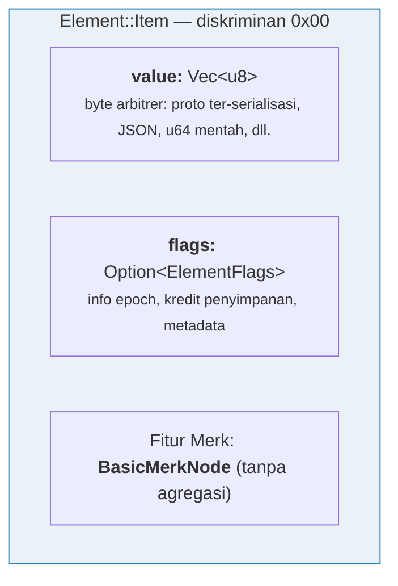
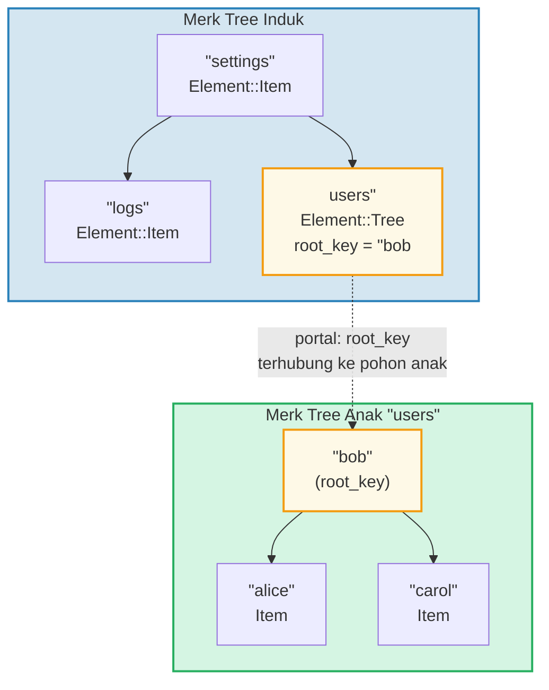
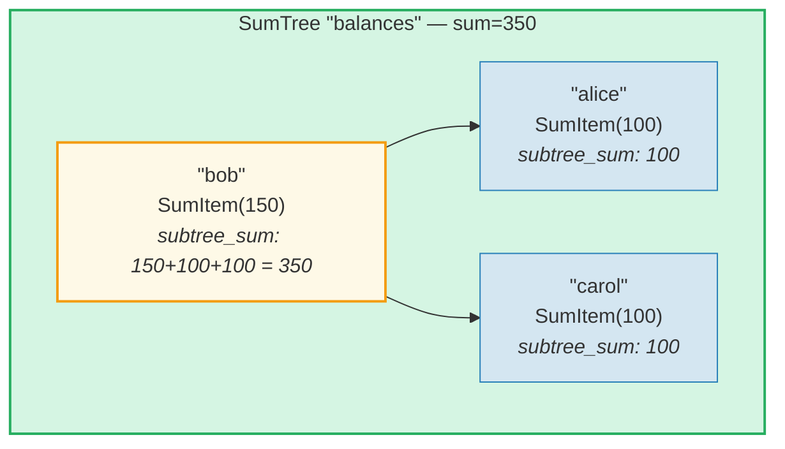
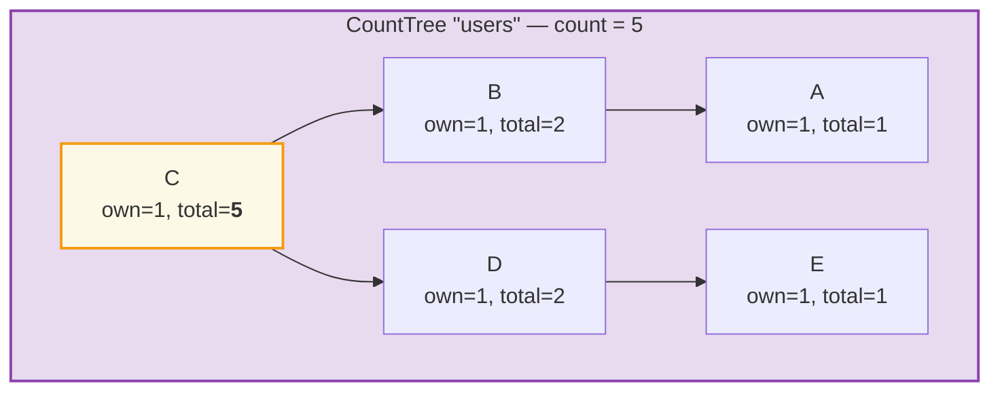
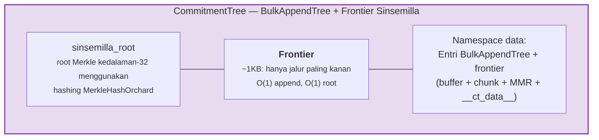

# Sistem Element

Sementara Merk berurusan dengan pasangan key-value mentah, GroveDB beroperasi pada tingkat yang lebih tinggi
menggunakan **Element** — nilai bertipe yang membawa makna semantik. Setiap nilai yang disimpan
dalam GroveDB adalah sebuah Element.

## Enum Element

```rust
// grovedb-element/src/element/mod.rs
pub enum Element {
    Item(Vec<u8>, Option<ElementFlags>),                                    // [0]
    Reference(ReferencePathType, MaxReferenceHop, Option<ElementFlags>),    // [1]
    Tree(Option<Vec<u8>>, Option<ElementFlags>),                           // [2]
    SumItem(SumValue, Option<ElementFlags>),                               // [3]
    SumTree(Option<Vec<u8>>, SumValue, Option<ElementFlags>),              // [4]
    BigSumTree(Option<Vec<u8>>, BigSumValue, Option<ElementFlags>),        // [5]
    CountTree(Option<Vec<u8>>, CountValue, Option<ElementFlags>),          // [6]
    CountSumTree(Option<Vec<u8>>, CountValue, SumValue, Option<ElementFlags>), // [7]
    ProvableCountTree(Option<Vec<u8>>, CountValue, Option<ElementFlags>),  // [8]
    ItemWithSumItem(Vec<u8>, SumValue, Option<ElementFlags>),              // [9]
    ProvableCountSumTree(Option<Vec<u8>>, CountValue, SumValue,
                         Option<ElementFlags>),                            // [10]
    CommitmentTree(u64, u8, Option<ElementFlags>),                         // [11]
    MmrTree(u64, Option<ElementFlags>),                                    // [12]
    BulkAppendTree(u64, u8, Option<ElementFlags>),                         // [13]
    DenseAppendOnlyFixedSizeTree(u16, u8, Option<ElementFlags>),           // [14]
}
```

Nomor diskriminan (ditampilkan dalam kurung) digunakan selama serialisasi.

Alias tipe yang digunakan di seluruh kode:

```rust
pub type ElementFlags = Vec<u8>;        // Metadata arbitrer per element
pub type MaxReferenceHop = Option<u8>;  // Batas hop opsional untuk referensi
pub type SumValue = i64;                // Sum bertanda 64-bit
pub type BigSumValue = i128;            // Sum bertanda 128-bit
pub type CountValue = u64;              // Hitungan tak bertanda 64-bit
```

## Item — Penyimpanan Key-Value Dasar

Element paling sederhana. Menyimpan byte arbitrer:

```rust
Element::Item(value: Vec<u8>, flags: Option<ElementFlags>)
```



Konstruktor:

```rust
Element::new_item(b"hello world".to_vec())
Element::new_item_with_flags(b"data".to_vec(), Some(vec![0x01, 0x02]))
```

Item berpartisipasi dalam agregasi sum: dalam SumTree, sebuah Item berkontribusi
sum default 0. SumItem berkontribusi nilainya secara eksplisit.

## Tree — Kontainer untuk Subtree

Element Tree adalah sebuah **portal** ke Merk tree lain. Ia menyimpan root key dari
pohon anak (jika ada):

```rust
Element::Tree(root_key: Option<Vec<u8>>, flags: Option<ElementFlags>)
```



> Element Tree di Merk induk menyimpan `root_key` dari Merk tree anak. Ini membuat **portal** — tautan dari satu Merk tree ke yang lain.

Ketika pohon kosong, `root_key` adalah `None`. Konstruktor `Element::empty_tree()`
membuat `Element::Tree(None, None)`.

## SumItem / SumTree — Sum Agregat

Sebuah **SumTree** secara otomatis mempertahankan jumlah dari semua kontribusi sum
anak langsungnya:

```rust
Element::SumTree(root_key: Option<Vec<u8>>, sum: SumValue, flags: Option<ElementFlags>)
Element::SumItem(value: SumValue, flags: Option<ElementFlags>)
```



> **Rumus agregasi:** `node_sum = own_value + left_child_sum + right_child_sum`
> Bob: 150 + 100 (alice) + 100 (carol) = **350**. Sum root (350) disimpan di element SumTree induk.

Sum dipertahankan di tingkat Merk melalui tipe fitur `TreeFeatureType::SummedMerkNode(i64)`.
Selama propagasi pohon, data agregat setiap node dihitung ulang:

```text
aggregate_sum = own_sum + left_child_sum + right_child_sum
```

## CountTree, CountSumTree, BigSumTree

Tipe pohon agregat tambahan:

| Tipe Element | Tipe Fitur Merk | Agregasi |
|---|---|---|
| `CountTree` | `CountedMerkNode(u64)` | Jumlah elemen |
| `CountSumTree` | `CountedSummedMerkNode(u64, i64)` | Hitungan dan sum |
| `BigSumTree` | `BigSummedMerkNode(i128)` | Sum 128-bit untuk nilai besar |
| `ProvableCountTree` | `ProvableCountedMerkNode(u64)` | Hitungan tertanam dalam hash |
| `ProvableCountSumTree` | `ProvableCountedSummedMerkNode(u64, i64)` | Hitungan dalam hash + sum |

**ProvableCountTree** istimewa: hitungannya disertakan dalam komputasi `node_hash`
(melalui `node_hash_with_count`), sehingga proof dapat memverifikasi hitungan tanpa
mengungkapkan nilai apa pun.

## Serialisasi Element

Element diserialisasi menggunakan **bincode** dengan urutan byte big-endian:

```rust
pub fn serialize(&self, grove_version: &GroveVersion) -> Result<Vec<u8>, ElementError> {
    let config = config::standard().with_big_endian().with_no_limit();
    bincode::encode_to_vec(self, config)
}
```

Byte pertama adalah **diskriminan**, memungkinkan deteksi tipe O(1):

```rust
pub fn from_serialized_value(value: &[u8]) -> Option<ElementType> {
    match value.first()? {
        0 => Some(ElementType::Item),
        1 => Some(ElementType::Reference),
        2 => Some(ElementType::Tree),
        3 => Some(ElementType::SumItem),
        // ... dll
    }
}
```

## TreeFeatureType dan Aliran Data Agregat

Enum `TreeFeatureType` menjembatani kesenjangan antara Element GroveDB dan node Merk:

```rust
pub enum TreeFeatureType {
    BasicMerkNode,                              // Tanpa agregasi
    SummedMerkNode(i64),                       // Agregasi sum
    BigSummedMerkNode(i128),                   // Sum besar
    CountedMerkNode(u64),                      // Hitungan
    CountedSummedMerkNode(u64, i64),           // Hitungan + sum
    ProvableCountedMerkNode(u64),              // Hitungan dalam hash
    ProvableCountedSummedMerkNode(u64, i64),   // Hitungan dalam hash + sum
}
```

Data agregat mengalir **ke atas** melalui pohon:



> **Tabel agregasi:** Agregat setiap node = own(1) + left_aggregate + right_aggregate
>
> | Node | own | left_agg | right_agg | total |
> |------|-----|----------|-----------|-------|
> | A | 1 | 0 | 0 | 1 |
> | B | 1 | 1 (A) | 0 | 2 |
> | E | 1 | 0 | 0 | 1 |
> | D | 1 | 0 | 1 (E) | 2 |
> | C | 1 | 2 (B) | 2 (D) | **5** (root) |

Hitungan yang disimpan di setiap node mewakili total hitungan dalam
subtree yang di-root pada node tersebut, termasuk dirinya sendiri. Hitungan node root adalah total
untuk seluruh pohon.

Enum `AggregateData` membawa ini melalui sistem Link:

```rust
pub enum AggregateData {
    NoAggregateData,
    Sum(i64),
    BigSum(i128),
    Count(u64),
    CountAndSum(u64, i64),
    ProvableCount(u64),
    ProvableCountAndSum(u64, i64),
}
```

## CommitmentTree — Pohon Komitmen Sinsemilla

Sebuah **CommitmentTree** menyediakan pohon Merkle Sinsemilla kedalaman-32 untuk melacak
anchor komitmen note, seperti yang digunakan dalam protokol terlindung (shielded protocol) Orchard dari Zcash. Ia membungkus
`incrementalmerkletree::Frontier<MerkleHashOrchard, 32>` untuk append dan
komputasi root O(1):

```rust
Element::CommitmentTree(
    total_count: u64,               // Jumlah komitmen yang ditambahkan
    chunk_power: u8,                // Ukuran kompaksi BulkAppendTree (chunk_size = 2^chunk_power)
    flags: Option<ElementFlags>,
)                                   // diskriminan [11]
```

> **Catatan:** Root hash frontier Sinsemilla TIDAK disimpan dalam Element.
> Ia disimpan di penyimpanan data dan mengalir melalui mekanisme child hash Merk
> (parameter `subtree_root_hash` dari `insert_subtree`). Perubahan apa pun pada frontier
> secara otomatis merambat ke atas melalui hierarki Merk GroveDB.



**Arsitektur:**
- *Frontier* (jalur paling kanan pohon Merkle, ukuran konstan ~1KB) disimpan
  dalam **namespace data**, dikunci oleh `COMMITMENT_TREE_DATA_KEY`
- Data note aktual (`cmx || ciphertext`) disimpan melalui **BulkAppendTree**
  di **namespace data** — dikompaksi chunk, dapat diambil berdasarkan posisi
- Anchor historis dilacak oleh Platform di pohon provable terpisah
- Root Sinsemilla TIDAK disimpan dalam Element — ia mengalir sebagai child hash
  Merk melalui hierarki hash GroveDB

**Operasi:**
- `commitment_tree_insert(path, key, cmx, ciphertext, tx)` — Append bertipe
  menerima `TransmittedNoteCiphertext<M>`; mengembalikan `(new_root, position)`
- `commitment_tree_anchor(path, key, tx)` — Dapatkan Anchor Orchard saat ini
- `commitment_tree_get_value(path, key, position, tx)` — Ambil value berdasarkan posisi
- `commitment_tree_count(path, key, tx)` — Dapatkan total hitungan item

**Generic MemoSize:** `CommitmentTree<S, M: MemoSize = DashMemo>` memvalidasi bahwa
payload ciphertext sesuai dengan ukuran yang diharapkan untuk `M`. Untuk Dash (memo 36-byte):
`epk_bytes (32) + enc_ciphertext (104) + out_ciphertext (80) = 216 byte`.

**Pelacakan biaya:** Operasi hash Sinsemilla dilacak melalui
`cost.sinsemilla_hash_calls`. Komputasi root selalu menelusuri 32 level.
Penggabungan ommer berjenjang melalui `trailing_ones()` dari posisi sebelumnya.
Operasi BulkAppendTree menambahkan biaya hash Blake3.

## MmrTree — Merkle Mountain Range

Sebuah **MmrTree** menyimpan data dalam Merkle Mountain Range (MMR) append-only menggunakan
hashing Blake3. Node MMR disimpan di kolom **data** (sama dengan node Merk),
bukan di subtree Merk anak. Lihat **[Bab 13](#chapter-13-the-mmr-tree--append-only-authenticated-logs)**
untuk pembahasan mendalam komprehensif tentang cara kerja MMR, cara pengisian, cara proof
dihasilkan dan diverifikasi, dan bagaimana MmrTree terintegrasi dengan GroveDB.

```rust
Element::MmrTree(
    mmr_size: u64,                  // Ukuran MMR internal (node, bukan daun)
    flags: Option<ElementFlags>,
)                                   // diskriminan [12]
```

> **Catatan:** Root hash MMR TIDAK disimpan dalam Element. Ia mengalir sebagai
> child hash Merk melalui parameter `subtree_root_hash` dari `insert_subtree`.

**Operasi:** `mmr_tree_append`, `mmr_tree_root_hash`, `mmr_tree_get_value`,
`mmr_tree_leaf_count`. **Proof:** V1 proofs (lihat bagian 9.6 dan 13.9).

## BulkAppendTree — Struktur Append-Only Dua Level

Sebuah **BulkAppendTree** menggabungkan buffer pohon Merkle padat dengan MMR tingkat chunk
untuk append throughput tinggi yang efisien dengan range query yang dapat dibuktikan. Ini adalah
pohon non-Merk — data berada di namespace **data**, bukan di subtree Merk anak.
Lihat **[Bab 14](#chapter-14-the-bulkappendtree--high-throughput-append-only-storage)**
untuk pembahasan mendalam komprehensif tentang arsitektur dua level, kompaksi chunk,
generasi proof, verifikasi, dan integrasi GroveDB.

```rust
Element::BulkAppendTree(
    total_count: u64,               // Total nilai yang ditambahkan
    chunk_power: u8,                // Tinggi dense tree (kapasitas buffer = 2^chunk_power - 1)
    flags: Option<ElementFlags>,
)                                   // diskriminan [13]
```

> **Catatan:** State root (`blake3("bulk_state" || mmr_root || dense_tree_root)`)
> TIDAK disimpan dalam Element. Ia mengalir sebagai child hash Merk melalui
> parameter `subtree_root_hash` dari `insert_subtree`.

**Operasi:** `bulk_append`, `bulk_get_value`, `bulk_get_chunk`,
`bulk_get_buffer`, `bulk_count`, `bulk_chunk_count`.
**Proof:** V1 range proofs (lihat bagian 9.6 dan 14.10).

## DenseAppendOnlyFixedSizeTree — Penyimpanan Padat Kapasitas Tetap

Sebuah **DenseAppendOnlyFixedSizeTree** adalah pohon biner lengkap dengan tinggi tetap *h*
di mana setiap node (internal dan daun) menyimpan nilai data. Posisi diisi
dalam urutan level-order (BFS). Root hash dihitung ulang secara langsung — tidak ada hash
antara yang disimpan. Lihat **[Bab 16](#chapter-16-the-denseappendonlyfixedsizetree--dense-fixed-capacity-merkle-storage)**
untuk pembahasan mendalam lengkap.

```rust
Element::DenseAppendOnlyFixedSizeTree(
    count: u16,                     // Jumlah nilai yang disimpan (maks 65.535)
    height: u8,                     // Tinggi pohon (1..=16, immutable), kapasitas = 2^h - 1
    flags: Option<ElementFlags>,
)                                   // diskriminan [14]
```

> **Catatan:** Root hash TIDAK disimpan dalam Element — ia dihitung ulang secara
> langsung dan mengalir sebagai child hash Merk. Field `count` adalah `u16` (bukan u64),
> membatasi pohon hingga 65.535 posisi. Tinggi dibatasi pada 1..=16.

**Operasi:** `dense_tree_insert`, `dense_tree_get`, `dense_tree_root_hash`,
`dense_tree_count`.
**Proof:** Hanya tingkat element (belum ada subquery proofs).

## Pohon Non-Merk — Pola Umum

CommitmentTree, MmrTree, BulkAppendTree, dan DenseAppendOnlyFixedSizeTree berbagi pola arsitektur
umum yang membedakan mereka dari tipe pohon berbasis Merk (Tree, SumTree,
CountTree, dll.):

| Properti | Pohon berbasis Merk | Pohon non-Merk |
|----------|-----------------|-------------------|
| Subtree Merk anak | Ya (`root_key = Some(...)`) | Tidak (tidak ada field root_key) |
| Penyimpanan data | Pasangan key-value Merk | Blob kolom data (key non-Merk) |
| Pengikatan root hash | `combine_hash(elem_hash, child_root_hash)` | `combine_hash(elem_hash, type_specific_root)` |
| Root spesifik-tipe | Dikelola oleh Merk AVL | Mengalir sebagai child hash Merk (TIDAK di byte element) |
| Format proof | V0 (Merk layer-by-layer) | V1 (proof spesifik-tipe) |
| TreeFeatureType | BasicMerkNode (tanpa agregasi) | BasicMerkNode |

> **Catatan kolom penyimpanan:** Keempat tipe pohon non-Merk (MmrTree,
> CommitmentTree, BulkAppendTree, DenseAppendOnlyFixedSizeTree) menyimpan
> data mereka di kolom **data** menggunakan key non-Merk. CommitmentTree menyimpan
> frontier Sinsemilla-nya bersama entri BulkAppendTree di kolom **data** yang sama
> (key `b"__ct_data__"`).

Root spesifik-tipe (root sinsemilla, root MMR, state root, atau root hash dense tree)
TIDAK disimpan dalam Element. Sebaliknya, ia mengalir sebagai **child hash** Merk melalui
parameter `subtree_root_hash` dari `insert_subtree`. combined_value_hash Merk
menjadi `combine_hash(value_hash(element_bytes), type_specific_root)`.
Perubahan apa pun pada root spesifik-tipe mengubah child hash, yang mengubah
combined_value_hash, yang merambat ke atas melalui hierarki hash
GroveDB — mempertahankan integritas kriptografis.

---
