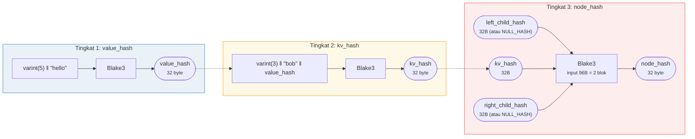
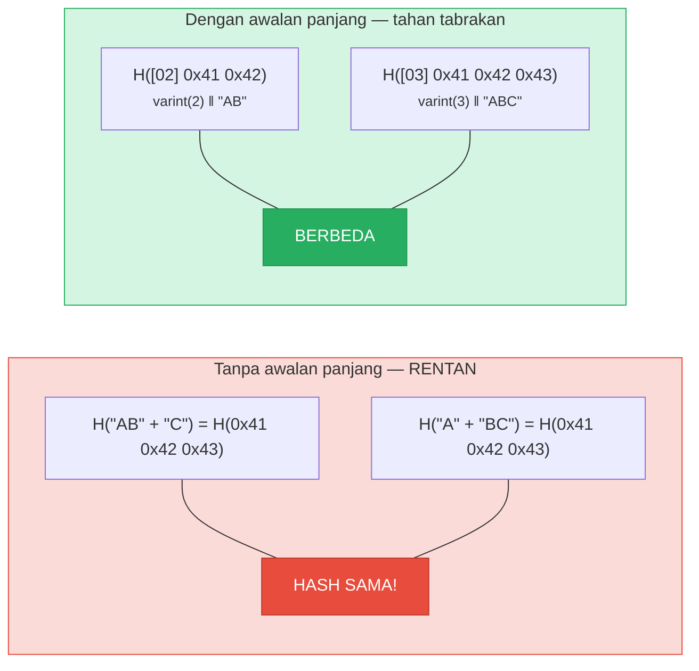
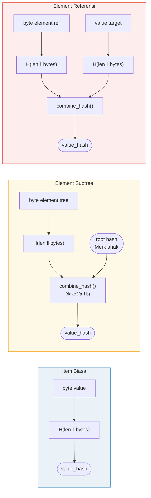

# Hashing — Integritas Kriptografis

Setiap node dalam Merk tree di-hash untuk menghasilkan sebuah **root hash** — satu nilai
32-byte yang mengotentikasi seluruh pohon. Perubahan apa pun pada key, value, atau
hubungan struktural akan menghasilkan root hash yang berbeda.

## Hierarki Hash Tiga Tingkat

Merk menggunakan skema hashing tiga tingkat, dari paling dalam ke paling luar:

Contoh: key = `"bob"` (3 byte), value = `"hello"` (5 byte):



> ROOT dari pohon = `node_hash` dari node root — mengotentikasi **setiap** key, value, dan hubungan struktural. Anak yang hilang menggunakan `NULL_HASH = [0x00; 32]`.

### Tingkat 1: value_hash

```rust
// merk/src/tree/hash.rs
pub fn value_hash(value: &[u8]) -> CostContext<CryptoHash> {
    let mut hasher = blake3::Hasher::new();
    let val_length = value.len().encode_var_vec();  // Encoding varint
    hasher.update(val_length.as_slice());
    hasher.update(value);
    // ...
}
```

Panjang value di-encode sebagai **varint** dan diawali. Ini kritis untuk
ketahanan terhadap tabrakan (collision resistance) — tanpanya, `H("AB" ‖ "C")` akan sama dengan `H("A" ‖ "BC")`.

### Tingkat 2: kv_hash

```rust
pub fn kv_hash(key: &[u8], value: &[u8]) -> CostContext<CryptoHash> {
    let mut hasher = blake3::Hasher::new();
    let key_length = key.len().encode_var_vec();
    hasher.update(key_length.as_slice());
    hasher.update(key);
    let vh = value_hash(value);
    hasher.update(vh.as_slice());  // Hash bersarang
    // ...
}
```

Ini mengikat key ke value. Untuk verifikasi proof, ada juga varian
yang menerima value_hash yang sudah dihitung sebelumnya:

```rust
pub fn kv_digest_to_kv_hash(key: &[u8], value_hash: &CryptoHash) -> CostContext<CryptoHash>
```

Ini digunakan ketika verifier sudah memiliki value_hash (misalnya, untuk subtree
di mana value_hash adalah hash gabungan).

### Tingkat 3: node_hash

```rust
pub fn node_hash(
    kv: &CryptoHash,
    left: &CryptoHash,
    right: &CryptoHash,
) -> CostContext<CryptoHash> {
    let mut hasher = blake3::Hasher::new();
    hasher.update(kv);       // 32 byte
    hasher.update(left);     // 32 byte
    hasher.update(right);    // 32 byte — total 96 byte
    // Selalu tepat 2 operasi hash (96 byte / blok 64-byte = 2)
}
```

Jika anak tidak ada, hash-nya adalah **NULL_HASH** — 32 byte nol:

```rust
pub const NULL_HASH: CryptoHash = [0; HASH_LENGTH];  // [0u8; 32]
```

## Blake3 sebagai Fungsi Hash

GroveDB menggunakan **Blake3** untuk semua hashing. Properti kunci:

- **Output 256-bit** (32 byte)
- **Ukuran blok**: 64 byte
- **Kecepatan**: ~3x lebih cepat dari SHA-256 pada perangkat keras modern
- **Streaming**: Dapat memasukkan data secara inkremental

Biaya operasi hash dihitung berdasarkan berapa banyak blok 64-byte yang
diproses:

```rust
let hashes = 1 + (hasher.count() - 1) / 64;  // Jumlah operasi hash
```

## Encoding Awalan Panjang untuk Ketahanan Tabrakan

Setiap input dengan panjang variabel diawali dengan panjangnya menggunakan **encoding varint**:



> **Input value_hash**: `[varint(value.len)] [byte value]`
> **Input kv_hash**: `[varint(key.len)] [byte key] [value_hash: 32 byte]`

Tanpa awalan panjang, penyerang bisa membuat pasangan key-value berbeda yang
menghasilkan digest yang sama. Awalan panjang membuat ini tidak mungkin secara kriptografis.

## Hashing Gabungan untuk Element Khusus

Untuk **subtree** dan **referensi**, `value_hash` bukan sekadar `H(value)`.
Sebaliknya, ini adalah **hash gabungan** (combined hash) yang mengikat element ke targetnya:



> **Subtree:** mengikat root hash Merk anak ke induk. **Referensi:** mengikat baik path referensi DAN value target. Mengubah salah satu mengubah root hash.

Fungsi `combine_hash`:

```rust
pub fn combine_hash(hash_one: &CryptoHash, hash_two: &CryptoHash) -> CostContext<CryptoHash> {
    let mut hasher = blake3::Hasher::new();
    hasher.update(hash_one);   // 32 byte
    hasher.update(hash_two);   // 32 byte — total 64 byte, tepat 1 operasi hash
    // ...
}
```

Inilah yang memungkinkan GroveDB mengotentikasi seluruh hierarki melalui satu
root hash — setiap value_hash pohon induk untuk element subtree menyertakan
root hash pohon anak.

## Hashing Agregat untuk ProvableCountTree

Node `ProvableCountTree` menyertakan hitungan agregat dalam node hash:

```rust
pub fn node_hash_with_count(
    kv: &CryptoHash,
    left: &CryptoHash,
    right: &CryptoHash,
    count: u64,
) -> CostContext<CryptoHash> {
    let mut hasher = blake3::Hasher::new();
    hasher.update(kv);                        // 32 byte
    hasher.update(left);                      // 32 byte
    hasher.update(right);                     // 32 byte
    hasher.update(&count.to_be_bytes());      // 8 byte — total 104 byte
    // Tetap tepat 2 operasi hash (104 < 128 = 2 × 64)
}
```

Ini berarti proof hitungan tidak memerlukan pengungkapan data aktual — hitungan
sudah tertanam dalam komitmen kriptografis.

---
