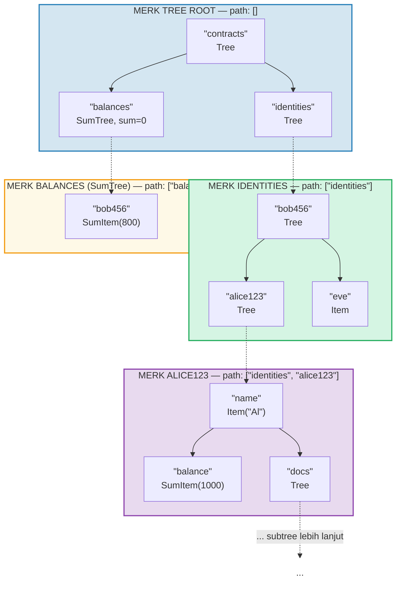
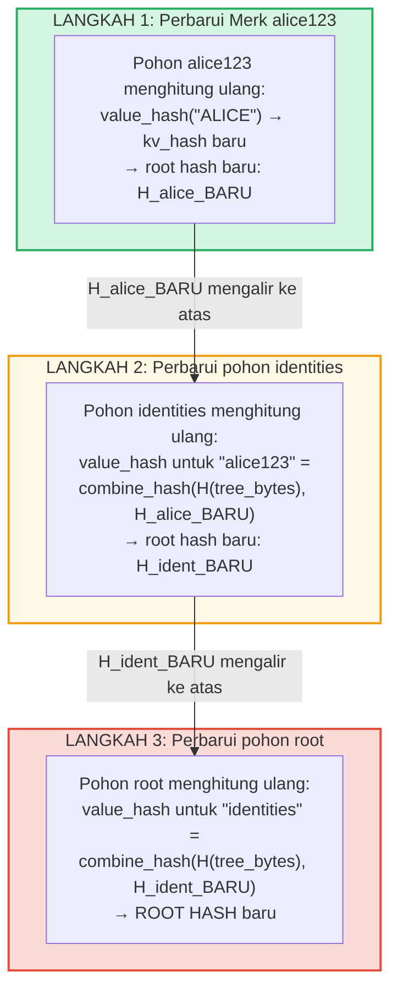
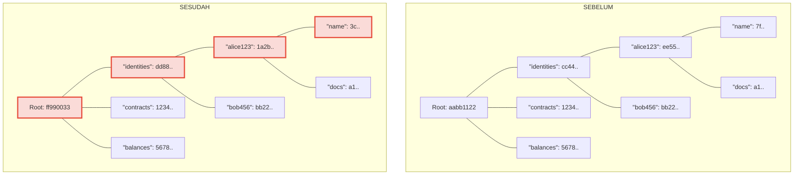
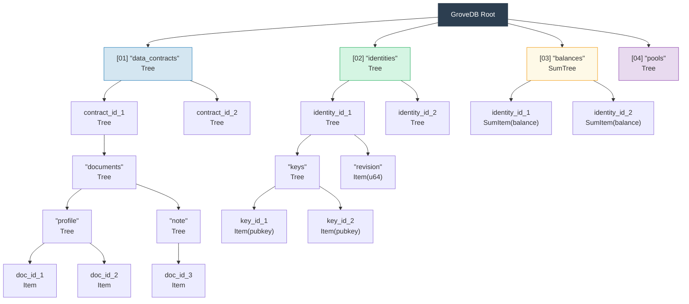

# Grove Hierarkis — Pohon dari Pohon-Pohon

## Bagaimana Subtree Bersarang di Dalam Pohon Induk

Fitur pembeda GroveDB adalah bahwa sebuah Merk tree dapat memuat element yang
merupakan Merk tree itu sendiri. Ini membuat sebuah **namespace hierarkis**:



> Setiap kotak berwarna adalah Merk tree terpisah. Panah putus-putus merepresentasikan tautan portal dari element Tree ke Merk tree anak mereka. Path ke setiap Merk ditampilkan di labelnya.

## Sistem Pengalamatan Path

Setiap element dalam GroveDB dialamatkan oleh sebuah **path** — urutan string byte
yang menavigasi dari root melalui subtree ke key target:

```text
    Path: ["identities", "alice123", "name"]

    Langkah 1: Di pohon root, cari "identities" → element Tree
    Langkah 2: Buka subtree identities, cari "alice123" → element Tree
    Langkah 3: Buka subtree alice123, cari "name" → Item("Alice")
```

Path direpresentasikan sebagai `Vec<Vec<u8>>` atau menggunakan tipe `SubtreePath` untuk
manipulasi efisien tanpa alokasi:

```rust
// Path ke element (semua segmen kecuali yang terakhir)
let path: &[&[u8]] = &[b"identities", b"alice123"];
// Key di dalam subtree terakhir
let key: &[u8] = b"name";
```

## Generasi Prefiks Blake3 untuk Isolasi Penyimpanan

Setiap subtree dalam GroveDB mendapat **namespace penyimpanan terisolasi** sendiri di RocksDB.
Namespace ditentukan dengan meng-hash path menggunakan Blake3:

```rust
pub type SubtreePrefix = [u8; 32];

// Prefiks dihitung dengan meng-hash segmen path
// storage/src/rocksdb_storage/storage.rs
```

Contoh:

```text
    Path: ["identities", "alice123"]
    Prefiks: Blake3(["identities", "alice123"]) = [0xab, 0x3f, ...]  (32 byte)

    Di RocksDB, key untuk subtree ini disimpan sebagai:
    [prefix: 32 byte][original_key]

    Jadi "name" di subtree ini menjadi:
    [0xab, 0x3f, ...][0x6e, 0x61, 0x6d, 0x65]  ("name")
```

Ini memastikan:
- Tidak ada tabrakan key antar subtree (prefiks 32-byte = isolasi 256-bit)
- Komputasi prefiks yang efisien (satu hash Blake3 atas byte path)
- Data subtree berdekatan di RocksDB untuk efisiensi cache

## Propagasi Root Hash Melalui Hierarki

Ketika sebuah nilai berubah jauh di dalam grove, perubahan harus **merambat ke atas** untuk
memperbarui root hash:

```text
    Perubahan: Perbarui "name" menjadi "ALICE" di identities/alice123/

    Langkah 1: Perbarui value di Merk tree alice123
            → pohon alice123 mendapat root hash baru: H_alice_new

    Langkah 2: Perbarui element "alice123" di pohon identities
            → value_hash pohon identities untuk "alice123" =
              combine_hash(H(tree_element_bytes), H_alice_new)
            → pohon identities mendapat root hash baru: H_ident_new

    Langkah 3: Perbarui element "identities" di pohon root
            → value_hash pohon root untuk "identities" =
              combine_hash(H(tree_element_bytes), H_ident_new)
            → ROOT HASH berubah
```



**Sebelum vs Sesudah** — node yang berubah ditandai dengan merah:



> Hanya node pada jalur dari nilai yang diubah ke root yang dihitung ulang. Saudara dan cabang lain tetap tidak berubah.

Propagasi diimplementasikan oleh `propagate_changes_with_transaction`, yang berjalan
naik di sepanjang path dari subtree yang dimodifikasi ke root, memperbarui hash element
setiap induk di sepanjang jalan.

## Contoh Struktur Grove Multi-Level

Berikut contoh lengkap yang menunjukkan bagaimana Dash Platform menyusun state-nya:



Setiap kotak adalah Merk tree terpisah, terotentikasi sampai ke satu root
hash yang disetujui oleh validator.

---
