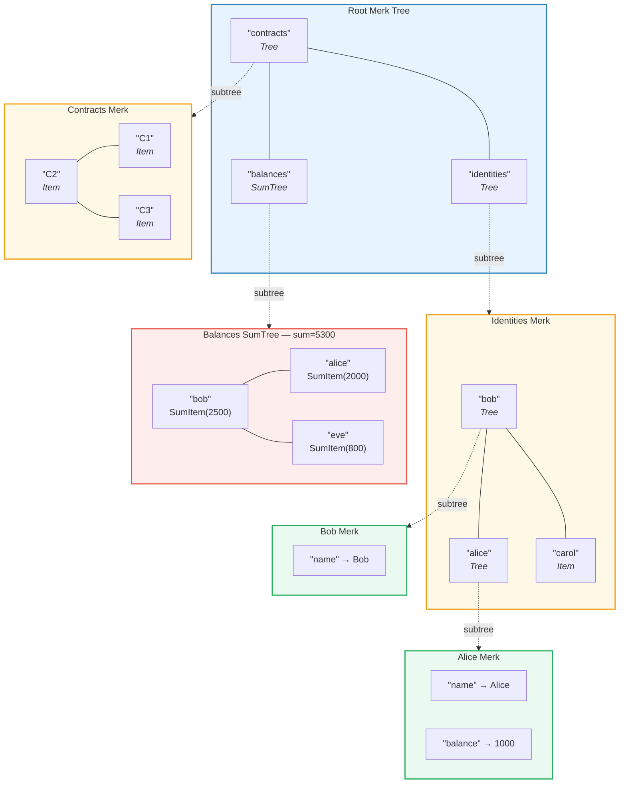
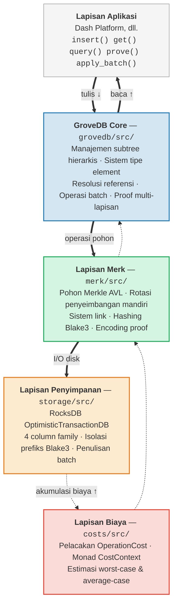

# Pendahuluan — Apa itu GroveDB?

## Ide Inti

GroveDB adalah sebuah **struktur data terotentikasi hierarkis** — pada dasarnya sebuah *grove*
(pohon dari pohon-pohon) yang dibangun di atas pohon Merkle AVL. Setiap node dalam database
merupakan bagian dari pohon yang terotentikasi secara kriptografis, dan setiap pohon dapat
memuat pohon-pohon lain sebagai anak, membentuk hierarki mendalam dari state yang dapat diverifikasi.

> Setiap kotak berwarna adalah **Merk tree terpisah**. Panah putus-putus menunjukkan hubungan subtree — sebuah element Tree di induk berisi root key dari Merk anak.

Dalam database tradisional, Anda mungkin menyimpan data di penyimpanan key-value datar dengan
satu pohon Merkle di atasnya untuk otentikasi. GroveDB mengambil pendekatan berbeda:
ia menyarangkan pohon Merkle di dalam pohon Merkle. Ini memberikan Anda:

1. **Indeks sekunder yang efisien** — query berdasarkan path apa pun, bukan hanya primary key
2. **Proof (bukti) kriptografis yang ringkas** — membuktikan keberadaan (atau ketiadaan) data apa pun
3. **Data agregat** — pohon dapat secara otomatis menjumlahkan, menghitung, atau mengagregasi
   anak-anaknya
4. **Operasi atomik lintas-pohon** — operasi batch mencakup beberapa subtree

## Mengapa GroveDB Ada

GroveDB dirancang untuk **Dash Platform**, sebuah platform aplikasi terdesentralisasi
di mana setiap bagian state harus:

- **Terotentikasi**: Setiap node dapat membuktikan bagian state apa pun ke light client
- **Deterministik**: Setiap node menghitung root state yang persis sama
- **Efisien**: Operasi harus selesai dalam batasan waktu blok
- **Dapat di-query**: Aplikasi membutuhkan query yang kaya, bukan hanya pencarian key

Pendekatan tradisional memiliki kekurangan:

| Pendekatan | Masalah |
|----------|---------|
| Plain Merkle Tree | Hanya mendukung pencarian key, tidak ada range query |
| Ethereum MPT | Rebalancing mahal, ukuran proof besar |
| Key-value datar + satu pohon | Tidak ada query hierarkis, satu proof mencakup semuanya |
| B-tree | Tidak secara alami ter-Merkle-kan, otentikasi rumit |

GroveDB mengatasi ini dengan menggabungkan **jaminan keseimbangan yang terbukti dari pohon AVL**
dengan **penyarangan hierarkis** dan **sistem tipe element yang kaya**.

## Gambaran Arsitektur

GroveDB diorganisasi menjadi lapisan-lapisan yang berbeda, masing-masing dengan tanggung jawab yang jelas:

Data mengalir **ke bawah** melalui lapisan-lapisan ini saat penulisan dan **ke atas** saat pembacaan.
Setiap operasi mengakumulasi biaya saat melewati tumpukan, memungkinkan
akuntansi sumber daya yang presisi.

---
