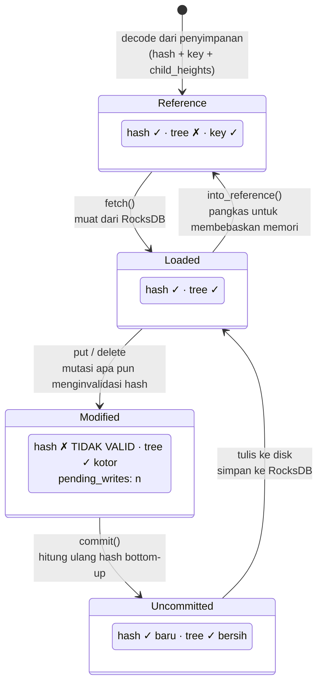
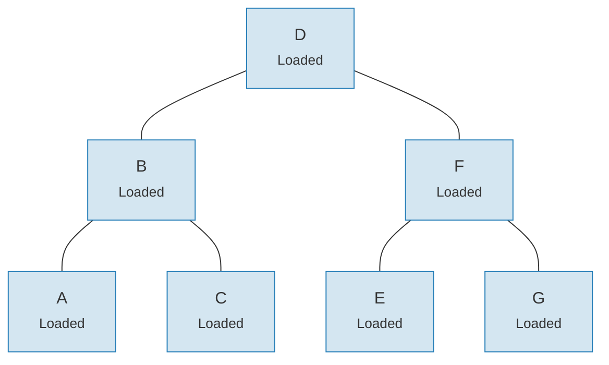
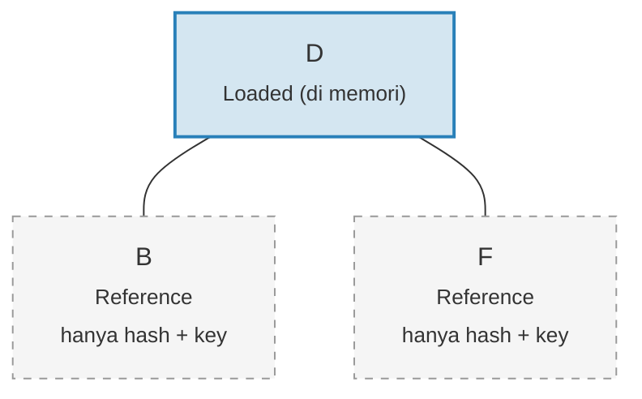

# Sistem Link — Arsitektur Pemuatan Malas

Memuat seluruh Merk tree ke dalam memori akan sangat mahal untuk pohon besar.
Sistem Link mengatasi ini dengan merepresentasikan koneksi anak dalam empat
kemungkinan state, memungkinkan **pemuatan malas** (lazy loading) — anak-anak hanya diambil dari penyimpanan saat
benar-benar dibutuhkan.

## Empat State Link

```rust
// merk/src/tree/link.rs
pub enum Link {
    Reference {                    // Dipangkas: hanya metadata, tidak ada pohon di memori
        hash: CryptoHash,
        child_heights: (u8, u8),
        key: Vec<u8>,
        aggregate_data: AggregateData,
    },
    Modified {                     // Baru saja diubah, hash belum dihitung
        pending_writes: usize,
        child_heights: (u8, u8),
        tree: TreeNode,
    },
    Uncommitted {                  // Sudah di-hash tapi belum disimpan ke penyimpanan
        hash: CryptoHash,
        child_heights: (u8, u8),
        tree: TreeNode,
        aggregate_data: AggregateData,
    },
    Loaded {                       // Dimuat sepenuhnya dari penyimpanan
        hash: CryptoHash,
        child_heights: (u8, u8),
        tree: TreeNode,
        aggregate_data: AggregateData,
    },
}
```

## Diagram Transisi State



## Apa yang Disimpan Setiap State

| State | Hash? | Pohon di Memori? | Tujuan |
|-------|-------|-----------------|---------|
| **Reference** | Ya | Tidak | Representasi on-disk ringkas. Hanya menyimpan key, hash, child heights, dan data agregat. |
| **Modified** | Tidak | Ya | Setelah mutasi apa pun. Melacak jumlah `pending_writes` untuk optimasi batch. |
| **Uncommitted** | Ya | Ya | Setelah komputasi hash tapi sebelum penulisan ke penyimpanan. State perantara saat commit. |
| **Loaded** | Ya | Ya | Terwujud sepenuhnya. Siap untuk pembacaan atau modifikasi lebih lanjut. |

Field `pending_writes` di `Modified` patut diperhatikan:

```rust
// Dihitung sebagai: 1 + left_pending_writes + right_pending_writes
pending_writes: 1 + tree.child_pending_writes(true)
                  + tree.child_pending_writes(false),
```

Hitungan ini membantu fase commit menentukan cara mengurutkan penulisan untuk performa
optimal.

## Pola Fetch Callback

Sistem Link menggunakan **trait Fetch** untuk mengabstraksi bagaimana node anak dimuat:

```rust
pub trait Fetch {
    fn fetch(
        &self,
        link: &Link,
        value_defined_cost_fn: Option<&impl Fn(&[u8], &GroveVersion) -> Option<ValueDefinedCostType>>,
        grove_version: &GroveVersion,
    ) -> CostResult<TreeNode, Error>;
}
```

Implementasi fetch yang berbeda melayani tujuan yang berbeda:

- **StorageFetch**: Memuat dari RocksDB (jalur normal)
- **PanicSource**: Digunakan dalam pengujian di mana fetching seharusnya tidak pernah terjadi
- **MockSource**: Mengembalikan data pengujian yang terkontrol

Pola ini memungkinkan operasi pohon menjadi **agnostik terhadap penyimpanan** — logika
penyeimbangan dan mutasi yang sama bekerja terlepas dari mana data berasal.

## Pola Walker

`Walker` membungkus `TreeNode` dengan sumber `Fetch`, menyediakan
traversal pohon yang aman dengan pemuatan malas otomatis (`merk/src/tree/walk/mod.rs`):

```rust
pub struct Walker<S: Fetch + Sized + Clone> {
    tree: Owner<TreeNode>,
    source: S,
}
```

Walker menyediakan tiga operasi kunci:

**walk()** — Lepaskan anak, transformasi, dan pasang kembali:

```rust
pub fn walk<F, T>(self, left: bool, f: F, ...) -> CostResult<Self, Error>
where
    F: FnOnce(Option<Self>) -> CostResult<Option<T>, Error>,
    T: Into<TreeNode>,
```

**detach()** — Hapus anak, memuat dari penyimpanan jika perlu:

```rust
pub fn detach(self, left: bool, ...) -> CostResult<(Self, Option<Self>), Error>
```

Jika anak adalah `Link::Reference` (dipangkas), detach akan memanggil `fetch()` untuk memuatnya
terlebih dahulu. Jika anak sudah ada di memori (`Modified`, `Uncommitted`, `Loaded`),
ia hanya mengambil ownership.

**attach()** — Hubungkan anak ke induk:

```rust
pub fn attach(self, left: bool, maybe_child: Option<Self>) -> Self
```

Pemasangan selalu membuat `Link::Modified` karena hubungan induk-anak
telah berubah.

## Efisiensi Memori Melalui Pemangkasan

Setelah meng-commit perubahan, pohon dapat **memangkas** subtree yang dimuat kembali ke
`Link::Reference`, membebaskan memori sambil mempertahankan hash yang diperlukan untuk
generasi proof:

**Sebelum pemangkasan** — semua 7 node di memori:



**Setelah pemangkasan** — hanya root di memori, anak-anak adalah `Link::Reference` (hanya hash + key):



> **Link::Loaded** menyimpan `hash + child_heights + tree (TreeNode)`. **Link::Reference** hanya menyimpan `hash + child_heights + key` — TreeNode dilepas dari memori.

Transformasinya sederhana:

```rust
pub fn into_reference(self) -> Link {
    Link::Reference {
        hash: self.hash(),
        child_heights: self.child_heights(),
        key: self.key().to_vec(),
        aggregate_data: self.aggregate_data(),
    }
}
```

Ini sangat penting untuk menjaga penggunaan memori tetap terbatas pada pohon besar — hanya node
yang sedang aktif diakses yang perlu ada di memori.

---
