# Merk Tree — Pohon Merkle AVL

Merk tree adalah blok bangunan fundamental dari GroveDB. Setiap subtree dalam
grove adalah sebuah Merk tree — pohon pencarian biner yang menyeimbangkan diri sendiri di mana setiap node
di-hash secara kriptografis, menghasilkan satu root hash yang mengotentikasi
seluruh isi pohon.

## Apa itu Merk Node?

Tidak seperti banyak implementasi pohon Merkle di mana data hanya ada di daun, dalam sebuah
Merk tree **setiap node menyimpan pasangan key-value**. Ini berarti tidak ada node
internal yang "kosong" — pohon ini merupakan struktur pencarian sekaligus penyimpan data secara bersamaan.

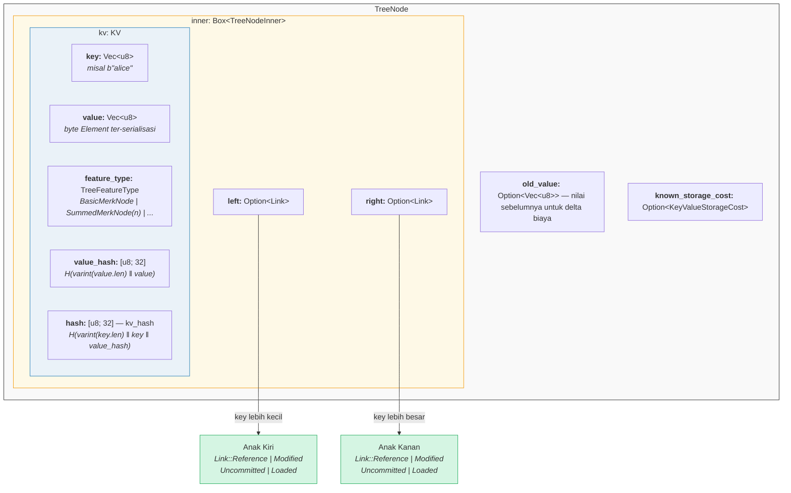

Dalam kode (`merk/src/tree/mod.rs`):

```rust
pub struct TreeNode {
    pub(crate) inner: Box<TreeNodeInner>,
    pub(crate) old_value: Option<Vec<u8>>,        // Nilai sebelumnya untuk pelacakan biaya
    pub(crate) known_storage_cost: Option<KeyValueStorageCost>,
}

pub struct TreeNodeInner {
    pub(crate) left: Option<Link>,    // Anak kiri (key lebih kecil)
    pub(crate) right: Option<Link>,   // Anak kanan (key lebih besar)
    pub(crate) kv: KV,               // Payload key-value
}
```

`Box<TreeNodeInner>` menyimpan node di heap, yang penting karena link anak
dapat secara rekursif memuat seluruh instance `TreeNode`.

## Struktur KV

Struct `KV` menyimpan data mentah dan digest kriptografisnya
(`merk/src/tree/kv.rs`):

```rust
pub struct KV {
    pub(super) key: Vec<u8>,                        // Key pencarian
    pub(super) value: Vec<u8>,                      // Nilai yang disimpan
    pub(super) feature_type: TreeFeatureType,       // Perilaku agregasi
    pub(crate) value_defined_cost: Option<ValueDefinedCostType>,
    pub(super) hash: CryptoHash,                    // kv_hash
    pub(super) value_hash: CryptoHash,              // H(value)
}
```

Dua poin penting:

1. **Key tidak disimpan di disk sebagai bagian dari node yang di-encode.** Key disimpan sebagai
   key RocksDB. Ketika sebuah node di-decode dari penyimpanan, key disuntikkan dari
   luar. Ini menghindari duplikasi byte key.

2. **Dua field hash dipertahankan.** `value_hash` adalah `H(value)` dan
   `hash` (kv_hash) adalah `H(key, value_hash)`. Menjaga keduanya memungkinkan sistem proof
   untuk memilih seberapa banyak informasi yang diungkap.

## Sifat Semi-Seimbang — Bagaimana AVL "Bergoyang"

Merk tree adalah sebuah **pohon AVL** — pohon pencarian biner yang menyeimbangkan diri
klasik yang ditemukan oleh Adelson-Velsky dan Landis. Invarian kuncinya adalah:

> Untuk setiap node, perbedaan tinggi antara subtree kiri dan kanannya paling banyak 1.

Ini diekspresikan sebagai **faktor keseimbangan** (balance factor):

```text
balance_factor = right_height - left_height
```

Nilai valid: **{-1, 0, 1}**

```rust
// merk/src/tree/mod.rs
pub const fn balance_factor(&self) -> i8 {
    let left_height = self.child_height(true) as i8;
    let right_height = self.child_height(false) as i8;
    right_height - left_height
}
```

Tapi inilah poin halusnya: meskipun setiap node individu hanya bisa miring satu level,
kemiringan ini dapat **bertumpuk** melalui pohon. Inilah mengapa kita menyebutnya
"semi-seimbang" — pohon ini tidak seimbang sempurna seperti pohon biner lengkap.

Pertimbangkan sebuah pohon dengan 10 node. Pohon yang seimbang sempurna akan memiliki tinggi 4
(⌈log₂(10+1)⌉). Tapi pohon AVL mungkin memiliki tinggi 5:

**Seimbang sempurna (tinggi 4)** — setiap level terisi penuh:

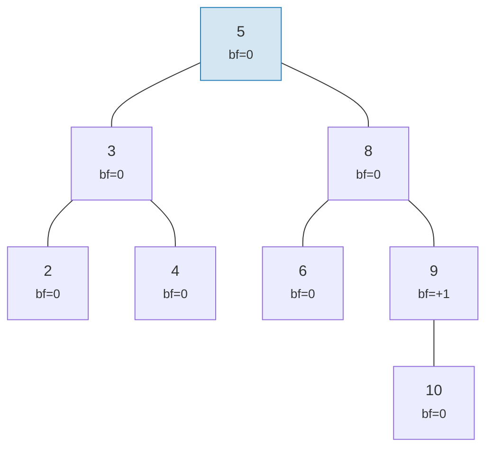

**"Goyangan" valid AVL (tinggi 5)** — setiap node miring paling banyak 1, tapi bertumpuk:

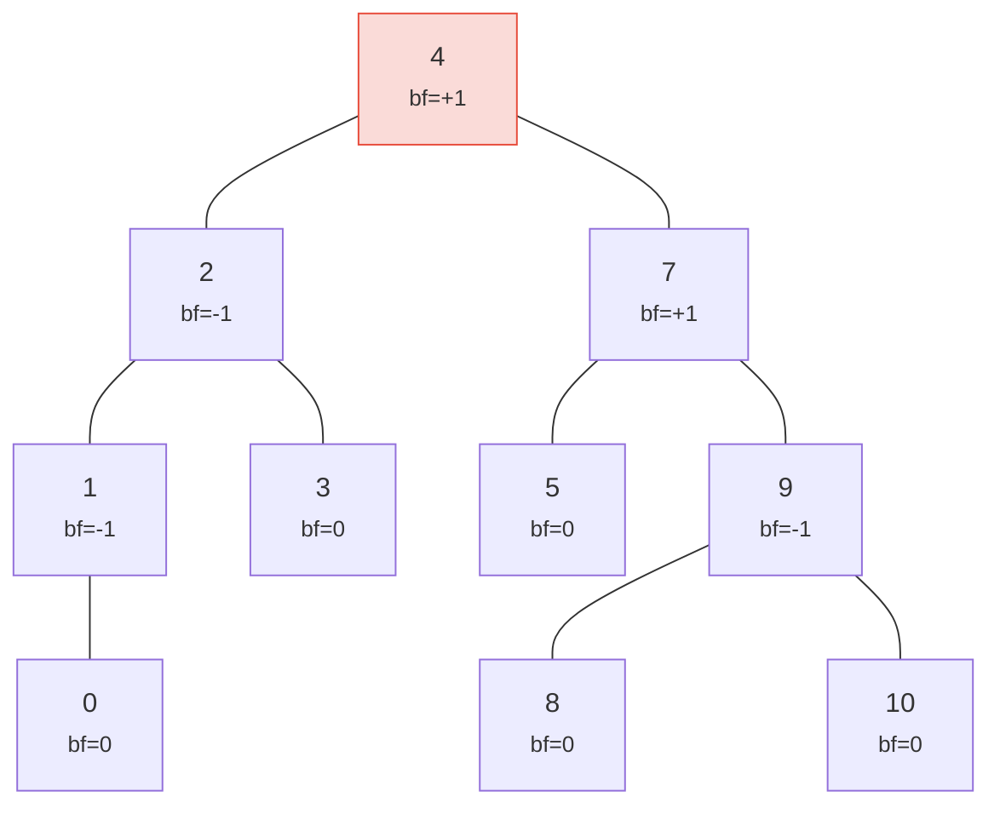

> Tinggi 5 vs sempurna 4 — itulah "goyangan"-nya. Kasus terburuk: h ≤ 1.44 × log₂(n+2).

Kedua pohon adalah pohon AVL yang valid! Tinggi kasus terburuk pohon AVL adalah:

```text
h ≤ 1.4404 × log₂(n + 2) − 0.3277
```

Jadi untuk **n = 1.000.000** node:
- Keseimbangan sempurna: tinggi 20
- Kasus terburuk AVL: tinggi ≈ 29

Overhead ~44% ini adalah harga dari aturan rotasi sederhana AVL. Dalam praktiknya, penyisipan
acak menghasilkan pohon yang jauh lebih dekat ke seimbang sempurna.

Inilah seperti apa pohon yang valid dan tidak valid:

**VALID** — semua faktor keseimbangan dalam {-1, 0, +1}:

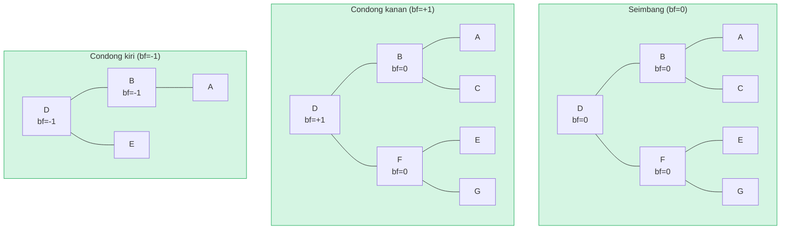

**TIDAK VALID** — faktor keseimbangan = +2 (butuh rotasi!):

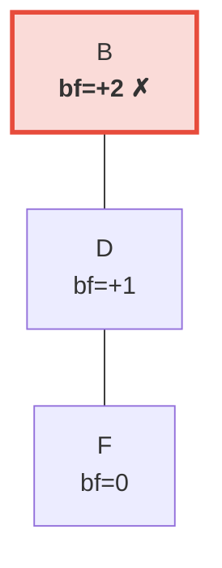

> Subtree kanan 2 level lebih tinggi dari kiri (yang kosong). Ini memicu **rotasi kiri** untuk memulihkan invarian AVL.

## Rotasi — Memulihkan Keseimbangan

Ketika penyisipan atau penghapusan menyebabkan faktor keseimbangan mencapai ±2, pohon harus
**dirotasi** untuk memulihkan invarian AVL. Ada empat kasus, yang dapat direduksi menjadi
dua operasi fundamental.

### Rotasi Kiri Tunggal

Digunakan ketika sebuah node **berat kanan** (bf = +2) dan anak kanannya
**berat kanan atau seimbang** (bf ≥ 0):

**Sebelum** (bf=+2):

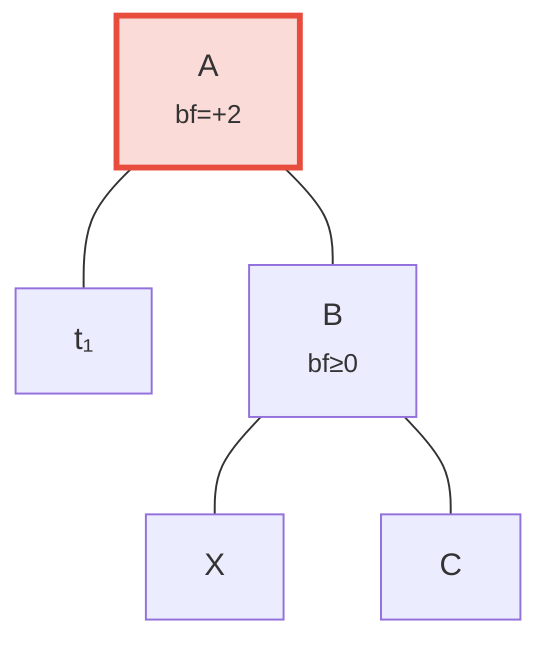

**Sesudah** rotasi kiri — B dipromosikan ke root:

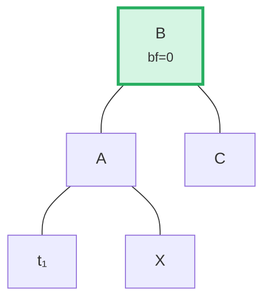

> **Langkah-langkah:** (1) Lepaskan B dari A. (2) Lepaskan X (anak kiri B). (3) Pasang X sebagai anak kanan A. (4) Pasang A sebagai anak kiri B. Subtree yang di-root di B sekarang seimbang.

Dalam kode (`merk/src/tree/ops.rs`):

```rust
fn rotate<V>(self, left: bool, ...) -> CostResult<Self, Error> {
    // Lepaskan anak di sisi yang berat
    let (tree, child) = self.detach_expect(left, ...);
    // Lepaskan cucu dari sisi berlawanan anak
    let (child, maybe_grandchild) = child.detach(!left, ...);

    // Pasang cucu ke root asli
    tree.attach(left, maybe_grandchild)
        .maybe_balance(...)
        .flat_map_ok(|tree| {
            // Pasang root asli sebagai anak dari node yang dipromosikan
            child.attach(!left, Some(tree))
                .maybe_balance(...)
        })
}
```

Perhatikan bagaimana `maybe_balance` dipanggil secara rekursif — rotasi itu sendiri mungkin membuat
ketidakseimbangan baru yang memerlukan koreksi lebih lanjut.

### Rotasi Ganda (Kiri-Kanan)

Digunakan ketika sebuah node **berat kiri** (bf = -2) tapi anak kirinya
**berat kanan** (bf > 0). Rotasi tunggal tidak akan memperbaiki ini:

**Langkah 0: Sebelum** — C berat kiri (bf=-2) tapi anak kirinya A condong kanan (bf=+1). Rotasi tunggal tidak akan memperbaiki ini:

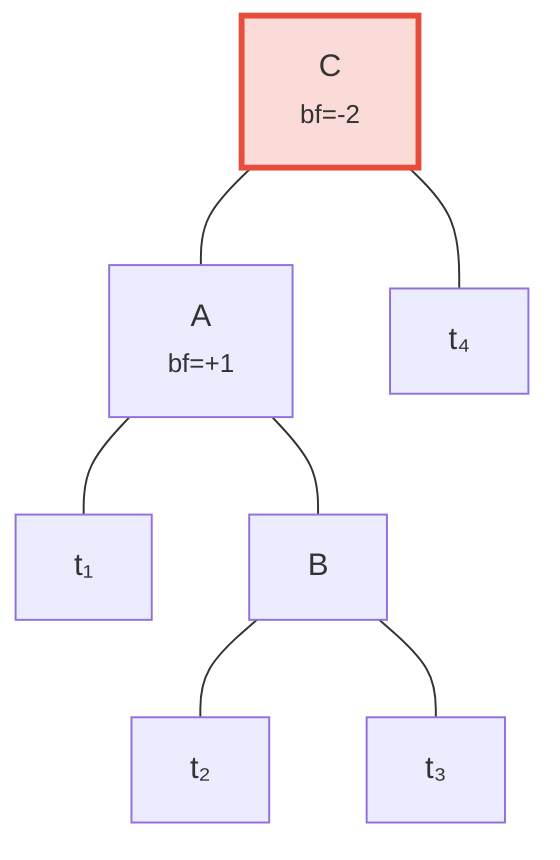

**Langkah 1: Rotasi kiri anak A** — sekarang C dan B condong kiri, dapat diperbaiki dengan rotasi tunggal:

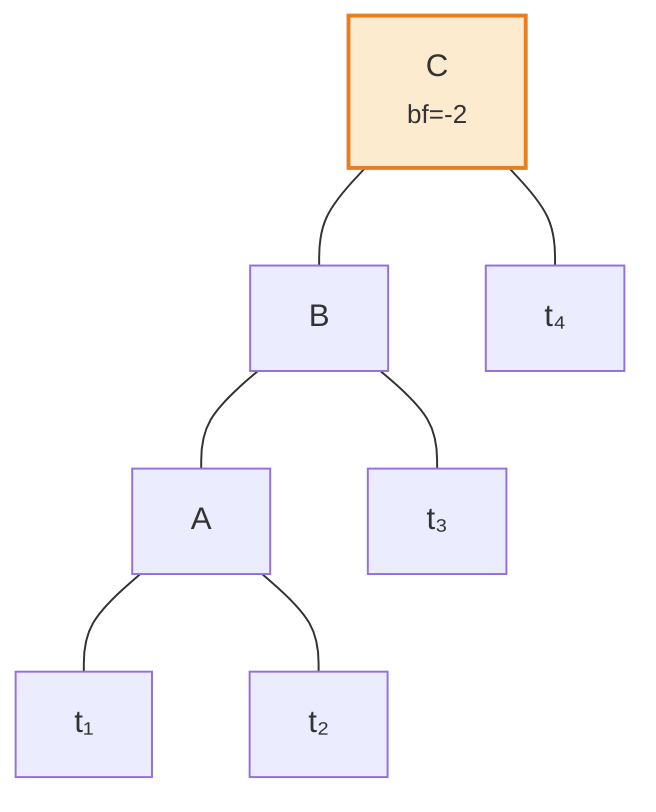

**Langkah 2: Rotasi kanan root C** — seimbang!

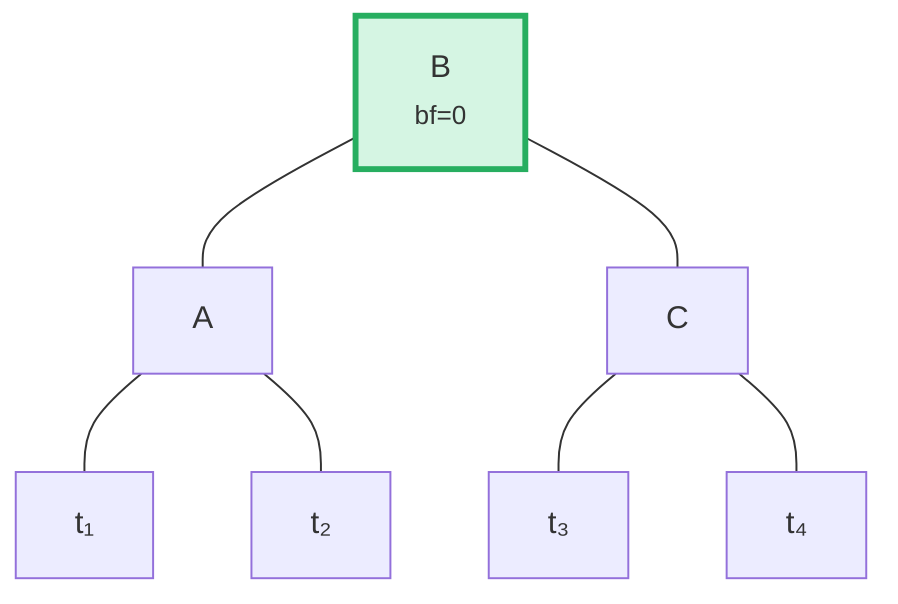

Algoritma mendeteksi kasus ini dengan membandingkan arah condong induk dengan
faktor keseimbangan anak:

```rust
fn maybe_balance<V>(self, ...) -> CostResult<Self, Error> {
    let balance_factor = self.balance_factor();
    if balance_factor.abs() <= 1 {
        return Ok(self);  // Sudah seimbang
    }

    let left = balance_factor < 0;  // true jika berat kiri

    // Rotasi ganda diperlukan ketika anak condong berlawanan dengan induk
    let tree = if left == (self.tree().link(left).unwrap().balance_factor() > 0) {
        // Rotasi pertama: rotasi anak ke arah berlawanan
        self.walk_expect(left, |child|
            child.rotate(!left, ...).map_ok(Some), ...
        )
    } else {
        self
    };

    // Rotasi kedua (atau satu-satunya)
    tree.rotate(left, ...)
}
```

## Operasi Batch — Membangun dan Menerapkan

Alih-alih menyisipkan elemen satu per satu, Merk mendukung operasi batch yang
menerapkan beberapa perubahan dalam satu pass. Ini penting untuk efisiensi: sebuah batch
dari N operasi pada pohon dengan M elemen membutuhkan waktu **O((M + N) log(M + N))**,
dibandingkan O(N log M) untuk penyisipan sekuensial.

### Tipe MerkBatch

```rust
type MerkBatch<K> = [(K, Op)];

enum Op {
    Put(Vec<u8>, TreeFeatureType),  // Sisipkan atau perbarui dengan value dan tipe fitur
    PutWithSpecializedCost(...),     // Sisipkan dengan biaya yang telah ditentukan
    PutCombinedReference(...),       // Sisipkan referensi dengan hash gabungan
    Replace(Vec<u8>, TreeFeatureType),
    Patch { .. },                    // Pembaruan nilai parsial
    Delete,                          // Hapus key
    DeleteLayered,                   // Hapus dengan biaya berlapis
    DeleteMaybeSpecialized,          // Hapus dengan biaya khusus opsional
}
```

### Strategi 1: build() — Membangun dari Awal

Ketika pohon kosong, `build()` membangun pohon seimbang langsung dari
batch yang diurutkan menggunakan algoritma **median-split** (pembagian median):

Batch input (diurutkan): `[A, B, C, D, E, F, G]` — pilih tengah (D) sebagai root, rekursi pada setiap setengah:

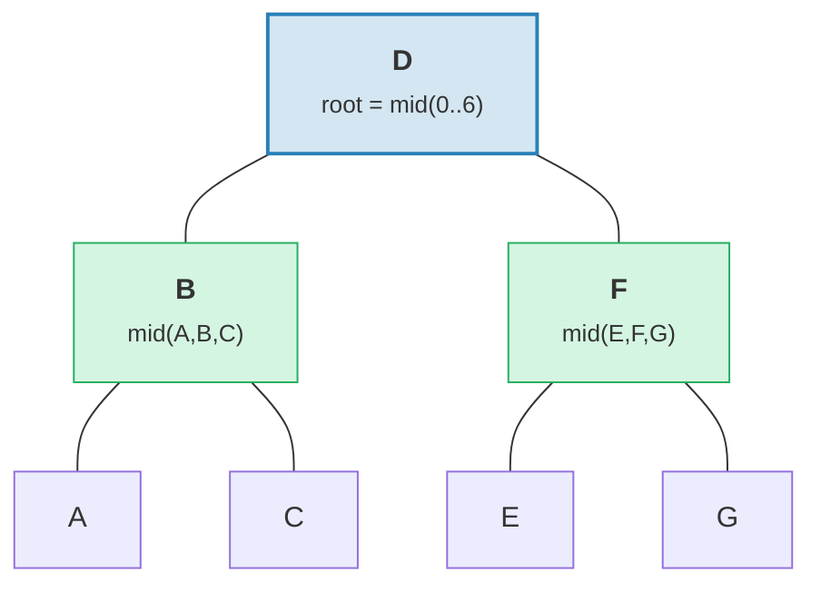

> Hasil: pohon seimbang sempurna dengan tinggi = 3 = ⌈log₂(7)⌉.

```rust
fn build(batch: &MerkBatch<K>, ...) -> CostResult<Option<TreeNode>, Error> {
    let mid_index = batch.len() / 2;
    let (mid_key, mid_op) = &batch[mid_index];

    // Buat node root dari elemen tengah
    let mid_tree = TreeNode::new(mid_key.clone(), value.clone(), None, feature_type)?;

    // Bangun subtree kiri dan kanan secara rekursif
    let left = Self::build(&batch[..mid_index], ...);
    let right = Self::build(&batch[mid_index + 1..], ...);

    // Pasang anak-anak
    mid_tree.attach(true, left).attach(false, right)
}
```

Ini menghasilkan pohon dengan tinggi ⌈log₂(n)⌉ — seimbang sempurna.

### Strategi 2: apply_sorted() — Menggabungkan ke Pohon yang Ada

Ketika pohon sudah memiliki data, `apply_sorted()` menggunakan **pencarian biner** untuk menemukan
di mana setiap operasi batch termasuk, kemudian secara rekursif menerapkan operasi ke
subtree kiri dan kanan:

Pohon yang ada dengan batch `[(B, Put), (F, Delete)]`:

Pencarian biner: B < D (ke kiri), F > D (ke kanan).

**Sebelum:**
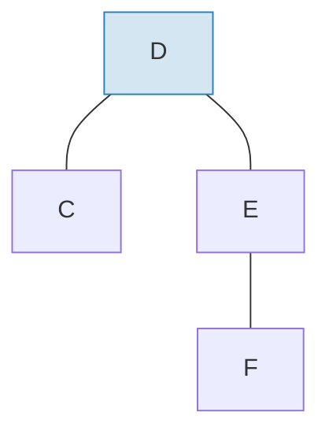

**Sesudah** menerapkan batch dan rebalancing:
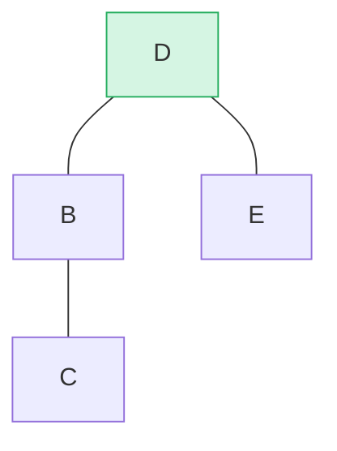

> B disisipkan sebagai subtree kiri, F dihapus dari subtree kanan. `maybe_balance()` mengonfirmasi bf(D) = 0.

```rust
fn apply_sorted(self, batch: &MerkBatch<K>, ...) -> CostResult<...> {
    let search = batch.binary_search_by(|(key, _)| key.cmp(self.tree().key()));

    match search {
        Ok(index) => {
            // Key cocok dengan node ini — terapkan operasi langsung
            // (Put mengganti value, Delete menghapus node)
        }
        Err(mid) => {
            // Key tidak ditemukan — mid adalah titik pembagian
            // Rekursi pada left_batch[..mid] dan right_batch[mid..]
        }
    }

    self.recurse(batch, mid, exclusive, ...)
}
```

Metode `recurse` membagi batch dan berjalan ke kiri dan kanan:

```rust
fn recurse(self, batch: &MerkBatch<K>, mid: usize, ...) {
    let left_batch = &batch[..mid];
    let right_batch = &batch[mid..];  // atau mid+1 jika eksklusif

    // Terapkan batch kiri ke subtree kiri
    let tree = self.walk(true, |maybe_left| {
        Self::apply_to(maybe_left, left_batch, ...)
    });

    // Terapkan batch kanan ke subtree kanan
    let tree = tree.walk(false, |maybe_right| {
        Self::apply_to(maybe_right, right_batch, ...)
    });

    // Seimbangkan kembali setelah modifikasi
    tree.maybe_balance(...)
}
```

### Penghapusan Node

Ketika menghapus node dengan dua anak, Merk mempromosikan **node tepi** dari
subtree yang lebih tinggi. Ini meminimalkan kemungkinan memerlukan rotasi tambahan:

**Sebelum** — menghapus D (memiliki dua anak, tinggi subtree kanan ≥ kiri):

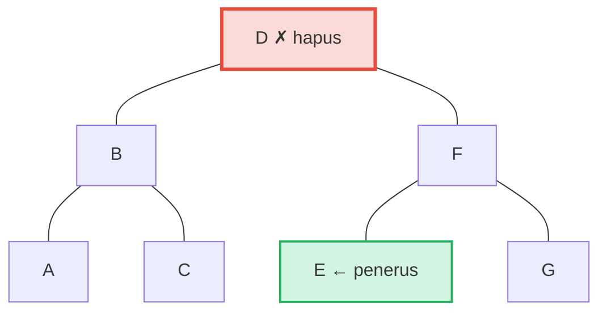

**Sesudah** — E (paling kiri di subtree kanan = penerus in-order) dipromosikan ke posisi D:

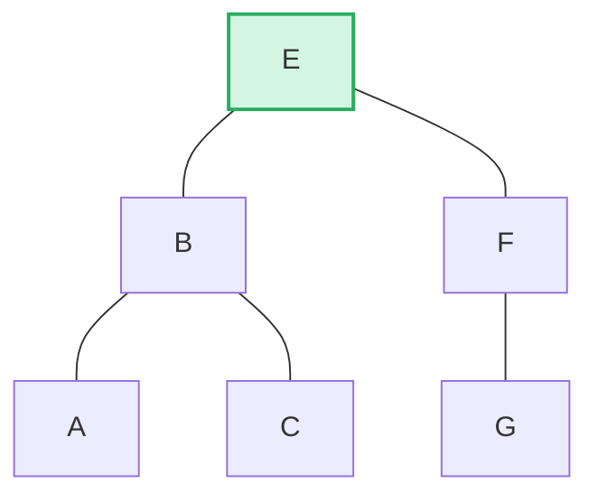

> **Aturan:** Jika tinggi kiri > kanan → promosikan tepi kanan subtree kiri. Jika tinggi kanan ≥ kiri → promosikan tepi kiri subtree kanan. Ini meminimalkan rebalancing pasca-penghapusan.

```rust
pub fn remove(self, ...) -> CostResult<Option<Self>, Error> {
    let has_left = tree.link(true).is_some();
    let has_right = tree.link(false).is_some();
    let left = tree.child_height(true) > tree.child_height(false);

    if has_left && has_right {
        // Dua anak: promosikan tepi dari anak yang lebih tinggi
        let (tree, tall_child) = self.detach_expect(left, ...);
        let (_, short_child) = tree.detach_expect(!left, ...);
        tall_child.promote_edge(!left, short_child, ...)
    } else if has_left || has_right {
        // Satu anak: promosikan langsung
        self.detach_expect(left, ...).1
    } else {
        // Node daun: cukup hapus
        None
    }
}
```

---
