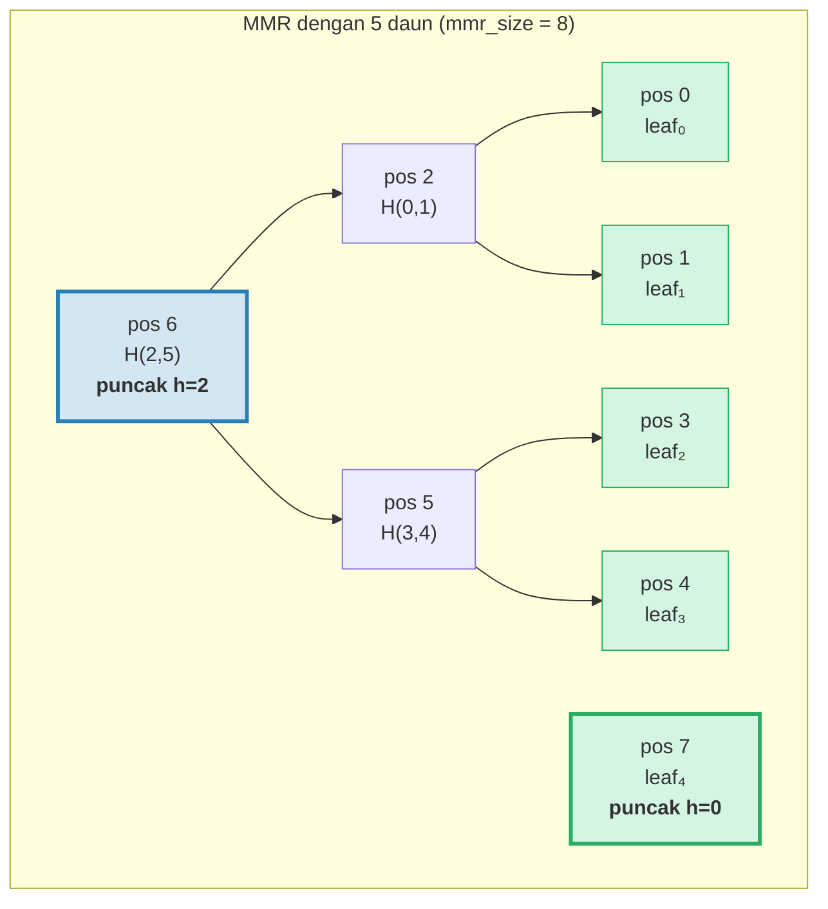
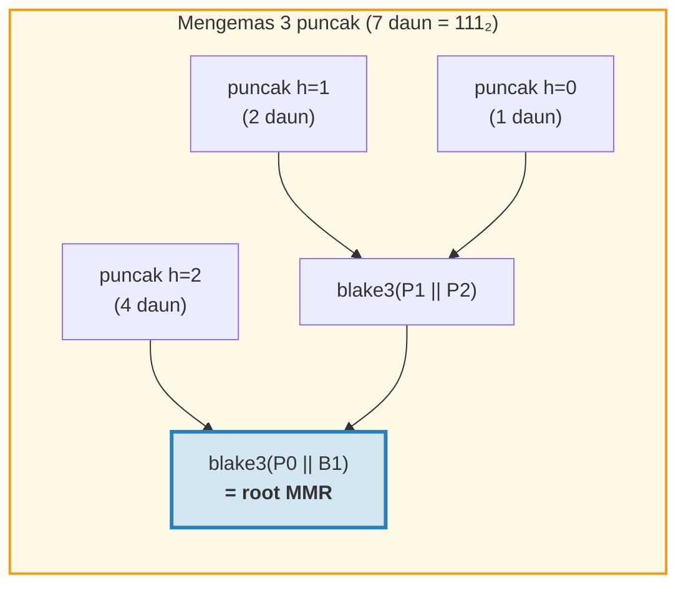
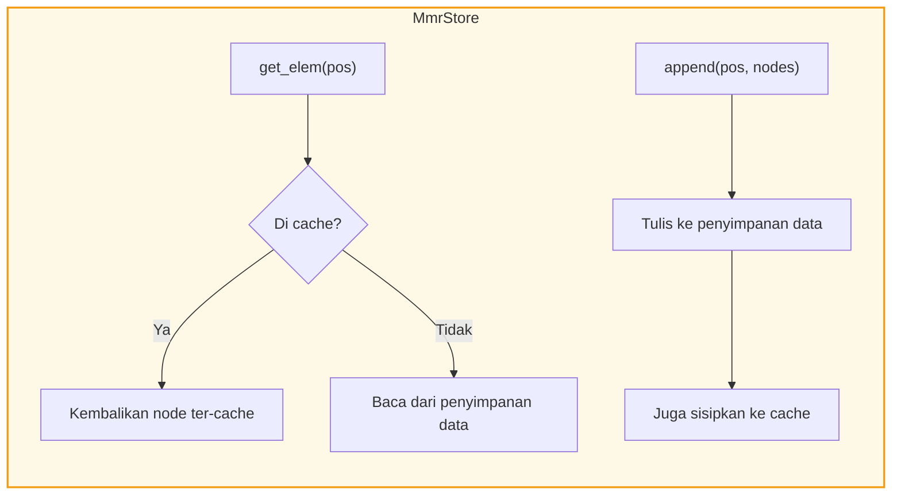
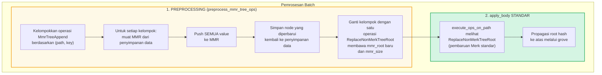
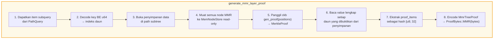
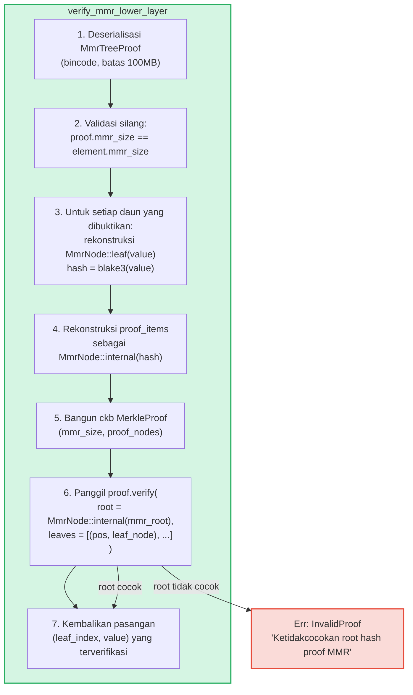

# MMR Tree — Log Terotentikasi Append-Only

**MmrTree** adalah struktur data terotentikasi append-only GroveDB, dibangun di atas
Merkle Mountain Range (MMR) dengan hashing Blake3. Sementara Merk AVL tree
(Bab 2) unggul dalam operasi key-value acak dengan pembaruan O(log N), MMR
dirancang khusus untuk kasus append-only: mereka menawarkan nol rotasi, biaya hash O(1)
teramortisasi per append, dan pola I/O sekuensial.

Bab ini membahas struktur data MMR secara mendalam — bagaimana ia tumbuh, bagaimana node
disimpan, bagaimana append berjenjang, dan bagaimana sistem proof memungkinkan pihak ketiga
memverifikasi bahwa value tertentu ditambahkan pada posisi tertentu.

## Mengapa Tipe Pohon Terpisah?

Merk tree standar GroveDB menangani data key-value terurut dengan baik, tapi
log append-only memiliki kebutuhan yang berbeda:

| Properti | Merk AVL Tree | MMR |
|----------|--------------|-----|
| Operasi | Sisip, perbarui, hapus | Hanya append |
| Rebalancing | Rotasi O(log N) per penulisan | Tidak ada |
| Pola I/O | Acak (rebalancing menyentuh banyak node) | Sekuensial (node baru selalu di akhir) |
| Total hash untuk N penyisipan | O(N log N) | O(N) |
| Struktur | Ditentukan oleh urutan penyisipan | Ditentukan hanya oleh jumlah daun |
| Proof | Jalur dari root ke daun | Hash saudara + puncak |

Untuk kasus penggunaan seperti log transaksi, stream event, atau data yang tumbuh monoton,
MMR secara tegas lebih baik: lebih sederhana, lebih cepat, dan lebih dapat diprediksi.

## Struktur Data MMR

MMR adalah **hutan pohon biner sempurna** (disebut "puncak" / peaks) yang tumbuh dari
kiri ke kanan. Setiap puncak adalah pohon biner lengkap dengan tinggi *h*, berisi
tepat 2^h daun.

Wawasan kunci: **representasi biner dari jumlah daun menentukan
struktur puncak**. Setiap bit-1 dalam bentuk biner sesuai dengan satu puncak:

```text
Jumlah daun    Biner     Puncak
─────────     ──────    ─────
1             1         satu puncak h=0
2             10        satu puncak h=1
3             11        puncak h=1, h=0
4             100       satu puncak h=2
5             101       puncak h=2, h=0
6             110       puncak h=2, h=1
7             111       puncak h=2, h=1, h=0
8             1000      satu puncak h=3
```

Ini berarti struktur MMR sepenuhnya ditentukan oleh satu angka — jumlah
daun. Dua MMR dengan jumlah daun yang sama selalu memiliki bentuk yang sama,
terlepas dari value apa yang ditambahkan.

## Bagaimana MMR Terisi

Setiap node dalam MMR memiliki **posisi** (indeks-0). Daun dan node internal
diselingi dalam pola tertentu. Berikut pertumbuhan langkah demi langkah:

**Setelah 1 daun (mmr_size = 1):**
```text
pos:  0
      leaf₀        ← satu puncak pada tinggi 0
```

**Setelah 2 daun (mmr_size = 3):**
```text
pos:     2          ← internal: blake3(leaf₀.hash || leaf₁.hash)
        / \
       0   1        ← daun

Satu puncak pada tinggi 1. Posisi 0 dan 1 adalah daun, posisi 2 adalah internal.
```
Ketika leaf₁ ditambahkan, ia membuat puncak tinggi-0. Tapi sudah ada puncak
tinggi-0 (leaf₀), jadi mereka **bergabung** menjadi puncak tinggi-1.

**Setelah 3 daun (mmr_size = 4):**
```text
pos:     2     3    ← puncak h=1, puncak h=0
        / \
       0   1

Dua puncak. Tidak ada penggabungan — tinggi 1 dan 0 berbeda.
(Biner: 3 = 11₂ → satu puncak per bit-1)
```

**Setelah 4 daun (mmr_size = 7):**
```text
pos:         6              ← internal: penggabungan node 2 dan 5
           /   \
         2       5          ← node internal
        / \     / \
       0   1   3   4        ← daun

Satu puncak pada tinggi 2.
```
Di sinilah menjadi menarik. Menambahkan leaf₃ (posisi 4) membuat node₅
(menggabungkan posisi 3 dan 4). Tapi sekarang node₅ (tinggi 1) dan node₂ (tinggi 1)
adalah puncak berdekatan dengan tinggi sama, jadi mereka bergabung menjadi node₆. **Kaskade dua
penggabungan dari satu append.**

**Setelah 5 daun (mmr_size = 8):**
```text
pos:         6         7    ← puncak h=2, puncak h=0
           /   \
         2       5
        / \     / \
       0   1   3   4

Dua puncak. (Biner: 5 = 101₂)
```

**Setelah 7 daun (mmr_size = 11):**
```text
pos:         6         10    ← puncak h=2, puncak h=1, puncak h=0
           /   \      / \
         2       5   8   9    7
        / \     / \
       0   1   3   4

Tiga puncak. (Biner: 7 = 111₂)
```

**Setelah 8 daun (mmr_size = 15):**
```text
pos:              14                     ← puncak tunggal h=3
               /      \
            6            13
          /   \        /    \
        2       5    9       12
       / \     / \  / \     / \
      0   1   3  4 7   8  10  11

Satu puncak pada tinggi 3. Tiga penggabungan berjenjang dari menambahkan leaf₇.
```



> **Biru** = puncak (root dari subtree biner sempurna). **Hijau** = node daun.

## Kaskade Penggabungan

Ketika daun baru ditambahkan, ia mungkin memicu rantai penggabungan. Jumlah
penggabungan sama dengan jumlah **bit 1 trailing** dalam representasi biner
dari jumlah daun saat ini:

| Jumlah daun (sebelum push) | Biner | trailing 1s | Penggabungan | Total hash |
|--------------------------|--------|-------------|--------|--------------|
| 0 | `0` | 0 | 0 | 1 (hanya daun) |
| 1 | `1` | 1 | 1 | 2 |
| 2 | `10` | 0 | 0 | 1 |
| 3 | `11` | 2 | 2 | 3 |
| 4 | `100` | 0 | 0 | 1 |
| 5 | `101` | 1 | 1 | 2 |
| 6 | `110` | 0 | 0 | 1 |
| 7 | `111` | 3 | 3 | 4 |

**Total hash per push** = `1 + trailing_ones(leaf_count)`:
- 1 hash untuk daun itu sendiri: `blake3(value)`
- N hash untuk kaskade penggabungan: `blake3(left.hash || right.hash)` untuk setiap
  penggabungan

Inilah cara GroveDB melacak biaya hash untuk setiap append. Implementasinya:
```rust
pub fn hash_count_for_push(leaf_count: u64) -> u32 {
    1 + leaf_count.trailing_ones()
}
```

## Ukuran MMR vs Jumlah Daun

MMR menyimpan baik daun maupun node internal dalam ruang posisi datar, jadi
`mmr_size` selalu lebih besar dari jumlah daun. Hubungan tepatnya adalah:

```text
mmr_size = 2 * leaf_count - popcount(leaf_count)
```

di mana `popcount` adalah jumlah bit-1 (yaitu, jumlah puncak). Setiap
node internal menggabungkan dua subtree, mengurangi jumlah node sebanyak satu per penggabungan.

Komputasi terbalik — jumlah daun dari mmr_size — menggunakan posisi puncak:

```rust
fn mmr_size_to_leaf_count(mmr_size: u64) -> u64 {
    // Setiap puncak pada tinggi h berisi 2^h daun
    get_peaks(mmr_size).iter()
        .map(|&peak_pos| 1u64 << pos_height_in_tree(peak_pos))
        .sum()
}
```

| mmr_size | leaf_count | puncak |
|----------|-----------|-------|
| 0 | 0 | (kosong) |
| 1 | 1 | h=0 |
| 3 | 2 | h=1 |
| 4 | 3 | h=1, h=0 |
| 7 | 4 | h=2 |
| 8 | 5 | h=2, h=0 |
| 10 | 6 | h=2, h=1 |
| 11 | 7 | h=2, h=1, h=0 |
| 15 | 8 | h=3 |

GroveDB menyimpan `mmr_size` di Element (bukan jumlah daun) karena pustaka ckb MMR
menggunakan posisi secara internal. Operasi `mmr_tree_leaf_count` menghitung
jumlah daun secara langsung.

## Root Hash MMR — Mengemas Puncak

MMR memiliki beberapa puncak (satu per bit-1 dalam jumlah daun). Untuk menghasilkan
satu root hash 32-byte, puncak-puncak **"dikemas"** dari kanan ke kiri:

```text
root = bag_rhs_peaks(peaks):
    mulai dari puncak paling kanan
    lipat ke kiri: blake3(left_peak || accumulated_right)
```

Dengan 1 puncak, root hanyalah hash puncak itu. Dengan 3 puncak:



> Root hash berubah dengan **setiap** append, bahkan ketika tidak ada penggabungan terjadi,
> karena puncak paling kanan berubah dan pengepakan harus dihitung ulang.

## Struktur dan Serialisasi Node

Setiap node MMR adalah sebuah `MmrNode`:

```rust
struct MmrNode {
    hash: [u8; 32],           // Hash Blake3
    value: Option<Vec<u8>>,   // Some untuk daun, None untuk node internal
}
```

**Node daun:** `hash = blake3(value_bytes)`, `value = Some(value_bytes)`
**Node internal:** `hash = blake3(left.hash || right.hash)`, `value = None`

Fungsi penggabungan sederhana — gabungkan dua hash 32-byte dan
Blake3 hasilnya:

```rust
fn blake3_merge(left: &[u8; 32], right: &[u8; 32]) -> [u8; 32] {
    let mut input = [0u8; 64];
    input[..32].copy_from_slice(left);
    input[32..].copy_from_slice(right);
    *blake3::hash(&input).as_bytes()
}
```

> **Catatan tentang PartialEq:** `MmrNode` mengimplementasikan `PartialEq` dengan membandingkan **hanya
> field hash**, bukan value. Ini kritis untuk verifikasi proof: verifier
> ckb membandingkan root yang direkonstruksi (value = None) terhadap root
> yang diharapkan. Jika PartialEq membandingkan field value, proof MMR daun tunggal akan
> selalu gagal karena daun memiliki `value: Some(...)` tapi rekonstruksi root
> menghasilkan `value: None`.

**Format serialisasi:**
```text
Internal: [0x00] [hash: 32 byte]                                = 33 byte
Daun:     [0x01] [hash: 32 byte] [value_len: 4 BE] [value...]   = 37 + len byte
```

Byte flag membedakan node internal dari daun. Deserialisasi memvalidasi
panjang tepat — tidak boleh ada byte trailing.

## Arsitektur Penyimpanan

MmrTree menyimpan node-nya di kolom **data** (column family yang sama digunakan
oleh node Merk), bukan di subtree Merk anak. Element tidak memiliki field `root_key`
— root hash MMR mengalir sebagai **child hash** Merk melalui
`insert_subtree(subtree_root_hash)`, mengotentikasi state MMR.

**Key penyimpanan** berbasis posisi:
```text
key = 'm' || position_as_be_u64    (9 byte: prefiks + u64 BE)
```

Jadi posisi 42 disimpan di key `[0x6D, 0x00, 0x00, 0x00, 0x00, 0x00, 0x00,
0x00, 0x2A]`.

Mencari daun *i* memerlukan komputasi posisi MMR terlebih dahulu:
`pos = leaf_index_to_pos(i)`, lalu membaca data key `m{pos}`.

**Cache write-through:** Selama append, node yang baru ditulis harus
segera dapat dibaca untuk penggabungan berikutnya dalam push yang sama. Karena
penyimpanan transaksional GroveDB menunda penulisan ke batch (mereka tidak terlihat untuk pembacaan
sampai commit), adapter `MmrStore` membungkus konteks penyimpanan dengan
cache `HashMap` dalam-memori:



Ini memastikan bahwa ketika menambahkan leaf₃ memicu kaskade penggabungan (membuat
node internal di posisi 5 dan 6), node₅ segera tersedia ketika
menghitung node₆, meskipun node₅ belum di-commit ke RocksDB.

**Propagasi root hash ke state root GroveDB:**

```text
combined_value_hash = blake3(
    blake3(varint(len) || element_bytes),   ← value_hash dari Element ter-serialisasi
    mmr_root_hash                           ← child_hash = root spesifik-tipe
)
```

Root hash MMR mengalir sebagai child hash Merk melalui `insert_subtree`. Perubahan apa pun
pada state MMR menghasilkan `combined_value_hash` berbeda, yang merambat ke atas
melalui hierarki Merk induk sampai ke state root GroveDB.

## Operasi GroveDB

MmrTree menyediakan empat operasi:

```rust
// Tambah value — mengembalikan (new_mmr_root, leaf_index)
db.mmr_tree_append(path, key, value, tx, version)

// Baca root hash saat ini (dari Element, tanpa akses penyimpanan)
db.mmr_tree_root_hash(path, key, tx, version)

// Dapatkan value daun berdasarkan indeks berbasis-0
db.mmr_tree_get_value(path, key, leaf_index, tx, version)

// Dapatkan jumlah daun yang ditambahkan
db.mmr_tree_leaf_count(path, key, tx, version)
```

### Alur Append

Operasi append adalah yang paling kompleks, melakukan 8 langkah:

```mermaid
graph TD
    subgraph append["mmr_tree_append(path, key, value, tx)"]
        A1["1. Baca Element di path/key<br/>→ dapatkan mmr_size, flags"]
        A2["2. Buka penyimpanan data di<br/>subtree path/key"]
        A3["3. Buat MmrNode::leaf(value)<br/>hash = blake3(value)"]
        A4["4. Push daun ke ckb MMR<br/>→ penggabungan berjenjang menulis<br/>node internal baru"]
        A5["5. Commit → flush node baru<br/>ke penyimpanan"]
        A6["6. Kemas puncak → mmr_root baru"]
        A7["7. Perbarui Element dengan<br/>mmr_root dan mmr_size baru"]
        A8["8. Propagasi perubahan ke atas<br/>melalui hierarki Merk<br/>GroveDB + commit tx"]

        A1 --> A2 --> A3 --> A4 --> A5 --> A6 --> A7 --> A8
    end

    style append fill:#d5f5e3,stroke:#27ae60,stroke-width:2px
    style A6 fill:#d4e6f1,stroke:#2980b9,stroke-width:2px
```



Langkah 4 mungkin menulis 1 node (hanya daun) atau 1 + N node (daun + N node internal
penggabungan). Langkah 5 memanggil `mmr.commit()` yang mem-flush MemStore ckb ke
MmrStore. Langkah 7 memanggil `insert_subtree` dengan root MMR baru sebagai child hash
(melalui `subtree_root_hash`), karena MmrTree tidak memiliki Merk anak.

### Operasi Baca

`mmr_tree_root_hash` menghitung root dari data MMR di penyimpanan.
`mmr_tree_leaf_count` menghitung jumlah daun dari `mmr_size` di Element.
Tidak perlu akses penyimpanan data.

`mmr_tree_get_value` menghitung `pos = leaf_index_to_pos(leaf_index)`, membaca
satu entri penyimpanan data di `m{pos}`, mendeserialisasi `MmrNode`, dan
mengembalikan `node.value`.

## Operasi Batch

Beberapa append MMR dapat di-batch menggunakan `GroveOp::MmrTreeAppend { value }`.
Karena fungsi batch standar `execute_ops_on_path` hanya memiliki akses ke
Merk (bukan konteks penyimpanan MMR), append MMR menggunakan **fase preprocessing**:



Contoh: Batch dengan 3 append ke MMR yang sama:
```rust
vec![
    QualifiedGroveDbOp { path: p, key: k, op: MmrTreeAppend { value: v1 } },
    QualifiedGroveDbOp { path: p, key: k, op: MmrTreeAppend { value: v2 } },
    QualifiedGroveDbOp { path: p, key: k, op: MmrTreeAppend { value: v3 } },
]
```

Preprocessing memuat MMR sekali, push v1, v2, v3 (membuat semua node perantara),
menyimpan semuanya ke penyimpanan data, lalu mengeluarkan satu `ReplaceNonMerkTreeRoot`
dengan `mmr_root` dan `mmr_size` akhir. Mesin batch standar menangani
sisanya.

## Generasi Proof

Proof MMR adalah **proof V1** — mereka menggunakan varian `ProofBytes::MMR` dalam
struktur proof berlapis (lihat bagian 9.6). Proof menunjukkan bahwa value daun
tertentu ada di posisi tertentu dalam MMR, dan bahwa hash mereka
konsisten dengan `mmr_root` yang disimpan di element induk.

### Encoding Query

Key query meng-encode posisi sebagai **byte u64 big-endian**. Ini mempertahankan
urutan pengurutan leksikografis (karena encoding BE monoton), memungkinkan semua
varian `QueryItem` standar bekerja:

```text
QueryItem::Key([0,0,0,0,0,0,0,5])            → indeks daun 5
QueryItem::RangeInclusive([..2]..=[..7])      → indeks daun [2, 3, 4, 5, 6, 7]
QueryItem::RangeFrom([..10]..)                → indeks daun [10, 11, ..., N-1]
QueryItem::RangeFull                          → semua daun [0..leaf_count)
```

Batas keamanan **10.000.000 indeks** mencegah kehabisan memori dari
range query tak terbatas. MMR kosong (nol daun) mengembalikan proof kosong.

### Struktur MmrTreeProof

```rust
struct MmrTreeProof {
    mmr_size: u64,                 // Ukuran MMR saat proof
    leaves: Vec<(u64, Vec<u8>)>,   // (leaf_index, value) untuk setiap daun yang dibuktikan
    proof_items: Vec<[u8; 32]>,    // Hash saudara/puncak untuk verifikasi
}
```

`proof_items` berisi set hash minimal yang diperlukan untuk merekonstruksi
jalur dari daun yang dibuktikan ke root MMR. Ini adalah node saudara
di setiap level dan hash puncak yang tidak terlibat.

### Alur Generasi



Langkah 4 menggunakan `MemNodeStore` — BTreeMap read-only yang memuat terlebih dahulu semua
node MMR dari penyimpanan data. Generator proof ckb memerlukan akses acak, jadi semua
node harus ada di memori.

Langkah 5 adalah di mana pustaka ckb melakukan kerja berat: diberikan ukuran MMR dan
posisi yang akan dibuktikan, ia menentukan hash saudara dan puncak mana yang diperlukan.

### Contoh Terperinci

**Membuktikan daun 2 dalam MMR 5-daun (mmr_size = 8):**

```text
Struktur MMR:
pos:         6         7
           /   \
         2       5
        / \     / \
       0   1   3   4

Indeks daun 2 → posisi MMR 3

Untuk memverifikasi daun di posisi 3:
  1. Hash value yang diklaim: leaf_hash = blake3(value)
  2. Saudara di posisi 4:  node₅ = blake3(leaf_hash || proof[pos 4])
  3. Saudara di posisi 2:  node₆ = blake3(proof[pos 2] || node₅)
  4. Puncak di posisi 7:   root  = bag(node₆, proof[pos 7])
  5. Bandingkan: root == mmr_root yang diharapkan ✓

proof_items = [hash(pos 4), hash(pos 2), hash(pos 7)]
leaves = [(2, original_value_bytes)]
```

Ukuran proof untuk contoh ini adalah: 3 hash (96 byte) + 1 value daun +
metadata. Secara umum, membuktikan K daun dari MMR N-daun memerlukan
O(K * log N) hash saudara.

## Verifikasi Proof

Verifikasi adalah **murni** — ia tidak memerlukan akses database. Verifier hanya memerlukan
byte proof dan root hash MMR yang diharapkan (yang diekstrak dari
element induk yang dibuktikan di lapisan Merk di atasnya).

### Langkah Verifikasi



Fungsi `MerkleProof::verify` ckb merekonstruksi root dari daun
dan item proof, lalu membandingkannya (menggunakan `PartialEq`, yang memeriksa hanya
hash) terhadap root yang diharapkan.

### Rantai Kepercayaan

Rantai penuh dari state root GroveDB ke value daun yang terverifikasi:

```text
GroveDB state_root (diketahui/dipercaya)
│
├─ Proof Merk V0 lapisan 0: membuktikan subtree ada di root
│   └─ root_hash cocok dengan state_root ✓
│
├─ Proof Merk V0 lapisan 1: membuktikan element MmrTree di path/key
│   └─ Node KVValueHash: element_bytes berisi mmr_root
│   └─ combined_hash = combine_hash(H(element_bytes), mmr_root)
│   └─ root_hash cocok dengan lapisan induk ✓
│
└─ Proof MMR V1: membuktikan value daun ada di MMR
    └─ Rekonstruksi jalur dari daun melalui saudara ke puncak
    └─ Kemas puncak → root yang direkonstruksi
    └─ root yang direkonstruksi == mmr_root dari element_bytes ✓
    └─ Hasil: leaf₂ = [byte value yang terverifikasi]
```

### Properti Keamanan

- **Validasi silang mmr_size:** `mmr_size` proof harus cocok dengan
  `mmr_size` element. Ketidakcocokan menunjukkan proof dihasilkan terhadap
  state berbeda dan ditolak.
- **Batas ukuran bincode:** Deserialisasi menggunakan batas 100MB untuk mencegah header
  panjang yang dibuat untuk menyebabkan alokasi besar.
- **Penghitungan limit:** Setiap daun yang dibuktikan mengurangi limit query keseluruhan sebesar
  1 menggunakan `saturating_sub` untuk mencegah underflow.
- **Pengembalian child hash:** Verifier mengembalikan root MMR yang dihitung sebagai child
  hash untuk komputasi combine_hash di lapisan induk.
- **Penolakan V0:** Mencoba subquery ke MmrTree dengan proof V0
  mengembalikan `Error::NotSupported`. Hanya proof V1 yang dapat turun ke pohon non-Merk.

## Pelacakan Biaya

Operasi MMR melacak biaya dengan presisi:

| Operasi | Panggilan hash | Operasi penyimpanan |
|-----------|-----------|-------------------|
| Append 1 daun | `1 + trailing_ones(leaf_count)` | 1 penulisan daun + N penulisan internal |
| Root hash | 0 (di-cache di Element) | 1 pembacaan Element |
| Dapatkan value | 0 | 1 pembacaan Element + 1 pembacaan data |
| Jumlah daun | 0 | 1 pembacaan Element |

Rumus jumlah hash `1 + trailing_ones(N)` memberikan jumlah tepat panggilan Blake3:
1 untuk hash daun, plus satu hash penggabungan per level kaskade.

**Analisis teramortisasi:** Selama N append, total jumlah hash adalah:

```text
Σ (1 + trailing_ones(i)) untuk i = 0..N-1
= N + Σ trailing_ones(i) untuk i = 0..N-1
= N + (N - popcount(N))
≈ 2N
```

Jadi biaya teramortisasi per append adalah sekitar **2 panggilan hash Blake3** —
konstan dan independen dari ukuran pohon. Bandingkan ini dengan Merk AVL tree di mana
setiap penyisipan memerlukan O(log N) hash untuk jalur ditambah hash rotasi potensial.

**Biaya penyimpanan:** Setiap append menulis 1 node daun (37 + value_len byte) ditambah
0 sampai log₂(N) node internal (33 byte masing-masing). Penulisan penyimpanan teramortisasi per
append sekitar 33 + 37 + value_len byte ≈ 70 + value_len byte.

## File Implementasi

| File | Tujuan |
|------|---------|
| `grovedb-mmr/src/node.rs` | Struct `MmrNode`, penggabungan Blake3, serialisasi |
| `grovedb-mmr/src/grove_mmr.rs` | Wrapper `GroveMmr` di sekitar ckb MMR |
| `grovedb-mmr/src/util.rs` | `mmr_node_key`, `hash_count_for_push`, `mmr_size_to_leaf_count` |
| `grovedb-mmr/src/proof.rs` | Generasi dan verifikasi `MmrTreeProof` |
| `grovedb-mmr/src/dense_merkle.rs` | Root dense Merkle tree (digunakan oleh BulkAppendTree) |
| `grovedb/src/operations/mmr_tree.rs` | Operasi GroveDB + adapter `MmrStore` + preprocessing batch |
| `grovedb/src/operations/proof/generate.rs` | Generasi proof V1: `generate_mmr_layer_proof`, `query_items_to_leaf_indices` |
| `grovedb/src/operations/proof/verify.rs` | Verifikasi proof V1: `verify_mmr_lower_layer` |
| `grovedb/src/tests/mmr_tree_tests.rs` | 28 tes integrasi |

## Perbandingan dengan Struktur Terotentikasi Lain

| | MMR (MmrTree) | Merk AVL (Tree) | Sinsemilla (CommitmentTree) |
|---|---|---|---|
| **Kasus penggunaan** | Log append-only | Penyimpanan key-value | Komitmen ramah-ZK |
| **Fungsi hash** | Blake3 | Blake3 | Sinsemilla (kurva Pallas) |
| **Operasi** | Append, baca berdasarkan indeks | Sisip, perbarui, hapus, query | Append, witness |
| **Hash teramortisasi/tulis** | ~2 | O(log N) | ~33 (32 level + ommer) |
| **Tipe proof** | V1 (hash saudara MMR) | V0 (proof jalur Merk) | Witness (jalur otentikasi Merkle) |
| **Ramah-ZK** | Tidak | Tidak | Ya (sirkuit Halo 2) |
| **Rebalancing** | Tidak ada | Rotasi AVL | Tidak ada |
| **Dukungan hapus** | Tidak | Ya | Tidak |

---
