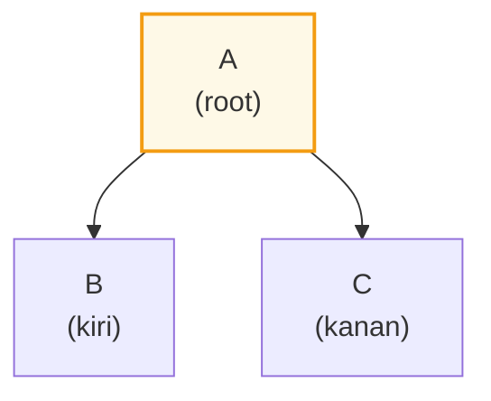
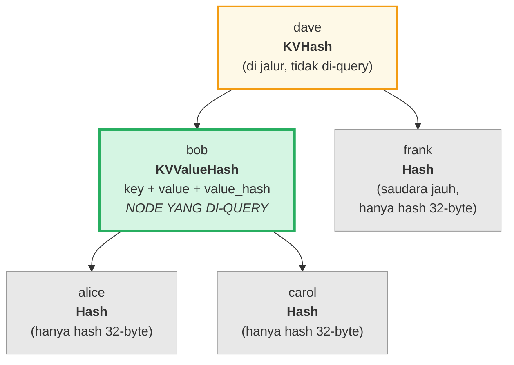
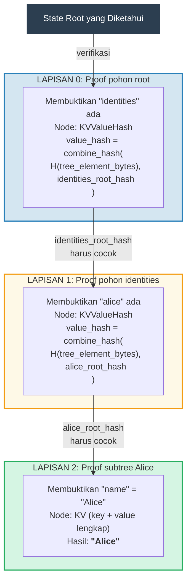
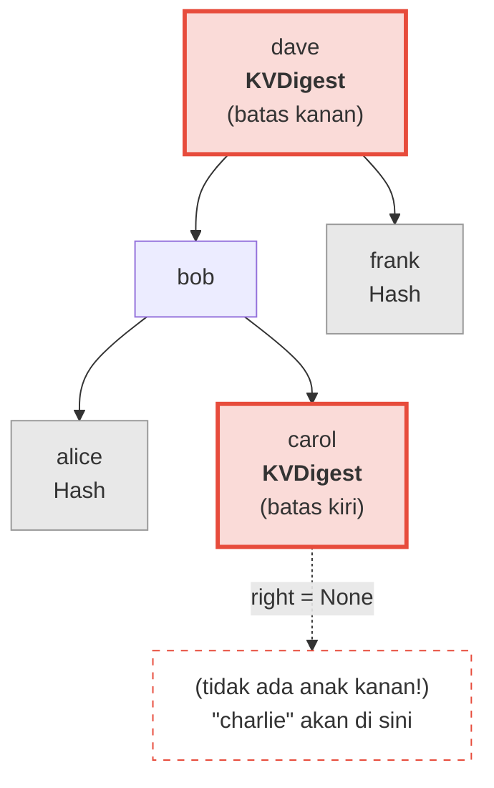
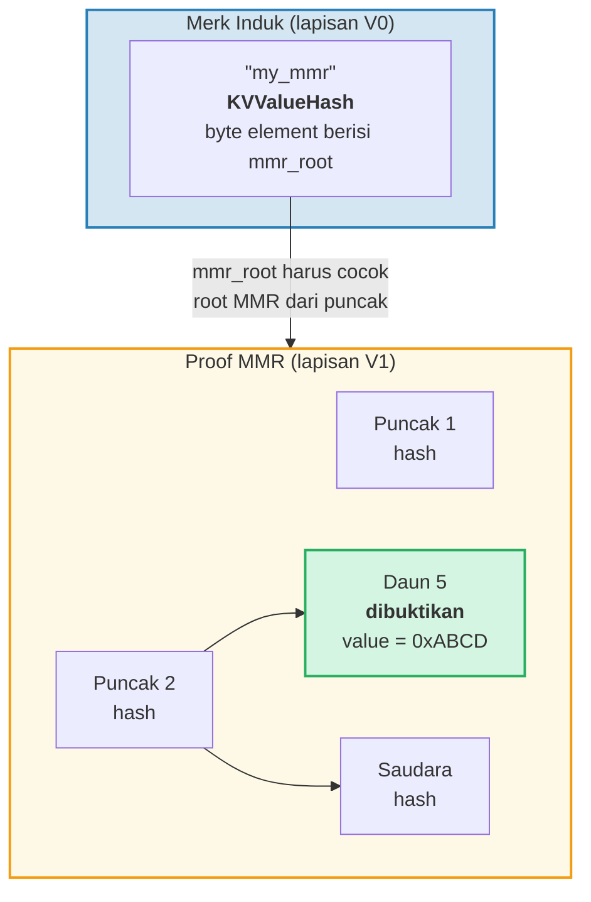
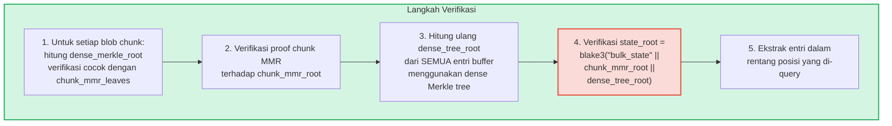
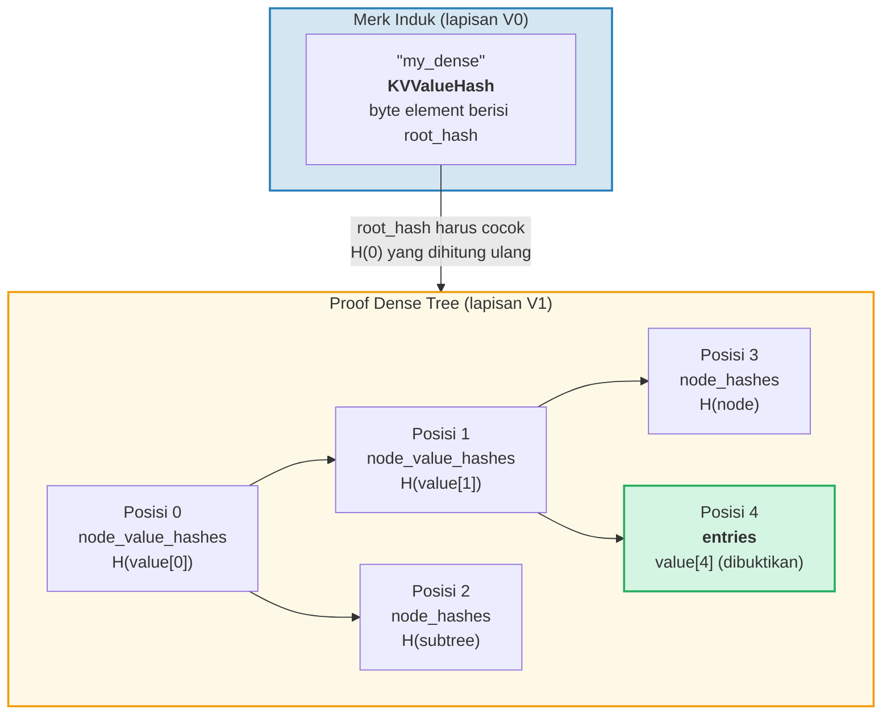

# Sistem Proof

Sistem proof (bukti) GroveDB memungkinkan pihak mana pun memverifikasi kebenaran hasil query
tanpa memiliki database lengkap. Sebuah proof adalah representasi ringkas dari
struktur pohon yang relevan yang memungkinkan rekonstruksi root hash.

## Operasi Proof Berbasis Stack

Proof di-encode sebagai urutan **operasi** yang merekonstruksi pohon parsial
menggunakan mesin stack:

```rust
// merk/src/proofs/mod.rs
pub enum Op {
    Push(Node),        // Dorong node ke stack (urutan key naik)
    PushInverted(Node),// Dorong node (urutan key turun)
    Parent,            // Pop induk, pop anak → pasang anak sebagai KIRI induk
    Child,             // Pop anak, pop induk → pasang anak sebagai KANAN induk
    ParentInverted,    // Pop induk, pop anak → pasang anak sebagai KANAN induk
    ChildInverted,     // Pop anak, pop induk → pasang anak sebagai KIRI induk
}
```

Eksekusi menggunakan stack:

Operasi proof: `Push(B), Push(A), Parent, Push(C), Child`

| Langkah | Operasi | Stack (atas→kanan) | Aksi |
|------|-----------|-------------------|--------|
| 1 | Push(B) | [ B ] | Dorong B ke stack |
| 2 | Push(A) | [ B , A ] | Dorong A ke stack |
| 3 | Parent | [ A{left:B} ] | Pop A (induk), pop B (anak), B → KIRI dari A |
| 4 | Push(C) | [ A{left:B} , C ] | Dorong C ke stack |
| 5 | Child | [ A{left:B, right:C} ] | Pop C (anak), pop A (induk), C → KANAN dari A |

Hasil akhir — satu pohon di stack:



> Verifier menghitung `node_hash(A) = Blake3(kv_hash_A || node_hash_B || node_hash_C)` dan memeriksa apakah cocok dengan root hash yang diharapkan.

Ini adalah fungsi `execute` (`merk/src/proofs/tree.rs`):

```rust
pub fn execute<I, F>(ops: I, collapse: bool, mut visit_node: F) -> CostResult<Tree, Error>
where
    I: IntoIterator<Item = Result<Op, Error>>,
    F: FnMut(&Node) -> Result<(), Error>,
{
    let mut stack: Vec<Tree> = Vec::with_capacity(32);

    for op in ops {
        match op? {
            Op::Parent => {
                let (mut parent, child) = (try_pop(&mut stack), try_pop(&mut stack));
                parent.left = Some(Child { tree: Box::new(child), hash: child.hash() });
                stack.push(parent);
            }
            Op::Child => {
                let (child, mut parent) = (try_pop(&mut stack), try_pop(&mut stack));
                parent.right = Some(Child { tree: Box::new(child), hash: child.hash() });
                stack.push(parent);
            }
            Op::Push(node) => {
                visit_node(&node)?;
                stack.push(Tree::from(node));
            }
            // ... Varian Inverted menukar kiri/kanan
        }
    }
    // Item terakhir di stack adalah root
}
```

## Tipe Node dalam Proof

Setiap `Push` membawa sebuah `Node` yang berisi informasi secukupnya untuk
verifikasi:

```rust
pub enum Node {
    // Info minimal — hanya hash. Digunakan untuk saudara yang jauh.
    Hash(CryptoHash),

    // Hash KV untuk node di jalur tapi tidak di-query.
    KVHash(CryptoHash),

    // Key-value lengkap untuk item yang di-query.
    KV(Vec<u8>, Vec<u8>),

    // Key, value, dan value_hash yang sudah dihitung.
    // Digunakan untuk subtree di mana value_hash = combine_hash(...)
    KVValueHash(Vec<u8>, Vec<u8>, CryptoHash),

    // KV dengan tipe fitur — untuk ProvableCountTree atau restorasi chunk.
    KVValueHashFeatureType(Vec<u8>, Vec<u8>, CryptoHash, TreeFeatureType),

    // Referensi: key, value yang sudah di-dereference, hash element referensi.
    KVRefValueHash(Vec<u8>, Vec<u8>, CryptoHash),

    // Untuk item di ProvableCountTree.
    KVCount(Vec<u8>, Vec<u8>, u64),

    // Hash KV + hitungan untuk node ProvableCountTree yang tidak di-query.
    KVHashCount(CryptoHash, u64),

    // Referensi di ProvableCountTree.
    KVRefValueHashCount(Vec<u8>, Vec<u8>, CryptoHash, u64),

    // Untuk proof batas/ketiadaan di ProvableCountTree.
    KVDigestCount(Vec<u8>, CryptoHash, u64),

    // Key + value_hash untuk proof ketiadaan (pohon biasa).
    KVDigest(Vec<u8>, CryptoHash),
}
```

Pilihan tipe Node menentukan informasi apa yang dibutuhkan verifier:

**Query: "Dapatkan value untuk key 'bob'"**



> Hijau = node yang di-query (data lengkap diungkap). Kuning = di jalur (hanya kv_hash). Abu-abu = saudara (hanya hash node 32-byte).

Di-encode sebagai operasi proof:

| # | Op | Efek |
|---|----|----|
| 1 | Push(Hash(alice_node_hash)) | Dorong hash alice |
| 2 | Push(KVValueHash("bob", value, value_hash)) | Dorong bob dengan data lengkap |
| 3 | Parent | alice menjadi anak kiri bob |
| 4 | Push(Hash(carol_node_hash)) | Dorong hash carol |
| 5 | Child | carol menjadi anak kanan bob |
| 6 | Push(KVHash(dave_kv_hash)) | Dorong kv_hash dave |
| 7 | Parent | subtree bob menjadi kiri dave |
| 8 | Push(Hash(frank_node_hash)) | Dorong hash frank |
| 9 | Child | frank menjadi anak kanan dave |

## Generasi Proof Multi-Lapisan

Karena GroveDB adalah pohon dari pohon-pohon, proof mencakup beberapa lapisan. Setiap lapisan membuktikan
bagian yang relevan dari satu Merk tree, dan lapisan-lapisan terhubung oleh
mekanisme combined value_hash:

**Query:** `Dapatkan ["identities", "alice", "name"]`



> **Rantai kepercayaan:** `known_state_root → verifikasi Lapisan 0 → verifikasi Lapisan 1 → verifikasi Lapisan 2 → "Alice"`. Root hash yang direkonstruksi setiap lapisan harus cocok dengan value_hash dari lapisan di atasnya.

Verifier memeriksa setiap lapisan, mengonfirmasi bahwa:
1. Proof lapisan merekonstruksi ke root hash yang diharapkan
2. Root hash cocok dengan value_hash dari lapisan induk
3. Root hash tingkat atas cocok dengan state root yang diketahui

## Verifikasi Proof

Verifikasi mengikuti lapisan proof bottom-up atau top-down, menggunakan fungsi `execute`
untuk merekonstruksi pohon setiap lapisan. Metode `Tree::hash()` di pohon proof
menghitung hash berdasarkan tipe node:

```rust
impl Tree {
    pub fn hash(&self) -> CostContext<CryptoHash> {
        match &self.node {
            Node::Hash(hash) => *hash,  // Sudah hash, kembalikan langsung

            Node::KVHash(kv_hash) =>
                node_hash(kv_hash, &self.child_hash(true), &self.child_hash(false)),

            Node::KV(key, value) =>
                kv_hash(key, value)
                    .flat_map(|kv_hash| node_hash(&kv_hash, &left, &right)),

            Node::KVValueHash(key, _, value_hash) =>
                kv_digest_to_kv_hash(key, value_hash)
                    .flat_map(|kv_hash| node_hash(&kv_hash, &left, &right)),

            Node::KVValueHashFeatureType(key, _, value_hash, feature_type) => {
                let kv = kv_digest_to_kv_hash(key, value_hash);
                match feature_type {
                    ProvableCountedMerkNode(count) =>
                        node_hash_with_count(&kv, &left, &right, *count),
                    _ => node_hash(&kv, &left, &right),
                }
            }

            Node::KVRefValueHash(key, referenced_value, ref_element_hash) => {
                let ref_value_hash = value_hash(referenced_value);
                let combined = combine_hash(ref_element_hash, &ref_value_hash);
                let kv = kv_digest_to_kv_hash(key, &combined);
                node_hash(&kv, &left, &right)
            }
            // ... varian lainnya
        }
    }
}
```

## Proof Ketiadaan

GroveDB dapat membuktikan bahwa sebuah key **tidak ada**. Ini menggunakan node batas —
node yang akan berdekatan dengan key yang hilang jika ia ada:

**Buktikan:** "charlie" TIDAK ada



> **Pencarian biner:** alice < bob < carol < **"charlie"** < dave < frank. "charlie" akan berada antara carol dan dave. Anak kanan carol adalah `None`, membuktikan tidak ada apa-apa antara carol dan dave. Oleh karena itu "charlie" tidak mungkin ada di pohon ini.

Untuk range query, proof ketiadaan menunjukkan bahwa tidak ada key dalam rentang yang di-query
yang tidak disertakan dalam set hasil.

## Proof V1 — Pohon Non-Merk

Sistem proof V0 bekerja secara eksklusif dengan subtree Merk, turun lapisan demi
lapisan melalui hierarki grove. Namun, element **CommitmentTree**, **MmrTree**,
**BulkAppendTree**, dan **DenseAppendOnlyFixedSizeTree** menyimpan data mereka
di luar Merk tree anak. Mereka tidak punya Merk anak untuk diturunkan — root hash
spesifik-tipe mereka mengalir sebagai child hash Merk.

**Format proof V1** memperluas V0 untuk menangani pohon non-Merk ini dengan
struktur proof spesifik-tipe:

```rust
/// Format proof mana yang digunakan lapisan.
pub enum ProofBytes {
    Merk(Vec<u8>),            // Operasi proof Merk standar
    MMR(Vec<u8>),             // Proof keanggotaan MMR
    BulkAppendTree(Vec<u8>),  // Proof rentang BulkAppendTree
    DenseTree(Vec<u8>),       // Proof inklusi Dense tree
    CommitmentTree(Vec<u8>),  // Root sinsemilla (32 byte) + byte proof BulkAppendTree
}

/// Satu lapisan proof V1.
pub struct LayerProof {
    pub merk_proof: ProofBytes,
    pub lower_layers: BTreeMap<Vec<u8>, LayerProof>,
}
```

**Aturan pemilihan V0/V1:** Jika setiap lapisan dalam proof adalah Merk tree standar,
`prove_query` menghasilkan `GroveDBProof::V0` (kompatibel ke belakang). Jika ada lapisan
yang melibatkan MmrTree, BulkAppendTree, atau DenseAppendOnlyFixedSizeTree, ia menghasilkan
`GroveDBProof::V1`.

### Bagaimana Proof Pohon Non-Merk Terikat ke Root Hash

Merk tree induk membuktikan byte element ter-serialisasi melalui node proof Merk
standar (`KVValueHash`). Root spesifik-tipe (misalnya, `mmr_root` atau
`state_root`) mengalir sebagai **child hash** Merk — ia TIDAK tertanam dalam
byte element:

```text
combined_value_hash = combine_hash(
    Blake3(varint(len) || element_bytes),   ← berisi count, height, dll.
    type_specific_root                      ← mmr_root / state_root / dense_root
)
```

Proof spesifik-tipe kemudian membuktikan bahwa data yang di-query konsisten dengan
root spesifik-tipe yang digunakan sebagai child hash.

### Proof MMR Tree

Proof MMR menunjukkan bahwa daun-daun tertentu ada pada posisi yang diketahui dalam
MMR, dan bahwa root hash MMR cocok dengan child hash yang disimpan di
node Merk induk:

```rust
pub struct MmrProof {
    pub mmr_size: u64,
    pub proof: MerkleProof,  // ckb_merkle_mountain_range::MerkleProof
    pub leaves: Vec<MmrProofLeaf>,
}

pub struct MmrProofLeaf {
    pub position: u64,       // Posisi MMR
    pub leaf_index: u64,     // Indeks daun logis
    pub hash: [u8; 32],      // Hash daun
    pub value: Vec<u8>,      // Byte value daun
}
```



**Key query adalah posisi:** Item query meng-encode posisi sebagai byte u64 big-endian
(yang mempertahankan urutan pengurutan). `QueryItem::RangeInclusive` dengan posisi
awal/akhir ber-encode BE memilih rentang berturutan dari daun MMR.

**Verifikasi:**
1. Rekonstruksi daun `MmrNode` dari proof
2. Verifikasi `MerkleProof` ckb terhadap root MMR yang diharapkan dari child hash Merk induk
3. Validasi silang bahwa `proof.mmr_size` cocok dengan ukuran yang disimpan element
4. Kembalikan value daun yang dibuktikan

### Proof BulkAppendTree

Proof BulkAppendTree lebih kompleks karena data berada di dua tempat: blob
chunk yang tersegel dan buffer yang sedang berjalan. Proof rentang harus mengembalikan:

- **Blob chunk lengkap** untuk setiap chunk yang sudah selesai yang tumpang tindih dengan rentang query
- **Entri buffer individual** untuk posisi yang masih di buffer

```rust
pub struct BulkAppendTreeProof {
    pub chunk_power: u8,
    pub total_count: u64,
    pub chunk_blobs: Vec<(u64, Vec<u8>)>,       // (chunk_index, blob_bytes)
    pub chunk_mmr_size: u64,
    pub chunk_mmr_proof_items: Vec<[u8; 32]>,    // Hash saudara MMR
    pub chunk_mmr_leaves: Vec<(u64, [u8; 32])>,  // (mmr_pos, dense_merkle_root)
    pub buffer_entries: Vec<Vec<u8>>,             // SEMUA entri buffer saat ini (dense tree)
    pub chunk_mmr_root: [u8; 32],
}
```



> **Mengapa menyertakan SEMUA entri buffer?** Buffer adalah dense Merkle tree yang root hash-nya
> meng-commit ke setiap entri. Untuk memverifikasi `dense_tree_root`, verifier harus
> membangun ulang pohon dari semua entri. Karena buffer dibatasi oleh `capacity`
> entri (paling banyak 65.535), ini dapat diterima.

**Penghitungan limit:** Setiap value individual (dalam chunk atau buffer) dihitung
terhadap limit query, bukan setiap blob chunk secara keseluruhan. Jika query memiliki
`limit: 100` dan sebuah chunk berisi 1024 entri dengan 500 yang tumpang tindih rentang,
semua 500 entri dihitung terhadap limit.

### Proof DenseAppendOnlyFixedSizeTree

Proof dense tree menunjukkan bahwa posisi tertentu menyimpan value tertentu,
diotentikasi terhadap root hash pohon (yang mengalir sebagai child hash Merk).
Semua node menggunakan `blake3(H(value) || H(left) || H(right))`, jadi node ancestor di
jalur otentikasi hanya memerlukan **value hash** 32-byte mereka — bukan value lengkap.

```rust
pub struct DenseTreeProof {
    pub entries: Vec<(u16, Vec<u8>)>,            // (posisi, value) yang dibuktikan
    pub node_value_hashes: Vec<(u16, [u8; 32])>, // value hash ancestor di jalur otentikasi
    pub node_hashes: Vec<(u16, [u8; 32])>,       // hash subtree saudara yang sudah dihitung
}
```

> `height` dan `count` berasal dari Element induk (diotentikasi oleh hierarki Merk), bukan dari proof.



**Verifikasi** adalah fungsi murni yang tidak memerlukan penyimpanan:
1. Bangun peta pencarian dari `entries`, `node_value_hashes`, dan `node_hashes`
2. Hitung ulang root hash secara rekursif dari posisi 0:
   - Posisi memiliki hash yang sudah dihitung di `node_hashes` → gunakan langsung
   - Posisi dengan value di `entries` → `blake3(blake3(value) || H(left) || H(right))`
   - Posisi dengan hash di `node_value_hashes` → `blake3(hash || H(left) || H(right))`
   - Posisi `>= count` atau `>= capacity` → `[0u8; 32]`
3. Bandingkan root yang dihitung dengan root hash yang diharapkan dari element induk
4. Kembalikan entri yang dibuktikan jika berhasil

**Proof multi-posisi** menggabungkan jalur otentikasi yang tumpang tindih: ancestor bersama dan
value mereka hanya muncul sekali, membuatnya lebih ringkas daripada proof independen.

---
