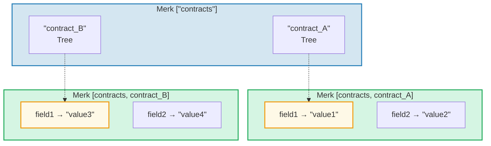
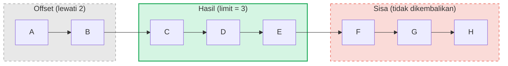

# Sistem Query

## Struktur PathQuery

Query GroveDB menggunakan tipe `PathQuery`, yang menggabungkan path (di mana mencari)
dengan query (apa yang dipilih):

```rust
pub struct PathQuery {
    pub path: Vec<Vec<u8>>,         // Path awal di grove
    pub query: SizedQuery,          // Apa yang dipilih
}

pub struct SizedQuery {
    pub query: Query,               // Kriteria seleksi
    pub limit: Option<u16>,         // Jumlah maksimum hasil
    pub offset: Option<u16>,        // Lewati N hasil pertama
}
```

## Tipe Query

```rust
pub struct Query {
    pub items: Vec<QueryItem>,              // Apa yang dicocokkan
    pub default_subquery_branch: SubqueryBranch,
    pub conditional_subquery_branches: Option<IndexMap<QueryItem, SubqueryBranch>>,
    pub left_to_right: bool,                // Arah iterasi
    pub add_parent_tree_on_subquery: bool,  // Sertakan element pohon induk dalam hasil (v2)
}
```

> **`add_parent_tree_on_subquery`** (v2): Ketika `true`, element pohon induk (misalnya,
> CountTree atau SumTree) disertakan dalam hasil query bersama value anak-anaknya.
> Ini memungkinkan Anda mengambil baik value agregat maupun element individual dalam satu query.

## QueryItem — Apa yang Dipilih

Setiap `QueryItem` menentukan key atau rentang yang dicocokkan:

```rust
pub enum QueryItem {
    Key(Vec<u8>),                           // Pencocokan key tepat
    Range(Range<Vec<u8>>),                  // Rentang eksklusif [start..end)
    RangeInclusive(RangeInclusive<Vec<u8>>),// Rentang inklusif [start..=end]
    RangeFull(RangeFull),                   // Semua key
    RangeFrom(RangeFrom<Vec<u8>>),          // [start..)
    RangeTo(RangeTo<Vec<u8>>),              // [..end)
    RangeToInclusive(RangeToInclusive<Vec<u8>>), // [..=end]
    RangeAfter(RangeFrom<Vec<u8>>),         // (start..) start eksklusif
    RangeAfterTo(Range<Vec<u8>>),           // (start..end) keduanya eksklusif
    RangeAfterToInclusive(RangeInclusive<Vec<u8>>), // (start..=end]
}
```

Contoh query:

Merk tree (terurut): `alice  bob  carol  dave  eve  frank`

| Query | Seleksi | Hasil |
|-------|-----------|--------|
| `Key("bob")` | alice **[bob]** carol dave eve frank | bob |
| `RangeInclusive("bob"..="dave")` | alice **[bob carol dave]** eve frank | bob, carol, dave |
| `RangeAfter("carol"..)` | alice bob carol **[dave eve frank]** | dave, eve, frank |
| `RangeFull`, limit=2 | **[alice bob]** carol dave eve frank *(dihentikan oleh limit)* | alice, bob |
| `RangeFull`, limit=2, kanan-ke-kiri | alice bob carol dave **[eve frank]** *(dihentikan oleh limit)* | frank, eve |

## Subquery dan Cabang Bersyarat

Kekuatan sebenarnya query GroveDB adalah **subquery** — ketika query mencocokkan element Tree,
query dapat secara otomatis turun ke subtree tersebut:



> **PathQuery:** `path: ["contracts"], query: RangeFull` dengan `default_subquery: Key("field1")`
>
> **Eksekusi:**
> 1. `RangeFull` pada ["contracts"] → cocok contract_A, contract_B
> 2. Keduanya adalah element Tree → turun dengan subquery `Key("field1")`
> 3. contract_A → "value1", contract_B → "value3"
>
> **Hasil:** `["value1", "value3"]`

**Subquery bersyarat** memungkinkan Anda menerapkan subquery berbeda berdasarkan key mana
yang cocok:

```rust
conditional_subquery_branches: Some(indexmap! {
    QueryItem::Key(b"contract_A".to_vec()) => SubqueryBranch {
        subquery: Some(Query { items: vec![Key(b"field1".to_vec())] }),
        ..
    },
    QueryItem::Key(b"contract_B".to_vec()) => SubqueryBranch {
        subquery: Some(Query { items: vec![Key(b"field2".to_vec())] }),
        ..
    },
})
```

Ini akan mendapatkan `field1` dari `contract_A` tapi `field2` dari `contract_B`.

## Sized Query — Limit dan Offset

Wrapper `SizedQuery` menambahkan paginasi:



> `SizedQuery { query: RangeFull, limit: Some(3), offset: Some(2) }` → Hasil: **[C, D, E]**

Ketika dikombinasikan dengan `left_to_right: false`, iterasi dibalik:

```text
    SizedQuery {
        query: Query { items: [RangeFull], left_to_right: false, .. },
        limit: Some(3),
        offset: None
    }

    Hasil: [H, G, F]
```

## Penggabungan Query

Beberapa PathQuery dapat digabungkan menjadi satu query untuk efisiensi. Algoritma penggabungan
menemukan prefiks path yang sama dan menggabungkan item query:

```text
    Query A: path=["users"], query=Key("alice")
    Query B: path=["users"], query=Key("bob")

    Digabungkan: path=["users"], query=items=[Key("alice"), Key("bob")]
```

---
