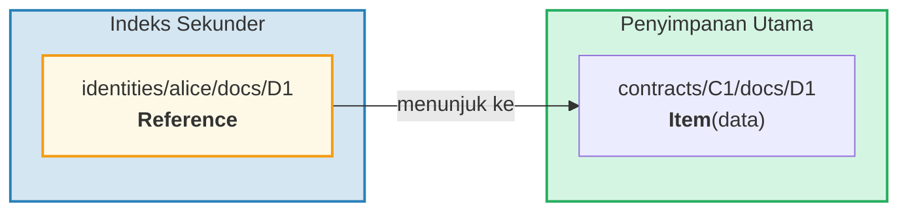
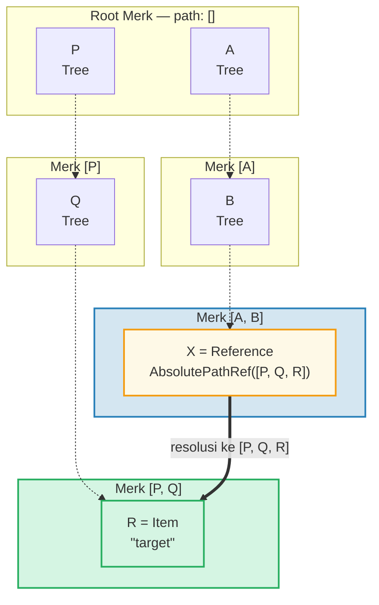
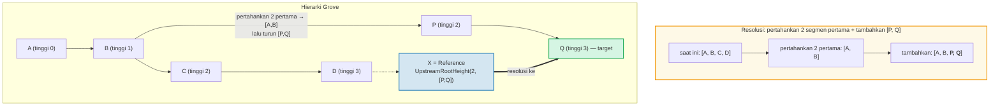
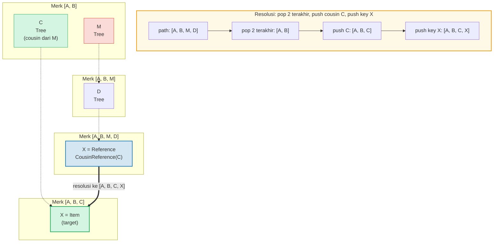
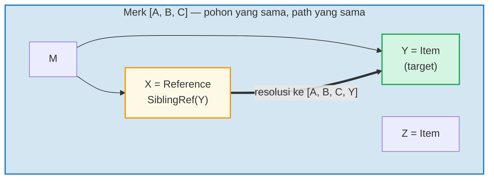
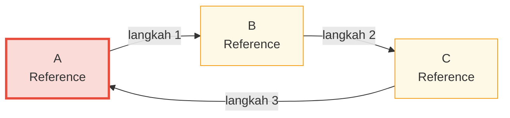

# Sistem Referensi

## Mengapa Referensi Ada

Dalam database hierarkis, Anda sering memerlukan data yang sama dapat diakses dari beberapa
path. Misalnya, dokumen mungkin disimpan di bawah kontrak mereka tetapi juga
dapat di-query berdasarkan identitas pemilik. **Referensi** adalah jawaban GroveDB — mereka adalah
pointer dari satu lokasi ke lokasi lain, mirip dengan symbolic link di filesystem.



Properti kunci:
- Referensi **terotentikasi** — value_hash referensi mencakup baik
  referensi itu sendiri maupun element yang direferensikan
- Referensi dapat **dirantai** — sebuah referensi dapat menunjuk ke referensi lain
- Deteksi siklus mencegah loop tak terbatas
- Batas hop yang dapat dikonfigurasi mencegah kelelahan sumber daya

## Tujuh Tipe Referensi

```rust
// grovedb-element/src/reference_path/mod.rs
pub enum ReferencePathType {
    AbsolutePathReference(Vec<Vec<u8>>),
    UpstreamRootHeightReference(u8, Vec<Vec<u8>>),
    UpstreamRootHeightWithParentPathAdditionReference(u8, Vec<Vec<u8>>),
    UpstreamFromElementHeightReference(u8, Vec<Vec<u8>>),
    CousinReference(Vec<u8>),
    RemovedCousinReference(Vec<Vec<u8>>),
    SiblingReference(Vec<u8>),
}
```

Mari kita bahas masing-masing dengan diagram.

### AbsolutePathReference

Tipe paling sederhana. Menyimpan path lengkap ke target:



> X menyimpan path absolut lengkap `[P, Q, R]`. Di mana pun X berada, ia selalu ter-resolve ke target yang sama.

### UpstreamRootHeightReference

Mempertahankan N segmen pertama dari path saat ini, lalu menambahkan path baru:



### UpstreamRootHeightWithParentPathAdditionReference

Seperti UpstreamRootHeight, tapi menambahkan kembali segmen terakhir dari path saat ini:

```text
    Referensi di path [A, B, C, D, E] key=X
    UpstreamRootHeightWithParentPathAdditionReference(2, [P, Q])

    Path saat ini:       [A, B, C, D, E]
    Pertahankan 2 pertama: [A, B]
    Tambahkan [P, Q]:    [A, B, P, Q]
    Tambahkan ulang terakhir: [A, B, P, Q, E]   ← "E" dari path asli ditambahkan kembali

    Berguna untuk: indeks di mana key induk harus dipertahankan
```

### UpstreamFromElementHeightReference

Membuang N segmen terakhir, lalu menambahkan:

```text
    Referensi di path [A, B, C, D] key=X
    UpstreamFromElementHeightReference(1, [P, Q])

    Path saat ini:      [A, B, C, D]
    Buang 1 terakhir:   [A, B, C]
    Tambahkan [P, Q]:   [A, B, C, P, Q]
```

### CousinReference

Mengganti hanya induk langsung dengan key baru:



> "Cousin" adalah subtree saudara dari kakek referensi. Referensi menavigasi naik dua level, lalu turun ke subtree cousin.

### RemovedCousinReference

Seperti CousinReference tapi mengganti induk dengan path multi-segmen:

```text
    Referensi di path [A, B, C, D] key=X
    RemovedCousinReference([M, N])

    Path saat ini:   [A, B, C, D]
    Pop induk C:     [A, B]
    Tambahkan [M, N]: [A, B, M, N]
    Push key X:      [A, B, M, N, X]
```

### SiblingReference

Referensi relatif paling sederhana — hanya mengubah key dalam induk yang sama:



> Tipe referensi paling sederhana. X dan Y adalah saudara dalam Merk tree yang sama — resolusi hanya mengubah key sambil mempertahankan path yang sama.

## Penyusuran Referensi dan Batas Hop

Ketika GroveDB menemukan element Reference, ia harus **mengikutinya** untuk menemukan
value sebenarnya. Karena referensi dapat menunjuk ke referensi lain, ini melibatkan loop:

```rust
// grovedb/src/reference_path.rs
pub const MAX_REFERENCE_HOPS: usize = 10;

pub fn follow_reference(...) -> CostResult<ResolvedReference, Error> {
    let mut hops_left = MAX_REFERENCE_HOPS;
    let mut visited = HashSet::new();

    while hops_left > 0 {
        // Resolve path referensi ke path absolut
        let target_path = current_ref.absolute_qualified_path(...);

        // Periksa siklus
        if !visited.insert(target_path.clone()) {
            return Err(Error::CyclicReference);
        }

        // Ambil element di target
        let element = Element::get(target_path);

        match element {
            Element::Reference(next_ref, ..) => {
                // Masih referensi — terus ikuti
                current_ref = next_ref;
                hops_left -= 1;
            }
            other => {
                // Menemukan element sebenarnya!
                return Ok(ResolvedReference { element: other, ... });
            }
        }
    }

    Err(Error::ReferenceLimit)  // Melebihi 10 hop
}
```

## Deteksi Siklus

HashSet `visited` melacak semua path yang sudah dikunjungi. Jika kita menemukan path yang sudah
pernah dikunjungi, kita memiliki siklus:



> **Jejak deteksi siklus:**
>
> | Langkah | Ikuti | Set visited | Hasil |
> |------|--------|-------------|--------|
> | 1 | Mulai di A | { A } | A adalah Ref → ikuti |
> | 2 | A → B | { A, B } | B adalah Ref → ikuti |
> | 3 | B → C | { A, B, C } | C adalah Ref → ikuti |
> | 4 | C → A | A sudah ada di visited! | **Error::CyclicRef** |
>
> Tanpa deteksi siklus, ini akan loop selamanya. `MAX_REFERENCE_HOPS = 10` juga membatasi kedalaman traversal untuk rantai panjang.

## Referensi dalam Merk — Hash Value Gabungan

Ketika sebuah Reference disimpan di Merk tree, `value_hash`-nya harus mengotentikasi
baik struktur referensi maupun data yang direferensikan:

```rust
// merk/src/tree/kv.rs
pub fn update_hashes_using_reference_value_hash(
    mut self,
    reference_value_hash: CryptoHash,
) -> CostContext<Self> {
    // Hash byte element referensi itu sendiri
    let actual_value_hash = value_hash(self.value_as_slice());

    // Gabungkan: H(reference_bytes) ⊕ H(referenced_data)
    let combined = combine_hash(&actual_value_hash, &reference_value_hash);

    self.value_hash = combined;
    self.hash = kv_digest_to_kv_hash(self.key(), self.value_hash());
    // ...
}
```

Ini berarti mengubah referensi itu sendiri ATAU data yang ditunjuknya akan
mengubah root hash — keduanya terikat secara kriptografis.

---
