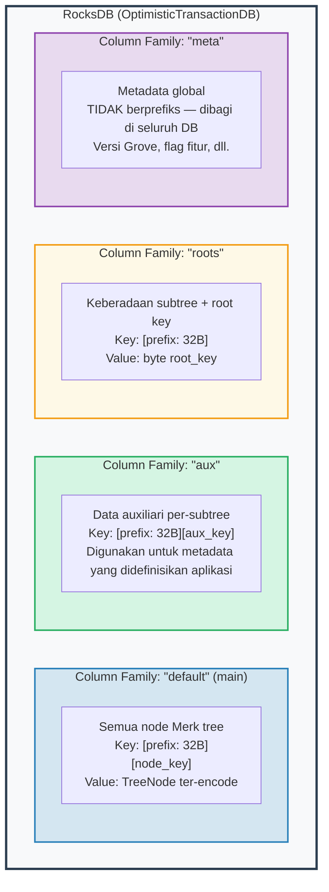
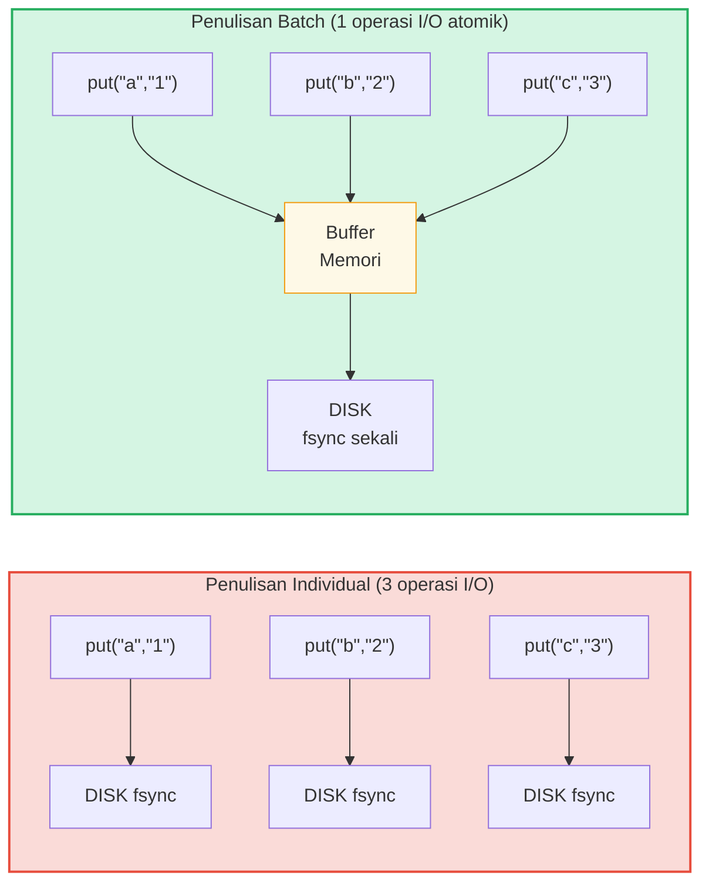

# Lapisan Penyimpanan

## RocksDB dengan OptimisticTransactionDB

GroveDB menggunakan **RocksDB** sebagai backend penyimpanannya, khususnya varian
`OptimisticTransactionDB` yang mendukung transaksi:

```rust
// storage/src/rocksdb_storage/storage.rs
pub(crate) type Db = OptimisticTransactionDB;
pub(crate) type Tx<'db> = Transaction<'db, Db>;

pub struct RocksDbStorage {
    db: OptimisticTransactionDB,
}
```

**Transaksi optimistik** bekerja dengan mengasumsikan tidak akan ada konflik. Jika dua
transaksi memodifikasi data yang sama, transaksi kedua yang di-commit akan gagal dan dapat
dicoba ulang. Ini lebih efisien daripada penguncian pesimistik untuk beban kerja di mana
konflik jarang terjadi.

Opsi RocksDB disetel untuk beban kerja GroveDB:

```rust
lazy_static! {
    static ref DEFAULT_OPTS: rocksdb::Options = {
        let mut opts = rocksdb::Options::default();
        opts.create_if_missing(true);
        opts.increase_parallelism(num_cpus::get() as i32);
        opts.set_allow_mmap_writes(true);
        opts.set_allow_mmap_reads(true);
        opts.create_missing_column_families(true);
        opts.set_atomic_flush(true);
        opts
    };
}
```

## Empat Column Family

Column family RocksDB bertindak seperti namespace key-value terpisah dalam satu
database. GroveDB menggunakan empat:



> **Contoh:** Key `[ab3fc2...][6e616d65]` di CF "default" memetakan ke `TreeNode{key:"name", val:"Al"}`, di mana `ab3fc2...` adalah `Blake3(path)` dan `6e616d65` adalah `"name"` dalam byte.

```rust
pub(crate) const AUX_CF_NAME: &str = "aux";
pub(crate) const ROOTS_CF_NAME: &str = "roots";
pub(crate) const META_CF_NAME: &str = "meta";
// Data utama menggunakan column family default
```

## Konteks Penyimpanan Berprefiks

Setiap subtree mendapat **konteks penyimpanan berprefiks** sendiri — wrapper yang
secara otomatis menambahkan prefiks Blake3 32-byte ke semua key:

```text
    Path subtree: ["identities", "alice"]
    Prefiks: Blake3(path) = [0xab, 0x3f, 0xc2, ...]  (32 byte)

    Ketika subtree menyimpan key "name" dengan value "Alice":

    Key RocksDB:   [0xab 0x3f 0xc2 ... (32 byte) | 0x6e 0x61 0x6d 0x65]
                    \_________prefiks________/       \_____"name"_____/

    Value RocksDB: [TreeNode ter-encode dengan value "Alice"]
```

Tipe konteks:

```text
    Tanpa transaksi:
    PrefixedRocksDbImmediateStorageContext
    └── Baca/tulis langsung ke DB dengan prefiks

    Dengan transaksi:
    PrefixedRocksDbTransactionContext
    └── Baca/tulis melalui Transaction dengan prefiks
```

Keduanya mengimplementasikan trait `StorageContext`:

```rust
pub trait StorageContext<'db> {
    fn get(&self, key: &[u8]) -> CostResult<Option<Vec<u8>>, Error>;
    fn get_aux(&self, key: &[u8]) -> CostResult<Option<Vec<u8>>, Error>;
    fn get_root(&self, key: &[u8]) -> CostResult<Option<Vec<u8>>, Error>;
    fn get_meta(&self, key: &[u8]) -> CostResult<Option<Vec<u8>>, Error>;
    fn put(&self, key: &[u8], value: &[u8], ...) -> CostResult<(), Error>;
    fn put_aux(&self, key: &[u8], value: &[u8], ...) -> CostResult<(), Error>;
    fn put_root(&self, key: &[u8], value: &[u8], ...) -> CostResult<(), Error>;
    fn put_meta(&self, key: &[u8], value: &[u8], ...) -> CostResult<(), Error>;
    fn delete(&self, key: &[u8], ...) -> CostResult<(), Error>;
    // ...
}
```

## Write Batch dan Model Transaksi

Untuk performa, GroveDB mengakumulasi penulisan menjadi batch:



> 3 sinkronisasi disk vs 1 sinkronisasi disk = ~3x lebih cepat. Penulisan batch juga **atomik** (semua-atau-tidak-sama-sekali).

`StorageBatch` mengakumulasi operasi yang di-flush bersama:

```rust
pub struct StorageBatch {
    operations: RefCell<Vec<AbstractBatchOperation>>,
}
```

## Pola Kritis commit_local()

Ketika menggunakan transaksi, ada pola kritis yang harus diikuti. Penulisan
di dalam transaksi di-buffer — mereka tidak terlihat sampai di-commit:

```rust
// Pola BENAR:
{
    let tx = db.start_transaction();
    let storage_ctx = db.get_transactional_storage_context(path, &tx);

    storage_ctx.put(key, value);  // Menulis ke buffer transaksi

    drop(storage_ctx);            // Lepaskan borrow pada tx
    tx.commit_local();            // Flush transaksi ke DB
}

// SALAH — data hilang:
{
    let tx = db.start_transaction();
    let storage_ctx = db.get_transactional_storage_context(path, &tx);

    storage_ctx.put(key, value);  // Menulis ke buffer transaksi

    // tx di-drop di sini tanpa commit_local()!
    // Semua penulisan DIBATALKAN!
}
```

Ini sangat penting karena `storage_ctx` meminjam transaksi.
Anda harus `drop(storage_ctx)` sebelum bisa memanggil `tx.commit_local()`.

---
