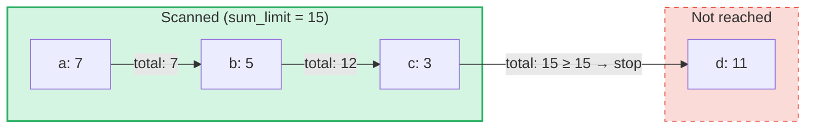

# Query di somma aggregata

## Panoramica

Le Query di Somma Aggregata sono un tipo di query specializzato progettato per i **SumTrees** in GroveDB.
Mentre le query normali recuperano elementi per chiave o intervallo, le query di somma aggregata iterano
attraverso gli elementi e accumulano i loro valori di somma fino al raggiungimento di un **limite di somma**.

Questo e utile per domande come:
- "Dammi le transazioni finche il totale progressivo non supera 1000"
- "Quali elementi contribuiscono alle prime 500 unita di valore in questo albero?"
- "Raccogli gli elementi di somma fino a un budget di N"

## Concetti fondamentali

### Come si differenzia dalle query normali

| Caratteristica | PathQuery | AggregateSumPathQuery |
|---------|-----------|----------------------|
| **Obiettivo** | Qualsiasi tipo di elemento | Elementi SumItem / ItemWithSumItem |
| **Condizione di arresto** | Limite (conteggio) o fine dell'intervallo | Limite di somma (totale progressivo) **e/o** limite di elementi |
| **Restituisce** | Elementi o chiavi | Coppie chiave-valore di somma |
| **Sottoquery** | Si (discende nei sottoalberi) | No (singolo livello dell'albero) |
| **Riferimenti** | Risolti dal livello GroveDB | Opzionalmente seguiti o ignorati |

### La struttura AggregateSumQuery

```rust
pub struct AggregateSumQuery {
    pub items: Vec<QueryItem>,              // Keys or ranges to scan
    pub left_to_right: bool,                // Iteration direction
    pub sum_limit: u64,                     // Stop when running total reaches this
    pub limit_of_items_to_check: Option<u16>, // Max number of matching items to return
}
```

La query viene racchiusa in un `AggregateSumPathQuery` per specificare dove cercare nel grove:

```rust
pub struct AggregateSumPathQuery {
    pub path: Vec<Vec<u8>>,                 // Path to the SumTree
    pub aggregate_sum_query: AggregateSumQuery,
}
```

### Limite di somma — Il totale progressivo

Il `sum_limit` e il concetto centrale. Man mano che gli elementi vengono scansionati, i loro valori di somma
vengono accumulati. Una volta che il totale progressivo raggiunge o supera il limite di somma, l'iterazione si interrompe:



> **Risultato:** `[(a, 7), (b, 5), (c, 3)]` — l'iterazione si interrompe perche 7 + 5 + 3 = 15 >= sum_limit

I valori di somma negativi sono supportati. Un valore negativo aumenta il budget rimanente:

```text
sum_limit = 12, elements: a(10), b(-3), c(5)

a: total = 10, remaining = 2
b: total =  7, remaining = 5  ← negative value gave us more room
c: total = 12, remaining = 0  ← stop

Result: [(a, 10), (b, -3), (c, 5)]
```

## Opzioni della query

La struttura `AggregateSumQueryOptions` controlla il comportamento della query:

```rust
pub struct AggregateSumQueryOptions {
    pub allow_cache: bool,                              // Use cached reads (default: true)
    pub error_if_intermediate_path_tree_not_present: bool, // Error on missing path (default: true)
    pub error_if_non_sum_item_found: bool,              // Error on non-sum elements (default: true)
    pub ignore_references: bool,                        // Skip references (default: false)
}
```

### Gestione degli elementi non-sum

I SumTrees possono contenere un mix di tipi di elementi: `SumItem`, `Item`, `Reference`, `ItemWithSumItem`
e altri. Per impostazione predefinita, incontrare un elemento non-sum e non-reference produce un errore.

Quando `error_if_non_sum_item_found` e impostato su `false`, gli elementi non-sum vengono **saltati silenziosamente**
senza consumare uno slot del limite utente:

```text
Tree contents: a(SumItem=7), b(Item), c(SumItem=3)
Query: sum_limit=100, limit_of_items_to_check=2, error_if_non_sum_item_found=false

Scan: a(7) → returned, limit=1
      b(Item) → skipped, limit still 1
      c(3) → returned, limit=0 → stop

Result: [(a, 7), (c, 3)]
```

Nota: gli elementi `ItemWithSumItem` vengono **sempre** elaborati (mai saltati), perche contengono
un valore di somma.

### Gestione dei riferimenti

Per impostazione predefinita, gli elementi `Reference` vengono **seguiti** — la query risolve la catena di riferimenti
(fino a 3 passaggi intermedi) per trovare il valore di somma dell'elemento di destinazione:

```text
Tree contents: a(SumItem=7), ref_b(Reference → a)
Query: sum_limit=100

ref_b is followed → resolves to a(SumItem=7)

Result: [(a, 7), (ref_b, 7)]
```

Quando `ignore_references` e `true`, i riferimenti vengono saltati silenziosamente senza consumare uno slot
del limite, in modo simile a come vengono saltati gli elementi non-sum.

Le catene di riferimenti con piu di 3 passaggi intermedi producono un errore `ReferenceLimit`.

## Il tipo di risultato

Le query restituiscono un `AggregateSumQueryResult`:

```rust
pub struct AggregateSumQueryResult {
    pub results: Vec<(Vec<u8>, i64)>,       // Key-sum value pairs
    pub hard_limit_reached: bool,           // True if system limit truncated results
}
```

Il flag `hard_limit_reached` indica se il limite rigido di scansione del sistema (predefinito: 1024
elementi) e stato raggiunto prima che la query si completasse naturalmente. Quando e `true`, potrebbero esistere
ulteriori risultati oltre a quelli restituiti.

## Due sistemi di limite

Le query di somma aggregata hanno **tre** condizioni di arresto:

| Limite | Origine | Cosa conta | Effetto al raggiungimento |
|-------|--------|---------------|-------------------|
| **sum_limit** | Utente (query) | Totale progressivo dei valori di somma | Interrompe l'iterazione |
| **limit_of_items_to_check** | Utente (query) | Elementi corrispondenti restituiti | Interrompe l'iterazione |
| **Limite rigido di scansione** | Sistema (GroveVersion, predefinito 1024) | Tutti gli elementi scansionati (inclusi quelli saltati) | Interrompe l'iterazione, imposta `hard_limit_reached` |

Il limite rigido di scansione impedisce iterazioni illimitate quando non e impostato alcun limite utente. Gli elementi saltati
(elementi non-sum con `error_if_non_sum_item_found=false`, o riferimenti con
`ignore_references=true`) vengono contati nel limite rigido di scansione ma **non** nel
`limit_of_items_to_check` dell'utente.

## Utilizzo dell'API

### Query semplice

```rust
use grovedb::AggregateSumPathQuery;
use grovedb_merk::proofs::query::AggregateSumQuery;

// "Give me items from this SumTree until the total reaches 1000"
let query = AggregateSumQuery::new(1000, None);
let path_query = AggregateSumPathQuery {
    path: vec![b"my_tree".to_vec()],
    aggregate_sum_query: query,
};

let result = db.query_aggregate_sums(
    &path_query,
    true,   // allow_cache
    true,   // error_if_intermediate_path_tree_not_present
    None,   // transaction
    grove_version,
).unwrap().expect("query failed");

for (key, sum_value) in &result.results {
    println!("{}: {}", String::from_utf8_lossy(key), sum_value);
}
```

### Query con opzioni

```rust
use grovedb::{AggregateSumPathQuery, AggregateSumQueryOptions};
use grovedb_merk::proofs::query::AggregateSumQuery;

// Skip non-sum items and ignore references
let query = AggregateSumQuery::new(1000, Some(50));
let path_query = AggregateSumPathQuery {
    path: vec![b"mixed_tree".to_vec()],
    aggregate_sum_query: query,
};

let result = db.query_aggregate_sums_with_options(
    &path_query,
    AggregateSumQueryOptions {
        error_if_non_sum_item_found: false,  // skip Items, Trees, etc.
        ignore_references: true,              // skip References
        ..AggregateSumQueryOptions::default()
    },
    None,
    grove_version,
).unwrap().expect("query failed");

if result.hard_limit_reached {
    println!("Warning: results may be incomplete (hard limit reached)");
}
```

### Query basate su chiave

Invece di scansionare un intervallo, e possibile interrogare chiavi specifiche:

```rust
// Check the sum value of specific keys
let query = AggregateSumQuery::new_with_keys(
    vec![b"alice".to_vec(), b"bob".to_vec(), b"carol".to_vec()],
    u64::MAX,  // no sum limit
    None,      // no item limit
);
```

### Query discendenti

Iterazione dalla chiave piu alta alla piu bassa:

```rust
let query = AggregateSumQuery::new_descending(500, Some(10));
// Or: query.left_to_right = false;
```

## Riferimento dei costruttori

| Costruttore | Descrizione |
|-------------|-------------|
| `new(sum_limit, limit)` | Intervallo completo, ascendente |
| `new_descending(sum_limit, limit)` | Intervallo completo, discendente |
| `new_single_key(key, sum_limit)` | Ricerca di una singola chiave |
| `new_with_keys(keys, sum_limit, limit)` | Piu chiavi specifiche |
| `new_with_keys_reversed(keys, sum_limit, limit)` | Piu chiavi, discendente |
| `new_single_query_item(item, sum_limit, limit)` | Singolo QueryItem (chiave o intervallo) |
| `new_with_query_items(items, sum_limit, limit)` | Piu QueryItems |

---
