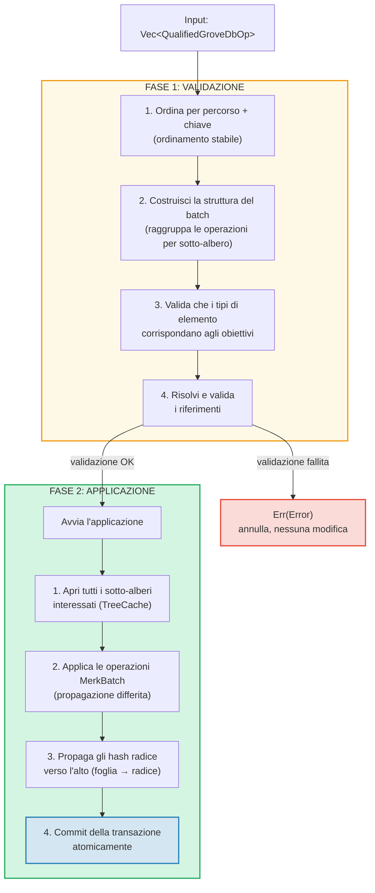
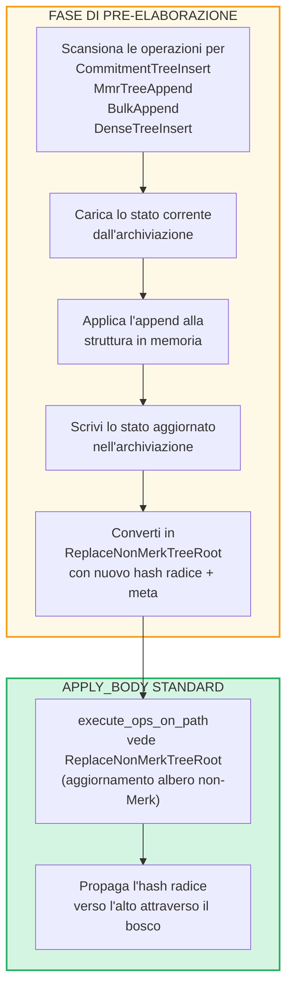

# Operazioni batch a livello di bosco

## Varianti di GroveOp

A livello GroveDB, le operazioni sono rappresentate come `GroveOp`:

```rust
pub enum GroveOp {
    // Operazioni rivolte all'utente:
    InsertOnly { element: Element },
    InsertOrReplace { element: Element },
    Replace { element: Element },
    Patch { element: Element, change_in_bytes: i32 },
    RefreshReference { reference_path_type, max_reference_hop, flags, trust_refresh_reference },
    Delete,
    DeleteTree(TreeType),                          // Parametrizzato per tipo di albero

    // Operazioni di append per alberi non-Merk (rivolte all'utente):
    CommitmentTreeInsert { cmx: [u8; 32], payload: Vec<u8> },
    MmrTreeAppend { value: Vec<u8> },
    BulkAppend { value: Vec<u8> },
    DenseTreeInsert { value: Vec<u8> },

    // Operazioni interne (create dalla pre-elaborazione/propagazione, rifiutate da from_ops):
    ReplaceTreeRootKey { hash, root_key, aggregate_data },
    InsertTreeWithRootHash { hash, root_key, flags, aggregate_data },
    ReplaceNonMerkTreeRoot { hash: [u8; 32], meta: NonMerkTreeMeta },
    InsertNonMerkTree { hash, root_key, flags, aggregate_data, meta: NonMerkTreeMeta },
}
```

**NonMerkTreeMeta** trasporta lo stato specifico del tipo di albero attraverso l'elaborazione del batch:

```rust
pub enum NonMerkTreeMeta {
    CommitmentTree { total_count: u64, chunk_power: u8 },
    MmrTree { mmr_size: u64 },
    BulkAppendTree { total_count: u64, chunk_power: u8 },
    DenseTree { count: u16, height: u8 },
}
```

Ogni operazione e avvolta in un `QualifiedGroveDbOp` che include il percorso:

```rust
pub struct QualifiedGroveDbOp {
    pub path: KeyInfoPath,           // Dove nel bosco
    pub key: Option<KeyInfo>,        // Quale chiave (None per operazioni di alberi append-only)
    pub op: GroveOp,                 // Cosa fare
}
```

> **Nota:** Il campo `key` e `Option<KeyInfo>` — e `None` per le operazioni di alberi append-only (`CommitmentTreeInsert`, `MmrTreeAppend`, `BulkAppend`, `DenseTreeInsert`) dove la chiave dell'albero e invece l'ultimo segmento del `path`.

## Elaborazione in due fasi

Le operazioni batch vengono elaborate in due fasi:



## TreeCache e propagazione differita

Durante l'applicazione del batch, GroveDB usa un **TreeCache** per differire la propagazione degli hash radice fino a quando tutte le operazioni in un sotto-albero sono complete:

```mermaid
graph TD
    subgraph without["SENZA TreeCache (ingenuo)"]
        w1["Op 1: Inserisci A in X"]
        w1p["Propaga X → genitore → radice"]
        w2["Op 2: Inserisci B in X"]
        w2p["Propaga X → genitore → radice"]
        w3["Op 3: Inserisci C in X"]
        w3p["Propaga X → genitore → radice"]
        w1 --> w1p --> w2 --> w2p --> w3 --> w3p
    end

    subgraph with_tc["CON TreeCache (differito)"]
        t1["Op 1: Inserisci A in X<br/>→ bufferizzato"]
        t2["Op 2: Inserisci B in X<br/>→ bufferizzato"]
        t3["Op 3: Inserisci C in X<br/>→ bufferizzato"]
        tp["Propaga X → genitore → radice<br/>(risali UNA VOLTA)"]
        t1 --> t2 --> t3 --> tp
    end

    style without fill:#fadbd8,stroke:#e74c3c,stroke-width:2px
    style with_tc fill:#d5f5e3,stroke:#27ae60,stroke-width:2px
    style w1p fill:#fadbd8,stroke:#e74c3c
    style w2p fill:#fadbd8,stroke:#e74c3c
    style w3p fill:#fadbd8,stroke:#e74c3c
    style tp fill:#d5f5e3,stroke:#27ae60,stroke-width:2px
```



> **3 propagazioni x O(profondita)** vs **1 propagazione x O(profondita)** = 3 volte piu veloce per questo sotto-albero.

Questa e un'ottimizzazione significativa quando molte operazioni puntano allo stesso sotto-albero.

## Operazioni atomiche cross-albero

Una proprieta chiave dei batch di GroveDB e l'**atomicita tra sotto-alberi**. Un singolo batch puo modificare elementi in piu sotto-alberi, e o tutte le modifiche vengono confermate o nessuna:

```text
    Batch:
    1. Delete ["balances", "alice"]       (rimuovi saldo)
    2. Insert ["balances", "bob"] = 100   (aggiungi saldo)
    3. Update ["identities", "bob", "rev"] = 2  (aggiorna revisione)

    Tre sotto-alberi interessati: balances, identities, identities/bob

    Se QUALSIASI operazione fallisce → TUTTE le operazioni vengono annullate
    Se TUTTE riescono → TUTTE vengono confermate atomicamente
```

Il processore del batch gestisce cio:
1. Raccogliendo tutti i percorsi interessati
2. Aprendo tutti i sotto-alberi necessari
3. Applicando tutte le operazioni
4. Propagando tutti gli hash radice nell'ordine delle dipendenze
5. Facendo il commit dell'intera transazione

## Pre-elaborazione del batch per alberi non-Merk

Le operazioni di CommitmentTree, MmrTree, BulkAppendTree e DenseAppendOnlyFixedSizeTree richiedono accesso ai contesti di archiviazione al di fuori del Merk, che non e disponibile all'interno del metodo standard `execute_ops_on_path` (che ha accesso solo al Merk). Queste operazioni usano un **pattern di pre-elaborazione**: prima della fase principale `apply_body`, i punti di ingresso cercano le operazioni degli alberi non-Merk e le convertono in operazioni interne standard.

```rust
pub enum GroveOp {
    // ... operazioni standard ...

    // Operazioni di alberi non-Merk (rivolte all'utente):
    CommitmentTreeInsert { cmx: [u8; 32], payload: Vec<u8> },
    MmrTreeAppend { value: Vec<u8> },
    BulkAppend { value: Vec<u8> },
    DenseTreeInsert { value: Vec<u8> },

    // Operazioni interne (prodotte dalla pre-elaborazione):
    ReplaceNonMerkTreeRoot { hash: [u8; 32], meta: NonMerkTreeMeta },
}
```



**Perche la pre-elaborazione?** La funzione `execute_ops_on_path` opera su un singolo sotto-albero Merk e non ha accesso a `self.db` o a contesti di archiviazione piu ampi. La pre-elaborazione nei punti di ingresso (`apply_batch_with_element_flags_update`, `apply_partial_batch_with_element_flags_update`) ha pieno accesso al database, quindi puo caricare/salvare dati e poi passare un semplice `ReplaceNonMerkTreeRoot` al meccanismo batch standard.

Ogni metodo di pre-elaborazione segue lo stesso pattern:
1. **`preprocess_commitment_tree_ops`** — Carica la frontiera e il BulkAppendTree dall'archiviazione dati, aggiunge a entrambi, salva, converte in `ReplaceNonMerkTreeRoot` con radice combinata aggiornata e meta `CommitmentTree { total_count, chunk_power }`
2. **`preprocess_mmr_tree_ops`** — Carica l'MMR dall'archiviazione dati, aggiunge i valori, salva, converte in `ReplaceNonMerkTreeRoot` con radice MMR aggiornata e meta `MmrTree { mmr_size }`
3. **`preprocess_bulk_append_ops`** — Carica il BulkAppendTree dall'archiviazione dati, aggiunge i valori (potrebbe innescare la compattazione dei chunk), salva, converte in `ReplaceNonMerkTreeRoot` con radice di stato aggiornata e meta `BulkAppendTree { total_count, chunk_power }`
4. **`preprocess_dense_tree_ops`** — Carica il DenseFixedSizedMerkleTree dall'archiviazione dati, inserisce i valori sequenzialmente, ricalcola l'hash radice, salva, converte in `ReplaceNonMerkTreeRoot` con hash radice aggiornato e meta `DenseTree { count, height }`

L'operazione `ReplaceNonMerkTreeRoot` trasporta il nuovo hash radice e un enum `NonMerkTreeMeta` in modo che l'elemento possa essere completamente ricostruito dopo l'elaborazione.

---
