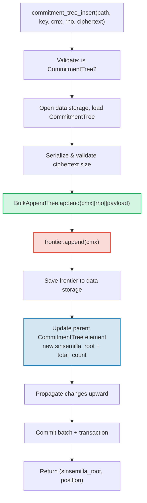

# Il CommitmentTree — Ancoraggi di impegno Sinsemilla

Il **CommitmentTree** e il ponte di GroveDB tra l'archiviazione autenticata e i sistemi di prove a conoscenza zero (zero-knowledge proof). Combina un **BulkAppendTree** (Capitolo 14) per l'archiviazione efficiente dei dati con compattazione a chunk e una **frontiera Sinsemilla** nello spazio dei nomi dati per ancoraggi compatibili con ZK. Come MmrTree e BulkAppendTree, **non ha un Merk figlio** — l'hash radice combinato fluisce come hash figlio del Merk. Sia le voci del BulkAppendTree che la frontiera Sinsemilla risiedono nello **spazio dei nomi dati**.

Questo capitolo tratta la funzione di hash Sinsemilla e perche e importante per i circuiti a conoscenza zero, la struttura dati della frontiera e la sua serializzazione compatta, l'architettura di archiviazione a doppio spazio dei nomi, le operazioni GroveDB, la pre-elaborazione batch, la generazione di testimoni lato client e come funzionano le prove.

## Perche un albero ZK-compatibile?

Gli alberi standard di GroveDB utilizzano l'hashing Blake3. Blake3 e veloce nel software, ma **costoso all'interno dei circuiti a conoscenza zero**. Quando un spender deve dimostrare "conosco una nota alla posizione P nell'albero degli impegni" senza rivelare P, deve valutare la funzione hash di Merkle 32 volte (una per livello dell'albero) all'interno di un circuito ZK.

Sinsemilla (specificato in ZIP-244 per il protocollo Zcash Orchard) e progettato esattamente per questo caso d'uso — fornisce un **hashing efficiente all'interno del circuito** sulla curva ellittica Pallas, una meta del ciclo di curve Pasta utilizzato dal sistema di prove Halo 2.

| Proprieta | Blake3 | Sinsemilla |
|----------|--------|------------|
| **Costo nel circuito** | ~25.000 vincoli per hash | ~800 vincoli per hash |
| **Velocita software** | Molto veloce (~2 GB/s) | Lento (~10.000 hash/s) |
| **Struttura algebrica** | Nessuna (operazioni bit a bit) | Operazioni su punti della curva Pallas |
| **Scopo primario** | Hashing generico, alberi di Merkle | Prove di Merkle all'interno di circuiti |
| **Utilizzato da** | Alberi Merk di GroveDB, MMR, Bulk | Protocollo schermato Orchard |
| **Dimensione output** | 32 byte | 32 byte (elemento di campo Pallas) |

Il CommitmentTree utilizza Sinsemilla per l'albero di Merkle su cui i circuiti ZK ragionano, pur continuando a usare Blake3 per la gerarchia Merk di GroveDB sopra di esso. Gli elementi inseriti nell'albero sono memorizzati tramite un BulkAppendTree nello spazio dei nomi dati (compattati in chunk, recuperabili per posizione) e simultaneamente aggiunti alla frontiera Sinsemilla (producendo un ancoraggio dimostrabile con ZK).

## L'architettura dello spazio dei nomi dati

Il CommitmentTree memorizza **tutti i dati nello spazio dei nomi dati** allo stesso percorso del sotto-albero. Come MmrTree e BulkAppendTree, **non ha un Merk figlio** (nessun campo `root_key` — la radice specifica del tipo fluisce come hash figlio del Merk). Le voci del BulkAppendTree e la frontiera Sinsemilla coesistono nello spazio dei nomi dati usando prefissi di chiave distinti:

```text
┌──────────────────────────────────────────────────────────────┐
│                       CommitmentTree                          │
│                                                               │
│  ┌─────────────────────────────────────────────────────────┐  │
│  │  Data Namespace                                         │  │
│  │                                                         │  │
│  │  BulkAppendTree storage (Chapter 14):                   │  │
│  │    Buffer entries → chunk blobs → chunk MMR             │  │
│  │    value = cmx (32) || rho (32) || ciphertext (216)     │  │
│  │                                                         │  │
│  │  Sinsemilla Frontier (~1KB):                            │  │
│  │    key: b"__ct_data__" (COMMITMENT_TREE_DATA_KEY)       │  │
│  │    Depth-32 incremental Merkle tree                     │  │
│  │    Stores only the rightmost path (leaf + ommers)       │  │
│  │    O(1) append, O(1) root computation                   │  │
│  │    Produces Orchard-compatible Anchor for ZK proofs     │  │
│  └─────────────────────────────────────────────────────────┘  │
│                                                               │
│  sinsemilla_root embedded in Element bytes                    │
│    → flows through Merk value_hash → GroveDB state root      │
└──────────────────────────────────────────────────────────────┘
```

**Perche due strutture?** Il BulkAppendTree fornisce archiviazione e recupero efficienti, compattati in chunk, per potenzialmente milioni di note crittografate. La frontiera Sinsemilla fornisce ancoraggi compatibili con ZK che possono essere dimostrati all'interno di un circuito Halo 2. Entrambe vengono aggiornate in sincronia ad ogni aggiunta.

Confronto con gli altri tipi di albero non standard:

| | CommitmentTree | MmrTree | BulkAppendTree |
|---|---|---|---|
| **Merk figlio** | No | No | No |
| **Spazio dei nomi dati** | Voci BulkAppendTree + frontiera | Nodi MMR | Buffer + chunk + MMR |
| **Spazio dei nomi aux** | — | — | — |
| **Elementi interrogabili** | Tramite prove V1 | Tramite prove V1 | Tramite prove V1 |
| **Funzione hash** | Sinsemilla + Blake3 | Blake3 | Blake3 |

## La frontiera Sinsemilla

La frontiera e un albero incrementale di Merkle di profondita 32 implementato dal tipo `Frontier<MerkleHashOrchard, 32>` del crate `incrementalmerkletree`. Invece di memorizzare tutte le 2^32 foglie possibili, memorizza solo le informazioni necessarie per **aggiungere la prossima foglia e calcolare la radice corrente**: la foglia piu a destra e i suoi ommer (hash dei fratelli necessari per il calcolo della radice).

```text
                         root (level 32)
                        /               \
                      ...               ...
                     /                     \
                  (level 2)             (level 2)
                  /     \               /     \
              (level 1) (level 1)   (level 1)  ?
              /    \    /    \      /    \
             L0    L1  L2    L3   L4    ?     ← frontier stores L4
                                              + ommers at levels
                                              where left sibling exists
```

La frontiera memorizza:
- **foglia**: il valore aggiunto piu di recente (un elemento di campo Pallas)
- **ommer**: gli hash dei fratelli sinistri a ogni livello dove il percorso della frontiera va a destra (al massimo 32 ommer per un albero di profondita 32)
- **posizione**: la posizione indicizzata da 0 della foglia

Proprieta chiave:
- **O(1) per aggiunta**: inserire una nuova foglia, aggiornare gli ommer, ricalcolare la radice
- **O(1) per la radice**: attraversare gli ommer memorizzati dalla foglia alla radice
- **~1KB di dimensione costante**: indipendentemente da quante foglie sono state aggiunte
- **Deterministico**: due frontiere con la stessa sequenza di aggiunte producono la stessa radice

La costante `EMPTY_SINSEMILLA_ROOT` e la radice di un albero vuoto di profondita 32, precalcolata come `MerkleHashOrchard::empty_root(Level::from(32)).to_bytes()`:

```text
0xae2935f1dfd8a24aed7c70df7de3a668eb7a49b1319880dde2bbd9031ae5d82f
```

## Come funziona l'aggiunta — La cascata degli ommer

Quando un nuovo impegno viene aggiunto alla posizione N, il numero di ommer che devono essere aggiornati e uguale a `trailing_ones(N)` — il numero di bit 1 finali nella rappresentazione binaria di N. Questo e lo stesso pattern della cascata di fusione dell'MMR (§13.4), ma opera sugli ommer anziche sui picchi.

**Esempio dettagliato — aggiunta di 4 foglie:**

```text
Position 0 (binary: 0, trailing_ones: 0):
  frontier = { leaf: L0, ommers: [], position: 0 }
  Sinsemilla hashes: 32 (root computation) + 0 (no ommer merges) = 32

Position 1 (binary: 1, trailing_ones: 0 of PREVIOUS position 0):
  Before: position 0 has trailing_ones = 0
  frontier = { leaf: L1, ommers: [H(L0,L1) at level 1], position: 1 }
  Sinsemilla hashes: 32 + 0 = 32

Position 2 (binary: 10, trailing_ones: 0 of PREVIOUS position 1):
  Before: position 1 has trailing_ones = 1
  frontier = { leaf: L2, ommers: [level1_hash], position: 2 }
  Sinsemilla hashes: 32 + 1 = 33

Position 3 (binary: 11, trailing_ones: 0 of PREVIOUS position 2):
  Before: position 2 has trailing_ones = 0
  frontier = { leaf: L3, ommers: [level1_hash, level2_hash], position: 3 }
  Sinsemilla hashes: 32 + 0 = 32
```

Il **totale di hash Sinsemilla** per aggiunta e:

```text
32 (root computation always traverses all 32 levels)
+ trailing_ones(current_position)  (ommer cascade)
```

In media, `trailing_ones` e ~1 (distribuzione geometrica), quindi il costo medio e **~33 hash Sinsemilla per aggiunta**. Il caso peggiore (alla posizione 2^32 - 1, dove tutti i bit sono 1) e **64 hash**.

## Il formato di serializzazione della frontiera

La frontiera e memorizzata nell'archiviazione dati alla chiave `b"__ct_data__"`. Il formato wire e:

```text
┌──────────────────────────────────────────────────────────────────┐
│ has_frontier: u8                                                  │
│   0x00 → empty tree (no more fields)                             │
│   0x01 → non-empty (fields follow)                               │
├──────────────────────────────────────────────────────────────────┤
│ position: u64 BE (8 bytes)      — 0-indexed leaf position        │
├──────────────────────────────────────────────────────────────────┤
│ leaf: [u8; 32]                  — Pallas field element bytes     │
├──────────────────────────────────────────────────────────────────┤
│ ommer_count: u8                 — number of ommers (0..=32)      │
├──────────────────────────────────────────────────────────────────┤
│ ommers: [ommer_count × 32 bytes] — Pallas field elements        │
└──────────────────────────────────────────────────────────────────┘
```

**Analisi delle dimensioni:**

| Stato | Dimensione | Dettaglio |
|-------|------|-----------|
| Vuoto | 1 byte | Solo flag `0x00` |
| 1 foglia, 0 ommer | 42 byte | 1 + 8 + 32 + 1 |
| ~16 ommer (media) | 554 byte | 1 + 8 + 32 + 1 + 16x32 |
| 32 ommer (massimo) | 1.066 byte | 1 + 8 + 32 + 1 + 32x32 |

La dimensione della frontiera e limitata a ~1,1KB indipendentemente da quanti milioni di impegni sono stati aggiunti. Questo rende il ciclo carica→modifica→salva molto economico (1 seek per leggere, 1 seek per scrivere).

## Rappresentazione dell'Element

```rust
CommitmentTree(
    u64,                  // total_count: number of appended items
    u8,                   // chunk_power: dense tree height for BulkAppendTree buffer
    Option<ElementFlags>, // flags: optional metadata
)
```

Il parametro `chunk_power` controlla l'altezza dell'albero denso del buffer del BulkAppendTree; `chunk_power` deve essere nell'intervallo 1..=16 (vedi §14.1 e §16).

**Identificatori di tipo:**

| Identificatore | Valore |
|---|---|
| Discriminante Element | 11 |
| `TreeType` | `CommitmentTree = 7` |
| `ElementType` | 11 |
| `COMMITMENT_TREE_COST_SIZE` | 12 byte (8 total_count + 1 chunk_power + 1 discriminante + 2 overhead) |

La radice Sinsemilla NON e memorizzata nell'Element. Fluisce come hash figlio del Merk attraverso il meccanismo `insert_subtree`. Quando il Merk genitore calcola il suo `combined_value_hash`, la radice derivata da Sinsemilla e inclusa come hash figlio:

```text
combined_value_hash = blake3(value_hash || child_hash)
                                           ↑ sinsemilla/BulkAppendTree combined root
```

Questo significa che qualsiasi cambiamento alla frontiera Sinsemilla si propaga automaticamente attraverso la gerarchia Merk di GroveDB fino alla radice di stato.

**Metodi costruttore:**

| Metodo | Crea |
|---|---|
| `Element::empty_commitment_tree(chunk_power)` | Albero vuoto, count=0, nessun flag |
| `Element::empty_commitment_tree_with_flags(chunk_power, flags)` | Albero vuoto con flag |
| `Element::new_commitment_tree(total_count, chunk_power, flags)` | Tutti i campi espliciti |

## Architettura di archiviazione

Il CommitmentTree memorizza tutti i suoi dati in un singolo **spazio dei nomi dati** al percorso del sotto-albero. Le voci del BulkAppendTree e la frontiera Sinsemilla coesistono nella stessa colonna usando prefissi di chiave distinti. Nessuno spazio dei nomi aux viene utilizzato.

```text
┌──────────────────────────────────────────────────────────────────┐
│  Data Namespace (all CommitmentTree storage)                      │
│                                                                   │
│  BulkAppendTree storage keys (see §14.7):                         │
│    b"m" || pos (u64 BE)  → MMR node blobs                        │
│    b"b" || index (u64 BE)→ buffer entries (cmx || rho || ciphertext) │
│    b"e" || chunk (u64 BE)→ chunk blobs (compacted buffer)         │
│    b"M"                  → BulkAppendTree metadata                │
│                                                                   │
│  Sinsemilla frontier:                                             │
│    b"__ct_data__"        → serialized CommitmentFrontier (~1KB)   │
│                                                                   │
│  No Merk nodes — this is a non-Merk tree.                         │
│  Data authenticated via BulkAppendTree state_root (Blake3).       │
│  Sinsemilla root authenticates all cmx values via Pallas curve.   │
└──────────────────────────────────────────────────────────────────┘
```

**Il pattern carica→modifica→salva**: Ogni operazione mutante carica la frontiera dall'archiviazione dati, la modifica in memoria e la riscrive. Poiche la frontiera e al massimo ~1KB, questa e una coppia di operazioni I/O poco costosa (1 seek per leggere, 1 seek per scrivere). Simultaneamente, il BulkAppendTree viene caricato, aggiornato e salvato.

**Propagazione dell'hash radice**: Quando un elemento viene inserito, due cose cambiano:
1. Lo stato del BulkAppendTree cambia (nuova voce nel buffer o compattazione del chunk)
2. La radice Sinsemilla cambia (nuovo impegno nella frontiera)

Entrambe sono catturate nell'elemento `CommitmentTree` aggiornato. L'hash del nodo Merk genitore diventa:

```text
combined_hash = combine_hash(
    value_hash(element_bytes),    ← includes total_count + chunk_power
    child_hash(combined_root)     ← sinsemilla/BulkAppendTree combined root
)
```

Come MmrTree e BulkAppendTree, la radice specifica del tipo fluisce come hash figlio del Merk. Tutta l'autenticazione dei dati passa attraverso questo legame con l'hash figlio.

**Implicazioni dell'archiviazione dati non-Merk**: Poiche lo spazio dei nomi dati contiene chiavi del BulkAppendTree (non nodi Merk), le operazioni che iterano l'archiviazione come elementi Merk — come `find_subtrees`, `is_empty_tree` e `verify_merk_and_submerks` — devono gestire il CommitmentTree (e gli altri tipi di albero non-Merk) come caso speciale. L'helper `uses_non_merk_data_storage()` su sia `Element` che `TreeType` identifica questi tipi di albero. Le operazioni di eliminazione svuotano lo spazio dei nomi dati direttamente invece di iterarlo, e verify_grovedb salta la ricorsione sui sotto-merk per questi tipi.

## Operazioni GroveDB

Il CommitmentTree fornisce quattro operazioni. L'operazione di inserimento e generica su `M: MemoSize` (dal crate `orchard`), che controlla la validazione della dimensione del payload del testo cifrato. Il valore predefinito `M = DashMemo` dà un payload di 216 byte (32 epk + 104 enc + 80 out).

```rust
// Insert a commitment (typed) — returns (sinsemilla_root, position)
// M controls ciphertext size validation
db.commitment_tree_insert::<_, _, M>(path, key, cmx, rho, ciphertext, tx, version)

// Insert a commitment (raw bytes) — validates payload.len() == ciphertext_payload_size::<DashMemo>()
db.commitment_tree_insert_raw(path, key, cmx, rho, payload_vec, tx, version)

// Get the current Orchard Anchor
db.commitment_tree_anchor(path, key, tx, version)

// Retrieve a value by global position
db.commitment_tree_get_value(path, key, position, tx, version)

// Get the current item count
db.commitment_tree_count(path, key, tx, version)
```

L'inserimento tipizzato `commitment_tree_insert` accetta un `TransmittedNoteCiphertext<M>` e lo serializza internamente. L'inserimento grezzo `commitment_tree_insert_raw` (pub(crate)) accetta `Vec<u8>` ed e usato dalla pre-elaborazione batch dove i payload sono gia serializzati.

### commitment_tree_insert

L'operazione di inserimento aggiorna sia il BulkAppendTree che la frontiera Sinsemilla in una singola operazione atomica:

```text
Step 1: Validate element at path/key is a CommitmentTree
        → extract total_count, chunk_power, flags

Step 2: Build ct_path = path ++ [key]

Step 3: Open data storage context at ct_path
        Load CommitmentTree (frontier + BulkAppendTree)
        Serialize ciphertext → validate payload size matches M
        Append cmx||rho||ciphertext to BulkAppendTree
        Append cmx to Sinsemilla frontier → get new sinsemilla_root
        Track Blake3 + Sinsemilla hash costs

Step 4: Save updated frontier to data storage

Step 5: Open parent Merk at path
        Write updated CommitmentTree element:
          new total_count, same chunk_power, same flags
        Child hash = combined_root (sinsemilla + bulk state)

Step 6: Propagate changes from parent upward through Merk hierarchy

Step 7: Commit storage batch and local transaction
        Return (sinsemilla_root, position)
```



> **Rosso** = operazioni Sinsemilla. **Verde** = operazioni BulkAppendTree.
> **Blu** = aggiornamento dell'elemento che collega entrambi.

### commitment_tree_anchor

L'operazione di ancoraggio e una query di sola lettura:

```text
Step 1: Validate element at path/key is a CommitmentTree
Step 2: Build ct_path = path ++ [key]
Step 3: Load frontier from data storage
Step 4: Return frontier.anchor() as orchard::tree::Anchor
```

Il tipo `Anchor` e la rappresentazione nativa Orchard della radice Sinsemilla, adatta per essere passata direttamente a `orchard::builder::Builder` quando si costruiscono prove di autorizzazione alla spesa.

### commitment_tree_get_value

Recupera un valore memorizzato (cmx || rho || payload) dalla sua posizione globale:

```text
Step 1: Validate element at path/key is a CommitmentTree
        → extract total_count, chunk_power
Step 2: Build ct_path = path ++ [key]
Step 3: Open data storage context, wrap in CachedBulkStore
Step 4: Load BulkAppendTree, call get_value(position)
Step 5: Return Option<Vec<u8>>
```

Questo segue lo stesso pattern di `bulk_get_value` (§14.9) — il BulkAppendTree recupera in modo trasparente dal buffer o da un blob di chunk compattato a seconda di dove cade la posizione.

### commitment_tree_count

Restituisce il numero totale di elementi aggiunti all'albero:

```text
Step 1: Read element at path/key
Step 2: Verify it is a CommitmentTree
Step 3: Return total_count from element fields
```

Questa e una semplice lettura del campo dell'elemento — nessun accesso all'archiviazione oltre al Merk genitore.

## Operazioni batch

Il CommitmentTree supporta inserimenti batch attraverso la variante `GroveOp::CommitmentTreeInsert`:

```rust
GroveOp::CommitmentTreeInsert {
    cmx: [u8; 32],      // extracted note commitment
    rho: [u8; 32],      // nullifier of the spent note
    payload: Vec<u8>,    // serialized ciphertext (216 bytes for DashMemo)
}
```

Due costruttori creano questa operazione:

```rust
// Raw constructor — caller serializes payload manually
QualifiedGroveDbOp::commitment_tree_insert_op(path, cmx, rho, payload_vec)

// Typed constructor — serializes TransmittedNoteCiphertext<M> internally
QualifiedGroveDbOp::commitment_tree_insert_op_typed::<M>(path, cmx, rho, &ciphertext)
```

Inserimenti multipli che puntano allo stesso albero sono consentiti in un singolo batch. Poiche `execute_ops_on_path` non ha accesso all'archiviazione dati, tutte le operazioni CommitmentTree devono essere pre-elaborate prima di `apply_body`.

**La pipeline di pre-elaborazione** (`preprocess_commitment_tree_ops`):

```text
Input: [CTInsert{cmx1}, Insert{...}, CTInsert{cmx2}, CTInsert{cmx3}]
                                       ↑ same (path,key) as cmx1

Step 1: Group CommitmentTreeInsert ops by (path, key)
        group_1: [cmx1, cmx2, cmx3]

Step 2: For each group:
        a. Read existing element → verify CommitmentTree, extract chunk_power
        b. Open transactional storage context at ct_path
        c. Load CommitmentTree from data storage (frontier + BulkAppendTree)
        d. For each (cmx, rho, payload):
           - ct.append_raw(cmx, rho, payload) — validates size, appends to both
        e. Save updated frontier to data storage

Step 3: Replace all CTInsert ops with one ReplaceNonMerkTreeRoot per group
        carrying: hash=bulk_state_root (combined root),
                  meta=NonMerkTreeMeta::CommitmentTree {
                      total_count: new_count,
                      chunk_power,
                  }

Output: [ReplaceNonMerkTreeRoot{...}, Insert{...}]
```

La prima operazione CommitmentTreeInsert in ogni gruppo viene sostituita dal `ReplaceNonMerkTreeRoot`; le operazioni successive per lo stesso (path, key) vengono eliminate. Il meccanismo batch standard gestisce poi l'aggiornamento dell'elemento e la propagazione dell'hash radice.

## Il generico MemoSize e la gestione dei testi cifrati

La struct `CommitmentTree<S, M>` e generica su `M: MemoSize` (dal crate `orchard`). Questo controlla la dimensione dei testi cifrati delle note crittografate memorizzati accanto a ogni impegno.

```rust
pub struct CommitmentTree<S, M: MemoSize = DashMemo> {
    frontier: CommitmentFrontier,
    pub bulk_tree: BulkAppendTree<S>,
    _memo: PhantomData<M>,
}
```

Il valore predefinito `M = DashMemo` significa che il codice esistente che non si occupa della dimensione del memo (come `verify_grovedb`, `commitment_tree_anchor`, `commitment_tree_count`) funziona senza specificare `M`.

**Funzioni helper di serializzazione** (funzioni libere pubbliche):

| Funzione | Descrizione |
|----------|-------------|
| `ciphertext_payload_size::<M>()` | Dimensione attesa del payload per un dato `MemoSize` |
| `serialize_ciphertext::<M>(ct)` | Serializza `TransmittedNoteCiphertext<M>` in byte |
| `deserialize_ciphertext::<M>(data)` | Deserializza i byte in `TransmittedNoteCiphertext<M>` |

**Validazione del payload**: Il metodo `append_raw()` valida che `payload.len() == ciphertext_payload_size::<M>()` e restituisce `CommitmentTreeError::InvalidPayloadSize` in caso di mancata corrispondenza. Il metodo tipizzato `append()` serializza internamente, quindi la dimensione e sempre corretta per costruzione.

### Layout del record memorizzato (280 byte per DashMemo)

Ogni voce nel BulkAppendTree memorizza il record completo della nota crittografata.
Il layout completo, byte per byte:

```text
┌─────────────────────────────────────────────────────────────────────┐
│  Offset   Size   Field                                              │
├─────────────────────────────────────────────────────────────────────┤
│  0        32     cmx — extracted note commitment (Pallas base field)│
│  32       32     rho — nullifier of the spent note                  │
│  64       32     epk_bytes — ephemeral public key (Pallas point)    │
│  96       104    enc_ciphertext — encrypted note plaintext + MAC    │
│  200      80     out_ciphertext — encrypted outgoing data + MAC     │
├─────────────────────────────────────────────────────────────────────┤
│  Total:   280 bytes                                                 │
└─────────────────────────────────────────────────────────────────────┘
```

I primi due campi (`cmx` e `rho`) sono **campi di protocollo non crittografati** —
sono pubblici per design. I tre campi rimanenti (`epk_bytes`,
`enc_ciphertext`, `out_ciphertext`) formano il `TransmittedNoteCiphertext` e
sono il payload crittografato.

### Analisi campo per campo

**cmx (32 byte)** — L'impegno di nota estratto, un elemento del campo base di
Pallas. Questo e il valore foglia aggiunto alla frontiera Sinsemilla. Si impegna
su tutti i campi della nota (destinatario, valore, casualita) senza rivelarli.
Il cmx e cio che rende la nota "trovabile" nell'albero degli impegni.

**rho (32 byte)** — Il nullifier della nota spesa in questa azione.
I nullifier sono gia pubblici sulla blockchain (devono esserlo per prevenire la
doppia spesa). Memorizzare `rho` accanto all'impegno permette ai light client
che eseguono la decrittazione di prova di verificare `esk = PRF(rseed, rho)` e
confermare `epk' == epk` senza una ricerca separata del nullifier. Questo campo si
trova tra `cmx` e il testo cifrato come un'associazione a livello di protocollo
non crittografata.

**epk_bytes (32 byte)** — La chiave pubblica effimera, un punto serializzato della
curva Pallas. Derivata deterministicamente dal `rseed` della nota tramite:

```text
rseed → esk = ToScalar(PRF^expand(rseed, [4] || rho))
esk   → epk = [esk] * g_d     (scalar multiplication on Pallas)
epk   → epk_bytes = Serialize(epk)
```

dove `g_d = DiversifyHash(d)` e il punto base diversificato per il diversificatore
del destinatario. L'`epk` permette al destinatario di calcolare il segreto condiviso
per la decrittazione: `shared_secret = [ivk] * epk`. Viene trasmesso in chiaro
perche non rivela nulla su mittente o destinatario senza conoscere `esk` o `ivk`.

**enc_ciphertext (104 byte per DashMemo)** — Il testo in chiaro della nota crittografato,
prodotto dalla crittografia AEAD ChaCha20-Poly1305:

```text
enc_ciphertext = ChaCha20-Poly1305.Encrypt(key, nonce=[0;12], aad=[], plaintext)
               = ciphertext (88 bytes) || MAC tag (16 bytes) = 104 bytes
```

La chiave simmetrica e derivata tramite ECDH:
`key = BLAKE2b-256("Zcash_OrchardKDF", shared_secret || epk_bytes)`.

Quando il destinatario decrittografa (usando `ivk`), il **testo in chiaro della nota**
(88 byte per DashMemo) contiene:

| Offset | Size | Campo | Descrizione |
|--------|------|-------|-------------|
| 0 | 1 | version | Sempre `0x02` (Orchard, post-ZIP-212) |
| 1 | 11 | diversifier (d) | Diversificatore del destinatario, deriva il punto base `g_d` |
| 12 | 8 | value (v) | Valore della nota a 64 bit little-endian in duff |
| 20 | 32 | rseed | Seme casuale per la derivazione deterministica di `rcm`, `psi`, `esk` |
| 52 | 36 | memo | Dati memo a livello applicativo (DashMemo: 36 byte) |
| **Total** | **88** | | |

I primi 52 byte (version + diversifier + value + rseed) sono la **nota compatta**
— i light client possono decrittare di prova solo questa porzione usando il cifrario
a flusso ChaCha20 (senza verificare il MAC) per controllare se la nota appartiene a
loro. Se si, decrittano i 88 byte completi e verificano il MAC.

**out_ciphertext (80 byte)** — I dati in uscita crittografati, che permettono al
**mittente** di recuperare la nota a posteriori. Crittografato con la chiave di
cifratura in uscita (Outgoing Cipher Key):

```text
ock = BLAKE2b-256("Zcash_Orchardock", ovk || cv_net || cmx || epk)
out_ciphertext = ChaCha20-Poly1305.Encrypt(ock, nonce=[0;12], aad=[], plaintext)
               = ciphertext (64 bytes) || MAC tag (16 bytes) = 80 bytes
```

Quando il mittente decrittografa (usando `ovk`), il **testo in chiaro in uscita**
(64 byte) contiene:

| Offset | Size | Campo | Descrizione |
|--------|------|-------|-------------|
| 0 | 32 | pk_d | Chiave di trasmissione diversificata (chiave pubblica del destinatario) |
| 32 | 32 | esk | Chiave segreta effimera (scalare Pallas) |
| **Total** | **64** | | |

Con `pk_d` ed `esk`, il mittente puo ricostruire il segreto condiviso, decrittare
`enc_ciphertext` e recuperare la nota completa. Se il mittente imposta `ovk = null`,
il testo in chiaro in uscita viene riempito con byte casuali prima della crittografia,
rendendo il recupero impossibile anche per il mittente (output non recuperabile).

### Schema di crittografia: ChaCha20-Poly1305

Sia `enc_ciphertext` che `out_ciphertext` utilizzano l'AEAD ChaCha20-Poly1305 (RFC 8439):

| Parametro | Valore |
|-----------|-------|
| Dimensione chiave | 256 bit (32 byte) |
| Nonce | `[0u8; 12]` (sicuro perche ogni chiave viene usata esattamente una volta) |
| AAD | Vuoto |
| Tag MAC | 16 byte (Poly1305) |

Il nonce zero e sicuro perche la chiave simmetrica e derivata da uno scambio
Diffie-Hellman fresco per nota — ogni chiave crittografa esattamente un messaggio.

### Confronto dimensioni DashMemo vs ZcashMemo

| Componente | DashMemo | ZcashMemo | Note |
|-----------|----------|-----------|-------|
| Campo memo | 36 byte | 512 byte | Dati applicativi |
| Testo in chiaro della nota | 88 byte | 564 byte | 52 fissi + memo |
| enc_ciphertext | 104 byte | 580 byte | testo in chiaro + 16 MAC |
| Payload del testo cifrato (epk+enc+out) | 216 byte | 692 byte | Trasmesso per nota |
| Record memorizzato completo (cmx+rho+payload) | **280 byte** | **756 byte** | Voce BulkAppendTree |

Il memo piu piccolo di DashMemo (36 vs 512 byte) riduce ogni record memorizzato di
476 byte — significativo quando si memorizzano milioni di note.

### Flusso di decrittazione di prova (light client)

Un light client che scansiona alla ricerca delle proprie note esegue questa sequenza per ogni
record memorizzato:

```text
1. Read record: cmx (32) || rho (32) || epk (32) || enc_ciphertext (104) || out_ciphertext (80)

2. Compute shared_secret = [ivk] * epk     (ECDH with incoming viewing key)

3. Derive key = BLAKE2b-256("Zcash_OrchardKDF", shared_secret || epk)

4. Trial-decrypt compact note (first 52 bytes of enc_ciphertext):
   → version (1) || diversifier (11) || value (8) || rseed (32)

5. Reconstruct esk = PRF(rseed, rho)    ← rho is needed here!
   Verify: [esk] * g_d == epk           ← confirms this is our note

6. If match: decrypt full enc_ciphertext (88 bytes + 16 MAC):
   → compact_note (52) || memo (36)
   Verify MAC tag for authenticity

7. Reconstruct full Note from (diversifier, value, rseed, rho)
   This note can later be spent by proving knowledge of it in ZK
```

Il passo 5 spiega perche `rho` deve essere memorizzato accanto al testo cifrato — senza di
esso, il light client non puo verificare il legame della chiave effimera durante la
decrittazione di prova.

## Generazione di testimoni lato client

Il crate `grovedb-commitment-tree` fornisce un albero **lato client** per wallet e ambienti di test che necessitano di generare percorsi di testimone di Merkle (Merkle witness paths) per spendere note. Abilita la feature `client` per utilizzarlo:

```toml
grovedb-commitment-tree = { version = "4", features = ["client"] }
```

```rust
pub struct ClientMemoryCommitmentTree {
    inner: ShardTree<MemoryShardStore<MerkleHashOrchard, u32>, 32, 4>,
}
```

Il `ClientMemoryCommitmentTree` avvolge `ShardTree` — un albero di impegni completo (non solo una frontiera) che mantiene la storia completa in memoria. Questo permette di generare percorsi di autenticazione per qualsiasi foglia marcata, cosa che la sola frontiera non puo fare.

**API:**

| Metodo | Descrizione |
|---|---|
| `new(max_checkpoints)` | Crea un albero vuoto con limite di ritenzione dei checkpoint |
| `append(cmx, retention)` | Aggiunge un impegno con politica di ritenzione |
| `checkpoint(id)` | Crea un checkpoint allo stato corrente |
| `max_leaf_position()` | Posizione della foglia aggiunta piu di recente |
| `witness(position, depth)` | Genera `MerklePath` per spendere una nota |
| `anchor()` | Radice corrente come `orchard::tree::Anchor` |

**Politiche di ritenzione** (retention policies) controllano quali foglie possono essere testimoniate successivamente:

| Ritenzione | Significato |
|---|---|
| `Retention::Ephemeral` | La foglia non puo essere testimoniata (note di altre persone) |
| `Retention::Marked` | La foglia puo essere testimoniata (le proprie note) |
| `Retention::Checkpoint { id, marking }` | Crea un checkpoint, opzionalmente marca |

**Confronto server vs client:**

| | `CommitmentFrontier` (server) | `ClientMemoryCommitmentTree` (client) | `ClientPersistentCommitmentTree` (sqlite) |
|---|---|---|---|
| **Archiviazione** | Frontiera ~1KB nell'archiviazione dati | Albero completo in memoria | Albero completo in SQLite |
| **Puo testimoniare** | No | Si (solo foglie marcate) | Si (solo foglie marcate) |
| **Puo calcolare l'ancoraggio** | Si | Si | Si |
| **L'ancoraggio corrisponde** | Stessa sequenza → stesso ancoraggio | Stessa sequenza → stesso ancoraggio | Stessa sequenza → stesso ancoraggio |
| **Persiste tra i riavvii** | Si (archiviazione dati GroveDB) | No (perso al drop) | Si (database SQLite) |
| **Caso d'uso** | Tracciamento ancoraggi lato server GroveDB | Test, wallet effimeri | Wallet di produzione |
| **Feature flag** | `server` | `client` | `sqlite` |

Tutti e tre producono **ancoraggi identici** per la stessa sequenza di aggiunte. Questo e verificato dal test `test_frontier_and_client_same_root`.

### Client persistente — Generazione di testimoni con SQLite

Il `ClientMemoryCommitmentTree` in memoria perde tutto lo stato al drop. Per wallet di produzione che devono sopravvivere ai riavvii senza ri-scansionare l'intera blockchain, il crate fornisce `ClientPersistentCommitmentTree` supportato da SQLite. Abilita la feature `sqlite`:

```toml
grovedb-commitment-tree = { version = "4", features = ["sqlite"] }
```

```rust
pub struct ClientPersistentCommitmentTree {
    inner: ShardTree<SqliteShardStore, 32, 4>,
}
```

**Tre modalita di costruzione:**

| Costruttore | Descrizione |
|---|---|
| `open(conn, max_checkpoints)` | Prende possesso di una `rusqlite::Connection` esistente |
| `open_on_shared_connection(arc, max_checkpoints)` | Condivide un `Arc<Mutex<Connection>>` con altri componenti |
| `open_path(path, max_checkpoints)` | Comodo — apre/crea un DB SQLite al percorso file indicato |

I costruttori che accettano connessioni esterne (`open`, `open_on_shared_connection`) permettono al wallet di usare il suo **database esistente** per l'archiviazione dell'albero degli impegni. Il `SqliteShardStore` crea le sue tabelle con un prefisso `commitment_tree_`, cosi coesiste in sicurezza accanto ad altre tabelle dell'applicazione.

**API** identica a `ClientMemoryCommitmentTree`:

| Metodo | Descrizione |
|---|---|
| `append(cmx, retention)` | Aggiunge un impegno con politica di ritenzione |
| `checkpoint(id)` | Crea un checkpoint allo stato corrente |
| `max_leaf_position()` | Posizione della foglia aggiunta piu di recente |
| `witness(position, depth)` | Genera `MerklePath` per spendere una nota |
| `anchor()` | Radice corrente come `orchard::tree::Anchor` |

**Schema SQLite** (4 tabelle, create automaticamente):

```sql
commitment_tree_shards                -- Shard data (serialized prunable trees)
commitment_tree_cap                   -- Tree cap (single-row, top of shard tree)
commitment_tree_checkpoints           -- Checkpoint metadata (position or empty)
commitment_tree_checkpoint_marks_removed  -- Marks removed per checkpoint
```

**Esempio di persistenza:**

```rust
use grovedb_commitment_tree::{ClientPersistentCommitmentTree, Retention, Position};

// First session: append notes and close
let mut tree = ClientPersistentCommitmentTree::open_path("wallet.db", 100)?;
tree.append(cmx_0, Retention::Marked)?;
tree.append(cmx_1, Retention::Ephemeral)?;
let anchor_before = tree.anchor()?;
drop(tree);

// Second session: reopen, state is preserved
let tree = ClientPersistentCommitmentTree::open_path("wallet.db", 100)?;
let anchor_after = tree.anchor()?;
assert_eq!(anchor_before, anchor_after);  // same anchor, no re-scan needed
```

**Esempio di connessione condivisa** (per wallet con un database SQLite esistente):

```rust
use std::sync::{Arc, Mutex};
use grovedb_commitment_tree::rusqlite::Connection;

let conn = Arc::new(Mutex::new(Connection::open("wallet.db")?));
// conn is also used by other wallet components...
let mut tree = ClientPersistentCommitmentTree::open_on_shared_connection(
    conn.clone(), 100
)?;
```

Il crate `grovedb-commitment-tree` ri-esporta `rusqlite` sotto la feature flag `sqlite`, cosi i consumatori downstream non devono aggiungere `rusqlite` come dipendenza separata.

**Internals di SqliteShardStore:**

Il `SqliteShardStore` implementa tutti i 18 metodi del trait `ShardStore`. Gli alberi shard sono serializzati usando un formato binario compatto:

```text
Nil:    [0x00]                                     — 1 byte
Leaf:   [0x01][hash: 32][flags: 1]                 — 34 bytes
Parent: [0x02][has_ann: 1][ann?: 32][left][right]  — recursive
```

`LocatedPrunableTree` aggiunge un prefisso di indirizzo: `[level: 1][index: 8][tree_bytes]`.

L'enum `ConnectionHolder` astrae sulle connessioni possedute vs condivise:

```rust
enum ConnectionHolder {
    Owned(Connection),                    // exclusive access
    Shared(Arc<Mutex<Connection>>),       // shared with other components
}
```

Tutte le operazioni sul database acquisiscono la connessione attraverso un helper `with_conn` che gestisce in modo trasparente entrambe le modalita, bloccando il mutex solo quando condiviso.

## Integrazione con le prove

Il CommitmentTree supporta due percorsi di prova:

**1. Prova dell'ancoraggio Sinsemilla (percorso ZK):**

```text
GroveDB root hash
  ↓ Merk proof (V0, standard)
Parent Merk node
  ↓ value_hash includes CommitmentTree element bytes
CommitmentTree element bytes
  ↓ contains sinsemilla_root field
Sinsemilla root (Orchard Anchor)
  ↓ ZK proof (Halo 2 circuit, off-chain)
Note commitment at position P
```

1. La prova del Merk genitore dimostra che l'elemento `CommitmentTree` esiste al percorso/chiave dichiarato, con byte specifici.
2. Quei byte includono il campo `sinsemilla_root`.
3. Il client (wallet) costruisce indipendentemente un testimone di Merkle nell'albero Sinsemilla usando `ClientMemoryCommitmentTree::witness()` (test) o `ClientPersistentCommitmentTree::witness()` (produzione, supportato da SQLite).
4. Il circuito ZK verifica il testimone rispetto all'ancoraggio (sinsemilla_root).

**2. Prova di recupero elemento (percorso V1):**

I singoli elementi (cmx || rho || payload) possono essere interrogati per posizione e dimostrati usando prove V1 (§9.6), lo stesso meccanismo usato dal BulkAppendTree autonomo. La prova V1 include il percorso di autenticazione del BulkAppendTree per la posizione richiesta, concatenato alla prova del Merk genitore per l'elemento CommitmentTree.

## Tracciamento dei costi

Il CommitmentTree introduce un campo di costo dedicato per le operazioni Sinsemilla:

```rust
pub struct OperationCost {
    pub seek_count: u32,
    pub storage_cost: StorageCost,
    pub storage_loaded_bytes: u64,
    pub hash_node_calls: u32,
    pub sinsemilla_hash_calls: u32,   // ← new field for CommitmentTree
}
```

Il campo `sinsemilla_hash_calls` e separato da `hash_node_calls` perche gli hash Sinsemilla sono drammaticamente piu costosi di Blake3 sia in tempo CPU che in costo del circuito ZK.

**Dettaglio dei costi per aggiunta:**

| Componente | Caso medio | Caso peggiore |
|---|---|---|
| Hash Sinsemilla | 33 (32 radice + 1 ommer medio) | 64 (32 radice + 32 ommer) |
| Seek I/O frontiera | 2 (get + put) | 2 |
| Byte caricati frontiera | 554 (~16 ommer) | 1.066 (32 ommer) |
| Byte scritti frontiera | 554 | 1.066 |
| Hash BulkAppendTree | ~5 Blake3 (ammortizzati, vedi §14.15) | O(chunk_size) alla compattazione |
| I/O BulkAppendTree | 2-3 seek (metadati + buffer) | +2 alla compattazione del chunk |

**Costanti di stima dei costi** (da `average_case_costs.rs` e `worst_case_costs.rs`):

```rust
// Average case
const AVG_FRONTIER_SIZE: u32 = 554;    // ~16 ommers
const AVG_SINSEMILLA_HASHES: u32 = 33; // 32 root levels + 1 avg ommer

// Worst case
const MAX_FRONTIER_SIZE: u32 = 1066;   // 32 ommers (max depth)
const MAX_SINSEMILLA_HASHES: u32 = 64; // 32 root levels + 32 ommers
```

Il costo del componente BulkAppendTree e tracciato accanto al costo Sinsemilla, combinando sia gli hash Blake3 (dalle operazioni buffer/chunk del BulkAppendTree) che gli hash Sinsemilla (dall'aggiunta alla frontiera) in un singolo `OperationCost`.

## La gerarchia delle chiavi Orchard e le ri-esportazioni

Il crate `grovedb-commitment-tree` ri-esporta l'intera API Orchard necessaria per costruire e verificare transazioni schermate. Questo permette al codice di Platform di importare tutto da un singolo crate.

**Tipi di gestione delle chiavi:**

```text
SpendingKey
  ├── SpendAuthorizingKey → SpendValidatingKey
  └── FullViewingKey
        ├── IncomingViewingKey (decrypt received notes)
        ├── OutgoingViewingKey (decrypt sent notes)
        └── Address (= PaymentAddress, derive recipient addresses)
```

**Tipi di nota:**

| Tipo | Scopo |
|---|---|
| `Note` | Nota completa con valore, destinatario, casualita |
| `ExtractedNoteCommitment` | Il `cmx` estratto da una nota (32 byte) |
| `Nullifier` | Tag unico che marca una nota come spesa |
| `Rho` | Input di derivazione del nullifier (collega la spesa alla nota precedente) |
| `NoteValue` | Valore della nota a 64 bit |
| `ValueCommitment` | Impegno di Pedersen sul valore di una nota |

**Tipi di prova e bundle:**

| Tipo | Scopo |
|---|---|
| `ProvingKey` | Chiave di prova Halo 2 per circuiti Orchard |
| `VerifyingKey` | Chiave di verifica Halo 2 per circuiti Orchard |
| `BatchValidator` | Verifica batch di multipli bundle Orchard |
| `Bundle<T, V>` | Collezione di azioni che formano un trasferimento schermato |
| `Action` | Singola coppia spesa/output all'interno di un bundle |
| `Authorized` | Stato di autorizzazione del bundle (firme + prova ZK) |
| `Flags` | Flag del bundle (spese abilitate, output abilitati) |
| `Proof` | La prova Halo 2 all'interno di un bundle autorizzato |

**Tipi del builder:**

| Tipo | Scopo |
|---|---|
| `Builder` | Costruisce un bundle Orchard da spese e output |
| `BundleType` | Configura la strategia di padding per il bundle |

**Tipi dell'albero:**

| Tipo | Scopo |
|---|---|
| `Anchor` | Radice Sinsemilla come tipo nativo Orchard |
| `MerkleHashOrchard` | Nodo hash Sinsemilla nell'albero degli impegni |
| `MerklePath` | Percorso di autenticazione a 32 livelli per la generazione di testimoni |

## File di implementazione

| File | Scopo |
|------|---------|
| `grovedb-commitment-tree/src/lib.rs` | Struct `CommitmentFrontier`, serializzazione, `EMPTY_SINSEMILLA_ROOT`, ri-esportazioni |
| `grovedb-commitment-tree/src/commitment_tree/mod.rs` | Struct `CommitmentTree<S, M>`, append tipizzato/grezzo, helper di ser/de per testi cifrati |
| `grovedb-commitment-tree/src/commitment_frontier/mod.rs` | `CommitmentFrontier` (frontiera Sinsemilla che avvolge `Frontier`) |
| `grovedb-commitment-tree/src/error.rs` | `CommitmentTreeError` (incluso `InvalidPayloadSize`) |
| `grovedb-commitment-tree/src/client/mod.rs` | `ClientMemoryCommitmentTree`, generazione di testimoni in memoria |
| `grovedb-commitment-tree/src/client/sqlite_store.rs` | `SqliteShardStore`, impl di `ShardStore` su SQLite, serializzazione dell'albero |
| `grovedb-commitment-tree/src/client/client_persistent_commitment_tree.rs` | `ClientPersistentCommitmentTree`, generazione di testimoni supportata da SQLite |
| `grovedb-commitment-tree/Cargo.toml` | Feature flag: `server`, `client`, `sqlite` |
| `grovedb-element/src/element/mod.rs` | Variante `Element::CommitmentTree` (3 campi: `u64, u8, Option<ElementFlags>`) |
| `grovedb-element/src/element/constructor.rs` | `empty_commitment_tree(chunk_power)`, `new_commitment_tree_with_all()` |
| `grovedb-element/src/element/helpers.rs` | Helper `uses_non_merk_data_storage()` |
| `merk/src/tree_type/costs.rs` | `COMMITMENT_TREE_COST_SIZE = 12` |
| `merk/src/tree_type/mod.rs` | `TreeType::CommitmentTree = 7`, `uses_non_merk_data_storage()` |
| `grovedb/src/operations/commitment_tree.rs` | Operazioni GroveDB: inserimento tipizzato, inserimento grezzo, ancoraggio, get_value, count, pre-elaborazione batch |
| `grovedb/src/operations/delete/mod.rs` | Gestione dell'eliminazione per tipi di albero non-Merk |
| `grovedb/src/batch/mod.rs` | `GroveOp::CommitmentTreeInsert`, costruttore `commitment_tree_insert_op_typed` |
| `grovedb/src/batch/estimated_costs/average_case_costs.rs` | Modello di costo caso medio |
| `grovedb/src/batch/estimated_costs/worst_case_costs.rs` | Modello di costo caso peggiore |
| `grovedb/src/tests/commitment_tree_tests.rs` | 32 test di integrazione |

## Confronto con gli altri tipi di albero

| | CommitmentTree | MmrTree | BulkAppendTree | DenseTree |
|---|---|---|---|---|
| **Discriminante Element** | 11 | 12 | 13 | 14 |
| **TreeType** | 7 | 8 | 9 | 10 |
| **Ha un Merk figlio** | No | No | No | No |
| **Spazio dei nomi dati** | Voci BulkAppendTree + frontiera Sinsemilla | Nodi MMR | Buffer + chunk + MMR | Valori per posizione |
| **Funzione hash** | Sinsemilla + Blake3 | Blake3 | Blake3 | Blake3 |
| **Tipo di prova** | V1 (Bulk) + ZK (Sinsemilla) | V1 (prova MMR) | V1 (prova Bulk) | V1 (prova DenseTree) |
| **Hash per aggiunta** | ~33 Sinsemilla + ~5 Blake3 | ~2 Blake3 | ~5 Blake3 (ammortizzati) | O(n) Blake3 |
| **Dimensione costo** | 12 byte | 11 byte | 12 byte | 6 byte |
| **Capacita** | Illimitata | Illimitata | Illimitata | Fissa (2^h - 1) |
| **ZK-compatibile** | Si (Halo 2) | No | No | No |
| **Compattazione chunk** | Si (chunk_power configurabile) | No | Si | No |
| **Caso d'uso** | Impegni di note schermate | Log di eventi/transazioni | Log in blocco ad alto throughput | Piccole strutture a dimensione fissa |

Scegli CommitmentTree quando hai bisogno di ancoraggi dimostrabili con ZK per protocolli schermati con archiviazione efficiente compattata in chunk. Scegli MmrTree quando hai bisogno di un semplice log append-only con prove su singole foglie. Scegli BulkAppendTree quando hai bisogno di query di intervallo ad alto throughput con snapshot basati su chunk. Scegli DenseAppendOnlyFixedSizeTree quando hai bisogno di una struttura compatta a capacita fissa dove ogni posizione memorizza un valore e l'hash radice viene sempre ricalcolato al volo.

---
