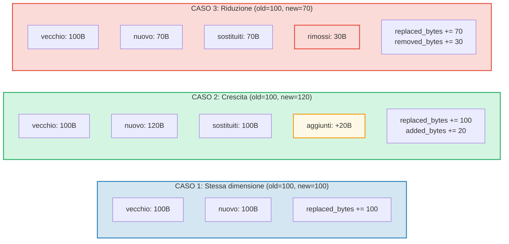

# Tracciamento dei costi

## La struttura OperationCost

Ogni operazione in GroveDB accumula costi, misurati in risorse computazionali:

```rust
// costs/src/lib.rs
pub struct OperationCost {
    pub seek_count: u32,              // Numero di seek nell'archiviazione
    pub storage_cost: StorageCost,    // Byte aggiunti/sostituiti/rimossi
    pub storage_loaded_bytes: u64,    // Byte letti dal disco
    pub hash_node_calls: u32,         // Numero di operazioni di hash Blake3
    pub sinsemilla_hash_calls: u32,   // Numero di operazioni di hash Sinsemilla (operazioni EC)
}
```

> Le **chiamate hash Sinsemilla** tracciano le operazioni di hash su curva ellittica per gli ancoraggi del CommitmentTree. Queste sono significativamente piu costose degli hash di nodo Blake3.

I costi di archiviazione si suddividono ulteriormente:

```rust
// costs/src/storage_cost/mod.rs
pub struct StorageCost {
    pub added_bytes: u32,                   // Nuovi dati scritti
    pub replaced_bytes: u32,                // Dati esistenti sovrascritti
    pub removed_bytes: StorageRemovedBytes, // Dati liberati
}
```

## Il pattern CostContext

Tutte le operazioni restituiscono il loro risultato avvolto in un `CostContext`:

```rust
pub struct CostContext<T> {
    pub value: T,               // Il risultato dell'operazione
    pub cost: OperationCost,    // Risorse consumate
}

pub type CostResult<T, E> = CostContext<Result<T, E>>;
```

Questo crea un pattern di tracciamento dei costi **monadico** — i costi fluiscono attraverso catene di operazioni automaticamente:

```rust
// Estrai un risultato, aggiungendo il suo costo a un accumulatore
let result = expensive_operation().unwrap_add_cost(&mut total_cost);

// Concatena operazioni, accumulando costi
let final_result = op1()
    .flat_map(|x| op2(x))      // Costi di op1 + op2
    .flat_map(|y| op3(y));      // + costi di op3
```

## La macro cost_return_on_error!

Il pattern piu comune nel codice di GroveDB e la macro `cost_return_on_error!`, che agisce come `?` ma preserva i costi in caso di ritorno anticipato:

```rust
macro_rules! cost_return_on_error {
    ( &mut $cost:ident, $($body:tt)+ ) => {
        {
            let result_with_cost = { $($body)+ };
            let result = result_with_cost.unwrap_add_cost(&mut $cost);
            match result {
                Ok(x) => x,
                Err(e) => return Err(e).wrap_with_cost($cost),
            }
        }
    };
}
```

In pratica:

```rust
fn insert_element(&self, path: &[&[u8]], key: &[u8], element: Element) -> CostResult<(), Error> {
    let mut cost = OperationCost::default();

    // Ogni chiamata alla macro aggiunge il costo dell'operazione a `cost`
    // e restituisce il valore Ok (o ritorna anticipatamente con il costo accumulato su Err)
    let merk = cost_return_on_error!(&mut cost, self.open_merk(path));
    cost_return_on_error!(&mut cost, merk.insert(key, element));
    cost_return_on_error!(&mut cost, self.propagate_changes(path));

    Ok(()).wrap_with_cost(cost)
    // `cost` ora contiene la somma dei costi delle tre operazioni
}
```

## Analisi dettagliata dei costi di archiviazione

Quando un valore viene aggiornato, il costo dipende dal fatto che il nuovo valore sia piu grande, piu piccolo o della stessa dimensione:



## Costi delle operazioni di hash

I costi degli hash sono misurati in "chiamate hash nodo" — il numero di compressioni di blocco Blake3:

| Operazione | Dimensione input | Chiamate hash |
|-----------|-----------|------------|
| `value_hash(piccolo)` | < 64 byte | 1 |
| `value_hash(medio)` | 64-127 byte | 2 |
| `kv_hash` | chiave + value_hash | variabile |
| `node_hash` | 96 byte (3 x 32) | 2 (sempre) |
| `combine_hash` | 64 byte (2 x 32) | 1 (sempre) |
| `node_hash_with_count` | 104 byte (3 x 32 + 8) | 2 (sempre) |
| Sinsemilla (CommitmentTree) | Operazione EC su curva Pallas | tracciato separatamente tramite `sinsemilla_hash_calls` |

La formula generale per Blake3:

```text
chiamate_hash = 1 + (byte_input - 1) / 64
```

## Stima nel caso peggiore e nel caso medio

GroveDB fornisce funzioni per **stimare** i costi delle operazioni prima di eseguirle. Cio e cruciale per il calcolo delle commissioni nella blockchain — bisogna conoscere il costo prima di impegnarsi a pagarlo.

```rust
// Costo nel caso peggiore per la lettura di un nodo
pub fn add_worst_case_get_merk_node(
    cost: &mut OperationCost,
    not_prefixed_key_len: u32,
    max_element_size: u32,
    node_type: NodeType,
) {
    cost.seek_count += 1;  // Un seek su disco
    cost.storage_loaded_bytes +=
        TreeNode::worst_case_encoded_tree_size(
            not_prefixed_key_len, max_element_size, node_type
        ) as u64;
}

// Costo di propagazione nel caso peggiore
pub fn add_worst_case_merk_propagate(
    cost: &mut OperationCost,
    input: &WorstCaseLayerInformation,
) {
    let levels = match input {
        MaxElementsNumber(n) => ((*n + 1) as f32).log2().ceil() as u32,
        NumberOfLevels(n) => *n,
    };
    let mut nodes_updated = levels;

    // Le rotazioni AVL possono aggiornare nodi aggiuntivi
    if levels > 2 {
        nodes_updated += 2;  // Al massimo 2 nodi extra per le rotazioni
    }

    cost.storage_cost.replaced_bytes += nodes_updated * MERK_BIGGEST_VALUE_SIZE;
    cost.storage_loaded_bytes +=
        nodes_updated as u64 * (MERK_BIGGEST_VALUE_SIZE + MERK_BIGGEST_KEY_SIZE) as u64;
    cost.seek_count += nodes_updated;
    cost.hash_node_calls += nodes_updated * 2;
}
```

Costanti utilizzate:

```rust
pub const MERK_BIGGEST_VALUE_SIZE: u32 = u16::MAX as u32;  // 65535
pub const MERK_BIGGEST_KEY_SIZE: u32 = 256;
```

---
