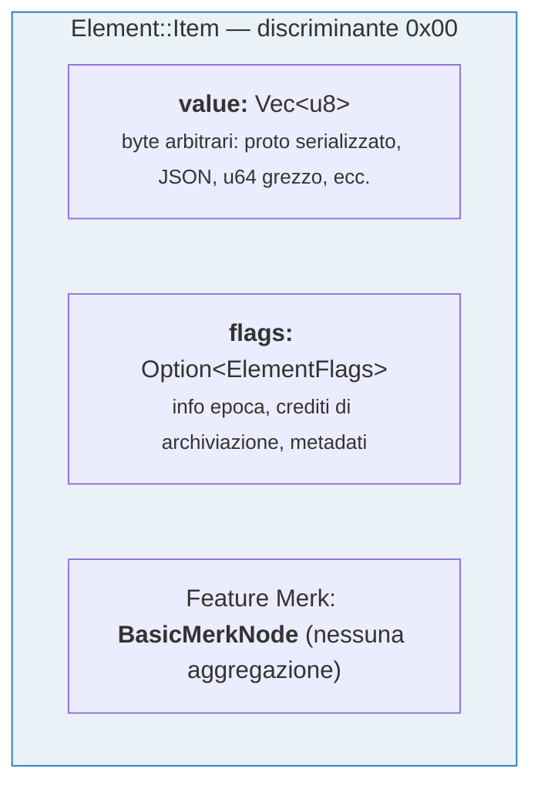
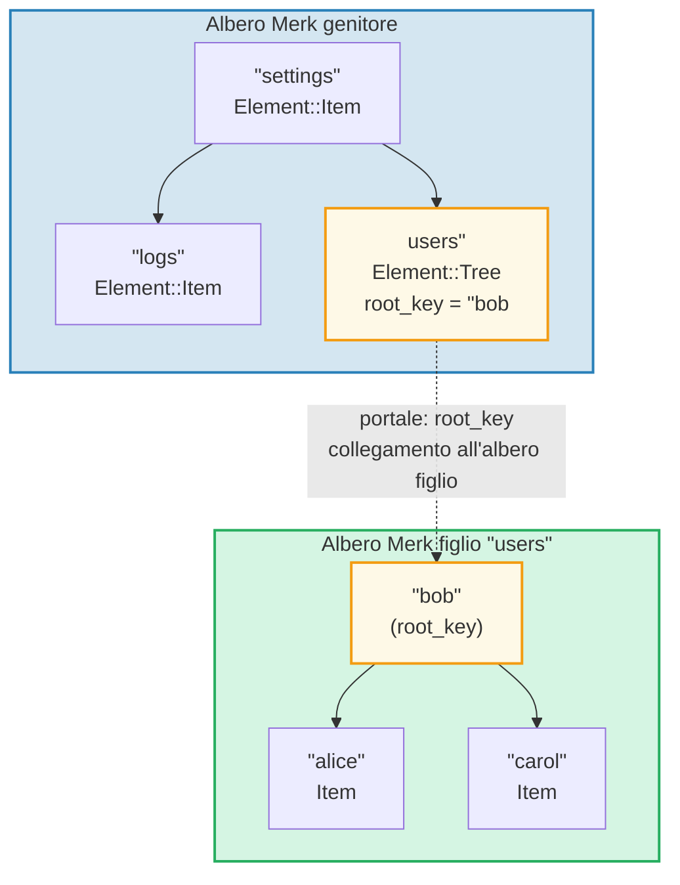
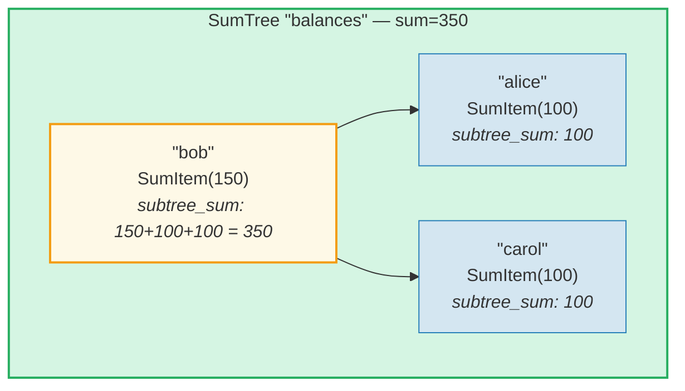
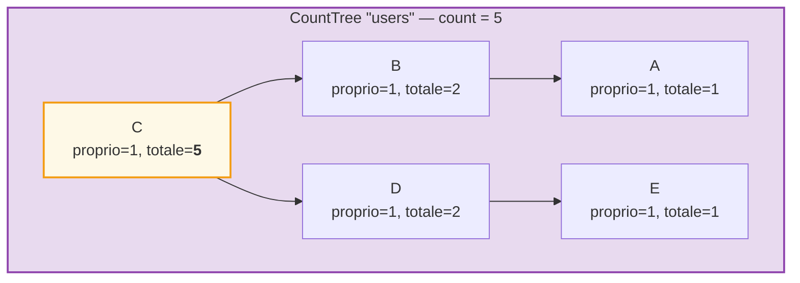
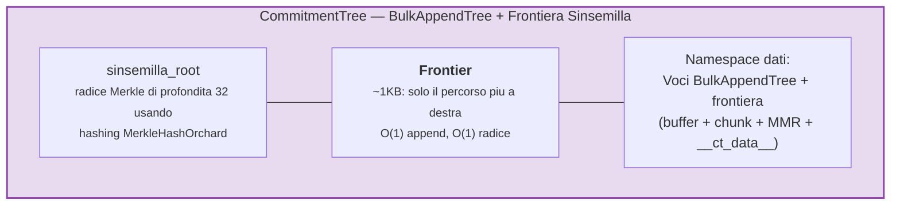

# Il sistema degli elementi

Mentre Merk opera con coppie chiave-valore grezze, GroveDB opera a un livello superiore utilizzando gli **Element** (elementi) — valori tipizzati che portano un significato semantico. Ogni valore memorizzato in GroveDB e un Element.

## L'enum Element

```rust
// grovedb-element/src/element/mod.rs
pub enum Element {
    Item(Vec<u8>, Option<ElementFlags>),                                    // [0]
    Reference(ReferencePathType, MaxReferenceHop, Option<ElementFlags>),    // [1]
    Tree(Option<Vec<u8>>, Option<ElementFlags>),                           // [2]
    SumItem(SumValue, Option<ElementFlags>),                               // [3]
    SumTree(Option<Vec<u8>>, SumValue, Option<ElementFlags>),              // [4]
    BigSumTree(Option<Vec<u8>>, BigSumValue, Option<ElementFlags>),        // [5]
    CountTree(Option<Vec<u8>>, CountValue, Option<ElementFlags>),          // [6]
    CountSumTree(Option<Vec<u8>>, CountValue, SumValue, Option<ElementFlags>), // [7]
    ProvableCountTree(Option<Vec<u8>>, CountValue, Option<ElementFlags>),  // [8]
    ItemWithSumItem(Vec<u8>, SumValue, Option<ElementFlags>),              // [9]
    ProvableCountSumTree(Option<Vec<u8>>, CountValue, SumValue,
                         Option<ElementFlags>),                            // [10]
    CommitmentTree(u64, u8, Option<ElementFlags>),                         // [11]
    MmrTree(u64, Option<ElementFlags>),                                    // [12]
    BulkAppendTree(u64, u8, Option<ElementFlags>),                         // [13]
    DenseAppendOnlyFixedSizeTree(u16, u8, Option<ElementFlags>),           // [14]
}
```

I numeri discriminanti (mostrati tra parentesi) vengono usati durante la serializzazione.

Alias di tipo usati nel codice:

```rust
pub type ElementFlags = Vec<u8>;        // Metadati arbitrari per elemento
pub type MaxReferenceHop = Option<u8>;  // Limite opzionale di salti per i riferimenti
pub type SumValue = i64;                // Somma con segno a 64 bit
pub type BigSumValue = i128;            // Somma con segno a 128 bit
pub type CountValue = u64;              // Conteggio senza segno a 64 bit
```

## Item — Archiviazione chiave-valore base

L'elemento piu semplice. Memorizza byte arbitrari:

```rust
Element::Item(value: Vec<u8>, flags: Option<ElementFlags>)
```



Costruttori:

```rust
Element::new_item(b"hello world".to_vec())
Element::new_item_with_flags(b"data".to_vec(), Some(vec![0x01, 0x02]))
```

Gli Item partecipano all'aggregazione delle somme: all'interno di un SumTree, un Item contribuisce con una somma predefinita di 0. Un SumItem contribuisce con il suo valore esplicito.

## Tree — Contenitori per sotto-alberi

Un elemento Tree e un **portale** verso un altro albero Merk. Memorizza la chiave radice dell'albero figlio (se presente):

```rust
Element::Tree(root_key: Option<Vec<u8>>, flags: Option<ElementFlags>)
```



> L'elemento Tree nel Merk genitore memorizza la `root_key` dell'albero Merk figlio. Cio crea un **portale** — un collegamento da un albero Merk a un altro.

Quando un albero e vuoto, `root_key` e `None`. Il costruttore `Element::empty_tree()` crea `Element::Tree(None, None)`.

## SumItem / SumTree — Somme aggregate

Un **SumTree** (albero delle somme) mantiene automaticamente la somma dei contributi di somma di tutti i suoi figli diretti:

```rust
Element::SumTree(root_key: Option<Vec<u8>>, sum: SumValue, flags: Option<ElementFlags>)
Element::SumItem(value: SumValue, flags: Option<ElementFlags>)
```



> **Formula di aggregazione:** `somma_nodo = valore_proprio + somma_figlio_sinistro + somma_figlio_destro`
> Bob: 150 + 100 (alice) + 100 (carol) = **350**. La somma radice (350) viene memorizzata nell'elemento SumTree del genitore.

La somma viene mantenuta a livello Merk attraverso il tipo di feature `TreeFeatureType::SummedMerkNode(i64)`. Durante la propagazione dell'albero, i dati aggregati di ogni nodo vengono ricalcolati:

```text
somma_aggregata = somma_propria + somma_figlio_sinistro + somma_figlio_destro
```

## CountTree, CountSumTree, BigSumTree

Tipi aggiuntivi di alberi aggregati:

| Tipo di elemento | Tipo di feature Merk | Cosa aggrega |
|---|---|---|
| `CountTree` | `CountedMerkNode(u64)` | Numero di elementi |
| `CountSumTree` | `CountedSummedMerkNode(u64, i64)` | Sia conteggio che somma |
| `BigSumTree` | `BigSummedMerkNode(i128)` | Somma a 128 bit per valori grandi |
| `ProvableCountTree` | `ProvableCountedMerkNode(u64)` | Conteggio incorporato nell'hash |
| `ProvableCountSumTree` | `ProvableCountedSummedMerkNode(u64, i64)` | Conteggio nell'hash + somma |

**ProvableCountTree** e speciale: il suo conteggio e incluso nel calcolo del `node_hash` (tramite `node_hash_with_count`), cosi una prova puo verificare il conteggio senza rivelare alcun valore.

## Serializzazione degli elementi

Gli elementi vengono serializzati utilizzando **bincode** con ordine dei byte big-endian:

```rust
pub fn serialize(&self, grove_version: &GroveVersion) -> Result<Vec<u8>, ElementError> {
    let config = config::standard().with_big_endian().with_no_limit();
    bincode::encode_to_vec(self, config)
}
```

Il primo byte e il **discriminante**, che consente il rilevamento del tipo in O(1):

```rust
pub fn from_serialized_value(value: &[u8]) -> Option<ElementType> {
    match value.first()? {
        0 => Some(ElementType::Item),
        1 => Some(ElementType::Reference),
        2 => Some(ElementType::Tree),
        3 => Some(ElementType::SumItem),
        // ... ecc
    }
}
```

## TreeFeatureType e flusso dei dati aggregati

L'enum `TreeFeatureType` colma il divario tra gli Element di GroveDB e i nodi Merk:

```rust
pub enum TreeFeatureType {
    BasicMerkNode,                              // Nessuna aggregazione
    SummedMerkNode(i64),                       // Aggregazione per somma
    BigSummedMerkNode(i128),                   // Somma grande
    CountedMerkNode(u64),                      // Conteggio
    CountedSummedMerkNode(u64, i64),           // Conteggio + somma
    ProvableCountedMerkNode(u64),              // Conteggio nell'hash
    ProvableCountedSummedMerkNode(u64, i64),   // Conteggio nell'hash + somma
}
```

I dati aggregati fluiscono **verso l'alto** attraverso l'albero:



> **Tabella di aggregazione:** L'aggregato di ogni nodo = proprio(1) + aggregato_sinistro + aggregato_destro
>
> | Nodo | proprio | agg_sin | agg_des | totale |
> |------|-----|----------|-----------|-------|
> | A | 1 | 0 | 0 | 1 |
> | B | 1 | 1 (A) | 0 | 2 |
> | E | 1 | 0 | 0 | 1 |
> | D | 1 | 0 | 1 (E) | 2 |
> | C | 1 | 2 (B) | 2 (D) | **5** (radice) |

Il conteggio memorizzato in ogni nodo rappresenta il conteggio totale nel sotto-albero con radice in quel nodo, incluso se stesso. Il conteggio del nodo radice e il totale per l'intero albero.

L'enum `AggregateData` trasporta questi dati attraverso il sistema di Link:

```rust
pub enum AggregateData {
    NoAggregateData,
    Sum(i64),
    BigSum(i128),
    Count(u64),
    CountAndSum(u64, i64),
    ProvableCount(u64),
    ProvableCountAndSum(u64, i64),
}
```

## CommitmentTree — Albero di impegni Sinsemilla

Un **CommitmentTree** fornisce un albero di Merkle Sinsemilla di profondita 32 per il tracciamento degli ancoraggi degli impegni di note (note commitments), come usato nel protocollo schermato Orchard di Zcash. Avvolge `incrementalmerkletree::Frontier<MerkleHashOrchard, 32>` per operazioni di append e calcolo della radice in O(1):

```rust
Element::CommitmentTree(
    total_count: u64,               // Numero di impegni aggiunti
    chunk_power: u8,                // Dimensione di compattazione del BulkAppendTree (chunk_size = 2^chunk_power)
    flags: Option<ElementFlags>,
)                                   // discriminante [11]
```

> **Nota:** L'hash radice della frontiera Sinsemilla NON e memorizzato nell'Element. E persistito nell'archiviazione dati e fluisce attraverso il meccanismo dell'hash figlio Merk (parametro `subtree_root_hash` di `insert_subtree`). Qualsiasi modifica alla frontiera si propaga automaticamente verso l'alto attraverso la gerarchia Merk di GroveDB.



**Architettura:**
- La *frontiera* (percorso piu a destra dell'albero di Merkle, ~1KB di dimensione costante) e memorizzata nel **namespace dati**, con chiave `COMMITMENT_TREE_DATA_KEY`
- I dati effettivi delle note (`cmx || ciphertext`) sono memorizzati tramite un **BulkAppendTree** nel **namespace dati** — compattati in chunk, recuperabili per posizione
- Gli ancoraggi storici vengono tracciati dalla Piattaforma in un albero dimostrabile separato
- La radice Sinsemilla NON e memorizzata nell'Element — fluisce come hash figlio Merk attraverso la gerarchia di hash di GroveDB

**Operazioni:**
- `commitment_tree_insert(path, key, cmx, ciphertext, tx)` — Append tipizzato che accetta `TransmittedNoteCiphertext<M>`; restituisce `(new_root, position)`
- `commitment_tree_anchor(path, key, tx)` — Ottieni l'ancoraggio Orchard corrente
- `commitment_tree_get_value(path, key, position, tx)` — Recupera un valore per posizione
- `commitment_tree_count(path, key, tx)` — Ottieni il conteggio totale degli elementi

**Generico MemoSize:** `CommitmentTree<S, M: MemoSize = DashMemo>` valida che i payload del testo cifrato corrispondano alla dimensione attesa per `M`. Per Dash (memo da 36 byte): `epk_bytes (32) + enc_ciphertext (104) + out_ciphertext (80) = 216 byte`.

**Tracciamento dei costi:** Le operazioni di hash Sinsemilla vengono tracciate tramite `cost.sinsemilla_hash_calls`. Il calcolo della radice attraversa sempre 32 livelli. Le fusioni degli ommer cascadano attraverso `trailing_ones()` della posizione precedente. Le operazioni del BulkAppendTree aggiungono costi di hash Blake3.

## MmrTree — Merkle Mountain Range

Un **MmrTree** memorizza dati in un Merkle Mountain Range (MMR) append-only (solo aggiunta) usando hashing Blake3. I nodi MMR sono memorizzati nella colonna **dati** (la stessa dei nodi Merk), non in un sotto-albero Merk figlio. Vedi il **[Capitolo 13](#chapter-13-the-mmr-tree--append-only-authenticated-logs)** per un approfondimento completo su come funzionano gli MMR, come si riempiono, come le prove vengono generate e verificate, e come MmrTree si integra con GroveDB.

```rust
Element::MmrTree(
    mmr_size: u64,                  // Dimensione interna dell'MMR (nodi, non foglie)
    flags: Option<ElementFlags>,
)                                   // discriminante [12]
```

> **Nota:** L'hash radice dell'MMR NON e memorizzato nell'Element. Fluisce come hash figlio Merk tramite il parametro `subtree_root_hash` di `insert_subtree`.

**Operazioni:** `mmr_tree_append`, `mmr_tree_root_hash`, `mmr_tree_get_value`, `mmr_tree_leaf_count`. **Prove:** Prove V1 (vedi par. 9.6 e par. 13.9).

## BulkAppendTree — Struttura append-only a due livelli

Un **BulkAppendTree** combina un buffer ad albero di Merkle denso con un MMR a livello di chunk per append ad alta capacita efficienti con query di intervallo dimostrabili. E un albero non-Merk — i dati risiedono nel **namespace dati**, non in un sotto-albero Merk figlio. Vedi il **[Capitolo 14](#chapter-14-the-bulkappendtree--high-throughput-append-only-storage)** per un approfondimento completo sull'architettura a due livelli, la compattazione dei chunk, la generazione delle prove, la verifica e l'integrazione con GroveDB.

```rust
Element::BulkAppendTree(
    total_count: u64,               // Totale valori aggiunti
    chunk_power: u8,                // Altezza dell'albero denso (capacita buffer = 2^chunk_power - 1)
    flags: Option<ElementFlags>,
)                                   // discriminante [13]
```

> **Nota:** La radice di stato (`blake3("bulk_state" || mmr_root || dense_tree_root)`) NON e memorizzata nell'Element. Fluisce come hash figlio Merk tramite il parametro `subtree_root_hash` di `insert_subtree`.

**Operazioni:** `bulk_append`, `bulk_get_value`, `bulk_get_chunk`, `bulk_get_buffer`, `bulk_count`, `bulk_chunk_count`.
**Prove:** Prove V1 di intervallo (vedi par. 9.6 e par. 14.10).

## DenseAppendOnlyFixedSizeTree — Archiviazione densa a capacita fissa

Un **DenseAppendOnlyFixedSizeTree** e un albero binario completo di altezza fissa *h* dove ogni nodo (interno e foglia) memorizza un valore di dati. Le posizioni vengono riempite in ordine di livello (BFS). L'hash radice viene ricalcolato al volo — nessun hash intermedio viene persistito. Vedi il **[Capitolo 16](#chapter-16-the-denseappendonlyfixedsizetree--dense-fixed-capacity-merkle-storage)** per l'approfondimento completo.

```rust
Element::DenseAppendOnlyFixedSizeTree(
    count: u16,                     // Numero di valori memorizzati (max 65.535)
    height: u8,                     // Altezza dell'albero (1..=16, immutabile), capacita = 2^h - 1
    flags: Option<ElementFlags>,
)                                   // discriminante [14]
```

> **Nota:** L'hash radice NON e memorizzato nell'Element — viene ricalcolato al volo e fluisce come hash figlio Merk. Il campo `count` e `u16` (non u64), limitando gli alberi a 65.535 posizioni. Le altezze sono limitate a 1..=16.

**Operazioni:** `dense_tree_insert`, `dense_tree_get`, `dense_tree_root_hash`, `dense_tree_count`.
**Prove:** Solo a livello di elemento (nessuna prova di sottoquery ancora).

## Alberi non-Merk — Pattern comuni

CommitmentTree, MmrTree, BulkAppendTree e DenseAppendOnlyFixedSizeTree condividono un pattern architetturale comune che li distingue dai tipi di albero basati su Merk (Tree, SumTree, CountTree, ecc.):

| Proprieta | Alberi basati su Merk | Alberi non-Merk |
|----------|-----------------|-------------------|
| Sotto-albero Merk figlio | Si (`root_key = Some(...)`) | No (nessun campo root_key) |
| Archiviazione dati | Coppie chiave-valore Merk | Blob nella colonna dati (chiavi non-Merk) |
| Legame hash radice | `combine_hash(elem_hash, child_root_hash)` | `combine_hash(elem_hash, type_specific_root)` |
| Radice specifica del tipo | Mantenuta dall'AVL Merk | Fluisce come hash figlio Merk (NON nei byte dell'elemento) |
| Formato delle prove | V0 (Merk livello per livello) | V1 (prova specifica del tipo) |
| TreeFeatureType | BasicMerkNode (nessuna aggregazione) | BasicMerkNode |

> **Nota sulla colonna di archiviazione:** Tutti e quattro i tipi di albero non-Merk (MmrTree, CommitmentTree, BulkAppendTree, DenseAppendOnlyFixedSizeTree) memorizzano i loro dati nella colonna **dati** usando chiavi non-Merk. CommitmentTree memorizza la sua frontiera Sinsemilla accanto alle voci del BulkAppendTree nella stessa colonna **dati** (chiave `b"__ct_data__"`).

La radice specifica del tipo (radice Sinsemilla, radice MMR, radice di stato o hash radice dell'albero denso) NON e memorizzata nell'Element. Invece, fluisce come **hash figlio** Merk tramite il parametro `subtree_root_hash` di `insert_subtree`. Il combined_value_hash del Merk diventa `combine_hash(value_hash(element_bytes), type_specific_root)`. Qualsiasi modifica alla radice specifica del tipo cambia l'hash figlio, che cambia il combined_value_hash, che si propaga verso l'alto attraverso la gerarchia di hash di GroveDB — mantenendo l'integrita crittografica.

---
