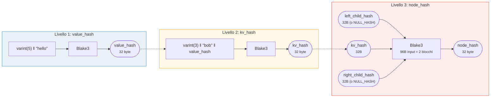
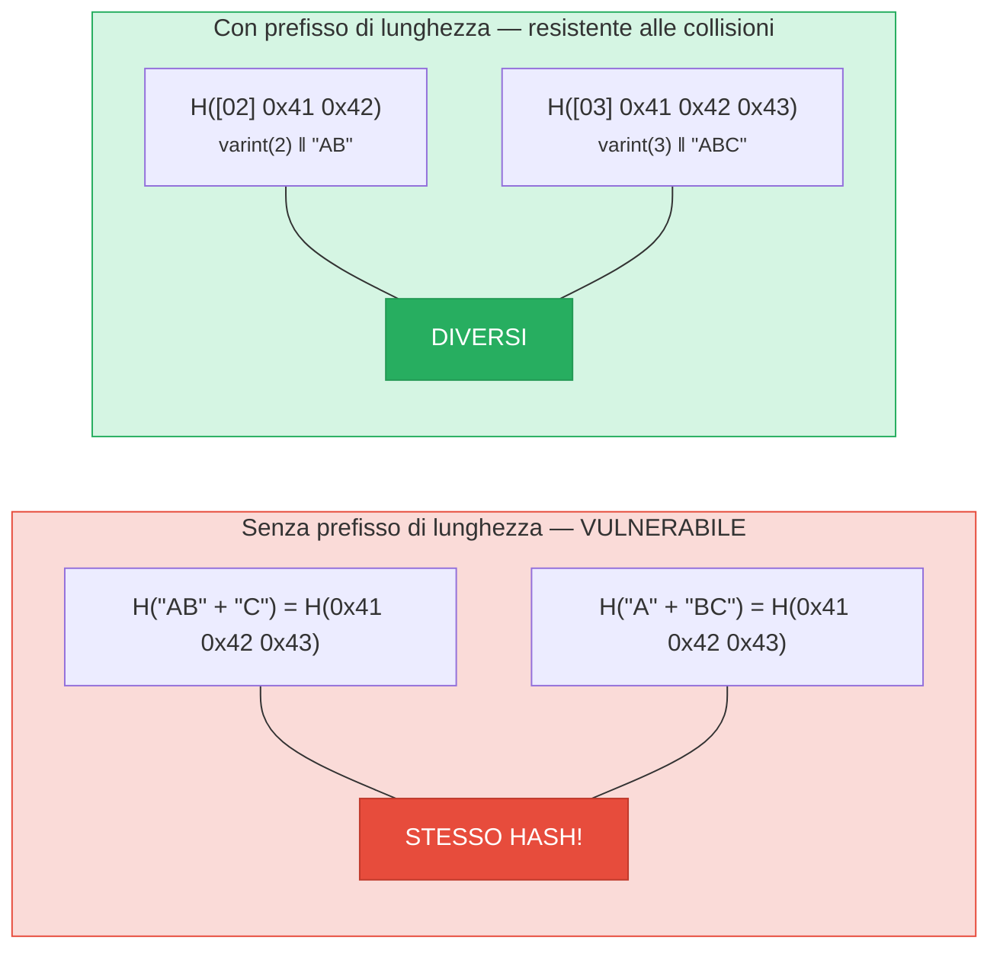
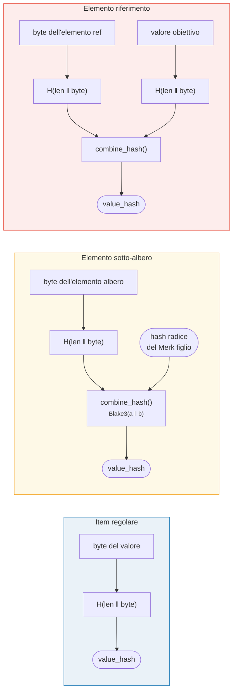

# Hashing — Integrita crittografica

Ogni nodo in un albero Merk viene sottoposto a hash per produrre un **hash radice** — un singolo valore di 32 byte che autentica l'intero albero. Qualsiasi modifica a qualsiasi chiave, valore o relazione strutturale produrra un hash radice diverso.

## Gerarchia di hash a tre livelli

Merk utilizza uno schema di hashing a tre livelli, dal piu interno al piu esterno:

Esempio: chiave = `"bob"` (3 byte), valore = `"hello"` (5 byte):



> La RADICE dell'albero = `node_hash` del nodo radice — autentica **ogni** chiave, valore e relazione strutturale. I figli assenti usano `NULL_HASH = [0x00; 32]`.

### Livello 1: value_hash

```rust
// merk/src/tree/hash.rs
pub fn value_hash(value: &[u8]) -> CostContext<CryptoHash> {
    let mut hasher = blake3::Hasher::new();
    let val_length = value.len().encode_var_vec();  // Codifica varint
    hasher.update(val_length.as_slice());
    hasher.update(value);
    // ...
}
```

La lunghezza del valore e **codificata in varint** e anteposta. Questo e critico per la resistenza alle collisioni — senza di essa, `H("AB" || "C")` sarebbe uguale a `H("A" || "BC")`.

### Livello 2: kv_hash

```rust
pub fn kv_hash(key: &[u8], value: &[u8]) -> CostContext<CryptoHash> {
    let mut hasher = blake3::Hasher::new();
    let key_length = key.len().encode_var_vec();
    hasher.update(key_length.as_slice());
    hasher.update(key);
    let vh = value_hash(value);
    hasher.update(vh.as_slice());  // Hash annidato
    // ...
}
```

Questo lega la chiave al valore. Per la verifica delle prove, esiste anche una variante che prende un value_hash pre-calcolato:

```rust
pub fn kv_digest_to_kv_hash(key: &[u8], value_hash: &CryptoHash) -> CostContext<CryptoHash>
```

Questa viene usata quando il verificatore ha gia il value_hash (ad esempio per sotto-alberi dove il value_hash e un hash combinato).

### Livello 3: node_hash

```rust
pub fn node_hash(
    kv: &CryptoHash,
    left: &CryptoHash,
    right: &CryptoHash,
) -> CostContext<CryptoHash> {
    let mut hasher = blake3::Hasher::new();
    hasher.update(kv);       // 32 byte
    hasher.update(left);     // 32 byte
    hasher.update(right);    // 32 byte — totale 96 byte
    // Sempre esattamente 2 operazioni di hash (96 byte / blocco da 64 byte = 2)
}
```

Se un figlio e assente, il suo hash e il **NULL_HASH** — 32 byte a zero:

```rust
pub const NULL_HASH: CryptoHash = [0; HASH_LENGTH];  // [0u8; 32]
```

## Blake3 come funzione di hash

GroveDB utilizza **Blake3** per tutto l'hashing. Proprieta chiave:

- **Output a 256 bit** (32 byte)
- **Dimensione blocco**: 64 byte
- **Velocita**: circa 3 volte piu veloce di SHA-256 sull'hardware moderno
- **Streaming**: puo alimentare i dati in modo incrementale

Il costo dell'operazione di hash e calcolato in base a quanti blocchi da 64 byte vengono elaborati:

```rust
let hashes = 1 + (hasher.count() - 1) / 64;  // Numero di operazioni di hash
```

## Codifica con prefisso di lunghezza per la resistenza alle collisioni

Ogni input a lunghezza variabile e prefissato con la sua lunghezza usando la **codifica varint**:



> **Input del value_hash**: `[varint(value.len)] [byte del valore]`
> **Input del kv_hash**: `[varint(key.len)] [byte della chiave] [value_hash: 32 byte]`

Senza prefissi di lunghezza, un attaccante potrebbe creare diverse coppie chiave-valore che producono lo stesso digest. Il prefisso di lunghezza rende cio crittograficamente impraticabile.

## Hashing combinato per elementi speciali

Per **sotto-alberi** e **riferimenti**, il `value_hash` non e semplicemente `H(value)`. Invece, e un **hash combinato** che lega l'elemento al suo obiettivo:



> **Sotto-albero:** lega l'hash radice del Merk figlio nel genitore. **Riferimento:** lega sia il percorso del riferimento SIA il valore obiettivo. Modificando l'uno o l'altro cambia l'hash radice.

La funzione `combine_hash`:

```rust
pub fn combine_hash(hash_one: &CryptoHash, hash_two: &CryptoHash) -> CostContext<CryptoHash> {
    let mut hasher = blake3::Hasher::new();
    hasher.update(hash_one);   // 32 byte
    hasher.update(hash_two);   // 32 byte — totale 64 byte, esattamente 1 operazione di hash
    // ...
}
```

Questo e cio che permette a GroveDB di autenticare l'intera gerarchia attraverso un singolo hash radice — il value_hash di ogni albero genitore per un elemento sotto-albero include l'hash radice dell'albero figlio.

## Hashing aggregato per ProvableCountTree

I nodi `ProvableCountTree` includono il conteggio aggregato nell'hash del nodo:

```rust
pub fn node_hash_with_count(
    kv: &CryptoHash,
    left: &CryptoHash,
    right: &CryptoHash,
    count: u64,
) -> CostContext<CryptoHash> {
    let mut hasher = blake3::Hasher::new();
    hasher.update(kv);                        // 32 byte
    hasher.update(left);                      // 32 byte
    hasher.update(right);                     // 32 byte
    hasher.update(&count.to_be_bytes());      // 8 byte — totale 104 byte
    // Sempre esattamente 2 operazioni di hash (104 < 128 = 2 x 64)
}
```

Cio significa che una prova del conteggio non richiede di rivelare i dati effettivi — il conteggio e incorporato nell'impegno crittografico.

---
