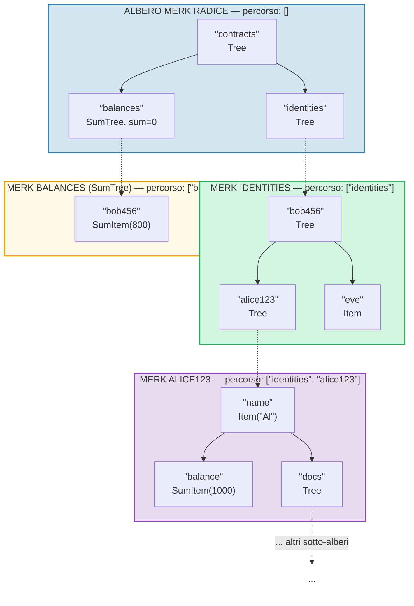
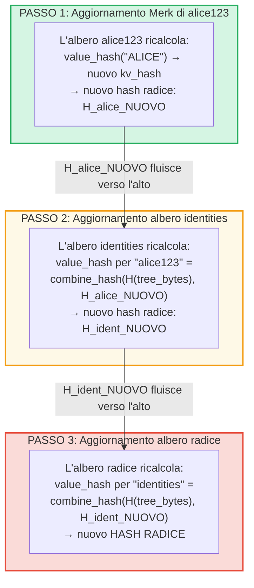
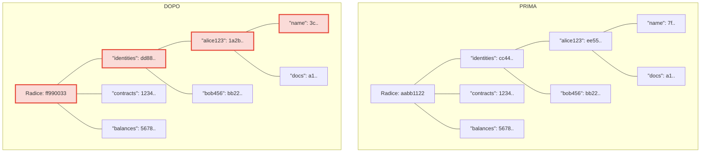
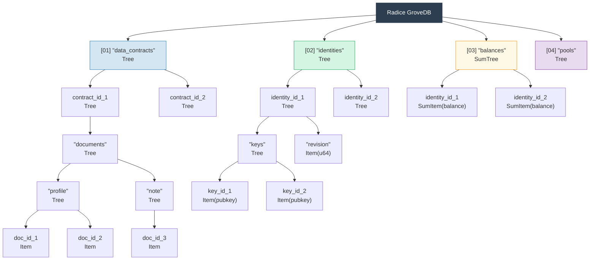

# Il bosco gerarchico — Albero di alberi

## Come i sotto-alberi si annidano dentro gli alberi genitori

La caratteristica distintiva di GroveDB e che un albero Merk puo contenere elementi che sono a loro volta alberi Merk. Cio crea uno **spazio dei nomi gerarchico**:



> Ogni riquadro colorato e un albero Merk separato. Le frecce tratteggiate rappresentano i collegamenti portale dagli elementi Tree ai loro alberi Merk figli. Il percorso verso ogni Merk e mostrato nella sua etichetta.

## Sistema di indirizzamento per percorso

Ogni elemento in GroveDB e indirizzato da un **percorso** (path) — una sequenza di stringhe di byte che navigano dalla radice attraverso i sotto-alberi fino alla chiave obiettivo:

```text
    Percorso: ["identities", "alice123", "name"]

    Passo 1: Nell'albero radice, cercare "identities" → elemento Tree
    Passo 2: Aprire il sotto-albero identities, cercare "alice123" → elemento Tree
    Passo 3: Aprire il sotto-albero alice123, cercare "name" → Item("Alice")
```

I percorsi sono rappresentati come `Vec<Vec<u8>>` o usando il tipo `SubtreePath` per una manipolazione efficiente senza allocazione:

```rust
// Il percorso verso l'elemento (tutti i segmenti tranne l'ultimo)
let path: &[&[u8]] = &[b"identities", b"alice123"];
// La chiave all'interno del sotto-albero finale
let key: &[u8] = b"name";
```

## Generazione del prefisso Blake3 per l'isolamento dell'archiviazione

Ogni sotto-albero in GroveDB ottiene il proprio **namespace di archiviazione isolato** in RocksDB. Il namespace e determinato dall'hashing del percorso con Blake3:

```rust
pub type SubtreePrefix = [u8; 32];

// Il prefisso viene calcolato facendo l'hash dei segmenti del percorso
// storage/src/rocksdb_storage/storage.rs
```

Per esempio:

```text
    Percorso: ["identities", "alice123"]
    Prefisso: Blake3(["identities", "alice123"]) = [0xab, 0x3f, ...]  (32 byte)

    In RocksDB, le chiavi per questo sotto-albero vengono memorizzate come:
    [prefisso: 32 byte][chiave_originale]

    Quindi "name" in questo sotto-albero diventa:
    [0xab, 0x3f, ...][0x6e, 0x61, 0x6d, 0x65]  ("name")
```

Cio garantisce:
- Nessuna collisione di chiavi tra sotto-alberi (prefisso a 32 byte = isolamento a 256 bit)
- Calcolo efficiente del prefisso (singolo hash Blake3 sui byte del percorso)
- I dati del sotto-albero sono collocati in RocksDB per efficienza della cache

## Propagazione dell'hash radice attraverso la gerarchia

Quando un valore cambia in profondita nel bosco, il cambiamento deve **propagarsi verso l'alto** per aggiornare l'hash radice:

```text
    Modifica: Aggiornare "name" a "ALICE" in identities/alice123/

    Passo 1: Aggiornare il valore nell'albero Merk di alice123
            → l'albero alice123 ottiene un nuovo hash radice: H_alice_nuovo

    Passo 2: Aggiornare l'elemento "alice123" nell'albero identities
            → il value_hash dell'albero identities per "alice123" =
              combine_hash(H(byte_elemento_albero), H_alice_nuovo)
            → l'albero identities ottiene un nuovo hash radice: H_ident_nuovo

    Passo 3: Aggiornare l'elemento "identities" nell'albero radice
            → il value_hash dell'albero radice per "identities" =
              combine_hash(H(byte_elemento_albero), H_ident_nuovo)
            → L'HASH RADICE cambia
```



**Prima vs Dopo** — nodi modificati contrassegnati in rosso:



> Solo i nodi sul percorso dal valore modificato fino alla radice vengono ricalcolati. I fratelli e gli altri rami rimangono invariati.

La propagazione e implementata da `propagate_changes_with_transaction`, che risale il percorso dal sotto-albero modificato fino alla radice, aggiornando l'hash dell'elemento di ogni genitore lungo il cammino.

## Esempio di struttura del bosco multi-livello

Ecco un esempio completo che mostra come Dash Platform struttura il suo stato:



Ogni riquadro e un albero Merk separato, autenticato fino a un singolo hash radice su cui i validatori concordano.

---
