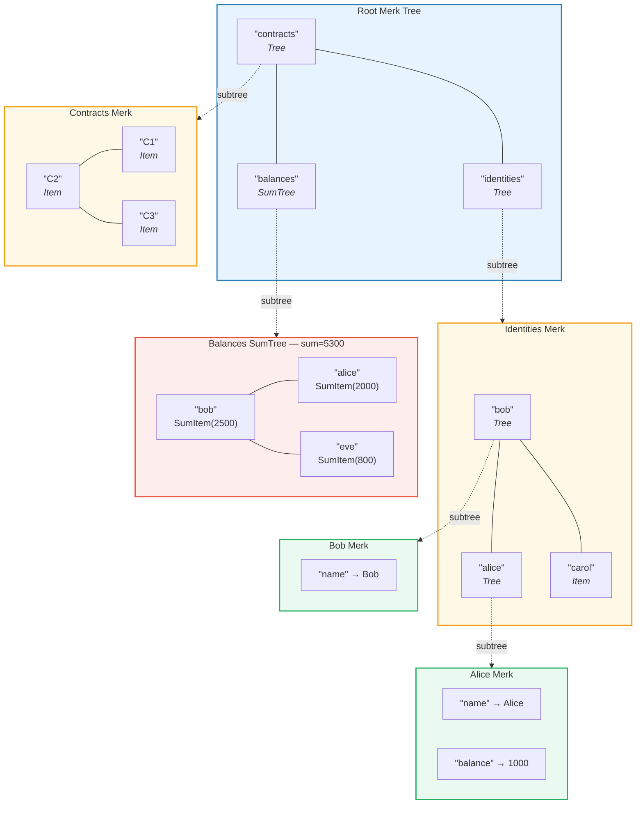
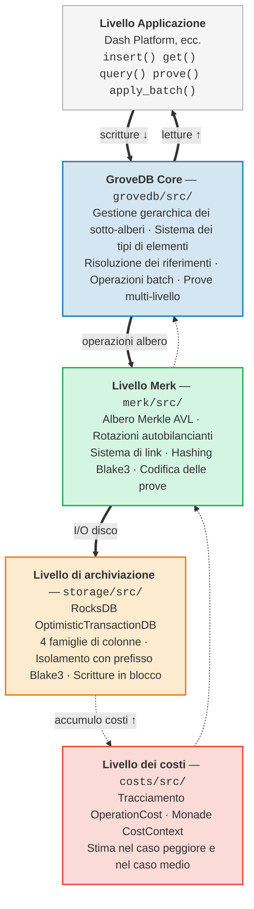

# Introduzione — Cos'e GroveDB?

## L'idea fondamentale

GroveDB e una **struttura dati gerarchica autenticata** — essenzialmente un *grove* (bosco, ovvero albero di alberi) costruito su alberi Merkle AVL. Ogni nodo nel database fa parte di un albero autenticato crittograficamente, e ogni albero puo contenere altri alberi come figli, formando una gerarchia profonda di stato verificabile.

> Ogni riquadro colorato e un **albero Merk separato**. Le frecce tratteggiate mostrano la relazione di sotto-albero — un elemento Tree nel genitore contiene la chiave radice del Merk figlio.

In un database tradizionale, si potrebbero archiviare i dati in un archivio chiave-valore piatto con un singolo albero di Merkle (albero di Merkle) in cima per l'autenticazione. GroveDB adotta un approccio diverso: annida alberi di Merkle dentro altri alberi di Merkle. Questo offre:

1. **Indici secondari efficienti** — interrogazione per qualsiasi percorso, non solo per chiave primaria
2. **Prove crittografiche compatte** — dimostrare l'esistenza (o l'assenza) di qualsiasi dato
3. **Dati aggregati** — gli alberi possono automaticamente sommare, contare o aggregare in altro modo i propri figli
4. **Operazioni atomiche cross-albero** — le operazioni batch (operazioni in blocco) coprono piu sotto-alberi

## Perche esiste GroveDB

GroveDB e stato progettato per **Dash Platform**, una piattaforma applicativa decentralizzata dove ogni pezzo di stato deve essere:

- **Autenticato**: qualsiasi nodo puo dimostrare qualsiasi dato a un client leggero
- **Deterministico**: ogni nodo calcola esattamente la stessa radice di stato
- **Efficiente**: le operazioni devono completarsi entro i vincoli temporali del blocco
- **Interrogabile**: le applicazioni necessitano di query ricche, non solo ricerche per chiave

Gli approcci tradizionali presentano limiti:

| Approccio | Problema |
|----------|---------|
| Albero di Merkle semplice | Supporta solo ricerche per chiave, nessuna query su intervalli |
| Ethereum MPT | Ribilanciamento costoso, dimensioni delle prove elevate |
| Chiave-valore piatto + singolo albero | Nessuna query gerarchica, una singola prova copre tutto |
| B-tree | Non naturalmente Merklizzato, autenticazione complessa |

GroveDB risolve questi problemi combinando le **garanzie di bilanciamento comprovate degli alberi AVL** con l'**annidamento gerarchico** e un **ricco sistema di tipi di elementi**.

## Panoramica dell'architettura

GroveDB e organizzato in livelli distinti, ciascuno con una responsabilita chiara:

I dati fluiscono **verso il basso** attraverso questi livelli durante le scritture e **verso l'alto** durante le letture. Ogni operazione accumula costi mentre attraversa lo stack, consentendo una contabilizzazione precisa delle risorse.

---
