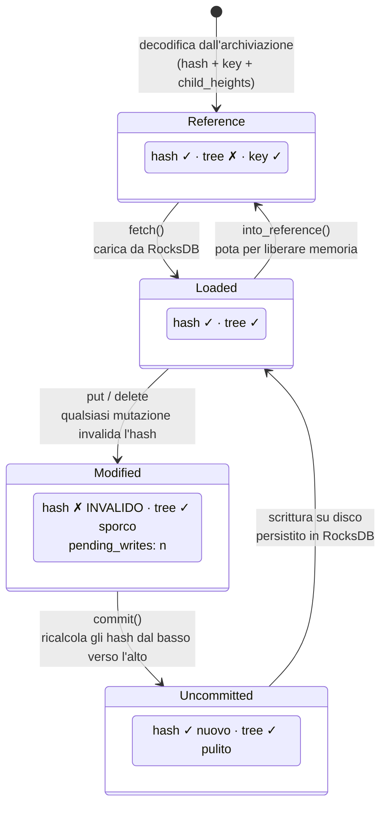
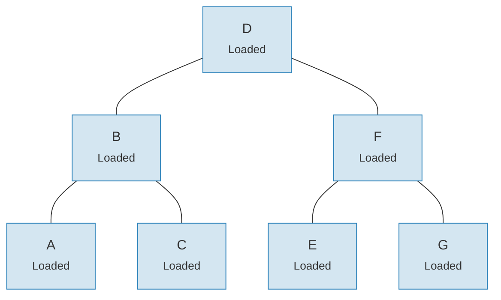
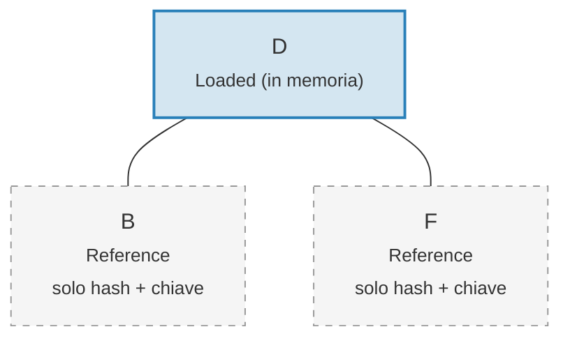

# Il sistema di Link — Architettura a caricamento pigro

Caricare un intero albero Merk in memoria sarebbe proibitivamente costoso per alberi grandi. Il sistema di Link risolve questo problema rappresentando le connessioni ai figli in quattro possibili stati, abilitando il **caricamento pigro** (lazy loading) — i figli vengono recuperati dall'archiviazione solo quando effettivamente necessari.

## Quattro stati dei Link

```rust
// merk/src/tree/link.rs
pub enum Link {
    Reference {                    // Potato: solo metadati, nessun albero in memoria
        hash: CryptoHash,
        child_heights: (u8, u8),
        key: Vec<u8>,
        aggregate_data: AggregateData,
    },
    Modified {                     // Recentemente modificato, hash non ancora calcolato
        pending_writes: usize,
        child_heights: (u8, u8),
        tree: TreeNode,
    },
    Uncommitted {                  // Hash calcolato ma non ancora persistito nell'archiviazione
        hash: CryptoHash,
        child_heights: (u8, u8),
        tree: TreeNode,
        aggregate_data: AggregateData,
    },
    Loaded {                       // Completamente caricato dall'archiviazione
        hash: CryptoHash,
        child_heights: (u8, u8),
        tree: TreeNode,
        aggregate_data: AggregateData,
    },
}
```

## Diagramma delle transizioni di stato



## Cosa memorizza ogni stato

| Stato | Hash? | Albero in memoria? | Scopo |
|-------|-------|-----------------|---------|
| **Reference** | Si | No | Rappresentazione compatta su disco. Memorizza solo chiave, hash, altezze dei figli e dati aggregati. |
| **Modified** | No | Si | Dopo qualsiasi mutazione. Traccia il conteggio `pending_writes` per l'ottimizzazione del batch. |
| **Uncommitted** | Si | Si | Dopo il calcolo dell'hash ma prima della scrittura su disco. Stato intermedio durante il commit. |
| **Loaded** | Si | Si | Completamente materializzato. Pronto per letture o ulteriori modifiche. |

Il campo `pending_writes` in `Modified` e degno di nota:

```rust
// Calcolato come: 1 + pending_writes_sinistro + pending_writes_destro
pending_writes: 1 + tree.child_pending_writes(true)
                  + tree.child_pending_writes(false),
```

Questo conteggio aiuta la fase di commit a decidere come ordinare le scritture per prestazioni ottimali.

## Il pattern del callback Fetch

Il sistema di Link utilizza un **trait Fetch** per astrarre il modo in cui i nodi figli vengono caricati:

```rust
pub trait Fetch {
    fn fetch(
        &self,
        link: &Link,
        value_defined_cost_fn: Option<&impl Fn(&[u8], &GroveVersion) -> Option<ValueDefinedCostType>>,
        grove_version: &GroveVersion,
    ) -> CostResult<TreeNode, Error>;
}
```

Diverse implementazioni di fetch servono scopi diversi:

- **StorageFetch**: carica da RocksDB (il percorso normale)
- **PanicSource**: usato nei test dove il fetch non dovrebbe mai avvenire
- **MockSource**: restituisce dati di test controllati

Questo pattern permette alle operazioni dell'albero di essere **indipendenti dall'archiviazione** — la stessa logica di bilanciamento e mutazione funziona indipendentemente da dove provengono i dati.

## Il pattern Walker

Il `Walker` avvolge un `TreeNode` con una sorgente `Fetch`, fornendo un attraversamento sicuro dell'albero con caricamento pigro automatico (`merk/src/tree/walk/mod.rs`):

```rust
pub struct Walker<S: Fetch + Sized + Clone> {
    tree: Owner<TreeNode>,
    source: S,
}
```

Il Walker fornisce tre operazioni chiave:

**walk()** — Stacca un figlio, lo trasforma e lo ricollega:

```rust
pub fn walk<F, T>(self, left: bool, f: F, ...) -> CostResult<Self, Error>
where
    F: FnOnce(Option<Self>) -> CostResult<Option<T>, Error>,
    T: Into<TreeNode>,
```

**detach()** — Rimuove un figlio, caricandolo dall'archiviazione se necessario:

```rust
pub fn detach(self, left: bool, ...) -> CostResult<(Self, Option<Self>), Error>
```

Se il figlio e un `Link::Reference` (potato), detach chiamara `fetch()` per caricarlo prima. Se il figlio e gia in memoria (`Modified`, `Uncommitted`, `Loaded`), prende semplicemente la proprieta.

**attach()** — Collega un figlio a un genitore:

```rust
pub fn attach(self, left: bool, maybe_child: Option<Self>) -> Self
```

Il collegamento crea sempre un `Link::Modified` poiche la relazione genitore-figlio e cambiata.

## Efficienza della memoria attraverso la potatura

Dopo il commit delle modifiche, l'albero puo **potare** i sotto-alberi caricati riportandoli a `Link::Reference`, liberando memoria mantenendo l'hash necessario per la generazione delle prove:

**Prima della potatura** — tutti e 7 i nodi in memoria:



**Dopo la potatura** — solo la radice in memoria, i figli sono `Link::Reference` (solo hash + chiave):



> **Link::Loaded** contiene `hash + child_heights + tree (TreeNode)`. **Link::Reference** contiene solo `hash + child_heights + key` — il TreeNode viene rilasciato dalla memoria.

La trasformazione e semplice:

```rust
pub fn into_reference(self) -> Link {
    Link::Reference {
        hash: self.hash(),
        child_heights: self.child_heights(),
        key: self.key().to_vec(),
        aggregate_data: self.aggregate_data(),
    }
}
```

Questo e cruciale per mantenere l'uso della memoria limitato in alberi grandi — solo i nodi attivamente in uso devono essere in memoria.

---
