# L'albero Merk — Un albero Merkle AVL

L'albero Merk e il mattone fondamentale di GroveDB. Ogni sotto-albero nel bosco e un albero Merk — un albero binario di ricerca autobilanciante dove ogni nodo e sottoposto a hash crittografico, producendo un singolo hash radice che autentica l'intero contenuto dell'albero.

## Cos'e un nodo Merk?

A differenza di molte implementazioni di alberi di Merkle dove i dati risiedono solo nelle foglie, in un albero Merk **ogni nodo memorizza una coppia chiave-valore**. Cio significa che non esistono nodi interni "vuoti" — l'albero e contemporaneamente sia una struttura di ricerca che un archivio dati.

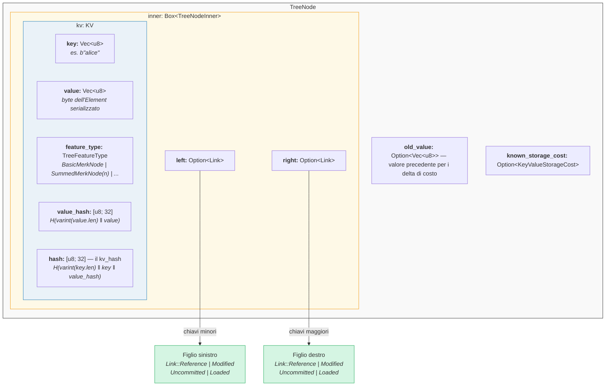

Nel codice (`merk/src/tree/mod.rs`):

```rust
pub struct TreeNode {
    pub(crate) inner: Box<TreeNodeInner>,
    pub(crate) old_value: Option<Vec<u8>>,        // Valore precedente per il tracciamento dei costi
    pub(crate) known_storage_cost: Option<KeyValueStorageCost>,
}

pub struct TreeNodeInner {
    pub(crate) left: Option<Link>,    // Figlio sinistro (chiavi minori)
    pub(crate) right: Option<Link>,   // Figlio destro (chiavi maggiori)
    pub(crate) kv: KV,               // Il payload chiave-valore
}
```

Il `Box<TreeNodeInner>` mantiene il nodo nell'heap, il che e essenziale poiche i link figli possono contenere ricorsivamente intere istanze di `TreeNode`.

## La struttura KV

La struttura `KV` contiene sia i dati grezzi che i loro digest crittografici (`merk/src/tree/kv.rs`):

```rust
pub struct KV {
    pub(super) key: Vec<u8>,                        // La chiave di ricerca
    pub(super) value: Vec<u8>,                      // Il valore memorizzato
    pub(super) feature_type: TreeFeatureType,       // Comportamento di aggregazione
    pub(crate) value_defined_cost: Option<ValueDefinedCostType>,
    pub(super) hash: CryptoHash,                    // kv_hash
    pub(super) value_hash: CryptoHash,              // H(value)
}
```

Due punti importanti:

1. **Le chiavi non vengono memorizzate su disco come parte del nodo codificato.** Vengono memorizzate come chiave RocksDB. Quando un nodo viene decodificato dall'archiviazione, la chiave viene iniettata dall'esterno. Cio evita la duplicazione dei byte della chiave.

2. **Vengono mantenuti due campi hash.** Il `value_hash` e `H(value)` e l'`hash` (kv_hash) e `H(key, value_hash)`. Mantenere entrambi permette al sistema di prove di scegliere quanta informazione rivelare.

## La natura semi-bilanciata — Come l'AVL "oscilla"

Un albero Merk e un **albero AVL** — il classico albero binario di ricerca autobilanciante inventato da Adelson-Velsky e Landis. L'invariante chiave e:

> Per ogni nodo, la differenza di altezza tra i sotto-alberi sinistro e destro e al massimo 1.

Questa e espressa come il **fattore di bilanciamento** (balance factor):

```text
balance_factor = altezza_destra - altezza_sinistra
```

Valori validi: **{-1, 0, 1}**

```rust
// merk/src/tree/mod.rs
pub const fn balance_factor(&self) -> i8 {
    let left_height = self.child_height(true) as i8;
    let right_height = self.child_height(false) as i8;
    right_height - left_height
}
```

Ma ecco il punto sottile: mentre ogni singolo nodo puo inclinarsi solo di un livello, queste inclinazioni possono **accumularsi** attraverso l'albero. Ecco perche lo chiamiamo "semi-bilanciato" — l'albero non e perfettamente bilanciato come un albero binario completo.

Consideriamo un albero di 10 nodi. Un albero perfettamente bilanciato avrebbe altezza 4 (ceil(log2(10+1))). Ma un albero AVL potrebbe avere altezza 5:

**Perfettamente bilanciato (altezza 4)** — ogni livello completamente pieno:

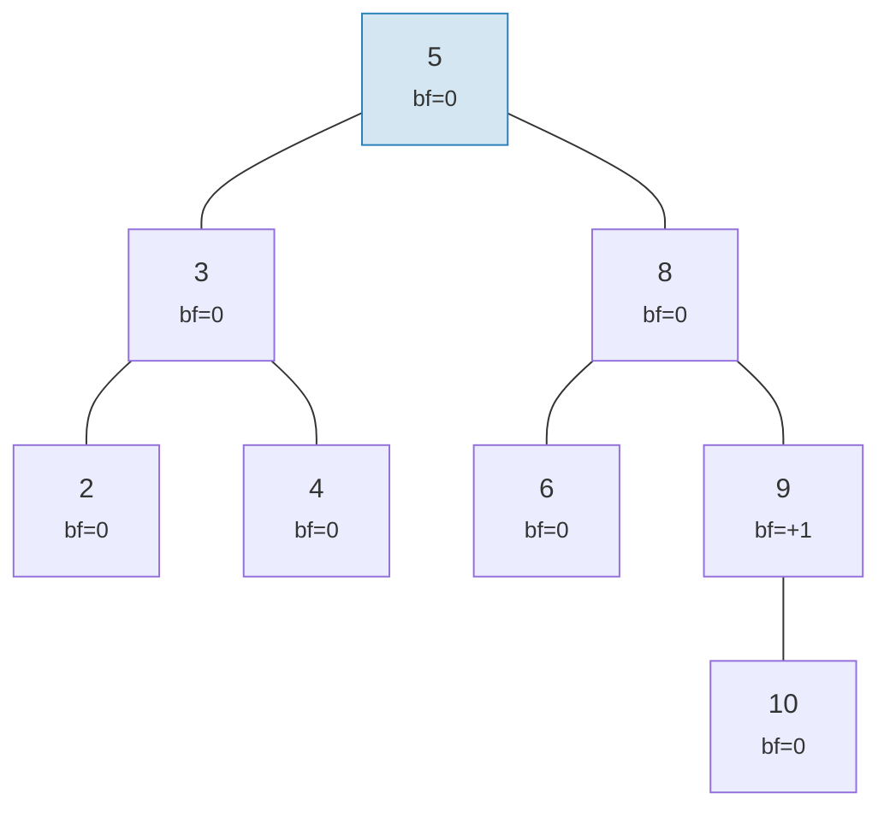

**"Oscillazione" valida per AVL (altezza 5)** — ogni nodo si inclina al massimo di 1, ma si accumula:

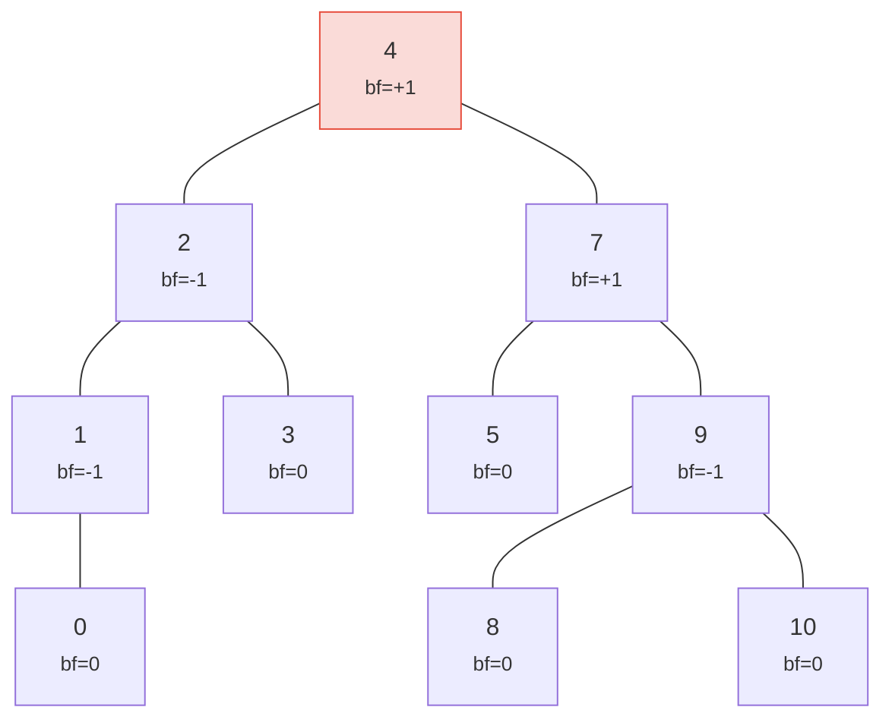

> Altezza 5 contro l'ideale 4 — questa e l'"oscillazione". Caso peggiore: h <= 1.44 x log2(n+2).

Entrambi gli alberi sono alberi AVL validi! L'altezza nel caso peggiore di un albero AVL e:

```text
h <= 1.4404 x log2(n + 2) - 0.3277
```

Quindi per **n = 1.000.000** nodi:
- Bilanciamento perfetto: altezza 20
- Caso peggiore AVL: altezza approssimativa 29

Questo sovraccarico di circa il 44% e il prezzo delle semplici regole di rotazione dell'AVL. In pratica, inserimenti casuali producono alberi molto piu vicini al bilanciamento perfetto.

Ecco come appaiono gli alberi validi e invalidi:

**VALIDO** — tutti i fattori di bilanciamento in {-1, 0, +1}:

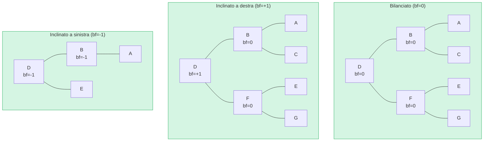

**INVALIDO** — fattore di bilanciamento = +2 (necessita rotazione!):

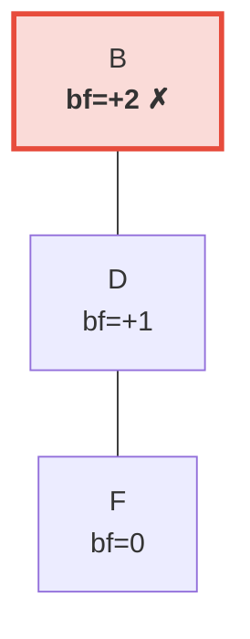

> Il sotto-albero destro e 2 livelli piu alto del sinistro (che e vuoto). Cio innesca una **rotazione a sinistra** per ripristinare l'invariante AVL.

## Rotazioni — Ripristinare il bilanciamento

Quando un inserimento o una cancellazione causa un fattore di bilanciamento di +/-2, l'albero deve essere **ruotato** per ripristinare l'invariante AVL. Ci sono quattro casi, riducibili a due operazioni fondamentali.

### Singola rotazione a sinistra

Usata quando un nodo e **pesante a destra** (bf = +2) e il suo figlio destro e **pesante a destra o bilanciato** (bf >= 0):

**Prima** (bf=+2):

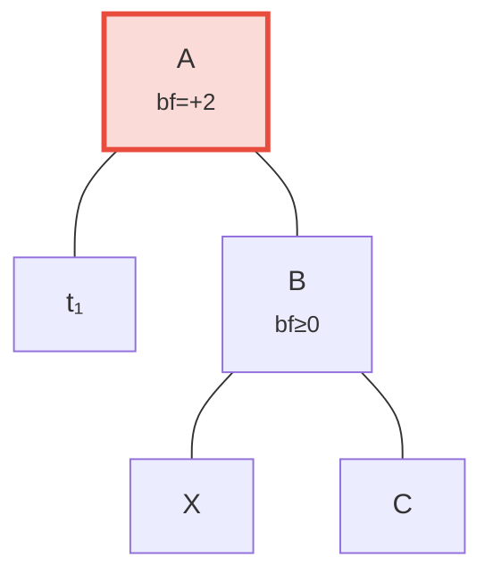

**Dopo** la rotazione a sinistra — B promosso a radice:

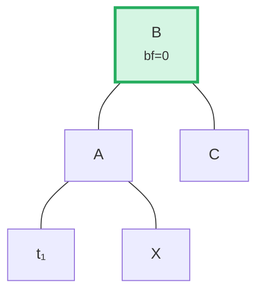

> **Passi:** (1) Staccare B da A. (2) Staccare X (figlio sinistro di B). (3) Collegare X come figlio destro di A. (4) Collegare A come figlio sinistro di B. Il sotto-albero con radice B e ora bilanciato.

Nel codice (`merk/src/tree/ops.rs`):

```rust
fn rotate<V>(self, left: bool, ...) -> CostResult<Self, Error> {
    // Stacca il figlio dal lato pesante
    let (tree, child) = self.detach_expect(left, ...);
    // Stacca il nipote dal lato opposto del figlio
    let (child, maybe_grandchild) = child.detach(!left, ...);

    // Collega il nipote alla radice originale
    tree.attach(left, maybe_grandchild)
        .maybe_balance(...)
        .flat_map_ok(|tree| {
            // Collega la radice originale come figlio del nodo promosso
            child.attach(!left, Some(tree))
                .maybe_balance(...)
        })
}
```

Nota come `maybe_balance` viene chiamato ricorsivamente — la rotazione stessa potrebbe creare nuovi squilibri che necessitano ulteriori correzioni.

### Doppia rotazione (sinistra-destra)

Usata quando un nodo e **pesante a sinistra** (bf = -2) ma il suo figlio sinistro e **pesante a destra** (bf > 0). Una singola rotazione non risolverebbe il problema:

**Passo 0: Prima** — C e pesante a sinistra (bf=-2) ma il suo figlio sinistro A si inclina a destra (bf=+1). Una singola rotazione non risolverebbe:

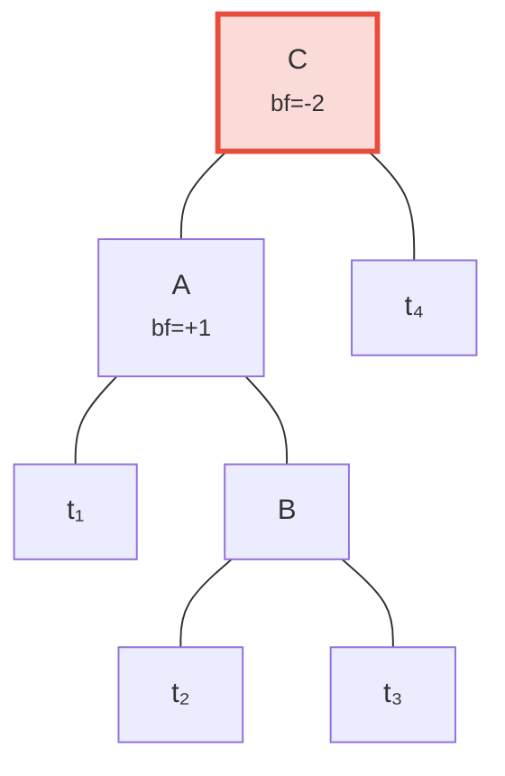

**Passo 1: Rotazione a sinistra del figlio A** — ora sia C che B si inclinano a sinistra, risolvibile con una singola rotazione:

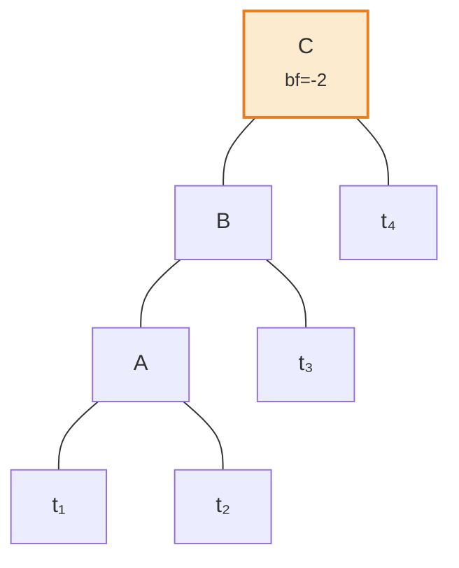

**Passo 2: Rotazione a destra della radice C** — bilanciato!

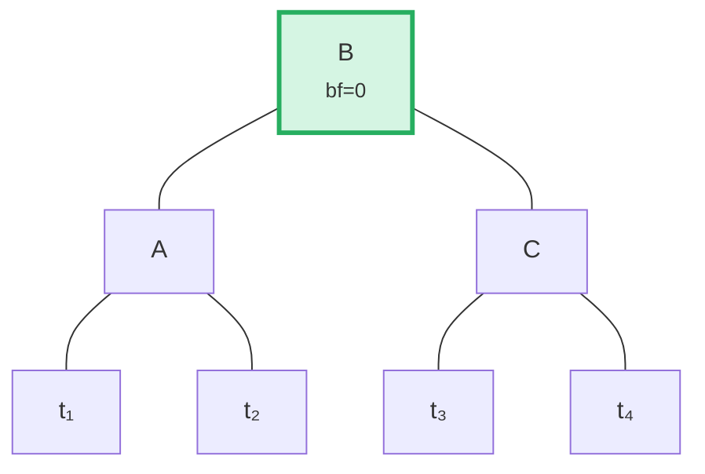

L'algoritmo rileva questo caso confrontando la direzione di inclinazione del genitore con il fattore di bilanciamento del figlio:

```rust
fn maybe_balance<V>(self, ...) -> CostResult<Self, Error> {
    let balance_factor = self.balance_factor();
    if balance_factor.abs() <= 1 {
        return Ok(self);  // Gia bilanciato
    }

    let left = balance_factor < 0;  // true se pesante a sinistra

    // Doppia rotazione necessaria quando il figlio si inclina opposto al genitore
    let tree = if left == (self.tree().link(left).unwrap().balance_factor() > 0) {
        // Prima rotazione: ruota il figlio nella direzione opposta
        self.walk_expect(left, |child|
            child.rotate(!left, ...).map_ok(Some), ...
        )
    } else {
        self
    };

    // Seconda (o unica) rotazione
    tree.rotate(left, ...)
}
```

## Operazioni batch — Costruzione e applicazione

Piuttosto che inserire elementi uno alla volta, Merk supporta operazioni batch che applicano piu modifiche in un singolo passaggio. Cio e critico per l'efficienza: un batch di N operazioni su un albero di M elementi richiede **O((M + N) log(M + N))** tempo, contro O(N log M) per inserimenti sequenziali.

### Il tipo MerkBatch

```rust
type MerkBatch<K> = [(K, Op)];

enum Op {
    Put(Vec<u8>, TreeFeatureType),  // Inserimento o aggiornamento con valore e tipo di feature
    PutWithSpecializedCost(...),     // Inserimento con costo predefinito
    PutCombinedReference(...),       // Inserimento di riferimento con hash combinato
    Replace(Vec<u8>, TreeFeatureType),
    Patch { .. },                    // Aggiornamento parziale del valore
    Delete,                          // Rimozione chiave
    DeleteLayered,                   // Rimozione con costo a livelli
    DeleteMaybeSpecialized,          // Rimozione con costo specializzato opzionale
}
```

### Strategia 1: build() — Costruzione da zero

Quando l'albero e vuoto, `build()` costruisce un albero bilanciato direttamente dal batch ordinato utilizzando un algoritmo di **divisione per mediana**:

Batch di input (ordinato): `[A, B, C, D, E, F, G]` — scegliere il medio (D) come radice, ricorsione su ogni meta:

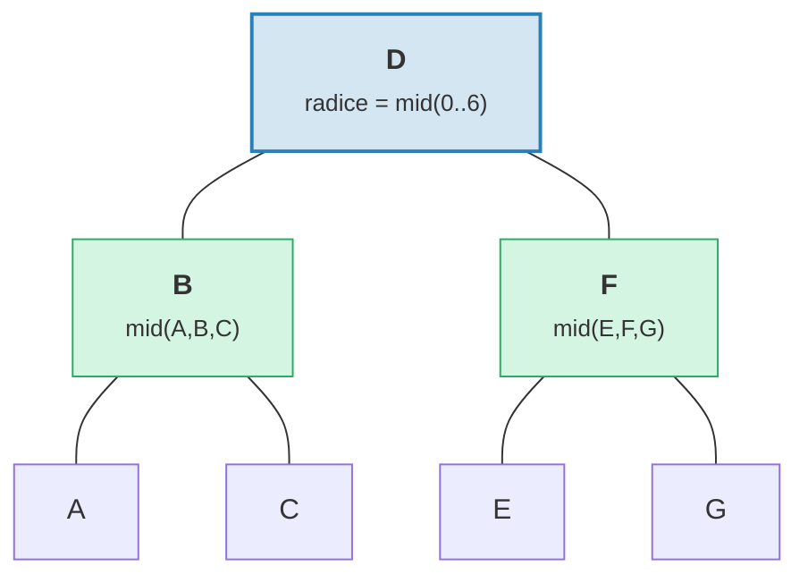

> Risultato: albero perfettamente bilanciato con altezza = 3 = ceil(log2(7)).

```rust
fn build(batch: &MerkBatch<K>, ...) -> CostResult<Option<TreeNode>, Error> {
    let mid_index = batch.len() / 2;
    let (mid_key, mid_op) = &batch[mid_index];

    // Crea il nodo radice dall'elemento centrale
    let mid_tree = TreeNode::new(mid_key.clone(), value.clone(), None, feature_type)?;

    // Costruisci ricorsivamente i sotto-alberi sinistro e destro
    let left = Self::build(&batch[..mid_index], ...);
    let right = Self::build(&batch[mid_index + 1..], ...);

    // Collega i figli
    mid_tree.attach(true, left).attach(false, right)
}
```

Questo produce un albero con altezza ceil(log2(n)) — perfettamente bilanciato.

### Strategia 2: apply_sorted() — Fusione in un albero esistente

Quando l'albero ha gia dei dati, `apply_sorted()` utilizza la **ricerca binaria** per trovare dove ogni operazione del batch appartiene, poi applica ricorsivamente le operazioni ai sotto-alberi sinistro e destro:

Albero esistente con batch `[(B, Put), (F, Delete)]`:

Ricerca binaria: B < D (vai a sinistra), F > D (vai a destra).

**Prima:**
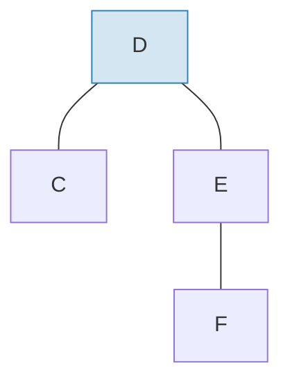

**Dopo** l'applicazione del batch e il ribilanciamento:
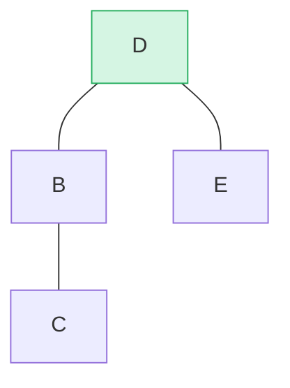

> B inserito come sotto-albero sinistro, F eliminato dal sotto-albero destro. `maybe_balance()` conferma bf(D) = 0.

```rust
fn apply_sorted(self, batch: &MerkBatch<K>, ...) -> CostResult<...> {
    let search = batch.binary_search_by(|(key, _)| key.cmp(self.tree().key()));

    match search {
        Ok(index) => {
            // La chiave corrisponde a questo nodo — applica l'operazione direttamente
            // (Put sostituisce il valore, Delete rimuove il nodo)
        }
        Err(mid) => {
            // Chiave non trovata — mid e il punto di divisione
            // Ricorsione su left_batch[..mid] e right_batch[mid..]
        }
    }

    self.recurse(batch, mid, exclusive, ...)
}
```

Il metodo `recurse` divide il batch e percorre sinistra e destra:

```rust
fn recurse(self, batch: &MerkBatch<K>, mid: usize, ...) {
    let left_batch = &batch[..mid];
    let right_batch = &batch[mid..];  // o mid+1 se esclusivo

    // Applica il batch sinistro al sotto-albero sinistro
    let tree = self.walk(true, |maybe_left| {
        Self::apply_to(maybe_left, left_batch, ...)
    });

    // Applica il batch destro al sotto-albero destro
    let tree = tree.walk(false, |maybe_right| {
        Self::apply_to(maybe_right, right_batch, ...)
    });

    // Ribilancia dopo le modifiche
    tree.maybe_balance(...)
}
```

### Rimozione dei nodi

Quando si elimina un nodo con due figli, Merk promuove il **nodo di bordo** dal sotto-albero piu alto. Cio minimizza la probabilita di necessitare ulteriori rotazioni:

**Prima** — eliminazione di D (ha due figli, altezza sotto-albero destro >= sinistro):

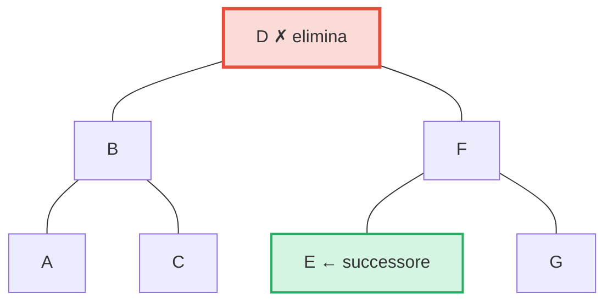

**Dopo** — E (il piu a sinistra nel sotto-albero destro = successore in-order) promosso alla posizione di D:

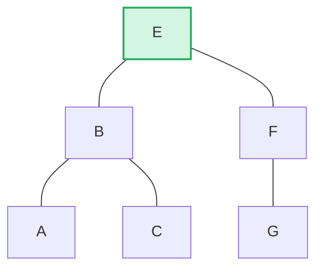

> **Regola:** Se altezza sinistra > destra → promuovi il bordo destro del sotto-albero sinistro. Se altezza destra >= sinistra → promuovi il bordo sinistro del sotto-albero destro. Cio minimizza il ribilanciamento post-eliminazione.

```rust
pub fn remove(self, ...) -> CostResult<Option<Self>, Error> {
    let has_left = tree.link(true).is_some();
    let has_right = tree.link(false).is_some();
    let left = tree.child_height(true) > tree.child_height(false);

    if has_left && has_right {
        // Due figli: promuovi il bordo del figlio piu alto
        let (tree, tall_child) = self.detach_expect(left, ...);
        let (_, short_child) = tree.detach_expect(!left, ...);
        tall_child.promote_edge(!left, short_child, ...)
    } else if has_left || has_right {
        // Un figlio: promuovilo direttamente
        self.detach_expect(left, ...).1
    } else {
        // Nodo foglia: rimuovi semplicemente
        None
    }
}
```

---
