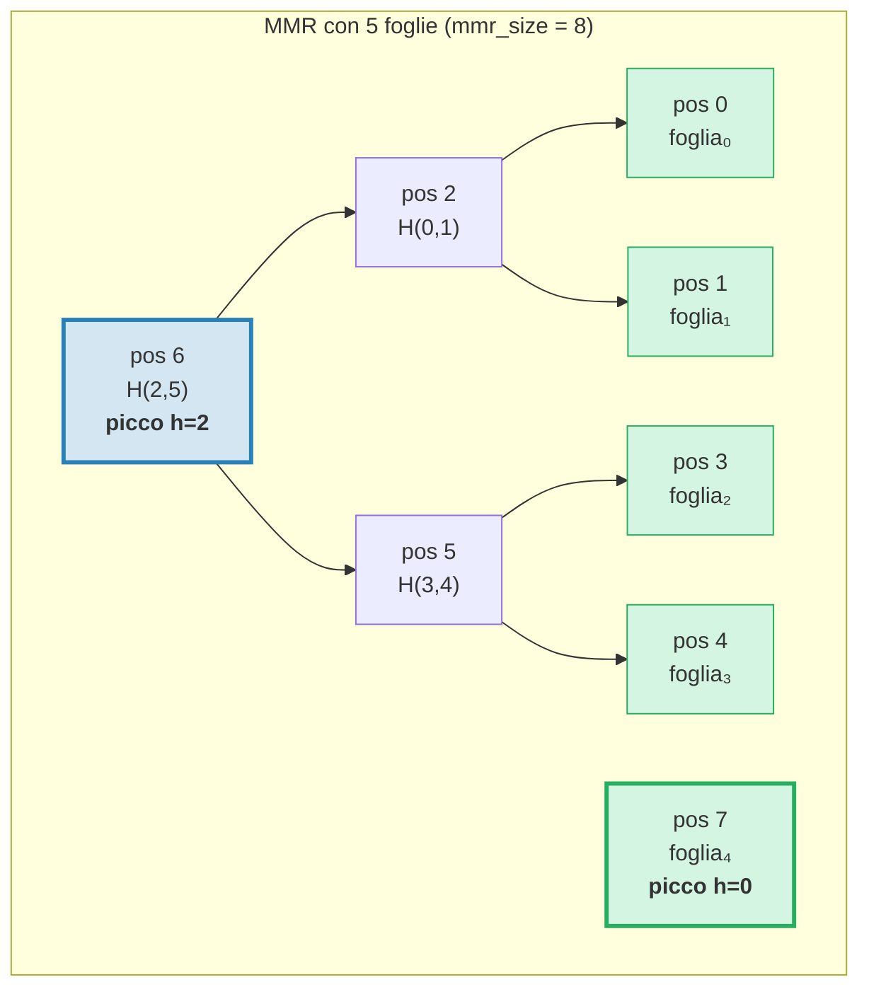
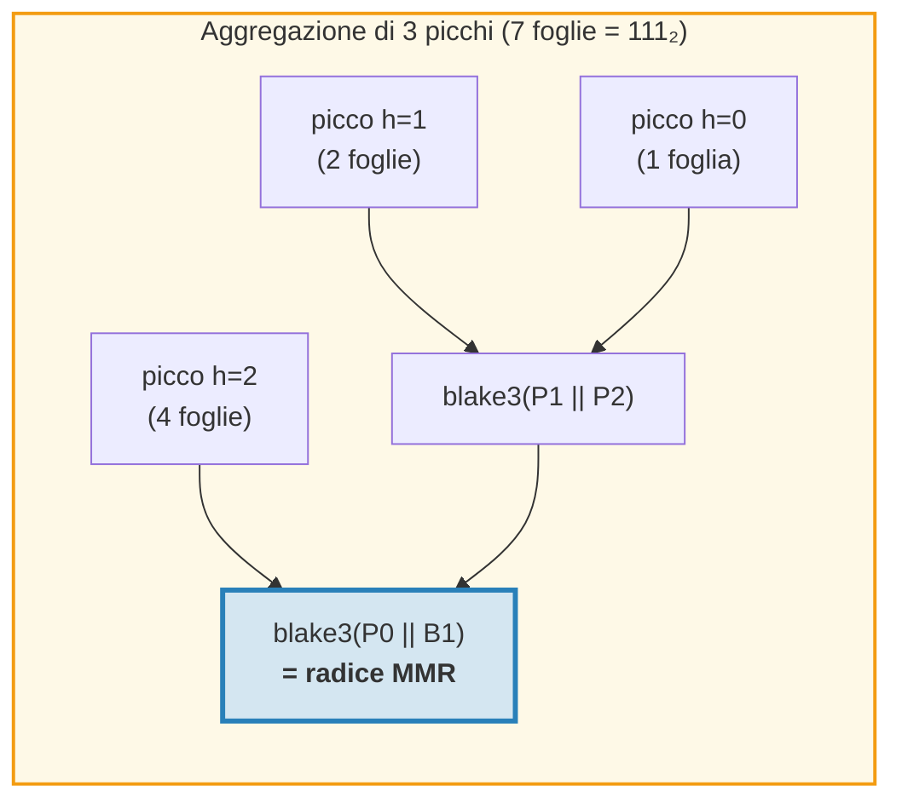
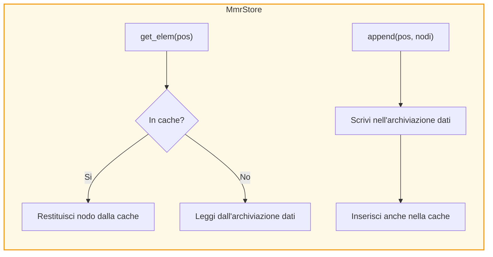
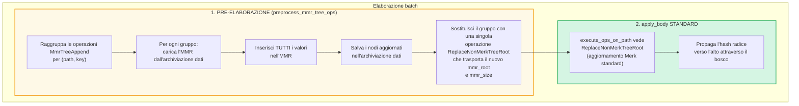
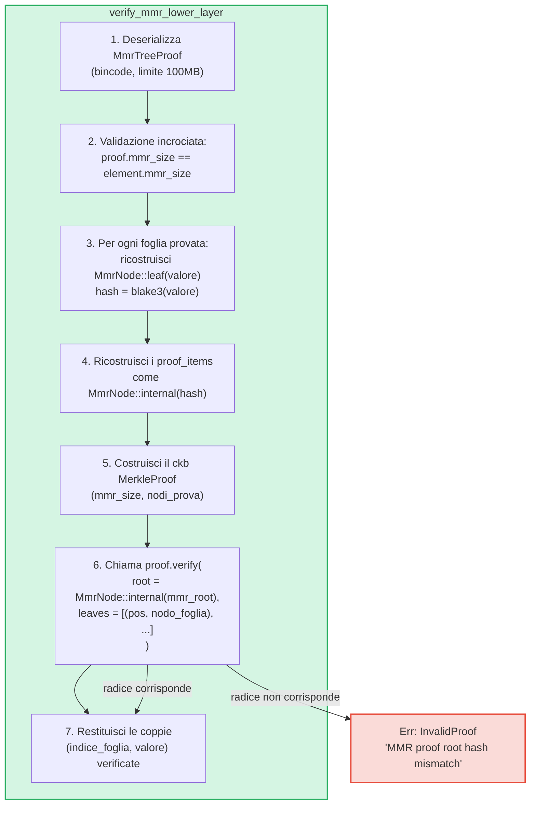

# L'albero MMR — Log autenticati append-only

Il **MmrTree** e la struttura dati autenticata append-only (solo aggiunta) di GroveDB, costruita su un Merkle Mountain Range (MMR) con hashing Blake3. Mentre gli alberi Merk AVL (Capitolo 2) eccellono nelle operazioni casuali chiave-valore con aggiornamenti O(log N), gli MMR sono progettati appositamente per il caso append-only: offrono zero rotazioni, costo di hash ammortizzato O(1) per append, e pattern di I/O sequenziali.

Questo capitolo copre in profondita la struttura dati MMR — come cresce, come vengono memorizzati i nodi, come le aggiunte generano cascate, e come il sistema di prove consente a qualsiasi terza parte di verificare che un valore specifico sia stato aggiunto a una posizione specifica.

## Perche un tipo di albero separato?

Gli alberi Merk standard di GroveDB gestiscono bene i dati chiave-valore ordinati, ma i log append-only hanno requisiti diversi:

| Proprieta | Albero Merk AVL | MMR |
|----------|--------------|-----|
| Operazioni | Inserimento, aggiornamento, eliminazione | Solo aggiunta |
| Ribilanciamento | Rotazioni O(log N) per scrittura | Nessuno |
| Pattern di I/O | Casuale (il ribilanciamento tocca molti nodi) | Sequenziale (nuovi nodi sempre alla fine) |
| Hash totali per N inserimenti | O(N log N) | O(N) |
| Struttura | Determinata dall'ordine di inserimento | Determinata solo dal numero di foglie |
| Prove | Percorso dalla radice alla foglia | Hash dei fratelli + dei picchi |

Per casi d'uso come log di transazioni, flussi di eventi, o qualsiasi dato in crescita monotona, l'MMR e strettamente migliore: piu semplice, piu veloce e piu prevedibile.

## La struttura dati MMR

Un MMR e una **foresta di alberi binari perfetti** (chiamati "picchi") che cresce da sinistra a destra. Ogni picco e un albero binario completo di qualche altezza *h*, contenente esattamente 2^h foglie.

L'intuizione chiave: **la rappresentazione binaria del numero di foglie determina la struttura dei picchi**. Ogni bit 1 nella forma binaria corrisponde a un picco:

```text
Numero foglie    Binario    Picchi
─────────────    ───────    ──────
1                1          un picco h=0
2                10         un picco h=1
3                11         picchi h=1, h=0
4                100        un picco h=2
5                101        picchi h=2, h=0
6                110        picchi h=2, h=1
7                111        picchi h=2, h=1, h=0
8                1000       un picco h=3
```

Cio significa che la struttura dell'MMR e completamente determinata da un singolo numero — il conteggio delle foglie. Due MMR con lo stesso numero di foglie hanno sempre la stessa forma, indipendentemente dai valori aggiunti.

## Come l'MMR si riempie

Ogni nodo nell'MMR ha una **posizione** (indicizzata da 0). Foglie e nodi interni sono intercalati in uno schema specifico. Ecco la crescita passo dopo passo:

**Dopo 1 foglia (mmr_size = 1):**
```text
pos:  0
      foglia₀        ← un picco ad altezza 0
```

**Dopo 2 foglie (mmr_size = 3):**
```text
pos:     2          ← interno: blake3(foglia₀.hash || foglia₁.hash)
        / \
       0   1        ← foglie

Un picco ad altezza 1. Le posizioni 0 e 1 sono foglie, la posizione 2 e interna.
```
Quando la foglia₁ e stata aggiunta, ha creato un picco di altezza 0. Ma c'era gia un picco di altezza 0 (foglia₀), quindi si sono **fusi** in un picco di altezza 1.

**Dopo 3 foglie (mmr_size = 4):**
```text
pos:     2     3    ← picco h=1, picco h=0
        / \
       0   1

Due picchi. Nessuna fusione — le altezze 1 e 0 sono diverse.
(Binario: 3 = 11₂ → un picco per ogni bit a 1)
```

**Dopo 4 foglie (mmr_size = 7):**
```text
pos:         6              ← interno: fusione dei nodi 2 e 5
           /   \
         2       5          ← nodi interni
        / \     / \
       0   1   3   4        ← foglie

Un picco ad altezza 2.
```
Qui diventa interessante. L'aggiunta della foglia₃ (posizione 4) crea il nodo₅ (fondendo le posizioni 3 e 4). Ma ora il nodo₅ (altezza 1) e il nodo₂ (altezza 1) sono picchi adiacenti di uguale altezza, quindi si fondono nel nodo₆. **Una cascata di due fusioni da una singola aggiunta.**

**Dopo 5 foglie (mmr_size = 8):**
```text
pos:         6         7    ← picco h=2, picco h=0
           /   \
         2       5
        / \     / \
       0   1   3   4

Due picchi. (Binario: 5 = 101₂)
```

**Dopo 7 foglie (mmr_size = 11):**
```text
pos:         6         10    ← picco h=2, picco h=1, picco h=0
           /   \      / \
         2       5   8   9    7
        / \     / \
       0   1   3   4

Tre picchi. (Binario: 7 = 111₂)
```

**Dopo 8 foglie (mmr_size = 15):**
```text
pos:              14                     ← singolo picco h=3
               /      \
            6            13
          /   \        /    \
        2       5    9       12
       / \     / \  / \     / \
      0   1   3  4 7   8  10  11

Un picco ad altezza 3. Tre fusioni a cascata dall'aggiunta della foglia₇.
```



> **Blu** = picchi (radici di sotto-alberi binari perfetti). **Verde** = nodi foglia.

## La cascata di fusione

Quando una nuova foglia viene aggiunta, puo innescare una catena di fusioni. Il numero di fusioni e uguale al numero di **bit finali a 1** nella rappresentazione binaria del conteggio corrente delle foglie:

| Conteggio foglie (prima del push) | Binario | bit finali a 1 | Fusioni | Hash totali |
|--------------------------|--------|-------------|--------|--------------|
| 0 | `0` | 0 | 0 | 1 (solo foglia) |
| 1 | `1` | 1 | 1 | 2 |
| 2 | `10` | 0 | 0 | 1 |
| 3 | `11` | 2 | 2 | 3 |
| 4 | `100` | 0 | 0 | 1 |
| 5 | `101` | 1 | 1 | 2 |
| 6 | `110` | 0 | 0 | 1 |
| 7 | `111` | 3 | 3 | 4 |

**Hash totali per push** = `1 + trailing_ones(conteggio_foglie)`:
- 1 hash per la foglia stessa: `blake3(valore)`
- N hash per la cascata di fusione: `blake3(sinistro.hash || destro.hash)` per ogni fusione

Ecco come GroveDB traccia i costi di hash per ogni aggiunta. L'implementazione:
```rust
pub fn hash_count_for_push(leaf_count: u64) -> u32 {
    1 + leaf_count.trailing_ones()
}
```

## Dimensione MMR vs conteggio foglie

L'MMR memorizza sia foglie che nodi interni in uno spazio di posizioni piatto, quindi `mmr_size` e sempre maggiore del conteggio delle foglie. La relazione esatta e:

```text
mmr_size = 2 * conteggio_foglie - popcount(conteggio_foglie)
```

dove `popcount` e il numero di bit a 1 (cioe il numero di picchi). Ogni nodo interno fonde due sotto-alberi, riducendo il conteggio dei nodi di uno per fusione.

Il calcolo inverso — conteggio foglie da mmr_size — usa le posizioni dei picchi:

```rust
fn mmr_size_to_leaf_count(mmr_size: u64) -> u64 {
    // Ogni picco ad altezza h contiene 2^h foglie
    get_peaks(mmr_size).iter()
        .map(|&peak_pos| 1u64 << pos_height_in_tree(peak_pos))
        .sum()
}
```

| mmr_size | conteggio_foglie | picchi |
|----------|-----------|-------|
| 0 | 0 | (vuoto) |
| 1 | 1 | h=0 |
| 3 | 2 | h=1 |
| 4 | 3 | h=1, h=0 |
| 7 | 4 | h=2 |
| 8 | 5 | h=2, h=0 |
| 10 | 6 | h=2, h=1 |
| 11 | 7 | h=2, h=1, h=0 |
| 15 | 8 | h=3 |

GroveDB memorizza `mmr_size` nell'Element (non il conteggio foglie) perche la libreria ckb MMR usa internamente le posizioni. L'operazione `mmr_tree_leaf_count` deriva il conteggio foglie al volo.

## Hash radice dell'MMR — Aggregazione dei picchi

Un MMR ha piu picchi (uno per bit a 1 nel conteggio foglie). Per produrre un singolo hash radice da 32 byte, i picchi vengono **"aggregati"** da destra a sinistra:

```text
root = bag_rhs_peaks(picchi):
    parti dal picco piu a destra
    piega verso sinistra: blake3(picco_sinistro || accumulato_destro)
```

Con 1 picco, la radice e semplicemente l'hash di quel picco. Con 3 picchi:



> L'hash radice cambia con **ogni** aggiunta, anche quando non avvengono fusioni, perche il picco piu a destra cambia e l'aggregazione deve essere ricalcolata.

## Struttura dei nodi e serializzazione

Ogni nodo MMR e un `MmrNode`:

```rust
struct MmrNode {
    hash: [u8; 32],           // Hash Blake3
    value: Option<Vec<u8>>,   // Some per le foglie, None per i nodi interni
}
```

**Nodo foglia:** `hash = blake3(byte_valore)`, `value = Some(byte_valore)`
**Nodo interno:** `hash = blake3(sinistro.hash || destro.hash)`, `value = None`

La funzione di fusione e semplice — concatena due hash da 32 byte e calcola il Blake3 del risultato:

```rust
fn blake3_merge(left: &[u8; 32], right: &[u8; 32]) -> [u8; 32] {
    let mut input = [0u8; 64];
    input[..32].copy_from_slice(left);
    input[32..].copy_from_slice(right);
    *blake3::hash(&input).as_bytes()
}
```

> **Nota su PartialEq:** `MmrNode` implementa `PartialEq` confrontando **solo il campo hash**, non il valore. Cio e critico per la verifica delle prove: il verificatore ckb confronta una radice ricostruita (value = None) con la radice attesa. Se PartialEq confrontasse il campo value, le prove MMR con una singola foglia fallirebbero sempre perche la foglia ha `value: Some(...)` ma la ricostruzione della radice produce `value: None`.

**Formato di serializzazione:**
```text
Interno: [0x00] [hash: 32 byte]                                = 33 byte
Foglia:  [0x01] [hash: 32 byte] [value_len: 4 BE] [value...]   = 37 + len byte
```

Il byte flag distingue i nodi interni dalle foglie. La deserializzazione valida la lunghezza esatta — nessun byte finale consentito.

## Architettura di archiviazione

MmrTree memorizza i suoi nodi nella colonna **dati** (la stessa famiglia di colonne usata dai nodi Merk), non in un sotto-albero Merk figlio. L'Element non ha un campo `root_key` — l'hash radice MMR fluisce come **hash figlio** Merk tramite `insert_subtree(subtree_root_hash)`, autenticando lo stato dell'MMR.

**Chiavi di archiviazione** sono basate sulla posizione:
```text
chiave = 'm' || posizione_come_be_u64    (9 byte: prefisso + u64 BE)
```

Quindi la posizione 42 e memorizzata alla chiave `[0x6D, 0x00, 0x00, 0x00, 0x00, 0x00, 0x00, 0x00, 0x2A]`.

La ricerca della foglia *i* richiede prima il calcolo della posizione MMR: `pos = leaf_index_to_pos(i)`, poi la lettura della chiave dati `m{pos}`.

**Cache write-through:** Durante le aggiunte, i nodi appena scritti devono essere immediatamente leggibili per le fusioni successive nello stesso push. Poiche l'archiviazione transazionale di GroveDB differisce le scritture in un batch (non sono visibili alle letture fino al commit), un adattatore `MmrStore` avvolge il contesto di archiviazione con una cache `HashMap` in memoria:



Cio garantisce che quando l'aggiunta della foglia₃ innesca una cascata di fusione (creando nodi interni alle posizioni 5 e 6), il nodo₅ sia immediatamente disponibile quando si calcola il nodo₆, anche se il nodo₅ non e ancora stato confermato in RocksDB.

**Propagazione dell'hash radice alla radice di stato di GroveDB:**

```text
combined_value_hash = blake3(
    blake3(varint(len) || element_bytes),   ← value_hash dall'Element serializzato
    mmr_root_hash                           ← child_hash = radice specifica del tipo
)
```

L'hash radice MMR fluisce come hash figlio Merk tramite `insert_subtree`. Qualsiasi cambiamento allo stato dell'MMR produce un `combined_value_hash` diverso, che si propaga verso l'alto attraverso la gerarchia Merk genitore fino alla radice di stato di GroveDB.

## Operazioni GroveDB

MmrTree fornisce quattro operazioni:

```rust
// Aggiungi un valore — restituisce (nuovo_mmr_root, indice_foglia)
db.mmr_tree_append(path, key, value, tx, version)

// Leggi l'hash radice corrente (dall'Element, nessun accesso all'archiviazione)
db.mmr_tree_root_hash(path, key, tx, version)

// Ottieni il valore di una foglia per indice (basato su 0)
db.mmr_tree_get_value(path, key, leaf_index, tx, version)

// Ottieni il numero di foglie aggiunte
db.mmr_tree_leaf_count(path, key, tx, version)
```

### Flusso dell'aggiunta

L'operazione di aggiunta e la piu complessa, eseguendo 8 passi:

```mermaid
graph TD
    subgraph append["mmr_tree_append(path, key, value, tx)"]
        A1["1. Leggi l'Element al path/key<br/>→ ottieni mmr_size, flags"]
        A2["2. Apri archiviazione dati al<br/>sotto-albero path/key"]
        A3["3. Crea MmrNode::leaf(value)<br/>hash = blake3(value)"]
        A4["4. Inserisci foglia nell'MMR ckb<br/>→ fusioni a cascata scrivono<br/>nuovi nodi interni"]
        A5["5. Commit → scarica i nuovi<br/>nodi nell'archiviazione"]
        A6["6. Aggrega i picchi → nuovo mmr_root"]
        A7["7. Aggiorna l'Element con<br/>nuovo mmr_root e mmr_size"]
        A8["8. Propaga le modifiche verso l'alto<br/>attraverso la gerarchia Merk<br/>di GroveDB + commit tx"]

        A1 --> A2 --> A3 --> A4 --> A5 --> A6 --> A7 --> A8
    end

    style append fill:#d5f5e3,stroke:#27ae60,stroke-width:2px
    style A6 fill:#d4e6f1,stroke:#2980b9,stroke-width:2px
```



Il passo 4 puo scrivere 1 nodo (solo foglia) o 1 + N nodi (foglia + N nodi interni di fusione). Il passo 5 chiama `mmr.commit()` che scarica il MemStore ckb nell'MmrStore. Il passo 7 chiama `insert_subtree` con la nuova radice MMR come hash figlio (tramite `subtree_root_hash`), poiche MmrTree non ha un Merk figlio.

### Operazioni di lettura

`mmr_tree_root_hash` calcola la radice dai dati MMR nell'archiviazione. `mmr_tree_leaf_count` deriva il conteggio foglie da `mmr_size` nell'Element. Non serve accesso all'archiviazione dati.

`mmr_tree_get_value` calcola `pos = leaf_index_to_pos(leaf_index)`, legge la singola voce dell'archiviazione dati a `m{pos}`, deserializza l'`MmrNode` e restituisce `node.value`.

## Operazioni batch

Piu aggiunte MMR possono essere raggruppate usando `GroveOp::MmrTreeAppend { value }`. Poiche la funzione batch standard `execute_ops_on_path` ha accesso solo al Merk (non al contesto di archiviazione dell'MMR), le aggiunte MMR usano una **fase di pre-elaborazione**:



Esempio: un batch con 3 aggiunte allo stesso MMR:
```rust
vec![
    QualifiedGroveDbOp { path: p, key: k, op: MmrTreeAppend { value: v1 } },
    QualifiedGroveDbOp { path: p, key: k, op: MmrTreeAppend { value: v2 } },
    QualifiedGroveDbOp { path: p, key: k, op: MmrTreeAppend { value: v3 } },
]
```

La pre-elaborazione carica l'MMR una volta, inserisce v1, v2, v3 (creando tutti i nodi intermedi), salva tutto nell'archiviazione dati, poi emette un singolo `ReplaceNonMerkTreeRoot` con il `mmr_root` e `mmr_size` finali. Il meccanismo batch standard gestisce il resto.

## Generazione delle prove

Le prove MMR sono **prove V1** — usano la variante `ProofBytes::MMR` nella struttura di prove a livelli (vedi par. 9.6). La prova dimostra che specifici valori foglia esistono a posizioni specifiche all'interno dell'MMR, e che i loro hash sono coerenti con il `mmr_root` memorizzato nell'elemento genitore.

### Codifica delle query

Le chiavi di query codificano le posizioni come **byte u64 big-endian**. Cio preserva l'ordine lessicografico (poiche la codifica BE e monotona), consentendo a tutte le varianti standard di `QueryItem` di funzionare:

```text
QueryItem::Key([0,0,0,0,0,0,0,5])            → indice foglia 5
QueryItem::RangeInclusive([..2]..=[..7])      → indici foglia [2, 3, 4, 5, 6, 7]
QueryItem::RangeFrom([..10]..)                → indici foglia [10, 11, ..., N-1]
QueryItem::RangeFull                          → tutte le foglie [0..conteggio_foglie)
```

Un limite di sicurezza di **10.000.000 indici** previene l'esaurimento della memoria da query di intervallo illimitate. Un MMR vuoto (zero foglie) restituisce una prova vuota.

### La struttura MmrTreeProof

```rust
struct MmrTreeProof {
    mmr_size: u64,                 // Dimensione MMR al momento della prova
    leaves: Vec<(u64, Vec<u8>)>,   // (indice_foglia, valore) per ogni foglia provata
    proof_items: Vec<[u8; 32]>,    // Hash fratelli/picchi per la verifica
}
```

I `proof_items` contengono l'insieme minimo di hash necessari per ricostruire i percorsi dalle foglie provate fino alla radice MMR. Questi sono i nodi fratelli a ogni livello e gli hash dei picchi non coinvolti.

### Flusso di generazione

```mermaid
graph TD
    subgraph gen["generate_mmr_layer_proof"]
        G1["1. Ottieni gli elementi della sottoquery<br/>dalla PathQuery"]
        G2["2. Decodifica le chiavi BE u64<br/>→ indici foglia"]
        G3["3. Apri archiviazione dati<br/>al percorso del sotto-albero"]
        G4["4. Carica tutti i nodi MMR<br/>in un MemNodeStore di sola lettura"]
        G5["5. Chiama ckb gen_proof(posizioni)<br/>→ MerkleProof"]
        G6["6. Leggi il valore completo<br/>di ogni foglia provata dall'archiviazione"]
        G7["7. Estrai i proof_items<br/>come hash [u8; 32]"]
        G8["8. Codifica MmrTreeProof<br/>→ ProofBytes::MMR(bytes)"]

        G1 --> G2 --> G3 --> G4 --> G5 --> G6 --> G7 --> G8
    end

    style gen fill:#fef9e7,stroke:#f39c12,stroke-width:2px
```



Il passo 4 usa un `MemNodeStore` — un BTreeMap di sola lettura che pre-carica tutti i nodi MMR dall'archiviazione dati. Il generatore di prove ckb necessita accesso casuale, quindi tutti i nodi devono essere in memoria.

Il passo 5 e dove la libreria ckb fa il lavoro pesante: dati la dimensione dell'MMR e le posizioni da provare, determina quali hash di fratelli e picchi sono necessari.

### Esempio pratico

**Provare la foglia 2 in un MMR con 5 foglie (mmr_size = 8):**

```text
Struttura MMR:
pos:         6         7
           /   \
         2       5
        / \     / \
       0   1   3   4

Indice foglia 2 → posizione MMR 3

Per verificare la foglia alla posizione 3:
  1. Hash del valore dichiarato: leaf_hash = blake3(valore)
  2. Fratello alla posizione 4:  nodo₅ = blake3(leaf_hash || proof[pos 4])
  3. Fratello alla posizione 2:  nodo₆ = blake3(proof[pos 2] || nodo₅)
  4. Picco alla posizione 7:     radice = bag(nodo₆, proof[pos 7])
  5. Confronta: radice == mmr_root atteso ✓

proof_items = [hash(pos 4), hash(pos 2), hash(pos 7)]
leaves = [(2, byte_valore_originale)]
```

La dimensione della prova per questo esempio e: 3 hash (96 byte) + 1 valore foglia + metadati. In generale, provare K foglie da un MMR con N foglie richiede O(K * log N) hash fratelli.

## Verifica delle prove

La verifica e **pura** — non richiede accesso al database. Il verificatore necessita solo dei byte della prova e dell'hash radice MMR atteso (che estrae dall'elemento genitore provato nel livello Merk superiore).

### Passi di verifica



La funzione `MerkleProof::verify` di ckb ricostruisce la radice dalle foglie e dai proof_items, poi la confronta (usando `PartialEq`, che controlla solo l'hash) con la radice attesa.

### Catena di fiducia

La catena completa dalla radice di stato di GroveDB a un valore foglia verificato:

```text
Radice di stato GroveDB (nota/fidata)
│
├─ Prova Merk V0 livello 0: dimostra che il sotto-albero esiste alla radice
│   └─ root_hash corrisponde alla radice_di_stato ✓
│
├─ Prova Merk V0 livello 1: dimostra l'elemento MmrTree al path/key
│   └─ Nodo KVValueHash: i byte dell'elemento contengono mmr_root
│   └─ combined_hash = combine_hash(H(byte_elemento), mmr_root)
│   └─ root_hash corrisponde al livello genitore ✓
│
└─ Prova MMR V1: dimostra che i valori foglia sono nell'MMR
    └─ Ricostruisci i percorsi dalle foglie attraverso i fratelli ai picchi
    └─ Aggrega i picchi → radice ricostruita
    └─ radice ricostruita == mmr_root dai byte dell'elemento ✓
    └─ Risultato: foglia₂ = [byte del valore verificato]
```

### Proprieta di sicurezza

- **Validazione incrociata mmr_size:** L'`mmr_size` della prova deve corrispondere all'`mmr_size` dell'elemento. Una discrepanza indica che la prova e stata generata contro uno stato diverso e viene rifiutata.
- **Limite dimensione bincode:** La deserializzazione usa un limite di 100MB per prevenire che intestazioni di lunghezza artefatte causino enormi allocazioni.
- **Contabilita dei limiti:** Ogni foglia provata decrementa il limite complessivo della query di 1 usando `saturating_sub` per prevenire l'underflow.
- **Restituzione dell'hash figlio:** Il verificatore restituisce la radice MMR calcolata come hash figlio per il calcolo combine_hash nel livello genitore.
- **Rifiuto V0:** Tentare una sottoquery in un MmrTree con prove V0 restituisce `Error::NotSupported`. Solo le prove V1 possono scendere negli alberi non-Merk.

## Tracciamento dei costi

Le operazioni MMR tracciano i costi con precisione:

| Operazione | Chiamate hash | Operazioni di archiviazione |
|-----------|-----------|-------------------|
| Aggiunta 1 foglia | `1 + trailing_ones(conteggio_foglie)` | 1 scrittura foglia + N scritture interne |
| Hash radice | 0 (in cache nell'Element) | 1 lettura Element |
| Ottieni valore | 0 | 1 lettura Element + 1 lettura dati |
| Conteggio foglie | 0 | 1 lettura Element |

La formula del conteggio hash `1 + trailing_ones(N)` da il numero esatto di chiamate Blake3: 1 per l'hash della foglia, piu un hash di fusione per livello della cascata.

**Analisi ammortizzata:** Su N aggiunte, il conteggio totale degli hash e:

```text
Σ (1 + trailing_ones(i)) per i = 0..N-1
= N + Σ trailing_ones(i) per i = 0..N-1
= N + (N - popcount(N))
≈ 2N
```

Quindi il costo ammortizzato per aggiunta e approssimativamente **2 chiamate hash Blake3** — costante e indipendente dalla dimensione dell'albero. Confrontalo con gli alberi Merk AVL dove ogni inserimento richiede O(log N) hash per il percorso piu potenziali hash di rotazione.

**Costo di archiviazione:** Ogni aggiunta scrive 1 nodo foglia (37 + lunghezza_valore byte) piu da 0 a log₂(N) nodi interni (33 byte ciascuno). La scrittura di archiviazione ammortizzata per aggiunta e approssimativamente 33 + 37 + lunghezza_valore byte, circa 70 + lunghezza_valore byte.

## File di implementazione

| File | Scopo |
|------|---------|
| `grovedb-mmr/src/node.rs` | Struttura `MmrNode`, fusione Blake3, serializzazione |
| `grovedb-mmr/src/grove_mmr.rs` | Wrapper `GroveMmr` attorno all'MMR ckb |
| `grovedb-mmr/src/util.rs` | `mmr_node_key`, `hash_count_for_push`, `mmr_size_to_leaf_count` |
| `grovedb-mmr/src/proof.rs` | Generazione e verifica di `MmrTreeProof` |
| `grovedb-mmr/src/dense_merkle.rs` | Radici di alberi di Merkle densi (usate da BulkAppendTree) |
| `grovedb/src/operations/mmr_tree.rs` | Operazioni GroveDB + adattatore `MmrStore` + pre-elaborazione batch |
| `grovedb/src/operations/proof/generate.rs` | Generazione prove V1: `generate_mmr_layer_proof`, `query_items_to_leaf_indices` |
| `grovedb/src/operations/proof/verify.rs` | Verifica prove V1: `verify_mmr_lower_layer` |
| `grovedb/src/tests/mmr_tree_tests.rs` | 28 test di integrazione |

## Confronto con altre strutture autenticate

| | MMR (MmrTree) | Merk AVL (Tree) | Sinsemilla (CommitmentTree) |
|---|---|---|---|
| **Caso d'uso** | Log append-only | Archivio chiave-valore | Impegni compatibili con ZK |
| **Funzione di hash** | Blake3 | Blake3 | Sinsemilla (curva Pallas) |
| **Operazioni** | Aggiungi, leggi per indice | Inserisci, aggiorna, elimina, interroga | Aggiungi, testimone |
| **Hash ammortizzato/scrittura** | ~2 | O(log N) | ~33 (32 livelli + ommer) |
| **Tipo di prova** | V1 (hash fratelli MMR) | V0 (prova percorso Merk) | Testimone (percorso di autenticazione Merkle) |
| **Compatibile con ZK** | No | No | Si (circuiti Halo 2) |
| **Ribilanciamento** | Nessuno | Rotazioni AVL | Nessuno |
| **Supporto eliminazione** | No | Si | No |

---
