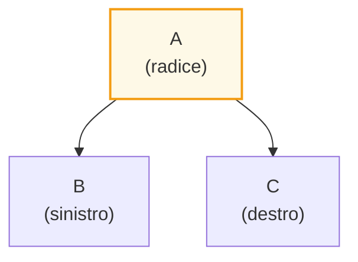
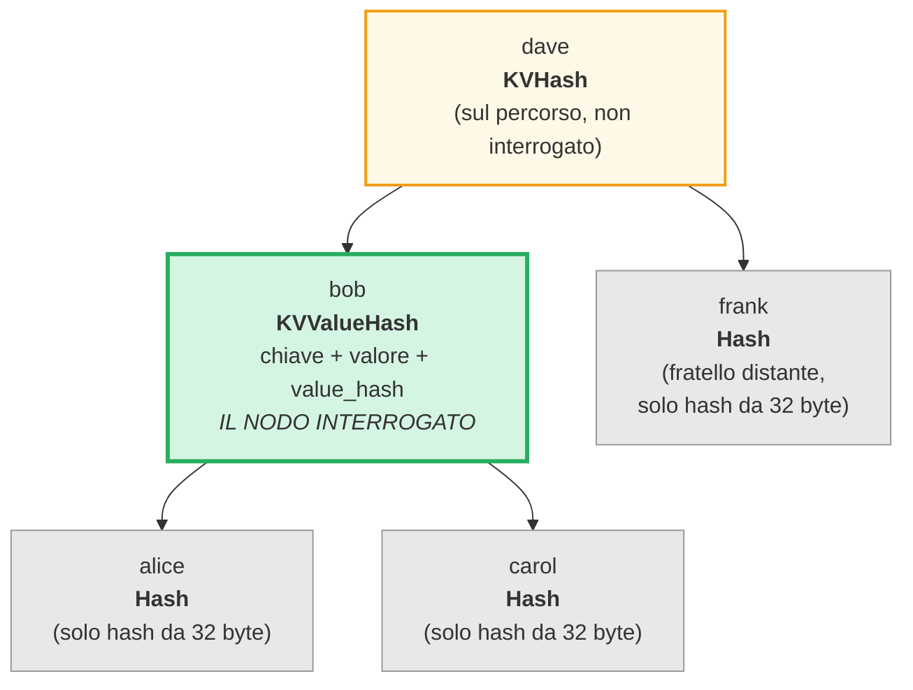
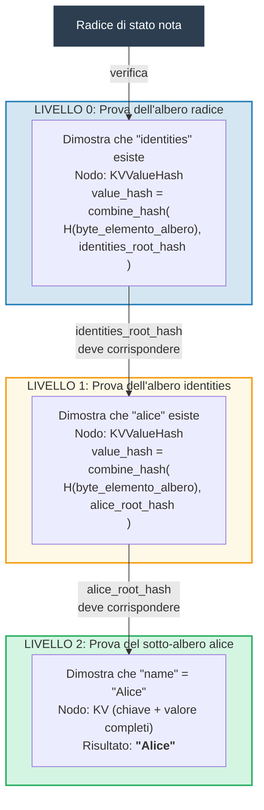
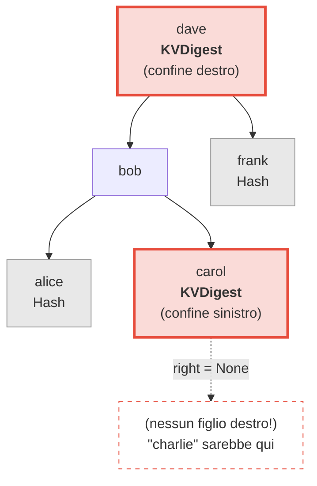
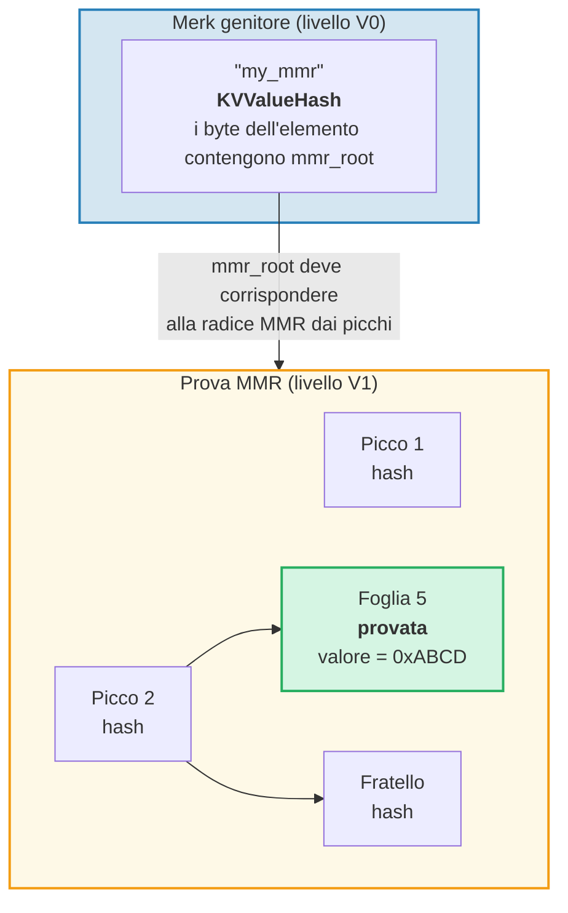
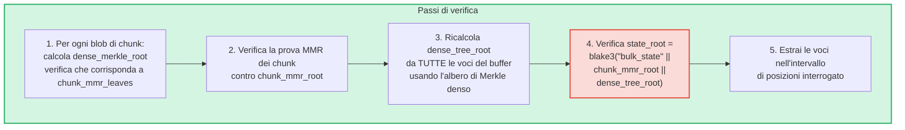
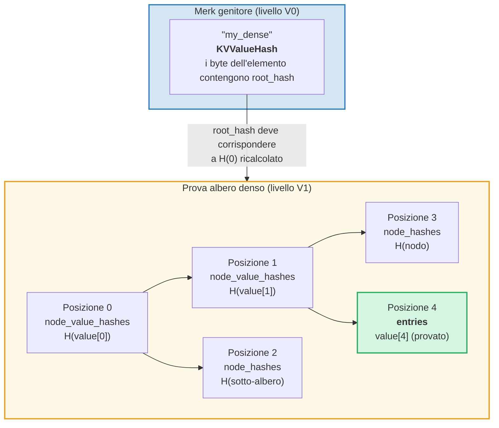

# Il sistema di prove

Il sistema di prove di GroveDB consente a qualsiasi parte di verificare la correttezza dei risultati delle query senza avere l'intero database. Una prova e una rappresentazione compatta della struttura dell'albero rilevante che permette la ricostruzione dell'hash radice.

## Operazioni di prove basate su stack

Le prove sono codificate come una sequenza di **operazioni** che ricostruiscono un albero parziale usando una macchina a stack:

```rust
// merk/src/proofs/mod.rs
pub enum Op {
    Push(Node),        // Inserisci un nodo nello stack (ordine chiavi crescente)
    PushInverted(Node),// Inserisci un nodo (ordine chiavi decrescente)
    Parent,            // Estrai genitore, estrai figlio → collega figlio come SINISTRO del genitore
    Child,             // Estrai figlio, estrai genitore → collega figlio come DESTRO del genitore
    ParentInverted,    // Estrai genitore, estrai figlio → collega figlio come DESTRO del genitore
    ChildInverted,     // Estrai figlio, estrai genitore → collega figlio come SINISTRO del genitore
}
```

L'esecuzione usa uno stack:

Operazioni della prova: `Push(B), Push(A), Parent, Push(C), Child`

| Passo | Operazione | Stack (cima→destra) | Azione |
|------|-----------|-------------------|--------|
| 1 | Push(B) | [ B ] | Inserisci B nello stack |
| 2 | Push(A) | [ B , A ] | Inserisci A nello stack |
| 3 | Parent | [ A{left:B} ] | Estrai A (genitore), estrai B (figlio), B → SINISTRO di A |
| 4 | Push(C) | [ A{left:B} , C ] | Inserisci C nello stack |
| 5 | Child | [ A{left:B, right:C} ] | Estrai C (figlio), estrai A (genitore), C → DESTRO di A |

Risultato finale — un albero nello stack:



> Il verificatore calcola `node_hash(A) = Blake3(kv_hash_A || node_hash_B || node_hash_C)` e controlla che corrisponda all'hash radice atteso.

Questa e la funzione `execute` (`merk/src/proofs/tree.rs`):

```rust
pub fn execute<I, F>(ops: I, collapse: bool, mut visit_node: F) -> CostResult<Tree, Error>
where
    I: IntoIterator<Item = Result<Op, Error>>,
    F: FnMut(&Node) -> Result<(), Error>,
{
    let mut stack: Vec<Tree> = Vec::with_capacity(32);

    for op in ops {
        match op? {
            Op::Parent => {
                let (mut parent, child) = (try_pop(&mut stack), try_pop(&mut stack));
                parent.left = Some(Child { tree: Box::new(child), hash: child.hash() });
                stack.push(parent);
            }
            Op::Child => {
                let (child, mut parent) = (try_pop(&mut stack), try_pop(&mut stack));
                parent.right = Some(Child { tree: Box::new(child), hash: child.hash() });
                stack.push(parent);
            }
            Op::Push(node) => {
                visit_node(&node)?;
                stack.push(Tree::from(node));
            }
            // ... Le varianti invertite scambiano sinistro/destro
        }
    }
    // L'elemento finale nello stack e la radice
}
```

## Tipi di nodo nelle prove

Ogni `Push` trasporta un `Node` che contiene le informazioni appena sufficienti per la verifica:

```rust
pub enum Node {
    // Informazione minima — solo l'hash. Usato per fratelli distanti.
    Hash(CryptoHash),

    // Hash KV per nodi sul percorso ma non interrogati.
    KVHash(CryptoHash),

    // Chiave-valore completo per elementi interrogati.
    KV(Vec<u8>, Vec<u8>),

    // Chiave, valore e value_hash pre-calcolato.
    // Usato per sotto-alberi dove value_hash = combine_hash(...)
    KVValueHash(Vec<u8>, Vec<u8>, CryptoHash),

    // KV con tipo di feature — per ProvableCountTree o ripristino da chunk.
    KVValueHashFeatureType(Vec<u8>, Vec<u8>, CryptoHash, TreeFeatureType),

    // Riferimento: chiave, valore dereferenziato, hash dell'elemento riferimento.
    KVRefValueHash(Vec<u8>, Vec<u8>, CryptoHash),

    // Per elementi in ProvableCountTree.
    KVCount(Vec<u8>, Vec<u8>, u64),

    // Hash KV + conteggio per nodi ProvableCountTree non interrogati.
    KVHashCount(CryptoHash, u64),

    // Riferimento in ProvableCountTree.
    KVRefValueHashCount(Vec<u8>, Vec<u8>, CryptoHash, u64),

    // Per prove di confine/assenza in ProvableCountTree.
    KVDigestCount(Vec<u8>, CryptoHash, u64),

    // Chiave + value_hash per prove di assenza (alberi regolari).
    KVDigest(Vec<u8>, CryptoHash),
}
```

La scelta del tipo di Node determina quali informazioni il verificatore necessita:

**Query: "Ottieni il valore per la chiave 'bob'"**



> Verde = nodo interrogato (dati completi rivelati). Giallo = sul percorso (solo kv_hash). Grigio = fratelli (solo hash del nodo da 32 byte).

Codificato come operazioni di prova:

| # | Op | Effetto |
|---|----|----|
| 1 | Push(Hash(alice_node_hash)) | Inserisci hash di alice |
| 2 | Push(KVValueHash("bob", value, value_hash)) | Inserisci bob con dati completi |
| 3 | Parent | alice diventa figlio sinistro di bob |
| 4 | Push(Hash(carol_node_hash)) | Inserisci hash di carol |
| 5 | Child | carol diventa figlio destro di bob |
| 6 | Push(KVHash(dave_kv_hash)) | Inserisci kv_hash di dave |
| 7 | Parent | sotto-albero bob diventa sinistro di dave |
| 8 | Push(Hash(frank_node_hash)) | Inserisci hash di frank |
| 9 | Child | frank diventa figlio destro di dave |

## Generazione di prove multi-livello

Poiche GroveDB e un albero di alberi, le prove attraversano piu livelli. Ogni livello dimostra la porzione rilevante di un albero Merk, e i livelli sono collegati dal meccanismo del value_hash combinato:

**Query:** `Get ["identities", "alice", "name"]`



> **Catena di fiducia:** `radice_stato_nota → verifica Livello 0 → verifica Livello 1 → verifica Livello 2 → "Alice"`. L'hash radice ricostruito di ogni livello deve corrispondere al value_hash dal livello superiore.

Il verificatore controlla ogni livello, confermando che:
1. La prova del livello si ricostruisce all'hash radice atteso
2. L'hash radice corrisponde al value_hash dal livello genitore
3. L'hash radice di primo livello corrisponde alla radice di stato nota

## Verifica delle prove

La verifica segue i livelli della prova dal basso verso l'alto o dall'alto verso il basso, usando la funzione `execute` per ricostruire l'albero di ogni livello. Il metodo `Tree::hash()` nell'albero della prova calcola l'hash in base al tipo di nodo:

```rust
impl Tree {
    pub fn hash(&self) -> CostContext<CryptoHash> {
        match &self.node {
            Node::Hash(hash) => *hash,  // Gia un hash, restituisci direttamente

            Node::KVHash(kv_hash) =>
                node_hash(kv_hash, &self.child_hash(true), &self.child_hash(false)),

            Node::KV(key, value) =>
                kv_hash(key, value)
                    .flat_map(|kv_hash| node_hash(&kv_hash, &left, &right)),

            Node::KVValueHash(key, _, value_hash) =>
                kv_digest_to_kv_hash(key, value_hash)
                    .flat_map(|kv_hash| node_hash(&kv_hash, &left, &right)),

            Node::KVValueHashFeatureType(key, _, value_hash, feature_type) => {
                let kv = kv_digest_to_kv_hash(key, value_hash);
                match feature_type {
                    ProvableCountedMerkNode(count) =>
                        node_hash_with_count(&kv, &left, &right, *count),
                    _ => node_hash(&kv, &left, &right),
                }
            }

            Node::KVRefValueHash(key, referenced_value, ref_element_hash) => {
                let ref_value_hash = value_hash(referenced_value);
                let combined = combine_hash(ref_element_hash, &ref_value_hash);
                let kv = kv_digest_to_kv_hash(key, &combined);
                node_hash(&kv, &left, &right)
            }
            // ... altre varianti
        }
    }
}
```

## Prove di assenza

GroveDB puo dimostrare che una chiave **non** esiste. Questo usa i nodi di confine — i nodi che sarebbero adiacenti alla chiave mancante se essa esistesse:

**Dimostra:** "charlie" NON esiste



> **Ricerca binaria:** alice < bob < carol < **"charlie"** < dave < frank. "charlie" sarebbe tra carol e dave. Il figlio destro di carol e `None`, dimostrando che non esiste nulla tra carol e dave. Quindi "charlie" non puo esistere in questo albero.

Per le query di intervallo, le prove di assenza mostrano che non ci sono chiavi nell'intervallo interrogato che non sono state incluse nell'insieme dei risultati.

## Prove V1 — Alberi non-Merk

Il sistema di prove V0 funziona esclusivamente con sotto-alberi Merk, scendendo livello per livello attraverso la gerarchia del bosco. Tuttavia, gli elementi **CommitmentTree**, **MmrTree**, **BulkAppendTree** e **DenseAppendOnlyFixedSizeTree** memorizzano i loro dati al di fuori di un sotto-albero Merk figlio. Non hanno un Merk figlio in cui scendere — il loro hash radice specifico del tipo fluisce invece come hash figlio Merk.

Il **formato di prova V1** estende V0 per gestire questi alberi non-Merk con strutture di prova specifiche del tipo:

```rust
/// Quale formato di prova usa un livello.
pub enum ProofBytes {
    Merk(Vec<u8>),            // Operazioni di prova Merk standard
    MMR(Vec<u8>),             // Prova di appartenenza MMR
    BulkAppendTree(Vec<u8>),  // Prova di intervallo BulkAppendTree
    DenseTree(Vec<u8>),       // Prova di inclusione albero denso
    CommitmentTree(Vec<u8>),  // Radice Sinsemilla (32 byte) + prova BulkAppendTree
}

/// Un livello di una prova V1.
pub struct LayerProof {
    pub merk_proof: ProofBytes,
    pub lower_layers: BTreeMap<Vec<u8>, LayerProof>,
}
```

**Regola di selezione V0/V1:** Se ogni livello nella prova e un albero Merk standard, `prove_query` produce un `GroveDBProof::V0` (retrocompatibile). Se un qualsiasi livello coinvolge un MmrTree, BulkAppendTree o DenseAppendOnlyFixedSizeTree, produce `GroveDBProof::V1`.

### Come le prove degli alberi non-Merk si legano all'hash radice

L'albero Merk genitore dimostra i byte serializzati dell'elemento tramite un nodo di prova Merk standard (`KVValueHash`). La radice specifica del tipo (es. `mmr_root` o `state_root`) fluisce come **hash figlio** Merk — NON e incorporata nei byte dell'elemento:

```text
combined_value_hash = combine_hash(
    Blake3(varint(len) || element_bytes),   ← contiene conteggio, altezza, ecc.
    type_specific_root                      ← mmr_root / state_root / dense_root
)
```

La prova specifica del tipo dimostra poi che i dati interrogati sono coerenti con la radice specifica del tipo usata come hash figlio.

### Prove degli alberi MMR

Una prova MMR dimostra che specifiche foglie esistono a posizioni note all'interno dell'MMR, e che l'hash radice dell'MMR corrisponde all'hash figlio memorizzato nel nodo Merk genitore:

```rust
pub struct MmrProof {
    pub mmr_size: u64,
    pub proof: MerkleProof,  // ckb_merkle_mountain_range::MerkleProof
    pub leaves: Vec<MmrProofLeaf>,
}

pub struct MmrProofLeaf {
    pub position: u64,       // Posizione MMR
    pub leaf_index: u64,     // Indice logico della foglia
    pub hash: [u8; 32],      // Hash della foglia
    pub value: Vec<u8>,      // Byte del valore della foglia
}
```



**Le chiavi di query sono posizioni:** Gli elementi di query codificano le posizioni come byte u64 big-endian (che preserva l'ordine di ordinamento). `QueryItem::RangeInclusive` con posizioni di inizio/fine codificate in BE seleziona un intervallo contiguo di foglie MMR.

**Verifica:**
1. Ricostruisci le foglie `MmrNode` dalla prova
2. Verifica il `MerkleProof` ckb contro la radice MMR attesa dall'hash figlio del Merk genitore
3. Controllo incrociato che `proof.mmr_size` corrisponda alla dimensione memorizzata nell'elemento
4. Restituisci i valori delle foglie provate

### Prove BulkAppendTree

Le prove BulkAppendTree sono piu complesse perche i dati risiedono in due posti: blob di chunk sigillati e il buffer in corso. Una prova di intervallo deve restituire:

- **Blob di chunk completi** per qualsiasi chunk completato che sovrappone l'intervallo della query
- **Singole voci del buffer** per le posizioni ancora nel buffer

```rust
pub struct BulkAppendTreeProof {
    pub chunk_power: u8,
    pub total_count: u64,
    pub chunk_blobs: Vec<(u64, Vec<u8>)>,       // (indice_chunk, byte_blob)
    pub chunk_mmr_size: u64,
    pub chunk_mmr_proof_items: Vec<[u8; 32]>,    // Hash fratelli MMR
    pub chunk_mmr_leaves: Vec<(u64, [u8; 32])>,  // (pos_mmr, radice_merkle_densa)
    pub buffer_entries: Vec<Vec<u8>>,             // TUTTE le voci correnti del buffer (albero denso)
    pub chunk_mmr_root: [u8; 32],
}
```



> **Perche includere TUTTE le voci del buffer?** Il buffer e un albero di Merkle denso il cui hash radice si impegna per ogni voce. Per verificare il `dense_tree_root`, il verificatore deve ricostruire l'albero da tutte le voci. Poiche il buffer e limitato da `capacity` voci (al massimo 65.535), cio e accettabile.

**Contabilita dei limiti:** Ogni singolo valore (all'interno di un chunk o del buffer) conta verso il limite della query, non ogni blob di chunk nel suo insieme. Se una query ha `limit: 100` e un chunk contiene 1024 voci con 500 che si sovrappongono all'intervallo, tutte e 500 le voci contano verso il limite.

### Prove DenseAppendOnlyFixedSizeTree

Una prova di albero denso dimostra che specifiche posizioni contengono specifici valori, autenticati contro l'hash radice dell'albero (che fluisce come hash figlio Merk). Tutti i nodi usano `blake3(H(value) || H(left) || H(right))`, quindi i nodi antenati sul percorso di autenticazione necessitano solo del loro **hash del valore** da 32 byte — non del valore completo.

```rust
pub struct DenseTreeProof {
    pub entries: Vec<(u16, Vec<u8>)>,            // coppie (posizione, valore) provate
    pub node_value_hashes: Vec<(u16, [u8; 32])>, // hash dei valori degli antenati sul percorso di autenticazione
    pub node_hashes: Vec<(u16, [u8; 32])>,       // hash precalcolati dei sotto-alberi fratelli
}
```

> `height` e `count` provengono dall'Element genitore (autenticato dalla gerarchia Merk), non dalla prova.



**La verifica** e una funzione pura che non richiede archiviazione:
1. Costruisci mappe di ricerca da `entries`, `node_value_hashes` e `node_hashes`
2. Ricalcola ricorsivamente l'hash radice dalla posizione 0:
   - La posizione ha un hash precalcolato in `node_hashes` → usalo direttamente
   - Posizione con valore in `entries` → `blake3(blake3(value) || H(left) || H(right))`
   - Posizione con hash in `node_value_hashes` → `blake3(hash || H(left) || H(right))`
   - Posizione `>= count` o `>= capacity` → `[0u8; 32]`
3. Confronta la radice calcolata con l'hash radice atteso dall'elemento genitore
4. Restituisci le voci provate in caso di successo

Le **prove multi-posizione** fondono i percorsi di autenticazione sovrapposti: gli antenati condivisi e i loro valori appaiono solo una volta, rendendole piu compatte rispetto a prove indipendenti.

---
