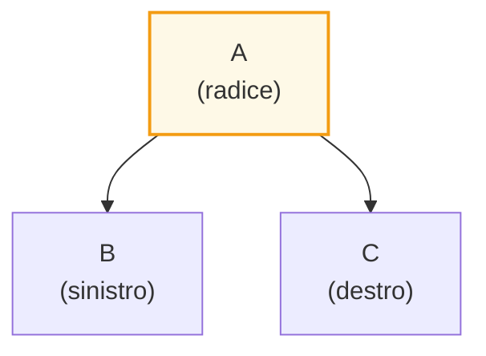
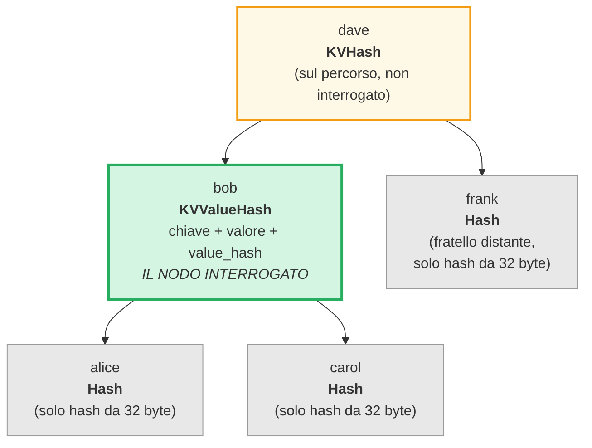
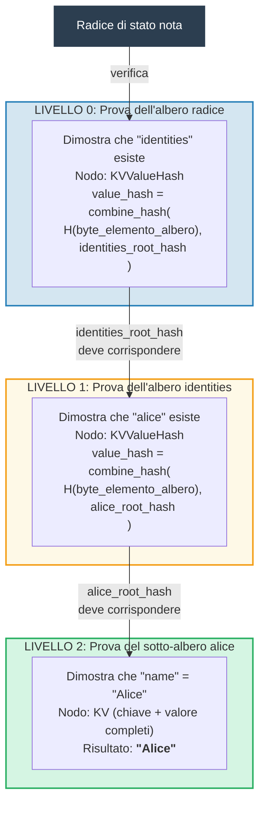
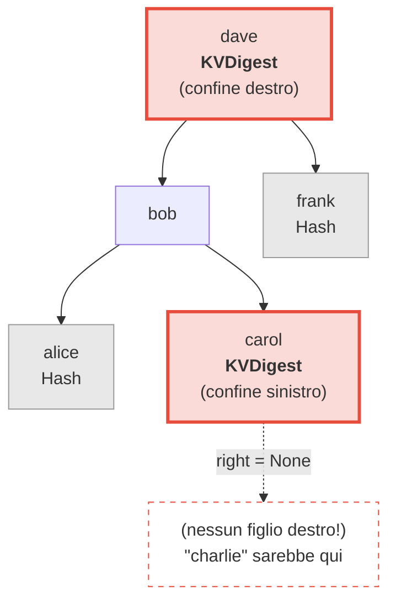
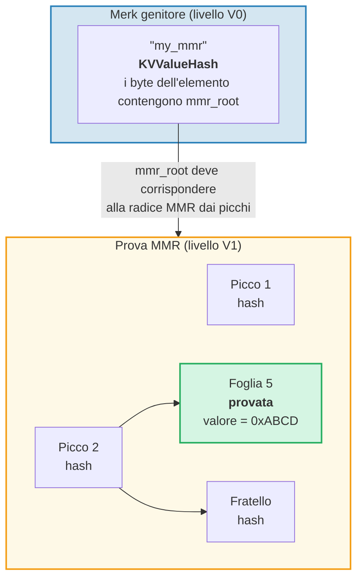
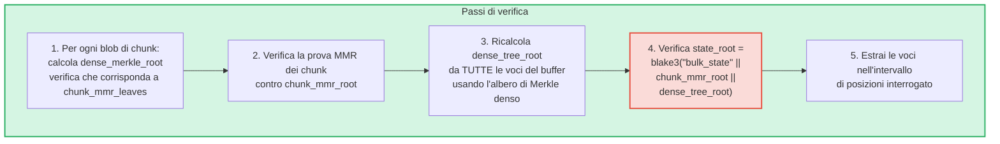
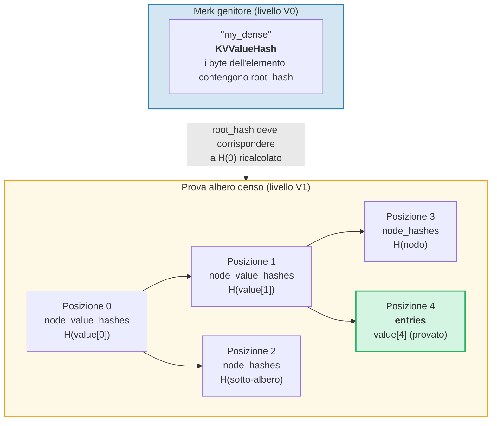

# Il sistema di prove

Il sistema di prove di GroveDB consente a qualsiasi parte di verificare la correttezza dei risultati delle query senza avere l'intero database. Una prova e una rappresentazione compatta della struttura dell'albero rilevante che permette la ricostruzione dell'hash radice.

## Operazioni di prove basate su stack

Le prove sono codificate come una sequenza di **operazioni** che ricostruiscono un albero parziale usando una macchina a stack:

```rust
// merk/src/proofs/mod.rs
pub enum Op {
    Push(Node),        // Inserisci un nodo nello stack (ordine chiavi crescente)
    PushInverted(Node),// Inserisci un nodo (ordine chiavi decrescente)
    Parent,            // Estrai genitore, estrai figlio → collega figlio come SINISTRO del genitore
    Child,             // Estrai figlio, estrai genitore → collega figlio come DESTRO del genitore
    ParentInverted,    // Estrai genitore, estrai figlio → collega figlio come DESTRO del genitore
    ChildInverted,     // Estrai figlio, estrai genitore → collega figlio come SINISTRO del genitore
}
```

L'esecuzione usa uno stack:

Operazioni della prova: `Push(B), Push(A), Parent, Push(C), Child`

| Passo | Operazione | Stack (cima→destra) | Azione |
|------|-----------|-------------------|--------|
| 1 | Push(B) | [ B ] | Inserisci B nello stack |
| 2 | Push(A) | [ B , A ] | Inserisci A nello stack |
| 3 | Parent | [ A{left:B} ] | Estrai A (genitore), estrai B (figlio), B → SINISTRO di A |
| 4 | Push(C) | [ A{left:B} , C ] | Inserisci C nello stack |
| 5 | Child | [ A{left:B, right:C} ] | Estrai C (figlio), estrai A (genitore), C → DESTRO di A |

Risultato finale — un albero nello stack:


```mermaid
graph TD
    A_proof["A<br/>(radice)"]
    B_proof["B<br/>(sinistro)"]
    C_proof["C<br/>(destro)"]
    A_proof --> B_proof
    A_proof --> C_proof

    style A_proof fill:#fef9e7,stroke:#f39c12,stroke-width:2px
```

> Il verificatore calcola `node_hash(A) = Blake3(kv_hash_A || node_hash_B || node_hash_C)` e controlla che corrisponda all'hash radice atteso.

Questa e la funzione `execute` (`merk/src/proofs/tree.rs`):

```rust
pub fn execute<I, F>(ops: I, collapse: bool, mut visit_node: F) -> CostResult<Tree, Error>
where
    I: IntoIterator<Item = Result<Op, Error>>,
    F: FnMut(&Node) -> Result<(), Error>,
{
    let mut stack: Vec<Tree> = Vec::with_capacity(32);

    for op in ops {
        match op? {
            Op::Parent => {
                let (mut parent, child) = (try_pop(&mut stack), try_pop(&mut stack));
                parent.left = Some(Child { tree: Box::new(child), hash: child.hash() });
                stack.push(parent);
            }
            Op::Child => {
                let (child, mut parent) = (try_pop(&mut stack), try_pop(&mut stack));
                parent.right = Some(Child { tree: Box::new(child), hash: child.hash() });
                stack.push(parent);
            }
            Op::Push(node) => {
                visit_node(&node)?;
                stack.push(Tree::from(node));
            }
            // ... Le varianti invertite scambiano sinistro/destro
        }
    }
    // L'elemento finale nello stack e la radice
}
```

## Tipi di nodo nelle prove

Ogni `Push` trasporta un `Node` che contiene le informazioni appena sufficienti per la verifica:

```rust
pub enum Node {
    // Informazione minima — solo l'hash. Usato per fratelli distanti.
    Hash(CryptoHash),

    // Hash KV per nodi sul percorso ma non interrogati.
    KVHash(CryptoHash),

    // Chiave-valore completo per elementi interrogati.
    KV(Vec<u8>, Vec<u8>),

    // Chiave, valore e value_hash pre-calcolato.
    // Usato per sotto-alberi dove value_hash = combine_hash(...)
    KVValueHash(Vec<u8>, Vec<u8>, CryptoHash),

    // KV con tipo di feature — per ProvableCountTree o ripristino da chunk.
    KVValueHashFeatureType(Vec<u8>, Vec<u8>, CryptoHash, TreeFeatureType),

    // Riferimento: chiave, valore dereferenziato, hash dell'elemento riferimento.
    KVRefValueHash(Vec<u8>, Vec<u8>, CryptoHash),

    // Per elementi in ProvableCountTree.
    KVCount(Vec<u8>, Vec<u8>, u64),

    // Hash KV + conteggio per nodi ProvableCountTree non interrogati.
    KVHashCount(CryptoHash, u64),

    // Riferimento in ProvableCountTree.
    KVRefValueHashCount(Vec<u8>, Vec<u8>, CryptoHash, u64),

    // Per prove di confine/assenza in ProvableCountTree.
    KVDigestCount(Vec<u8>, CryptoHash, u64),

    // Chiave + value_hash per prove di assenza (alberi regolari).
    KVDigest(Vec<u8>, CryptoHash),
}
```

La scelta del tipo di Node determina quali informazioni il verificatore necessita:

**Query: "Ottieni il valore per la chiave 'bob'"**


```mermaid
graph TD
    dave["dave<br/><b>KVHash</b><br/>(sul percorso, non interrogato)"]
    bob["bob<br/><b>KVValueHash</b><br/>chiave + valore + value_hash<br/><i>IL NODO INTERROGATO</i>"]
    frank["frank<br/><b>Hash</b><br/>(fratello distante,<br/>solo hash da 32 byte)"]
    alice["alice<br/><b>Hash</b><br/>(solo hash da 32 byte)"]
    carol["carol<br/><b>Hash</b><br/>(solo hash da 32 byte)"]

    dave --> bob
    dave --> frank
    bob --> alice
    bob --> carol

    style bob fill:#d5f5e3,stroke:#27ae60,stroke-width:3px
    style dave fill:#fef9e7,stroke:#f39c12,stroke-width:2px
    style frank fill:#e8e8e8,stroke:#999
    style alice fill:#e8e8e8,stroke:#999
    style carol fill:#e8e8e8,stroke:#999
```

> Verde = nodo interrogato (dati completi rivelati). Giallo = sul percorso (solo kv_hash). Grigio = fratelli (solo hash del nodo da 32 byte).

Codificato come operazioni di prova:

| # | Op | Effetto |
|---|----|----|
| 1 | Push(Hash(alice_node_hash)) | Inserisci hash di alice |
| 2 | Push(KVValueHash("bob", value, value_hash)) | Inserisci bob con dati completi |
| 3 | Parent | alice diventa figlio sinistro di bob |
| 4 | Push(Hash(carol_node_hash)) | Inserisci hash di carol |
| 5 | Child | carol diventa figlio destro di bob |
| 6 | Push(KVHash(dave_kv_hash)) | Inserisci kv_hash di dave |
| 7 | Parent | sotto-albero bob diventa sinistro di dave |
| 8 | Push(Hash(frank_node_hash)) | Inserisci hash di frank |
| 9 | Child | frank diventa figlio destro di dave |

## Tipi di nodo di prova per tipo di albero

Ogni tipo di albero in GroveDB utilizza un insieme specifico di tipi di nodo di prova
a seconda del **ruolo** del nodo nella prova. Ci sono quattro ruoli:

| Ruolo | Descrizione |
|------|-------------|
| **Interrogato** | Il nodo corrisponde alla query — chiave + valore completi rivelati |
| **Sul percorso** | Il nodo e un antenato dei nodi interrogati — solo kv_hash necessario |
| **Confine** | Adiacente a una chiave mancante — dimostra l'assenza |
| **Distante** | Un sotto-albero fratello non sul percorso di prova — solo node_hash necessario |

### Alberi regolari (Tree, SumTree, BigSumTree, CountTree, CountSumTree)

Tutti e cinque questi tipi di albero usano tipi di nodo di prova identici e la stessa
funzione hash: `compute_hash` (= `node_hash(kv_hash, left, right)`). **Non c'e
differenza** nel modo in cui vengono provati a livello merk.

Ogni nodo merk porta un `feature_type` internamente (BasicMerkNode,
SummedMerkNode, BigSummedMerkNode, CountedMerkNode, CountedSummedMerkNode), ma
questo **non e incluso nell'hash** e **non e incluso nella prova**. I dati
aggregati (somma, conteggio) per questi tipi di albero risiedono nei byte
serializzati dell'Element **genitore**, che sono verificati tramite hash nella
prova dell'albero genitore:

| Tipo di albero | L'Element memorizza | feature_type Merk (non hashed) |
|-----------|---------------|-------------------------------|
| Tree | `Element::Tree(root_key, flags)` | `BasicMerkNode` |
| SumTree | `Element::SumTree(root_key, sum, flags)` | `SummedMerkNode(sum)` |
| BigSumTree | `Element::BigSumTree(root_key, sum, flags)` | `BigSummedMerkNode(sum)` |
| CountTree | `Element::CountTree(root_key, count, flags)` | `CountedMerkNode(count)` |
| CountSumTree | `Element::CountSumTree(root_key, count, sum, flags)` | `CountedSummedMerkNode(count, sum)` |

> **Da dove viene la somma/il conteggio?** Quando un verificatore elabora una prova
> per `[root, my_sum_tree]`, la prova dell'albero genitore include un nodo
> `KVValueHash` per la chiave `my_sum_tree`. Il campo `value` contiene
> l'`Element::SumTree(root_key, 42, flags)` serializzato. Poiche questo valore e
> verificato tramite hash (il suo hash e impegnato nella radice Merkle genitore), la
> somma `42` e affidabile. Il feature_type a livello merk e irrilevante.

| Ruolo | Tipo nodo V0 | Tipo nodo V1 | Funzione hash |
|------|-------------|-------------|---------------|
| Elemento interrogato | `KV` | `KV` | `node_hash(kv_hash(key, H(value)), left, right)` |
| Albero non-vuoto interrogato (senza subquery) | `KVValueHash` | `KVValueHashFeatureTypeWithChildHash` | `node_hash(kv_hash(key, value_hash), left, right)` |
| Albero vuoto interrogato | `KVValueHash` | `KVValueHash` | `node_hash(kv_hash(key, value_hash), left, right)` |
| Riferimento interrogato | `KVRefValueHash` | `KVRefValueHash` | `node_hash(kv_hash(key, combine_hash(ref_hash, H(deref_value))), left, right)` |
| Sul percorso | `KVHash` | `KVHash` | `node_hash(kv_hash, left, right)` |
| Confine | `KVDigest` | `KVDigest` | `node_hash(kv_hash(key, value_hash), left, right)` |
| Distante | `Hash` | `Hash` | Usato direttamente |

> **Gli alberi non-vuoti CON una subquery** scendono nel livello figlio — il nodo
> albero appare come `KVValueHash` nella prova del livello genitore e il livello
> figlio ha la propria prova.

> **Perche `KVValueHash` per i sotto-alberi?** Il value_hash di un sotto-albero e
> `combine_hash(H(element_bytes), child_root_hash)` — il verificatore non puo
> ricalcolarlo dai soli byte dell'elemento (avrebbe bisogno dell'hash radice
> figlio). Quindi il provatore fornisce il value_hash pre-calcolato.
>
> **Perche `KV` per gli elementi?** Il value_hash di un elemento e semplicemente `H(value)`,
> che il verificatore puo ricalcolare. Usare `KV` e a prova di manomissione: se il
> provatore modifica il valore, l'hash non corrispondera.

**Miglioramento V1 — `KVValueHashFeatureTypeWithChildHash`:** Nelle prove V1, quando un
albero non-vuoto interrogato non ha subquery (la query si ferma a questo albero — l'elemento
albero stesso e il risultato), il livello GroveDB aggiorna il nodo merk a
`KVValueHashFeatureTypeWithChildHash(key, value, value_hash, feature_type,
child_hash)`. Questo permette al verificatore di controllare `combine_hash(H(value), child_hash)
== value_hash`, impedendo a un attaccante di scambiare i byte dell'elemento
riutilizzando il value_hash originale. Gli alberi vuoti non vengono aggiornati perche non
hanno un merk figlio per fornire un hash radice.

> **Nota di sicurezza su feature_type:** Per gli alberi regolari (non provabili), il
> campo `feature_type` in `KVValueHashFeatureType` e
> `KVValueHashFeatureTypeWithChildHash` viene decodificato ma **non utilizzato** per il
> calcolo dell'hash ne restituito ai chiamanti. Il tipo di albero canonico risiede nei
> byte dell'Element verificati tramite hash. Questo campo e importante solo per ProvableCountTree
> (vedi sotto), dove trasporta il conteggio necessario per `node_hash_with_count`.

### ProvableCountTree e ProvableCountSumTree

Questi tipi di albero usano `node_hash_with_count(kv_hash, left, right, count)` al posto
di `node_hash`. Il **conteggio** e incluso nell'hash, quindi il verificatore ha bisogno
del conteggio di ogni nodo per ricalcolare la radice Merkle.

| Ruolo | Tipo nodo V0 | Tipo nodo V1 | Funzione hash |
|------|-------------|-------------|---------------|
| Elemento interrogato | `KVCount` | `KVCount` | `node_hash_with_count(kv_hash(key, H(value)), left, right, count)` |
| Albero non-vuoto interrogato (senza subquery) | `KVValueHashFeatureType` | `KVValueHashFeatureTypeWithChildHash` | `node_hash_with_count(kv_hash(key, value_hash), left, right, feature_type.count())` |
| Albero vuoto interrogato | `KVValueHashFeatureType` | `KVValueHashFeatureType` | `node_hash_with_count(kv_hash(key, value_hash), left, right, feature_type.count())` |
| Riferimento interrogato | `KVRefValueHashCount` | `KVRefValueHashCount` | `node_hash_with_count(kv_hash(key, combine_hash(...)), left, right, count)` |
| Sul percorso | `KVHashCount` | `KVHashCount` | `node_hash_with_count(kv_hash, left, right, count)` |
| Confine | `KVDigestCount` | `KVDigestCount` | `node_hash_with_count(kv_hash(key, value_hash), left, right, count)` |
| Distante | `Hash` | `Hash` | Usato direttamente |

> **Gli alberi non-vuoti CON una subquery** scendono nel livello figlio, come
> gli alberi regolari.

> **Perche ogni nodo trasporta un conteggio?** Perche si usa `node_hash_with_count`
> al posto di `node_hash`. Senza il conteggio, il verificatore non puo ricostruire
> nessun hash intermedio sul percorso verso la radice — nemmeno per i nodi non interrogati.

**Miglioramento V1:** Identico agli alberi regolari — gli alberi non-vuoti interrogati senza
subquery vengono aggiornati a `KVValueHashFeatureTypeWithChildHash` per la
verifica di `combine_hash`.

> **Nota su ProvableCountSumTree:** Solo il **conteggio** e incluso nell'hash. La
> somma e trasportata nel feature_type (`ProvableCountedSummedMerkNode(count,
> sum)`) ma **non e sottoposta a hash**. Come i tipi di albero regolari sopra, il valore
> canonico della somma risiede nei byte serializzati dell'Element genitore (es.
> `Element::ProvableCountSumTree(root_key, count, sum, flags)`), che sono
> verificati tramite hash nella prova dell'albero genitore.

### Riepilogo: Matrice tipo di nodo → tipo di albero

| Tipo di nodo | Alberi regolari | Alberi ProvableCount |
|-----------|:------------:|:-------------------:|
| `KV` | Elementi interrogati | — |
| `KVCount` | — | Elementi interrogati |
| `KVValueHash` | Sotto-alberi interrogati | — |
| `KVValueHashFeatureType` | — | Sotto-alberi interrogati |
| `KVRefValueHash` | Riferimenti interrogati | — |
| `KVRefValueHashCount` | — | Riferimenti interrogati |
| `KVHash` | Sul percorso | — |
| `KVHashCount` | — | Sul percorso |
| `KVDigest` | Confine/assenza | — |
| `KVDigestCount` | — | Confine/assenza |
| `Hash` | Fratelli distanti | Fratelli distanti |
| `KVValueHashFeatureTypeWithChildHash` | — | Alberi non-vuoti senza subquery |

## Generazione di prove multi-livello

Poiche GroveDB e un albero di alberi, le prove attraversano piu livelli. Ogni livello dimostra la porzione rilevante di un albero Merk, e i livelli sono collegati dal meccanismo del value_hash combinato:

**Query:** `Get ["identities", "alice", "name"]`


```mermaid
graph TD
    subgraph layer0["LIVELLO 0: Prova dell'albero radice"]
        L0["Dimostra che &quot;identities&quot; esiste<br/>Nodo: KVValueHash<br/>value_hash = combine_hash(<br/>  H(byte_elemento_albero),<br/>  identities_root_hash<br/>)"]
    end

    subgraph layer1["LIVELLO 1: Prova dell'albero identities"]
        L1["Dimostra che &quot;alice&quot; esiste<br/>Nodo: KVValueHash<br/>value_hash = combine_hash(<br/>  H(byte_elemento_albero),<br/>  alice_root_hash<br/>)"]
    end

    subgraph layer2["LIVELLO 2: Prova del sotto-albero alice"]
        L2["Dimostra che &quot;name&quot; = &quot;Alice&quot;<br/>Nodo: KV (chiave + valore completi)<br/>Risultato: <b>&quot;Alice&quot;</b>"]
    end

    state_root["Radice di stato nota"] -->|"verifica"| L0
    L0 -->|"identities_root_hash<br/>deve corrispondere"| L1
    L1 -->|"alice_root_hash<br/>deve corrispondere"| L2

    style layer0 fill:#d4e6f1,stroke:#2980b9,stroke-width:2px
    style layer1 fill:#fef9e7,stroke:#f39c12,stroke-width:2px
    style layer2 fill:#d5f5e3,stroke:#27ae60,stroke-width:2px
    style state_root fill:#2c3e50,stroke:#2c3e50,color:#fff
```

> **Catena di fiducia:** `radice_stato_nota → verifica Livello 0 → verifica Livello 1 → verifica Livello 2 → "Alice"`. L'hash radice ricostruito di ogni livello deve corrispondere al value_hash dal livello superiore.

Il verificatore controlla ogni livello, confermando che:
1. La prova del livello si ricostruisce all'hash radice atteso
2. L'hash radice corrisponde al value_hash dal livello genitore
3. L'hash radice di primo livello corrisponde alla radice di stato nota

## Verifica delle prove

La verifica segue i livelli della prova dal basso verso l'alto o dall'alto verso il basso, usando la funzione `execute` per ricostruire l'albero di ogni livello. Il metodo `Tree::hash()` nell'albero della prova calcola l'hash in base al tipo di nodo:

```rust
impl Tree {
    pub fn hash(&self) -> CostContext<CryptoHash> {
        match &self.node {
            Node::Hash(hash) => *hash,  // Gia un hash, restituisci direttamente

            Node::KVHash(kv_hash) =>
                node_hash(kv_hash, &self.child_hash(true), &self.child_hash(false)),

            Node::KV(key, value) =>
                kv_hash(key, value)
                    .flat_map(|kv_hash| node_hash(&kv_hash, &left, &right)),

            Node::KVValueHash(key, _, value_hash) =>
                kv_digest_to_kv_hash(key, value_hash)
                    .flat_map(|kv_hash| node_hash(&kv_hash, &left, &right)),

            Node::KVValueHashFeatureType(key, _, value_hash, feature_type) => {
                let kv = kv_digest_to_kv_hash(key, value_hash);
                match feature_type {
                    ProvableCountedMerkNode(count) =>
                        node_hash_with_count(&kv, &left, &right, *count),
                    _ => node_hash(&kv, &left, &right),
                }
            }

            Node::KVRefValueHash(key, referenced_value, ref_element_hash) => {
                let ref_value_hash = value_hash(referenced_value);
                let combined = combine_hash(ref_element_hash, &ref_value_hash);
                let kv = kv_digest_to_kv_hash(key, &combined);
                node_hash(&kv, &left, &right)
            }
            // ... altre varianti
        }
    }
}
```

## Prove di assenza

GroveDB puo dimostrare che una chiave **non** esiste. Questo usa i nodi di confine — i nodi che sarebbero adiacenti alla chiave mancante se essa esistesse:

**Dimostra:** "charlie" NON esiste


```mermaid
graph TD
    dave_abs["dave<br/><b>KVDigest</b><br/>(confine destro)"]
    bob_abs["bob"]
    frank_abs["frank<br/>Hash"]
    alice_abs["alice<br/>Hash"]
    carol_abs["carol<br/><b>KVDigest</b><br/>(confine sinistro)"]
    missing["(nessun figlio destro!)<br/>&quot;charlie&quot; sarebbe qui"]

    dave_abs --> bob_abs
    dave_abs --> frank_abs
    bob_abs --> alice_abs
    bob_abs --> carol_abs
    carol_abs -.->|"right = None"| missing

    style carol_abs fill:#fadbd8,stroke:#e74c3c,stroke-width:3px
    style dave_abs fill:#fadbd8,stroke:#e74c3c,stroke-width:3px
    style missing fill:none,stroke:#e74c3c,stroke-dasharray:5 5
    style alice_abs fill:#e8e8e8,stroke:#999
    style frank_abs fill:#e8e8e8,stroke:#999
```

> **Ricerca binaria:** alice < bob < carol < **"charlie"** < dave < frank. "charlie" sarebbe tra carol e dave. Il figlio destro di carol e `None`, dimostrando che non esiste nulla tra carol e dave. Quindi "charlie" non puo esistere in questo albero.

Per le query di intervallo, le prove di assenza mostrano che non ci sono chiavi nell'intervallo interrogato che non sono state incluse nell'insieme dei risultati.

## Rilevamento delle chiavi di confine

Quando si verifica una prova da una query di intervallo esclusiva, potrebbe essere necessario
confermare che una chiave specifica esiste come **elemento di confine** — una chiave che ancora
l'intervallo ma non fa parte dell'insieme dei risultati.

Ad esempio, con `RangeAfter(10)` (tutte le chiavi strettamente dopo 10), la prova
include la chiave 10 come nodo `KVDigest`. Questo dimostra che la chiave 10 esiste nell'albero
e ancora l'inizio dell'intervallo, ma la chiave 10 non viene restituita nei risultati.

### Quando appaiono i nodi di confine

I nodi `KVDigest` (o `KVDigestCount` per ProvableCountTree) di confine appaiono nelle
prove per i tipi di query di intervallo esclusivo:

| Tipo di query | Chiave di confine | Cosa dimostra |
|------------|-------------|----------------|
| `RangeAfter(start..)` | `start` | L'inizio esclusivo esiste nell'albero |
| `RangeAfterTo(start..end)` | `start` | L'inizio esclusivo esiste nell'albero |
| `RangeAfterToInclusive(start..=end)` | `start` | L'inizio esclusivo esiste nell'albero |

I nodi di confine appaiono anche nelle prove di assenza, dove le chiavi adiacenti dimostrano
che esiste una lacuna (vedi [Prove di assenza](#prove-di-assenza) sopra).

### Verificare le chiavi di confine

Dopo aver verificato una prova, e possibile controllare se una chiave esiste come elemento
di confine utilizzando `key_exists_as_boundary` sul `GroveDBProof` decodificato:

```rust
// Decode and verify the proof
let (grovedb_proof, _): (GroveDBProof, _) =
    bincode::decode_from_slice(&proof_bytes, config)?;
let (root_hash, results) = grovedb_proof.verify(&path_query, grove_version)?;

// Check that the boundary key exists in the proof
let cursor_exists = grovedb_proof
    .key_exists_as_boundary(&[b"documents", b"notes"], &cursor_key)?;
```

L'argomento `path` identifica quale livello della prova ispezionare (corrispondente al
percorso del sotto-albero GroveDB dove e stata eseguita la query di intervallo), e `key` e la
chiave di confine da cercare.

### Uso pratico: verifica della paginazione

Questo e particolarmente utile per la **paginazione**. Quando un client richiede "i prossimi
100 documenti dopo il documento X," la query e `RangeAfter(document_X_id)`. La prova
restituisce i documenti 101-200, ma il client potrebbe anche voler confermare che il
documento X (il cursore di paginazione) esiste ancora nell'albero:

- Se `key_exists_as_boundary` restituisce `true`, il cursore e valido — il client
  puo fidarsi che la paginazione e ancorata a un documento reale.
- Se restituisce `false`, il documento cursore potrebbe essere stato eliminato tra le
  pagine, e il client dovrebbe considerare di riavviare la paginazione.

> **Importante:** `key_exists_as_boundary` esegue una scansione sintattica dei nodi
> `KVDigest`/`KVDigestCount` della prova. Non fornisce alcuna garanzia crittografica
> di per se — verificare sempre la prova rispetto a un hash radice affidabile prima.
> Gli stessi tipi di nodo appaiono anche nelle prove di assenza, quindi il chiamante
> dovrebbe interpretare il risultato nel contesto della query che ha generato la prova.

A livello merk, lo stesso controllo e disponibile tramite
`key_exists_as_boundary_in_proof(proof_bytes, key)` per lavorare direttamente con i
byte grezzi della prova merk.

## Prove V1 — Alberi non-Merk

Il sistema di prove V0 funziona esclusivamente con sotto-alberi Merk, scendendo livello per livello attraverso la gerarchia del bosco. Tuttavia, gli elementi **CommitmentTree**, **MmrTree**, **BulkAppendTree** e **DenseAppendOnlyFixedSizeTree** memorizzano i loro dati al di fuori di un sotto-albero Merk figlio. Non hanno un Merk figlio in cui scendere — il loro hash radice specifico del tipo fluisce invece come hash figlio Merk.

Il **formato di prova V1** estende V0 per gestire questi alberi non-Merk con strutture di prova specifiche del tipo:

```rust
/// Quale formato di prova usa un livello.
pub enum ProofBytes {
    Merk(Vec<u8>),            // Operazioni di prova Merk standard
    MMR(Vec<u8>),             // Prova di appartenenza MMR
    BulkAppendTree(Vec<u8>),  // Prova di intervallo BulkAppendTree
    DenseTree(Vec<u8>),       // Prova di inclusione albero denso
    CommitmentTree(Vec<u8>),  // Radice Sinsemilla (32 byte) + prova BulkAppendTree
}

/// Un livello di una prova V1.
pub struct LayerProof {
    pub merk_proof: ProofBytes,
    pub lower_layers: BTreeMap<Vec<u8>, LayerProof>,
}
```

**Regola di selezione V0/V1:** Se ogni livello nella prova e un albero Merk standard, `prove_query` produce un `GroveDBProof::V0` (retrocompatibile). Se un qualsiasi livello coinvolge un MmrTree, BulkAppendTree o DenseAppendOnlyFixedSizeTree, produce `GroveDBProof::V1`.

### Come le prove degli alberi non-Merk si legano all'hash radice

L'albero Merk genitore dimostra i byte serializzati dell'elemento tramite un nodo di prova Merk standard (`KVValueHash`). La radice specifica del tipo (es. `mmr_root` o `state_root`) fluisce come **hash figlio** Merk — NON e incorporata nei byte dell'elemento:

```text
combined_value_hash = combine_hash(
    Blake3(varint(len) || element_bytes),   ← contiene conteggio, altezza, ecc.
    type_specific_root                      ← mmr_root / state_root / dense_root
)
```

La prova specifica del tipo dimostra poi che i dati interrogati sono coerenti con la radice specifica del tipo usata come hash figlio.

### Prove degli alberi MMR

Una prova MMR dimostra che specifiche foglie esistono a posizioni note all'interno dell'MMR, e che l'hash radice dell'MMR corrisponde all'hash figlio memorizzato nel nodo Merk genitore:

```rust
pub struct MmrProof {
    pub mmr_size: u64,
    pub proof: MerkleProof,  // ckb_merkle_mountain_range::MerkleProof
    pub leaves: Vec<MmrProofLeaf>,
}

pub struct MmrProofLeaf {
    pub position: u64,       // Posizione MMR
    pub leaf_index: u64,     // Indice logico della foglia
    pub hash: [u8; 32],      // Hash della foglia
    pub value: Vec<u8>,      // Byte del valore della foglia
}
```


```mermaid
graph TD
    subgraph parent_merk["Merk genitore (livello V0)"]
        elem["&quot;my_mmr&quot;<br/><b>KVValueHash</b><br/>i byte dell'elemento contengono mmr_root"]
    end

    subgraph mmr_proof["Prova MMR (livello V1)"]
        peak1["Picco 1<br/>hash"]
        peak2["Picco 2<br/>hash"]
        leaf_a["Foglia 5<br/><b>provata</b><br/>valore = 0xABCD"]
        sibling["Fratello<br/>hash"]
        peak2 --> leaf_a
        peak2 --> sibling
    end

    elem -->|"mmr_root deve corrispondere<br/>alla radice MMR dai picchi"| mmr_proof

    style parent_merk fill:#d4e6f1,stroke:#2980b9,stroke-width:2px
    style mmr_proof fill:#fef9e7,stroke:#f39c12,stroke-width:2px
    style leaf_a fill:#d5f5e3,stroke:#27ae60,stroke-width:2px
```

**Le chiavi di query sono posizioni:** Gli elementi di query codificano le posizioni come byte u64 big-endian (che preserva l'ordine di ordinamento). `QueryItem::RangeInclusive` con posizioni di inizio/fine codificate in BE seleziona un intervallo contiguo di foglie MMR.

**Verifica:**
1. Ricostruisci le foglie `MmrNode` dalla prova
2. Verifica il `MerkleProof` ckb contro la radice MMR attesa dall'hash figlio del Merk genitore
3. Controllo incrociato che `proof.mmr_size` corrisponda alla dimensione memorizzata nell'elemento
4. Restituisci i valori delle foglie provate

### Prove BulkAppendTree

Le prove BulkAppendTree sono piu complesse perche i dati risiedono in due posti: blob di chunk sigillati e il buffer in corso. Una prova di intervallo deve restituire:

- **Blob di chunk completi** per qualsiasi chunk completato che sovrappone l'intervallo della query
- **Singole voci del buffer** per le posizioni ancora nel buffer

```rust
pub struct BulkAppendTreeProof {
    pub chunk_power: u8,
    pub total_count: u64,
    pub chunk_blobs: Vec<(u64, Vec<u8>)>,       // (indice_chunk, byte_blob)
    pub chunk_mmr_size: u64,
    pub chunk_mmr_proof_items: Vec<[u8; 32]>,    // Hash fratelli MMR
    pub chunk_mmr_leaves: Vec<(u64, [u8; 32])>,  // (pos_mmr, radice_merkle_densa)
    pub buffer_entries: Vec<Vec<u8>>,             // TUTTE le voci correnti del buffer (albero denso)
    pub chunk_mmr_root: [u8; 32],
}
```


```mermaid
graph TD
    subgraph verify["Passi di verifica"]
        step1["1. Per ogni blob di chunk:<br/>calcola dense_merkle_root<br/>verifica che corrisponda a chunk_mmr_leaves"]
        step2["2. Verifica la prova MMR dei chunk<br/>contro chunk_mmr_root"]
        step3["3. Ricalcola dense_tree_root<br/>da TUTTE le voci del buffer<br/>usando l'albero di Merkle denso"]
        step4["4. Verifica state_root =<br/>blake3(&quot;bulk_state&quot; ||<br/>chunk_mmr_root ||<br/>dense_tree_root)"]
        step5["5. Estrai le voci nell'intervallo<br/>di posizioni interrogato"]

        step1 --> step2 --> step3 --> step4 --> step5
    end

    style verify fill:#d5f5e3,stroke:#27ae60,stroke-width:2px
    style step4 fill:#fadbd8,stroke:#e74c3c,stroke-width:2px
```

> **Perche includere TUTTE le voci del buffer?** Il buffer e un albero di Merkle denso il cui hash radice si impegna per ogni voce. Per verificare il `dense_tree_root`, il verificatore deve ricostruire l'albero da tutte le voci. Poiche il buffer e limitato da `capacity` voci (al massimo 65.535), cio e accettabile.

**Contabilita dei limiti:** Ogni singolo valore (all'interno di un chunk o del buffer) conta verso il limite della query, non ogni blob di chunk nel suo insieme. Se una query ha `limit: 100` e un chunk contiene 1024 voci con 500 che si sovrappongono all'intervallo, tutte e 500 le voci contano verso il limite.

### Prove DenseAppendOnlyFixedSizeTree

Una prova di albero denso dimostra che specifiche posizioni contengono specifici valori, autenticati contro l'hash radice dell'albero (che fluisce come hash figlio Merk). Tutti i nodi usano `blake3(H(value) || H(left) || H(right))`, quindi i nodi antenati sul percorso di autenticazione necessitano solo del loro **hash del valore** da 32 byte — non del valore completo.

```rust
pub struct DenseTreeProof {
    pub entries: Vec<(u16, Vec<u8>)>,            // coppie (posizione, valore) provate
    pub node_value_hashes: Vec<(u16, [u8; 32])>, // hash dei valori degli antenati sul percorso di autenticazione
    pub node_hashes: Vec<(u16, [u8; 32])>,       // hash precalcolati dei sotto-alberi fratelli
}
```

> `height` e `count` provengono dall'Element genitore (autenticato dalla gerarchia Merk), non dalla prova.


```mermaid
graph TD
    subgraph parent_merk["Merk genitore (livello V0)"]
        elem["&quot;my_dense&quot;<br/><b>KVValueHash</b><br/>i byte dell'elemento contengono root_hash"]
    end

    subgraph dense_proof["Prova albero denso (livello V1)"]
        root["Posizione 0<br/>node_value_hashes<br/>H(value[0])"]
        node1["Posizione 1<br/>node_value_hashes<br/>H(value[1])"]
        hash2["Posizione 2<br/>node_hashes<br/>H(sotto-albero)"]
        hash3["Posizione 3<br/>node_hashes<br/>H(nodo)"]
        leaf4["Posizione 4<br/><b>entries</b><br/>value[4] (provato)"]
        root --> node1
        root --> hash2
        node1 --> hash3
        node1 --> leaf4
    end

    elem -->|"root_hash deve corrispondere<br/>a H(0) ricalcolato"| dense_proof

    style parent_merk fill:#d4e6f1,stroke:#2980b9,stroke-width:2px
    style dense_proof fill:#fef9e7,stroke:#f39c12,stroke-width:2px
    style leaf4 fill:#d5f5e3,stroke:#27ae60,stroke-width:2px
```

**La verifica** e una funzione pura che non richiede archiviazione:
1. Costruisci mappe di ricerca da `entries`, `node_value_hashes` e `node_hashes`
2. Ricalcola ricorsivamente l'hash radice dalla posizione 0:
   - La posizione ha un hash precalcolato in `node_hashes` → usalo direttamente
   - Posizione con valore in `entries` → `blake3(blake3(value) || H(left) || H(right))`
   - Posizione con hash in `node_value_hashes` → `blake3(hash || H(left) || H(right))`
   - Posizione `>= count` o `>= capacity` → `[0u8; 32]`
3. Confronta la radice calcolata con l'hash radice atteso dall'elemento genitore
4. Restituisci le voci provate in caso di successo

Le **prove multi-posizione** fondono i percorsi di autenticazione sovrapposti: gli antenati condivisi e i loro valori appaiono solo una volta, rendendole piu compatte rispetto a prove indipendenti.

---
