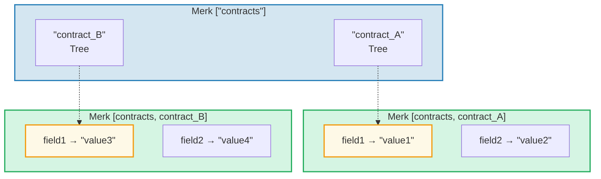
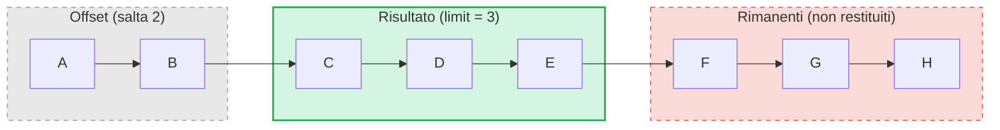

# Il sistema di query

## Struttura PathQuery

Le query di GroveDB utilizzano il tipo `PathQuery`, che combina un percorso (dove cercare) con una query (cosa selezionare):

```rust
pub struct PathQuery {
    pub path: Vec<Vec<u8>>,         // Percorso iniziale nel bosco
    pub query: SizedQuery,          // Cosa selezionare
}

pub struct SizedQuery {
    pub query: Query,               // I criteri di selezione
    pub limit: Option<u16>,         // Numero massimo di risultati
    pub offset: Option<u16>,        // Salta i primi N risultati
}
```

## Il tipo Query

```rust
pub struct Query {
    pub items: Vec<QueryItem>,              // Cosa selezionare
    pub default_subquery_branch: SubqueryBranch,
    pub conditional_subquery_branches: Option<IndexMap<QueryItem, SubqueryBranch>>,
    pub left_to_right: bool,                // Direzione dell'iterazione
    pub add_parent_tree_on_subquery: bool,  // Includi l'elemento albero genitore nei risultati (v2)
}
```

> **`add_parent_tree_on_subquery`** (v2): Quando `true`, l'elemento albero genitore (es. un CountTree o SumTree) viene incluso nei risultati della query insieme ai valori dei suoi figli. Cio consente di recuperare sia i valori aggregati che i singoli elementi in una singola query.

## QueryItem — Cosa selezionare

Ogni `QueryItem` specifica una chiave o un intervallo da selezionare:

```rust
pub enum QueryItem {
    Key(Vec<u8>),                           // Corrispondenza esatta della chiave
    Range(Range<Vec<u8>>),                  // Intervallo esclusivo [inizio..fine)
    RangeInclusive(RangeInclusive<Vec<u8>>),// Intervallo inclusivo [inizio..=fine]
    RangeFull(RangeFull),                   // Tutte le chiavi
    RangeFrom(RangeFrom<Vec<u8>>),          // [inizio..)
    RangeTo(RangeTo<Vec<u8>>),              // [..fine)
    RangeToInclusive(RangeToInclusive<Vec<u8>>), // [..=fine]
    RangeAfter(RangeFrom<Vec<u8>>),         // (inizio..) inizio esclusivo
    RangeAfterTo(Range<Vec<u8>>),           // (inizio..fine) esclusivi entrambi
    RangeAfterToInclusive(RangeInclusive<Vec<u8>>), // (inizio..=fine]
}
```

Esempi di query:

Albero Merk (ordinato): `alice  bob  carol  dave  eve  frank`

| Query | Selezione | Risultato |
|-------|-----------|--------|
| `Key("bob")` | alice **[bob]** carol dave eve frank | bob |
| `RangeInclusive("bob"..="dave")` | alice **[bob carol dave]** eve frank | bob, carol, dave |
| `RangeAfter("carol"..)` | alice bob carol **[dave eve frank]** | dave, eve, frank |
| `RangeFull`, limit=2 | **[alice bob]** carol dave eve frank *(fermato dal limite)* | alice, bob |
| `RangeFull`, limit=2, da-destra-a-sinistra | alice bob carol dave **[eve frank]** *(fermato dal limite)* | frank, eve |

## Sottoquery e rami condizionali

La vera potenza delle query di GroveDB sono le **sottoquery** (subquery) — quando una query trova un elemento Tree, la query puo automaticamente scendere in quel sotto-albero:



> **PathQuery:** `path: ["contracts"], query: RangeFull` con `default_subquery: Key("field1")`
>
> **Esecuzione:**
> 1. `RangeFull` su ["contracts"] → corrisponde a contract_A, contract_B
> 2. Entrambi sono elementi Tree → scendi con sottoquery `Key("field1")`
> 3. contract_A → "value1", contract_B → "value3"
>
> **Risultato:** `["value1", "value3"]`

Le **sottoquery condizionali** consentono di applicare sottoquery diverse in base a quale chiave e stata trovata:

```rust
conditional_subquery_branches: Some(indexmap! {
    QueryItem::Key(b"contract_A".to_vec()) => SubqueryBranch {
        subquery: Some(Query { items: vec![Key(b"field1".to_vec())] }),
        ..
    },
    QueryItem::Key(b"contract_B".to_vec()) => SubqueryBranch {
        subquery: Some(Query { items: vec![Key(b"field2".to_vec())] }),
        ..
    },
})
```

Questo otterrebbe `field1` da `contract_A` ma `field2` da `contract_B`.

## Query dimensionate — Limite e offset

Il wrapper `SizedQuery` aggiunge la paginazione:



> `SizedQuery { query: RangeFull, limit: Some(3), offset: Some(2) }` → Risultato: **[C, D, E]**

Quando combinato con `left_to_right: false`, l'iterazione e invertita:

```text
    SizedQuery {
        query: Query { items: [RangeFull], left_to_right: false, .. },
        limit: Some(3),
        offset: None
    }

    Risultato: [H, G, F]
```

## Fusione delle query

Piu PathQuery possono essere fuse in una singola query per efficienza. L'algoritmo di fusione trova i prefissi di percorso comuni e combina gli elementi di query:

```text
    Query A: path=["users"], query=Key("alice")
    Query B: path=["users"], query=Key("bob")

    Fusa:    path=["users"], query=items=[Key("alice"), Key("bob")]
```

---
