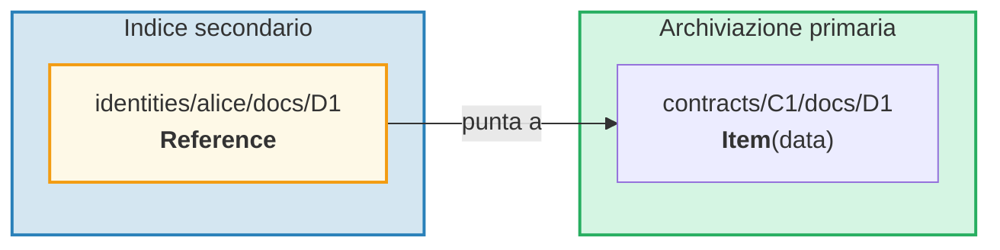
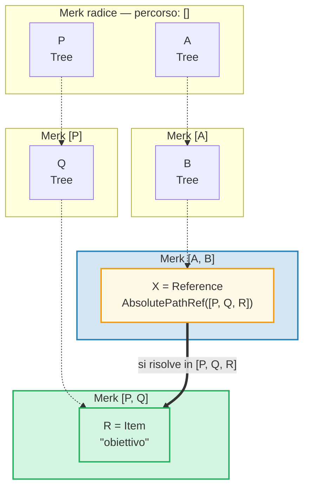
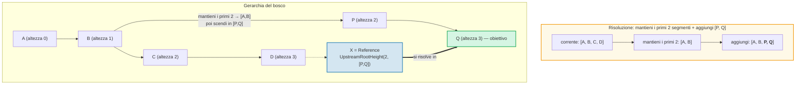
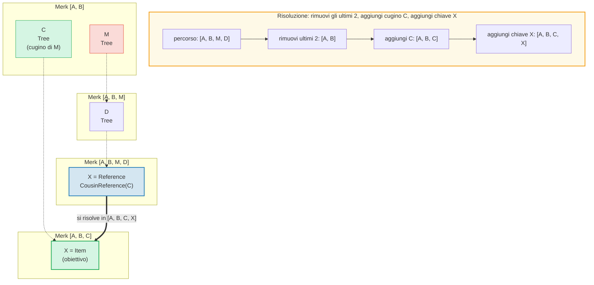
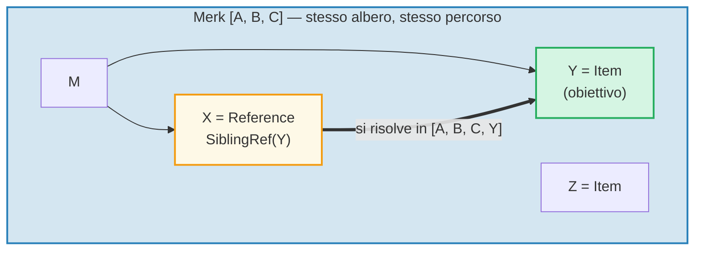
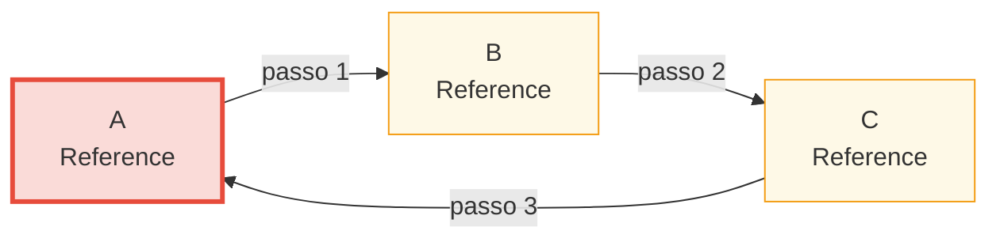

# Il sistema dei riferimenti

## Perche esistono i riferimenti

In un database gerarchico, spesso si ha bisogno degli stessi dati accessibili da percorsi multipli. Per esempio, i documenti potrebbero essere memorizzati sotto il loro contratto ma anche interrogabili per identita del proprietario. I **riferimenti** (Reference) sono la risposta di GroveDB — sono puntatori da una posizione a un'altra, simili ai link simbolici in un filesystem.



Proprieta chiave:
- I riferimenti sono **autenticati** — il value_hash del riferimento include sia il riferimento stesso che l'elemento referenziato
- I riferimenti possono essere **concatenati** — un riferimento puo puntare a un altro riferimento
- La rilevazione dei cicli previene loop infiniti
- Un limite configurabile di salti previene l'esaurimento delle risorse

## I sette tipi di riferimento

```rust
// grovedb-element/src/reference_path/mod.rs
pub enum ReferencePathType {
    AbsolutePathReference(Vec<Vec<u8>>),
    UpstreamRootHeightReference(u8, Vec<Vec<u8>>),
    UpstreamRootHeightWithParentPathAdditionReference(u8, Vec<Vec<u8>>),
    UpstreamFromElementHeightReference(u8, Vec<Vec<u8>>),
    CousinReference(Vec<u8>),
    RemovedCousinReference(Vec<Vec<u8>>),
    SiblingReference(Vec<u8>),
}
```

Esaminiamoli uno per uno con diagrammi.

### AbsolutePathReference

Il tipo piu semplice. Memorizza il percorso completo verso l'obiettivo:



> X memorizza il percorso assoluto completo `[P, Q, R]`. Indipendentemente da dove si trovi X, si risolve sempre nello stesso obiettivo.

### UpstreamRootHeightReference

Mantiene i primi N segmenti del percorso corrente, poi aggiunge un nuovo percorso:



### UpstreamRootHeightWithParentPathAdditionReference

Come UpstreamRootHeight, ma riaggiunge l'ultimo segmento del percorso corrente:

```text
    Riferimento al percorso [A, B, C, D, E] chiave=X
    UpstreamRootHeightWithParentPathAdditionReference(2, [P, Q])

    Percorso corrente:   [A, B, C, D, E]
    Mantieni i primi 2:  [A, B]
    Aggiungi [P, Q]:     [A, B, P, Q]
    Riaggiungil'ultimo:  [A, B, P, Q, E]   ← "E" dal percorso originale riaggiunto

    Utile per: indici dove la chiave del genitore deve essere preservata
```

### UpstreamFromElementHeightReference

Scarta gli ultimi N segmenti, poi aggiunge:

```text
    Riferimento al percorso [A, B, C, D] chiave=X
    UpstreamFromElementHeightReference(1, [P, Q])

    Percorso corrente:    [A, B, C, D]
    Scarta l'ultimo 1:   [A, B, C]
    Aggiungi [P, Q]:     [A, B, C, P, Q]
```

### CousinReference

Sostituisce solo il genitore immediato con una nuova chiave:



> Il "cugino" e un sotto-albero fratello del nonno del riferimento. Il riferimento naviga su di due livelli, poi scende nel sotto-albero cugino.

### RemovedCousinReference

Come CousinReference ma sostituisce il genitore con un percorso a piu segmenti:

```text
    Riferimento al percorso [A, B, C, D] chiave=X
    RemovedCousinReference([M, N])

    Percorso corrente: [A, B, C, D]
    Rimuovi genitore C: [A, B]
    Aggiungi [M, N]:    [A, B, M, N]
    Aggiungi chiave X:  [A, B, M, N, X]
```

### SiblingReference

Il riferimento relativo piu semplice — cambia solo la chiave all'interno dello stesso genitore:



> Il tipo di riferimento piu semplice. X e Y sono fratelli nello stesso albero Merk — la risoluzione cambia solo la chiave mantenendo lo stesso percorso.

## Inseguimento dei riferimenti e limite di salti

Quando GroveDB incontra un elemento Reference, deve **seguirlo** per trovare il valore effettivo. Poiche i riferimenti possono puntare ad altri riferimenti, questo implica un ciclo:

```rust
// grovedb/src/reference_path.rs
pub const MAX_REFERENCE_HOPS: usize = 10;

pub fn follow_reference(...) -> CostResult<ResolvedReference, Error> {
    let mut hops_left = MAX_REFERENCE_HOPS;
    let mut visited = HashSet::new();

    while hops_left > 0 {
        // Risolvi il percorso del riferimento in un percorso assoluto
        let target_path = current_ref.absolute_qualified_path(...);

        // Controlla i cicli
        if !visited.insert(target_path.clone()) {
            return Err(Error::CyclicReference);
        }

        // Recupera l'elemento all'obiettivo
        let element = Element::get(target_path);

        match element {
            Element::Reference(next_ref, ..) => {
                // Ancora un riferimento — continua a seguire
                current_ref = next_ref;
                hops_left -= 1;
            }
            other => {
                // Trovato l'elemento effettivo!
                return Ok(ResolvedReference { element: other, ... });
            }
        }
    }

    Err(Error::ReferenceLimit)  // Superati i 10 salti
}
```

## Rilevamento dei cicli

Il `visited` HashSet traccia tutti i percorsi gia visitati. Se incontriamo un percorso gia visitato, abbiamo un ciclo:



> **Traccia del rilevamento cicli:**
>
> | Passo | Segui | insieme visited | Risultato |
> |------|--------|-------------|--------|
> | 1 | Parti da A | { A } | A e Ref → segui |
> | 2 | A → B | { A, B } | B e Ref → segui |
> | 3 | B → C | { A, B, C } | C e Ref → segui |
> | 4 | C → A | A gia nel visited! | **Error::CyclicRef** |
>
> Senza il rilevamento dei cicli, questo girerebbe all'infinito. `MAX_REFERENCE_HOPS = 10` limita inoltre la profondita di attraversamento per catene lunghe.

## Riferimenti in Merk — Hash dei valori combinati

Quando un Reference viene memorizzato in un albero Merk, il suo `value_hash` deve autenticare sia la struttura del riferimento che i dati referenziati:

```rust
// merk/src/tree/kv.rs
pub fn update_hashes_using_reference_value_hash(
    mut self,
    reference_value_hash: CryptoHash,
) -> CostContext<Self> {
    // Calcola l'hash dei byte del proprio elemento riferimento
    let actual_value_hash = value_hash(self.value_as_slice());

    // Combina: H(byte_riferimento) ⊕ H(dati_referenziati)
    let combined = combine_hash(&actual_value_hash, &reference_value_hash);

    self.value_hash = combined;
    self.hash = kv_digest_to_kv_hash(self.key(), self.value_hash());
    // ...
}
```

Cio significa che modificare il riferimento stesso O i dati a cui punta cambiera l'hash radice — entrambi sono legati crittograficamente.

---
