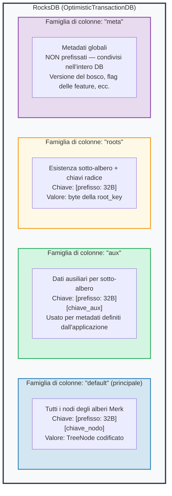
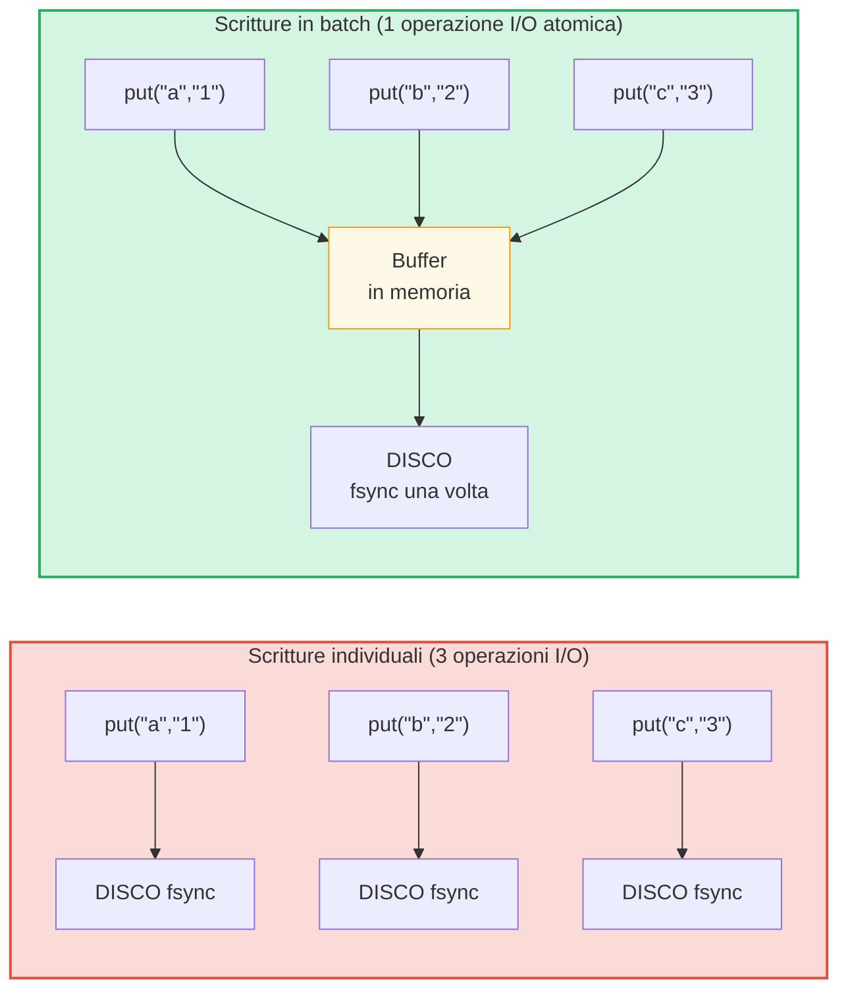

# Il livello di archiviazione

## RocksDB con OptimisticTransactionDB

GroveDB utilizza **RocksDB** come backend di archiviazione, specificamente la variante `OptimisticTransactionDB` che supporta le transazioni:

```rust
// storage/src/rocksdb_storage/storage.rs
pub(crate) type Db = OptimisticTransactionDB;
pub(crate) type Tx<'db> = Transaction<'db, Db>;

pub struct RocksDbStorage {
    db: OptimisticTransactionDB,
}
```

Le **transazioni ottimistiche** funzionano assumendo che non ci saranno conflitti. Se due transazioni modificano gli stessi dati, la seconda a fare il commit fallira e potra essere ritentata. Questo e piu efficiente del locking pessimistico per carichi di lavoro dove i conflitti sono rari.

Le opzioni di RocksDB sono ottimizzate per il carico di lavoro di GroveDB:

```rust
lazy_static! {
    static ref DEFAULT_OPTS: rocksdb::Options = {
        let mut opts = rocksdb::Options::default();
        opts.create_if_missing(true);
        opts.increase_parallelism(num_cpus::get() as i32);
        opts.set_allow_mmap_writes(true);
        opts.set_allow_mmap_reads(true);
        opts.create_missing_column_families(true);
        opts.set_atomic_flush(true);
        opts
    };
}
```

## Quattro famiglie di colonne

Le famiglie di colonne (column families) di RocksDB agiscono come namespace chiave-valore separati all'interno di un singolo database. GroveDB ne utilizza quattro:



> **Esempio:** La chiave `[ab3fc2...][6e616d65]` nella CF "default" mappa a `TreeNode{key:"name", val:"Al"}`, dove `ab3fc2...` e `Blake3(percorso)` e `6e616d65` e `"name"` in byte.

```rust
pub(crate) const AUX_CF_NAME: &str = "aux";
pub(crate) const ROOTS_CF_NAME: &str = "roots";
pub(crate) const META_CF_NAME: &str = "meta";
// I dati principali usano la famiglia di colonne predefinita
```

## Contesti di archiviazione con prefisso

Ogni sotto-albero ottiene il proprio **contesto di archiviazione con prefisso** — un wrapper che antepone automaticamente il prefisso Blake3 di 32 byte a tutte le chiavi:

```text
    Percorso del sotto-albero: ["identities", "alice"]
    Prefisso: Blake3(percorso) = [0xab, 0x3f, 0xc2, ...]  (32 byte)

    Quando il sotto-albero memorizza la chiave "name" con valore "Alice":

    Chiave RocksDB:   [0xab 0x3f 0xc2 ... (32 byte) | 0x6e 0x61 0x6d 0x65]
                       \_________prefisso________/     \_____"name"_____/

    Valore RocksDB:  [TreeNode codificato con valore "Alice"]
```

I tipi di contesto:

```text
    Senza transazione:
    PrefixedRocksDbImmediateStorageContext
    └── Letture/scritture dirette nel DB con prefisso

    Con transazione:
    PrefixedRocksDbTransactionContext
    └── Letture/scritture attraverso una Transaction con prefisso
```

Entrambi implementano il trait `StorageContext`:

```rust
pub trait StorageContext<'db> {
    fn get(&self, key: &[u8]) -> CostResult<Option<Vec<u8>>, Error>;
    fn get_aux(&self, key: &[u8]) -> CostResult<Option<Vec<u8>>, Error>;
    fn get_root(&self, key: &[u8]) -> CostResult<Option<Vec<u8>>, Error>;
    fn get_meta(&self, key: &[u8]) -> CostResult<Option<Vec<u8>>, Error>;
    fn put(&self, key: &[u8], value: &[u8], ...) -> CostResult<(), Error>;
    fn put_aux(&self, key: &[u8], value: &[u8], ...) -> CostResult<(), Error>;
    fn put_root(&self, key: &[u8], value: &[u8], ...) -> CostResult<(), Error>;
    fn put_meta(&self, key: &[u8], value: &[u8], ...) -> CostResult<(), Error>;
    fn delete(&self, key: &[u8], ...) -> CostResult<(), Error>;
    // ...
}
```

## Batch di scrittura e modello transazionale

Per le prestazioni, GroveDB accumula le scritture in batch:



> 3 sincronizzazioni disco vs 1 sincronizzazione disco = circa 3 volte piu veloce. Le scritture in batch sono anche **atomiche** (tutto-o-niente).

Il `StorageBatch` accumula le operazioni che vengono scaricate insieme:

```rust
pub struct StorageBatch {
    operations: RefCell<Vec<AbstractBatchOperation>>,
}
```

## Il pattern critico commit_local()

Quando si usano le transazioni, c'e un pattern critico che deve essere seguito. Le scritture all'interno di una transazione sono bufferizzate — non sono visibili fino al commit:

```rust
// Pattern CORRETTO:
{
    let tx = db.start_transaction();
    let storage_ctx = db.get_transactional_storage_context(path, &tx);

    storage_ctx.put(key, value);  // Scrive nel buffer della transazione

    drop(storage_ctx);            // Rilascia il prestito su tx
    tx.commit_local();            // Scarica la transazione nel DB
}

// SCORRETTO — i dati vengono persi:
{
    let tx = db.start_transaction();
    let storage_ctx = db.get_transactional_storage_context(path, &tx);

    storage_ctx.put(key, value);  // Scrive nel buffer della transazione

    // tx viene rilasciato qui senza commit_local()!
    // Tutte le scritture vengono ANNULLATE!
}
```

Questo e particolarmente importante perche lo `storage_ctx` prende in prestito la transazione. Bisogna fare `drop(storage_ctx)` prima di poter chiamare `tx.commit_local()`.

---
