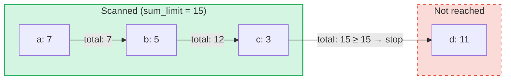

# 集約サムクエリ

## 概要

集約サムクエリ（Aggregate Sum Queries）は、GroveDB の **SumTree** 向けに設計された特殊なクエリタイプです。
通常のクエリがキーや範囲でエレメントを取得するのに対し、集約サムクエリはエレメントを走査しながら
サム値を累積し、**サムリミット**に達するまで処理を続けます。

これは以下のような問いに有用です:
- 「累計が 1000 を超えるまでのトランザクションを取得したい」
- 「このツリーで最初の 500 ユニット分の値に寄与するアイテムはどれか？」
- 「予算 N までのサムアイテムを収集したい」

## 基本概念

### 通常のクエリとの違い

| 特徴 | PathQuery | AggregateSumPathQuery |
|------|-----------|----------------------|
| **対象** | 任意のエレメント型 | SumItem / ItemWithSumItem エレメント |
| **停止条件** | リミット（件数）または範囲の終端 | サムリミット（累計値）**および/または** アイテムリミット |
| **戻り値** | エレメントまたはキー | キーとサム値のペア |
| **サブクエリ** | 対応（サブツリーへの下降） | 非対応（単一ツリーレベルのみ） |
| **参照** | GroveDB 層で解決 | オプションで追跡またはスキップ |

### AggregateSumQuery の構造

```rust
pub struct AggregateSumQuery {
    pub items: Vec<QueryItem>,              // Keys or ranges to scan
    pub left_to_right: bool,                // Iteration direction
    pub sum_limit: u64,                     // Stop when running total reaches this
    pub limit_of_items_to_check: Option<u16>, // Max number of matching items to return
}
```

このクエリは `AggregateSumPathQuery` でラップされ、グローブ内のどこを検索するかを指定します:

```rust
pub struct AggregateSumPathQuery {
    pub path: Vec<Vec<u8>>,                 // Path to the SumTree
    pub aggregate_sum_query: AggregateSumQuery,
}
```

### サムリミット --- 累計値

`sum_limit` は中心的な概念です。エレメントが走査されると、そのサム値が累積されます。
累計値がサムリミット以上になると、走査が停止します:



> **結果:** `[(a, 7), (b, 5), (c, 3)]` --- 7 + 5 + 3 = 15 >= sum_limit のため走査が停止

負のサム値もサポートされています。負の値は残りの予算を増やします:

```text
sum_limit = 12, elements: a(10), b(-3), c(5)

a: total = 10, remaining = 2
b: total =  7, remaining = 5  ← negative value gave us more room
c: total = 12, remaining = 0  ← stop

Result: [(a, 10), (b, -3), (c, 5)]
```

## クエリオプション

`AggregateSumQueryOptions` 構造体でクエリの動作を制御します:

```rust
pub struct AggregateSumQueryOptions {
    pub allow_cache: bool,                              // Use cached reads (default: true)
    pub error_if_intermediate_path_tree_not_present: bool, // Error on missing path (default: true)
    pub error_if_non_sum_item_found: bool,              // Error on non-sum elements (default: true)
    pub ignore_references: bool,                        // Skip references (default: false)
}
```

### 非サムエレメントの処理

SumTree にはさまざまなエレメント型が混在している場合があります: `SumItem`、`Item`、`Reference`、`ItemWithSumItem`
などです。デフォルトでは、非サム・非参照のエレメントに遭遇するとエラーが発生します。

`error_if_non_sum_item_found` を `false` に設定すると、非サムエレメントはユーザーリミットのスロットを
消費せずに**静かにスキップ**されます:

```text
Tree contents: a(SumItem=7), b(Item), c(SumItem=3)
Query: sum_limit=100, limit_of_items_to_check=2, error_if_non_sum_item_found=false

Scan: a(7) → returned, limit=1
      b(Item) → skipped, limit still 1
      c(3) → returned, limit=0 → stop

Result: [(a, 7), (c, 3)]
```

注意: `ItemWithSumItem` エレメントはサム値を持つため、**常に**処理されます（スキップされることはありません）。

### 参照の処理

デフォルトでは、`Reference` エレメントは**追跡**されます。クエリは参照チェーンを
（最大 3 つの中間ホップまで）解決し、対象エレメントのサム値を取得します:

```text
Tree contents: a(SumItem=7), ref_b(Reference → a)
Query: sum_limit=100

ref_b is followed → resolves to a(SumItem=7)

Result: [(a, 7), (ref_b, 7)]
```

`ignore_references` を `true` にすると、参照はリミットスロットを消費せずに静かにスキップされます。
非サムエレメントのスキップと同様の動作です。

3 つの中間ホップを超える参照チェーンは `ReferenceLimit` エラーを発生させます。

## 結果の型

クエリは `AggregateSumQueryResult` を返します:

```rust
pub struct AggregateSumQueryResult {
    pub results: Vec<(Vec<u8>, i64)>,       // Key-sum value pairs
    pub hard_limit_reached: bool,           // True if system limit truncated results
}
```

`hard_limit_reached` フラグは、クエリが自然に完了する前にシステムのハードスキャンリミット
（デフォルト: 1024 エレメント）に達したかどうかを示します。`true` の場合、返された結果以外にも
さらに結果が存在する可能性があります。

## 3 つのリミットシステム

集約サムクエリには **3 つ**の停止条件があります:

| リミット | 設定元 | 計測対象 | 到達時の動作 |
|----------|--------|----------|-------------|
| **sum_limit** | ユーザー（クエリ） | サム値の累計 | 走査を停止 |
| **limit_of_items_to_check** | ユーザー（クエリ） | 返されたマッチングアイテム数 | 走査を停止 |
| **ハードスキャンリミット** | システム（GroveVersion、デフォルト 1024） | 走査された全エレメント数（スキップ分を含む） | 走査を停止、`hard_limit_reached` を設定 |

ハードスキャンリミットは、ユーザーリミットが設定されていない場合に無制限の走査を防止します。
スキップされたエレメント（`error_if_non_sum_item_found=false` の場合の非サムアイテム、
または `ignore_references=true` の場合の参照）はハードスキャンリミットにはカウントされますが、
ユーザーの `limit_of_items_to_check` にはカウント**されません**。

## API の使い方

### シンプルなクエリ

```rust
use grovedb::AggregateSumPathQuery;
use grovedb_merk::proofs::query::AggregateSumQuery;

// "Give me items from this SumTree until the total reaches 1000"
let query = AggregateSumQuery::new(1000, None);
let path_query = AggregateSumPathQuery {
    path: vec![b"my_tree".to_vec()],
    aggregate_sum_query: query,
};

let result = db.query_aggregate_sums(
    &path_query,
    true,   // allow_cache
    true,   // error_if_intermediate_path_tree_not_present
    None,   // transaction
    grove_version,
).unwrap().expect("query failed");

for (key, sum_value) in &result.results {
    println!("{}: {}", String::from_utf8_lossy(key), sum_value);
}
```

### オプション付きクエリ

```rust
use grovedb::{AggregateSumPathQuery, AggregateSumQueryOptions};
use grovedb_merk::proofs::query::AggregateSumQuery;

// Skip non-sum items and ignore references
let query = AggregateSumQuery::new(1000, Some(50));
let path_query = AggregateSumPathQuery {
    path: vec![b"mixed_tree".to_vec()],
    aggregate_sum_query: query,
};

let result = db.query_aggregate_sums_with_options(
    &path_query,
    AggregateSumQueryOptions {
        error_if_non_sum_item_found: false,  // skip Items, Trees, etc.
        ignore_references: true,              // skip References
        ..AggregateSumQueryOptions::default()
    },
    None,
    grove_version,
).unwrap().expect("query failed");

if result.hard_limit_reached {
    println!("Warning: results may be incomplete (hard limit reached)");
}
```

### キーベースのクエリ

範囲をスキャンする代わりに、特定のキーを指定してクエリできます:

```rust
// Check the sum value of specific keys
let query = AggregateSumQuery::new_with_keys(
    vec![b"alice".to_vec(), b"bob".to_vec(), b"carol".to_vec()],
    u64::MAX,  // no sum limit
    None,      // no item limit
);
```

### 降順クエリ

最大のキーから最小のキーに向かって走査します:

```rust
let query = AggregateSumQuery::new_descending(500, Some(10));
// Or: query.left_to_right = false;
```

## コンストラクタリファレンス

| コンストラクタ | 説明 |
|---------------|------|
| `new(sum_limit, limit)` | 全範囲、昇順 |
| `new_descending(sum_limit, limit)` | 全範囲、降順 |
| `new_single_key(key, sum_limit)` | 単一キーの検索 |
| `new_with_keys(keys, sum_limit, limit)` | 複数の特定キー |
| `new_with_keys_reversed(keys, sum_limit, limit)` | 複数キー、降順 |
| `new_single_query_item(item, sum_limit, limit)` | 単一の QueryItem（キーまたは範囲） |
| `new_with_query_items(items, sum_limit, limit)` | 複数の QueryItem |

---
