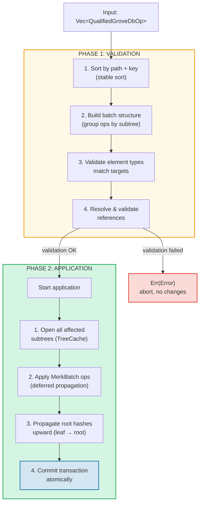
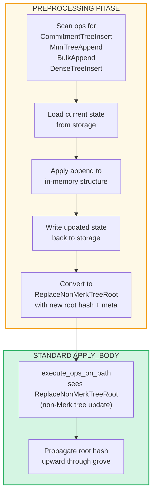

# グローブレベルのバッチ操作

## GroveOp バリアント

GroveDB レベルでは、操作は `GroveOp` として表現されます：

```rust
pub enum GroveOp {
    // User-facing operations:
    InsertOnly { element: Element },
    InsertOrReplace { element: Element },
    Replace { element: Element },
    Patch { element: Element, change_in_bytes: i32 },
    RefreshReference { reference_path_type, max_reference_hop, flags, trust_refresh_reference },
    Delete,
    DeleteTree(TreeType),                          // Parameterized by tree type

    // Non-Merk tree append operations (user-facing):
    CommitmentTreeInsert { cmx: [u8; 32], payload: Vec<u8> },
    MmrTreeAppend { value: Vec<u8> },
    BulkAppend { value: Vec<u8> },
    DenseTreeInsert { value: Vec<u8> },

    // Internal operations (created by preprocessing/propagation, rejected by from_ops):
    ReplaceTreeRootKey { hash, root_key, aggregate_data },
    InsertTreeWithRootHash { hash, root_key, flags, aggregate_data },
    ReplaceNonMerkTreeRoot { hash: [u8; 32], meta: NonMerkTreeMeta },
    InsertNonMerkTree { hash, root_key, flags, aggregate_data, meta: NonMerkTreeMeta },
}
```

**NonMerkTreeMeta** はバッチ処理を通じてツリー型固有の状態を運びます：

```rust
pub enum NonMerkTreeMeta {
    CommitmentTree { total_count: u64, chunk_power: u8 },
    MmrTree { mmr_size: u64 },
    BulkAppendTree { total_count: u64, chunk_power: u8 },
    DenseTree { count: u16, height: u8 },
}
```

各操作はパスを含む `QualifiedGroveDbOp` でラップされます：

```rust
pub struct QualifiedGroveDbOp {
    pub path: KeyInfoPath,           // Where in the grove
    pub key: Option<KeyInfo>,        // Which key (None for append-only tree ops)
    pub op: GroveOp,                 // What to do
}
```

> **注意:** `key` フィールドは `Option<KeyInfo>` です — 追記専用ツリー操作（`CommitmentTreeInsert`、`MmrTreeAppend`、`BulkAppend`、`DenseTreeInsert`）では `None` であり、代わりにツリーキーは `path` の最後のセグメントになります。

## 2フェーズ処理

バッチ操作は2つのフェーズで処理されます：



## TreeCache と遅延伝播

バッチ適用中、GroveDB はサブツリー内のすべての操作が完了するまでルートハッシュの伝播を遅延させるために **TreeCache** を使用します：

```mermaid
graph TD
    subgraph without["WITHOUT TreeCache (naive)"]
        w1["Op 1: Insert A in X"]
        w1p["Propagate X → parent → root"]
        w2["Op 2: Insert B in X"]
        w2p["Propagate X → parent → root"]
        w3["Op 3: Insert C in X"]
        w3p["Propagate X → parent → root"]
        w1 --> w1p --> w2 --> w2p --> w3 --> w3p
    end

    subgraph with_tc["WITH TreeCache (deferred)"]
        t1["Op 1: Insert A in X<br/>→ buffered"]
        t2["Op 2: Insert B in X<br/>→ buffered"]
        t3["Op 3: Insert C in X<br/>→ buffered"]
        tp["Propagate X → parent → root<br/>(walk up ONCE)"]
        t1 --> t2 --> t3 --> tp
    end

    style without fill:#fadbd8,stroke:#e74c3c,stroke-width:2px
    style with_tc fill:#d5f5e3,stroke:#27ae60,stroke-width:2px
    style w1p fill:#fadbd8,stroke:#e74c3c
    style w2p fill:#fadbd8,stroke:#e74c3c
    style w3p fill:#fadbd8,stroke:#e74c3c
    style tp fill:#d5f5e3,stroke:#27ae60,stroke-width:2px
```



> **3回の伝播 × O(depth)** vs **1回の伝播 × O(depth)** = このサブツリーで3倍高速。

これは多くの操作が同じサブツリーをターゲットとする場合に大幅な最適化になります。

## アトミックなクロスサブツリー操作

GroveDB バッチの重要な特性は**サブツリーをまたぐアトミック性**です。単一のバッチが複数のサブツリーのエレメントを変更でき、すべての変更がコミットされるかまったくされないかのいずれかです：

```text
    Batch:
    1. Delete ["balances", "alice"]       (remove balance)
    2. Insert ["balances", "bob"] = 100   (add balance)
    3. Update ["identities", "bob", "rev"] = 2  (update revision)

    Three subtrees affected: balances, identities, identities/bob

    If ANY operation fails → ALL operations are rolled back
    If ALL succeed → ALL are committed atomically
```

バッチプロセッサはこれを以下のように処理します：
1. 影響を受けるすべてのパスを収集
2. 必要なすべてのサブツリーを開く
3. すべての操作を適用
4. 依存関係の順序ですべてのルートハッシュを伝播
5. トランザクション全体をコミット

## 非 Merk ツリーのバッチ前処理

CommitmentTree、MmrTree、BulkAppendTree、DenseAppendOnlyFixedSizeTree の操作は Merk 外のストレージコンテキストへのアクセスが必要ですが、標準の `execute_ops_on_path` メソッド（Merk へのアクセスのみ）では利用できません。これらの操作は**前処理パターン**を使用します：メインの `apply_body` フェーズの前に、エントリポイントが非 Merk ツリー操作をスキャンし、標準的な内部操作に変換します。

```rust
pub enum GroveOp {
    // ... standard ops ...

    // Non-Merk tree operations (user-facing):
    CommitmentTreeInsert { cmx: [u8; 32], payload: Vec<u8> },
    MmrTreeAppend { value: Vec<u8> },
    BulkAppend { value: Vec<u8> },
    DenseTreeInsert { value: Vec<u8> },

    // Internal ops (produced by preprocessing):
    ReplaceNonMerkTreeRoot { hash: [u8; 32], meta: NonMerkTreeMeta },
}
```



**なぜ前処理が必要か？** `execute_ops_on_path` 関数は単一の Merk サブツリーで動作し、`self.db` やより広いストレージコンテキストへのアクセスがありません。エントリポイント（`apply_batch_with_element_flags_update`、`apply_partial_batch_with_element_flags_update`）での前処理はデータベースへの完全なアクセスがあるため、データの読み書きを行い、標準バッチ機構にシンプルな `ReplaceNonMerkTreeRoot` を引き渡すことができます。

各前処理メソッドは同じパターンに従います：
1. **`preprocess_commitment_tree_ops`** — データストレージからフロンティアと BulkAppendTree を読み込み、両方に追加し、書き戻し、更新された結合ルートと `CommitmentTree { total_count, chunk_power }` メタで `ReplaceNonMerkTreeRoot` に変換
2. **`preprocess_mmr_tree_ops`** — データストレージから MMR を読み込み、値を追加し、書き戻し、更新された MMR ルートと `MmrTree { mmr_size }` メタで `ReplaceNonMerkTreeRoot` に変換
3. **`preprocess_bulk_append_ops`** — データストレージから BulkAppendTree を読み込み、値を追加（チャンク圧縮をトリガーする可能性あり）し、書き戻し、更新されたステートルートと `BulkAppendTree { total_count, chunk_power }` メタで `ReplaceNonMerkTreeRoot` に変換
4. **`preprocess_dense_tree_ops`** — データストレージから DenseFixedSizedMerkleTree を読み込み、値を順次挿入し、ルートハッシュを再計算し、書き戻し、更新されたルートハッシュと `DenseTree { count, height }` メタで `ReplaceNonMerkTreeRoot` に変換

`ReplaceNonMerkTreeRoot` 操作は新しいルートハッシュと `NonMerkTreeMeta` 列挙型を運び、処理後にエレメントを完全に再構築できるようにします。

---
