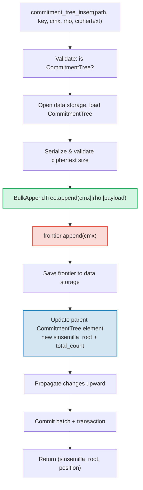

# CommitmentTree — Sinsemilla コミットメントアンカー

**CommitmentTree** は GroveDB の認証ストレージとゼロ知識証明（zero-knowledge proof）システムを橋渡しする構造です。効率的なチャンク圧縮データストレージのための **BulkAppendTree**（第14章）と、ZK 互換アンカーのための **Sinsemilla フロンティア（frontier）** をデータ名前空間で組み合わせます。MmrTree や BulkAppendTree と同様に、**子 Merk を持ちません** — 結合ルートハッシュが Merk の子ハッシュとして流れます。BulkAppendTree エントリと Sinsemilla フロンティアは共に**データ名前空間**に格納されます。

この章では、Sinsemilla ハッシュ関数とそのゼロ知識回路における重要性、フロンティアデータ構造とそのコンパクトなシリアライゼーション、デュアル名前空間ストレージアーキテクチャ、GroveDB 操作、バッチ前処理、クライアントサイドの証人（witness）生成、そして証明の仕組みについて解説します。

## なぜ ZK フレンドリーなツリーが必要か？

GroveDB の標準ツリーは Blake3 ハッシュを使用します。Blake3 はソフトウェアでは高速ですが、**ゼロ知識回路内では高コスト**です。支出者が「コミットメントツリーの位置 P にノートがあることを知っている」ことを P を明かさずに証明する必要がある場合、ZK 回路内でマークルハッシュ関数を32回（ツリーレベルごとに1回）評価する必要があります。

Sinsemilla（Zcash Orchard プロトコルの ZIP-244 で仕様化）はまさにこのユースケースのために設計されており、Halo 2 証明システムが使用する Pasta 曲線サイクルの一方である Pallas 楕円曲線上での**効率的な回路内ハッシュ**を提供します。

| 特性 | Blake3 | Sinsemilla |
|----------|--------|------------|
| **回路コスト** | ハッシュあたり約25,000制約 | ハッシュあたり約800制約 |
| **ソフトウェア速度** | 非常に高速（約2 GB/s） | 低速（約10,000ハッシュ/s） |
| **代数的構造** | なし（ビット単位） | Pallas 曲線点演算 |
| **主な目的** | 汎用ハッシュ、マークル木 | 回路内マークル証明 |
| **使用先** | GroveDB Merk ツリー、MMR、Bulk | Orchard シールドプロトコル |
| **出力サイズ** | 32バイト | 32バイト（Pallas 体元） |

CommitmentTree は ZK 回路が推論するマークル木に Sinsemilla を使用し、その上の GroveDB Merk 階層には Blake3 を使用します。ツリーに挿入されるアイテムはデータ名前空間の BulkAppendTree を通じて格納され（チャンク圧縮、位置による取得可能）、同時に Sinsemilla フロンティアに追加されます（ZK 証明可能なアンカーを生成）。

## データ名前空間アーキテクチャ

CommitmentTree は同じサブツリーパスの**データ名前空間にすべてのデータを格納**します。MmrTree や BulkAppendTree と同様に、**子 Merk を持ちません**（`root_key` フィールドなし — 型固有のルートが Merk の子ハッシュとして流れます）。BulkAppendTree エントリと Sinsemilla フロンティアは異なるキープレフィックスを使用してデータ名前空間で共存します：

```text
┌──────────────────────────────────────────────────────────────┐
│                       CommitmentTree                          │
│                                                               │
│  ┌─────────────────────────────────────────────────────────┐  │
│  │  Data Namespace                                         │  │
│  │                                                         │  │
│  │  BulkAppendTree storage (Chapter 14):                   │  │
│  │    Buffer entries → chunk blobs → chunk MMR             │  │
│  │    value = cmx (32) || rho (32) || ciphertext (216)     │  │
│  │                                                         │  │
│  │  Sinsemilla Frontier (~1KB):                            │  │
│  │    key: b"__ct_data__" (COMMITMENT_TREE_DATA_KEY)       │  │
│  │    Depth-32 incremental Merkle tree                     │  │
│  │    Stores only the rightmost path (leaf + ommers)       │  │
│  │    O(1) append, O(1) root computation                   │  │
│  │    Produces Orchard-compatible Anchor for ZK proofs     │  │
│  └─────────────────────────────────────────────────────────┘  │
│                                                               │
│  sinsemilla_root embedded in Element bytes                    │
│    → flows through Merk value_hash → GroveDB state root      │
└──────────────────────────────────────────────────────────────┘
```

**なぜ2つの構造が必要か？** BulkAppendTree は数百万の暗号化ノートに対する効率的でチャンク圧縮されたストレージと取得を提供します。Sinsemilla フロンティアは Halo 2 回路内で証明できる ZK 互換アンカーを提供します。両方はすべての追加操作で同期的に更新されます。

他の非標準ツリー型との比較：

| | CommitmentTree | MmrTree | BulkAppendTree |
|---|---|---|---|
| **子 Merk** | なし | なし | なし |
| **データ名前空間** | BulkAppendTree エントリ + フロンティア | MMR ノード | バッファ + チャンク + MMR |
| **Aux 名前空間** | — | — | — |
| **アイテムクエリ** | V1 証明経由 | V1 証明経由 | V1 証明経由 |
| **ハッシュ関数** | Sinsemilla + Blake3 | Blake3 | Blake3 |

## Sinsemilla フロンティア

フロンティアは `incrementalmerkletree` クレートの `Frontier<MerkleHashOrchard, 32>` 型で実装された深さ32のインクリメンタルマークル木です。2^32 の可能なリーフすべてを格納する代わりに、**次のリーフを追加し現在のルートを計算する**ために必要な情報のみを格納します：最右端のリーフとそのオマー（ルート計算に必要な兄弟ハッシュ）。

```text
                         root (level 32)
                        /               \
                      ...               ...
                     /                     \
                  (level 2)             (level 2)
                  /     \               /     \
              (level 1) (level 1)   (level 1)  ?
              /    \    /    \      /    \
             L0    L1  L2    L3   L4    ?     ← frontier stores L4
                                              + ommers at levels
                                              where left sibling exists
```

フロンティアが格納するもの：
- **leaf**：最後に追加された値（Pallas 体元）
- **ommers（オマー）**：フロンティアパスが右に向かう各レベルの左兄弟ハッシュ（深さ32のツリーでは最大32個のオマー）
- **position**：リーフの0始まりの位置

主要な特性：
- **O(1) 追加**：新しいリーフを挿入し、オマーを更新し、ルートを再計算
- **O(1) ルート**：格納されたオマーをリーフからルートまで走査
- **約1KBの一定サイズ**：追加されたリーフの数に関係なく
- **決定的**：同じ追加シーケンスを持つ2つのフロンティアは同じルートを生成

`EMPTY_SINSEMILLA_ROOT` 定数は空の深さ32ツリーのルートで、`MerkleHashOrchard::empty_root(Level::from(32)).to_bytes()` として事前計算されます：

```text
0xae2935f1dfd8a24aed7c70df7de3a668eb7a49b1319880dde2bbd9031ae5d82f
```

## 追加の仕組み — オマーカスケード

位置 N に新しいコミットメントが追加される場合、更新が必要なオマーの数は `trailing_ones(N)` — N の2進表現における末尾の1ビットの数に等しくなります。これは MMR のマージカスケード（§13.4）と同じパターンですが、ピークではなくオマーに対して操作します。

**実例 — 4つのリーフの追加：**

```text
Position 0 (binary: 0, trailing_ones: 0):
  frontier = { leaf: L0, ommers: [], position: 0 }
  Sinsemilla hashes: 32 (root computation) + 0 (no ommer merges) = 32

Position 1 (binary: 1, trailing_ones: 0 of PREVIOUS position 0):
  Before: position 0 has trailing_ones = 0
  frontier = { leaf: L1, ommers: [H(L0,L1) at level 1], position: 1 }
  Sinsemilla hashes: 32 + 0 = 32

Position 2 (binary: 10, trailing_ones: 0 of PREVIOUS position 1):
  Before: position 1 has trailing_ones = 1
  frontier = { leaf: L2, ommers: [level1_hash], position: 2 }
  Sinsemilla hashes: 32 + 1 = 33

Position 3 (binary: 11, trailing_ones: 0 of PREVIOUS position 2):
  Before: position 2 has trailing_ones = 0
  frontier = { leaf: L3, ommers: [level1_hash, level2_hash], position: 3 }
  Sinsemilla hashes: 32 + 0 = 32
```

追加あたりの**合計 Sinsemilla ハッシュ数**は：

```text
32 (root computation always traverses all 32 levels)
+ trailing_ones(current_position)  (ommer cascade)
```

平均して `trailing_ones` は約1（幾何分布）なので、平均コストは**追加あたり約33 Sinsemilla ハッシュ**です。最悪ケース（位置 2^32 - 1、すべてのビットが1）は**64ハッシュ**です。

## フロンティアのシリアライゼーション形式

フロンティアはキー `b"__ct_data__"` でデータストレージに格納されます。ワイヤ形式は：

```text
┌──────────────────────────────────────────────────────────────────┐
│ has_frontier: u8                                                  │
│   0x00 → empty tree (no more fields)                             │
│   0x01 → non-empty (fields follow)                               │
├──────────────────────────────────────────────────────────────────┤
│ position: u64 BE (8 bytes)      — 0-indexed leaf position        │
├──────────────────────────────────────────────────────────────────┤
│ leaf: [u8; 32]                  — Pallas field element bytes     │
├──────────────────────────────────────────────────────────────────┤
│ ommer_count: u8                 — number of ommers (0..=32)      │
├──────────────────────────────────────────────────────────────────┤
│ ommers: [ommer_count × 32 bytes] — Pallas field elements        │
└──────────────────────────────────────────────────────────────────┘
```

**サイズ分析：**

| 状態 | サイズ | 内訳 |
|-------|------|-----------|
| 空 | 1バイト | `0x00` フラグのみ |
| 1リーフ、0オマー | 42バイト | 1 + 8 + 32 + 1 |
| 約16オマー（平均） | 554バイト | 1 + 8 + 32 + 1 + 16×32 |
| 32オマー（最大） | 1,066バイト | 1 + 8 + 32 + 1 + 32×32 |

フロンティアサイズは、何百万のコミットメントが追加されても約1.1KBに制限されます。これにより、読み込み→変更→保存サイクルは非常に安価になります（読み取り1シーク、書き込み1シーク）。

## エレメント表現

```rust
CommitmentTree(
    u64,                  // total_count: number of appended items
    u8,                   // chunk_power: dense tree height for BulkAppendTree buffer
    Option<ElementFlags>, // flags: optional metadata
)
```

`chunk_power` パラメータは BulkAppendTree バッファの密ツリー高さを制御します。`chunk_power` は1..=16の範囲でなければなりません（§14.1 および §16 を参照）。

**型識別子：**

| 識別子 | 値 |
|---|---|
| Element 判別子 | 11 |
| `TreeType` | `CommitmentTree = 7` |
| `ElementType` | 11 |
| `COMMITMENT_TREE_COST_SIZE` | 12バイト（8 total_count + 1 chunk_power + 1 判別子 + 2 オーバーヘッド） |

Sinsemilla ルートはエレメントには格納されません。`insert_subtree` メカニズムを通じて Merk の子ハッシュとして流れます。親 Merk が `combined_value_hash` を計算する際、Sinsemilla 由来のルートが子ハッシュとして含まれます：

```text
combined_value_hash = blake3(value_hash || child_hash)
                                           ↑ sinsemilla/BulkAppendTree combined root
```

これは Sinsemilla フロンティアへの変更が GroveDB Merk 階層を通じてステートルートまで自動的に伝播することを意味します。

**コンストラクタメソッド：**

| メソッド | 作成内容 |
|---|---|
| `Element::empty_commitment_tree(chunk_power)` | 空のツリー、count=0、フラグなし |
| `Element::empty_commitment_tree_with_flags(chunk_power, flags)` | フラグ付き空のツリー |
| `Element::new_commitment_tree(total_count, chunk_power, flags)` | すべてのフィールドを明示 |

## ストレージアーキテクチャ

CommitmentTree はサブツリーパスの単一の**データ名前空間**にすべてのデータを格納します。BulkAppendTree エントリと Sinsemilla フロンティアは異なるキープレフィックスを使用して同じカラムで共存します。Aux 名前空間は使用しません。

```text
┌──────────────────────────────────────────────────────────────────┐
│  Data Namespace (all CommitmentTree storage)                      │
│                                                                   │
│  BulkAppendTree storage keys (see §14.7):                         │
│    b"m" || pos (u64 BE)  → MMR node blobs                        │
│    b"b" || index (u64 BE)→ buffer entries (cmx || rho || ciphertext) │
│    b"e" || chunk (u64 BE)→ chunk blobs (compacted buffer)         │
│    b"M"                  → BulkAppendTree metadata                │
│                                                                   │
│  Sinsemilla frontier:                                             │
│    b"__ct_data__"        → serialized CommitmentFrontier (~1KB)   │
│                                                                   │
│  No Merk nodes — this is a non-Merk tree.                         │
│  Data authenticated via BulkAppendTree state_root (Blake3).       │
│  Sinsemilla root authenticates all cmx values via Pallas curve.   │
└──────────────────────────────────────────────────────────────────┘
```

**読み込み→変更→保存パターン**：すべての変更操作はデータストレージからフロンティアを読み込み、メモリ内で変更し、書き戻します。フロンティアは最大約1KBなので、安価な I/O 操作ペアです（読み取り1シーク、書き込み1シーク）。同時に BulkAppendTree も読み込み、追加、保存されます。

**ルートハッシュの伝播**：アイテムが挿入されると、2つのものが変化します：
1. BulkAppendTree の状態が変化（バッファ内の新エントリまたはチャンク圧縮）
2. Sinsemilla ルートが変化（フロンティア内の新コミットメント）

両方は更新された `CommitmentTree` エレメントに反映されます。親 Merk ノードハッシュは次のようになります：

```text
combined_hash = combine_hash(
    value_hash(element_bytes),    ← includes total_count + chunk_power
    child_hash(combined_root)     ← sinsemilla/BulkAppendTree combined root
)
```

MmrTree や BulkAppendTree と同様に、型固有のルートは Merk の子ハッシュとして流れます。すべてのデータ認証はこの子ハッシュバインディングを通じて行われます。

**非 Merk データストレージの影響**：データ名前空間に BulkAppendTree キー（Merk ノードではない）が含まれるため、ストレージを Merk エレメントとしてイテレートする操作 — `find_subtrees`、`is_empty_tree`、`verify_merk_and_submerks` など — は CommitmentTree（および他の非 Merk ツリー型）を特別扱いする必要があります。`Element` と `TreeType` 両方の `uses_non_merk_data_storage()` ヘルパーがこれらのツリー型を識別します。削除操作はイテレートする代わりにデータ名前空間を直接クリアし、verify_grovedb はこれらの型のサブ Merk 再帰をスキップします。

## GroveDB 操作

CommitmentTree は4つの操作を提供します。挿入操作は `M: MemoSize`（`orchard` クレートから）に対してジェネリックであり、暗号文ペイロードサイズの検証を制御します。デフォルトの `M = DashMemo` は216バイトのペイロード（32 epk + 104 enc + 80 out）を与えます。

```rust
// Insert a commitment (typed) — returns (sinsemilla_root, position)
// M controls ciphertext size validation
db.commitment_tree_insert::<_, _, M>(path, key, cmx, rho, ciphertext, tx, version)

// Insert a commitment (raw bytes) — validates payload.len() == ciphertext_payload_size::<DashMemo>()
db.commitment_tree_insert_raw(path, key, cmx, rho, payload_vec, tx, version)

// Get the current Orchard Anchor
db.commitment_tree_anchor(path, key, tx, version)

// Retrieve a value by global position
db.commitment_tree_get_value(path, key, position, tx, version)

// Get the current item count
db.commitment_tree_count(path, key, tx, version)
```

型付きの `commitment_tree_insert` は `TransmittedNoteCiphertext<M>` を受け取り、内部でシリアライズします。生の `commitment_tree_insert_raw`（pub(crate)）は `Vec<u8>` を受け取り、ペイロードが既にシリアライズされているバッチ前処理で使用されます。

### commitment_tree_insert

挿入操作は BulkAppendTree と Sinsemilla フロンティアの両方を単一のアトミック操作で更新します：

```text
Step 1: Validate element at path/key is a CommitmentTree
        → extract total_count, chunk_power, flags

Step 2: Build ct_path = path ++ [key]

Step 3: Open data storage context at ct_path
        Load CommitmentTree (frontier + BulkAppendTree)
        Serialize ciphertext → validate payload size matches M
        Append cmx||rho||ciphertext to BulkAppendTree
        Append cmx to Sinsemilla frontier → get new sinsemilla_root
        Track Blake3 + Sinsemilla hash costs

Step 4: Save updated frontier to data storage

Step 5: Open parent Merk at path
        Write updated CommitmentTree element:
          new total_count, same chunk_power, same flags
        Child hash = combined_root (sinsemilla + bulk state)

Step 6: Propagate changes from parent upward through Merk hierarchy

Step 7: Commit storage batch and local transaction
        Return (sinsemilla_root, position)
```



> **赤** = Sinsemilla 操作。**緑** = BulkAppendTree 操作。**青** = 両方を橋渡しするエレメント更新。

### commitment_tree_anchor

アンカー操作は読み取り専用クエリです：

```text
Step 1: Validate element at path/key is a CommitmentTree
Step 2: Build ct_path = path ++ [key]
Step 3: Load frontier from data storage
Step 4: Return frontier.anchor() as orchard::tree::Anchor
```

`Anchor` 型は Sinsemilla ルートの Orchard ネイティブ表現であり、支出認可証明を構築する際に `orchard::builder::Builder` に直接渡すのに適しています。

### commitment_tree_get_value

グローバル位置による格納値（cmx || rho || payload）の取得：

```text
Step 1: Validate element at path/key is a CommitmentTree
        → extract total_count, chunk_power
Step 2: Build ct_path = path ++ [key]
Step 3: Open data storage context, wrap in CachedBulkStore
Step 4: Load BulkAppendTree, call get_value(position)
Step 5: Return Option<Vec<u8>>
```

これは `bulk_get_value`（§14.9）と同じパターンに従います — BulkAppendTree は位置がどこに該当するかに応じて、バッファまたは圧縮チャンクブロブから透過的に取得します。

### commitment_tree_count

ツリーに追加されたアイテムの総数を返します：

```text
Step 1: Read element at path/key
Step 2: Verify it is a CommitmentTree
Step 3: Return total_count from element fields
```

これはシンプルなエレメントフィールドの読み取りです — 親 Merk 以外のストレージアクセスは不要です。

## バッチ操作

CommitmentTree は `GroveOp::CommitmentTreeInsert` バリアントによるバッチ挿入をサポートします：

```rust
GroveOp::CommitmentTreeInsert {
    cmx: [u8; 32],      // extracted note commitment
    rho: [u8; 32],      // nullifier of the spent note
    payload: Vec<u8>,    // serialized ciphertext (216 bytes for DashMemo)
}
```

2つのコンストラクタがこの操作を作成します：

```rust
// Raw constructor — caller serializes payload manually
QualifiedGroveDbOp::commitment_tree_insert_op(path, cmx, rho, payload_vec)

// Typed constructor — serializes TransmittedNoteCiphertext<M> internally
QualifiedGroveDbOp::commitment_tree_insert_op_typed::<M>(path, cmx, rho, &ciphertext)
```

同じツリーへの複数の挿入は単一バッチ内で許可されます。`execute_ops_on_path` がデータストレージにアクセスできないため、すべての CommitmentTree 操作は `apply_body` の前に前処理される必要があります。

**前処理パイプライン**（`preprocess_commitment_tree_ops`）：

```text
Input: [CTInsert{cmx1}, Insert{...}, CTInsert{cmx2}, CTInsert{cmx3}]
                                       ↑ same (path,key) as cmx1

Step 1: Group CommitmentTreeInsert ops by (path, key)
        group_1: [cmx1, cmx2, cmx3]

Step 2: For each group:
        a. Read existing element → verify CommitmentTree, extract chunk_power
        b. Open transactional storage context at ct_path
        c. Load CommitmentTree from data storage (frontier + BulkAppendTree)
        d. For each (cmx, rho, payload):
           - ct.append_raw(cmx, rho, payload) — validates size, appends to both
        e. Save updated frontier to data storage

Step 3: Replace all CTInsert ops with one ReplaceNonMerkTreeRoot per group
        carrying: hash=bulk_state_root (combined root),
                  meta=NonMerkTreeMeta::CommitmentTree {
                      total_count: new_count,
                      chunk_power,
                  }

Output: [ReplaceNonMerkTreeRoot{...}, Insert{...}]
```

各グループの最初の CommitmentTreeInsert 操作が `ReplaceNonMerkTreeRoot` に置き換えられ、同じ (path, key) の後続操作は削除されます。標準バッチ機構がエレメント更新とルートハッシュ伝播を処理します。

## MemoSize ジェネリックと暗号文処理

`CommitmentTree<S, M>` 構造体は `M: MemoSize`（`orchard` クレートから）に対してジェネリックです。これは各コミットメントと共に格納される暗号化ノート暗号文のサイズを制御します。

```rust
pub struct CommitmentTree<S, M: MemoSize = DashMemo> {
    frontier: CommitmentFrontier,
    pub bulk_tree: BulkAppendTree<S>,
    _memo: PhantomData<M>,
}
```

デフォルトの `M = DashMemo` により、メモサイズを気にしない既存コード（`verify_grovedb`、`commitment_tree_anchor`、`commitment_tree_count` など）は `M` を指定せずに動作します。

**シリアライゼーションヘルパー**（公開フリー関数）：

| 関数 | 説明 |
|----------|-------------|
| `ciphertext_payload_size::<M>()` | 指定された `MemoSize` の期待ペイロードサイズ |
| `serialize_ciphertext::<M>(ct)` | `TransmittedNoteCiphertext<M>` をバイトにシリアライズ |
| `deserialize_ciphertext::<M>(data)` | バイトを `TransmittedNoteCiphertext<M>` にデシリアライズ |

**ペイロード検証**：`append_raw()` メソッドは `payload.len() == ciphertext_payload_size::<M>()` を検証し、不一致の場合は `CommitmentTreeError::InvalidPayloadSize` を返します。型付き `append()` メソッドは内部でシリアライズするため、サイズは常に構造的に正しくなります。

### 格納レコードレイアウト（DashMemo の場合 280 バイト）

BulkAppendTree の各エントリは完全な暗号化ノートレコードを格納します。すべてのバイトを考慮した完全なレイアウト：

```text
┌─────────────────────────────────────────────────────────────────────┐
│  Offset   Size   Field                                              │
├─────────────────────────────────────────────────────────────────────┤
│  0        32     cmx — extracted note commitment (Pallas base field)│
│  32       32     rho — nullifier of the spent note                  │
│  64       32     epk_bytes — ephemeral public key (Pallas point)    │
│  96       104    enc_ciphertext — encrypted note plaintext + MAC    │
│  200      80     out_ciphertext — encrypted outgoing data + MAC     │
├─────────────────────────────────────────────────────────────────────┤
│  Total:   280 bytes                                                 │
└─────────────────────────────────────────────────────────────────────┘
```

最初の2つのフィールド（`cmx` と `rho`）は**暗号化されていないプロトコルフィールド**です
— 設計上公開されています。残りの3つのフィールド（`epk_bytes`、`enc_ciphertext`、
`out_ciphertext`）は `TransmittedNoteCiphertext` を構成し、暗号化されたペイロードです。

### フィールドごとの詳細

**cmx（32バイト）** — 抽出されたノートコミットメント、Pallas 基本体元。これは
Sinsemilla フロンティアに追加されるリーフ値です。受取人、値、乱数などすべてのノート
フィールドを明かすことなくコミットします。cmx はノートをコミットメントツリー内で
「発見可能」にするものです。

**rho（32バイト）** — このアクションで支出されるノートのナリファイア（nullifier）。
ナリファイアはブロックチェーン上で既に公開されています（二重支出を防ぐためにそうでなけ
ればなりません）。`rho` をコミットメントと共に格納することで、試行復号
（trial decryption）を行うライトクライアントが `esk = PRF(rseed, rho)` を検証し、
別個のナリファイア検索なしで `epk' == epk` を確認できます。このフィールドは `cmx` と
暗号文の間に、暗号化されていないプロトコルレベルの関連付けとして配置されます。

**epk_bytes（32バイト）** — エフェメラル公開鍵、シリアライズされた Pallas 曲線点。
ノートの `rseed` から決定的に導出されます：

```text
rseed → esk = ToScalar(PRF^expand(rseed, [4] || rho))
esk   → epk = [esk] * g_d     (scalar multiplication on Pallas)
epk   → epk_bytes = Serialize(epk)
```

ここで `g_d = DiversifyHash(d)` は受取人のダイバーシファイアの多様化基点です。`epk`
により受取人は復号用の共有秘密を計算できます：`shared_secret = [ivk] * epk`。`esk`
または `ivk` を知らなければ送信者や受取人について何も明かさないため、平文で送信されます。

**enc_ciphertext（DashMemo の場合 104 バイト）** — 暗号化されたノート平文、
ChaCha20-Poly1305 AEAD 暗号化により生成：

```text
enc_ciphertext = ChaCha20-Poly1305.Encrypt(key, nonce=[0;12], aad=[], plaintext)
               = ciphertext (88 bytes) || MAC tag (16 bytes) = 104 bytes
```

対称鍵は ECDH を通じて導出されます：
`key = BLAKE2b-256("Zcash_OrchardKDF", shared_secret || epk_bytes)`。

受取人（`ivk` を使用）が復号すると、**ノート平文**（DashMemo の場合 88 バイト）は以下を
含みます：

| オフセット | サイズ | フィールド | 説明 |
|--------|------|-------|-------------|
| 0 | 1 | version | 常に `0x02`（Orchard、ZIP-212 以降） |
| 1 | 11 | diversifier (d) | 受取人のダイバーシファイア、基点 `g_d` を導出 |
| 12 | 8 | value (v) | 64ビットリトルエンディアンのノート値（duffs 単位） |
| 20 | 32 | rseed | `rcm`、`psi`、`esk` の決定的導出のためのランダムシード |
| 52 | 36 | memo | アプリケーション層のメモデータ（DashMemo：36バイト） |
| **合計** | **88** | | |

最初の52バイト（version + diversifier + value + rseed）は**コンパクトノート**です
— ライトクライアントは ChaCha20 ストリーム暗号（MAC 検証なし）を使用してこの部分のみを
試行復号し、ノートが自分のものかどうかを確認できます。該当する場合、完全な88バイトを
復号して MAC を検証します。

**out_ciphertext（80バイト）** — 暗号化された送信データ。**送信者**が事後にノートを
復元できるようにします。Outgoing Cipher Key で暗号化：

```text
ock = BLAKE2b-256("Zcash_Orchardock", ovk || cv_net || cmx || epk)
out_ciphertext = ChaCha20-Poly1305.Encrypt(ock, nonce=[0;12], aad=[], plaintext)
               = ciphertext (64 bytes) || MAC tag (16 bytes) = 80 bytes
```

送信者（`ovk` を使用）が復号すると、**送信平文**（64バイト）は以下を含みます：

| オフセット | サイズ | フィールド | 説明 |
|--------|------|-------|-------------|
| 0 | 32 | pk_d | 多様化転送鍵（受取人の公開鍵） |
| 32 | 32 | esk | エフェメラル秘密鍵（Pallas スカラー） |
| **合計** | **64** | | |

`pk_d` と `esk` を使用して、送信者は共有秘密を再構築し、`enc_ciphertext` を復号して
完全なノートを復元できます。送信者が `ovk = null` を設定した場合、送信平文は暗号化前に
ランダムバイトで埋められ、送信者でさえ復元が不可能になります（非復元可能な出力）。

### 暗号化スキーム：ChaCha20-Poly1305

`enc_ciphertext` と `out_ciphertext` の両方が ChaCha20-Poly1305 AEAD（RFC 8439）を
使用します：

| パラメータ | 値 |
|-----------|-------|
| 鍵サイズ | 256ビット（32バイト） |
| Nonce | `[0u8; 12]`（各鍵が正確に1回使用されるため安全） |
| AAD | 空 |
| MAC タグ | 16バイト（Poly1305） |

ゼロ nonce が安全なのは、対称鍵がノートごとの新しい Diffie-Hellman 交換から導出される
ためです — 各鍵は正確に1つのメッセージを暗号化します。

### DashMemo と ZcashMemo のサイズ比較

| コンポーネント | DashMemo | ZcashMemo | 備考 |
|-----------|----------|-----------|-------|
| メモフィールド | 36バイト | 512バイト | アプリケーションデータ |
| ノート平文 | 88バイト | 564バイト | 52固定 + メモ |
| enc_ciphertext | 104バイト | 580バイト | 平文 + 16 MAC |
| 暗号文ペイロード（epk+enc+out） | 216バイト | 692バイト | ノートあたりの送信量 |
| 完全格納レコード（cmx+rho+payload） | **280バイト** | **756バイト** | BulkAppendTree エントリ |

DashMemo の小さいメモ（36 対 512 バイト）により、各格納レコードが 476 バイト削減
されます — 数百万のノートを格納する際に重要です。

### 試行復号フロー（ライトクライアント）

自分のノートをスキャンするライトクライアントは、各格納レコードに対して次のシーケンスを
実行します：

```text
1. Read record: cmx (32) || rho (32) || epk (32) || enc_ciphertext (104) || out_ciphertext (80)

2. Compute shared_secret = [ivk] * epk     (ECDH with incoming viewing key)

3. Derive key = BLAKE2b-256("Zcash_OrchardKDF", shared_secret || epk)

4. Trial-decrypt compact note (first 52 bytes of enc_ciphertext):
   → version (1) || diversifier (11) || value (8) || rseed (32)

5. Reconstruct esk = PRF(rseed, rho)    ← rho is needed here!
   Verify: [esk] * g_d == epk           ← confirms this is our note

6. If match: decrypt full enc_ciphertext (88 bytes + 16 MAC):
   → compact_note (52) || memo (36)
   Verify MAC tag for authenticity

7. Reconstruct full Note from (diversifier, value, rseed, rho)
   This note can later be spent by proving knowledge of it in ZK
```

ステップ5が、`rho` を暗号文と共に格納する必要がある理由です — これがなければ、ライト
クライアントは試行復号中にエフェメラル鍵バインディングを検証できません。

## クライアントサイドの証人生成

`grovedb-commitment-tree` クレートは、ノート支出のためのマークル証人パスを生成する必要があるウォレットやテストハーネスのための**クライアントサイド**ツリーを提供します。使用するには `client` フィーチャーを有効にしてください：

```toml
grovedb-commitment-tree = { version = "4", features = ["client"] }
```

```rust
pub struct ClientMemoryCommitmentTree {
    inner: ShardTree<MemoryShardStore<MerkleHashOrchard, u32>, 32, 4>,
}
```

`ClientMemoryCommitmentTree` は `ShardTree` をラップします — フロンティアではなく、メモリ内に完全な履歴を保持するフルコミットメントツリーです。これにより、フロンティア単体ではできない、マークされた任意のリーフに対する認証パスの生成が可能になります。

**API：**

| メソッド | 説明 |
|---|---|
| `new(max_checkpoints)` | チェックポイント保持制限付きの空ツリーを作成 |
| `append(cmx, retention)` | 保持ポリシー付きでコミットメントを追加 |
| `checkpoint(id)` | 現在の状態でチェックポイントを作成 |
| `max_leaf_position()` | 最後に追加されたリーフの位置 |
| `witness(position, depth)` | ノート支出のための `MerklePath` を生成 |
| `anchor()` | `orchard::tree::Anchor` としての現在のルート |

**保持ポリシー（retention policy）** は後で証人を生成できるリーフを制御します：

| 保持 | 意味 |
|---|---|
| `Retention::Ephemeral` | リーフは証人化不可（他者のノート） |
| `Retention::Marked` | リーフは証人化可能（自分のノート） |
| `Retention::Checkpoint { id, marking }` | チェックポイント作成、オプションでマーク |

**サーバーとクライアントの比較：**

| | `CommitmentFrontier`（サーバー） | `ClientMemoryCommitmentTree`（クライアント） | `ClientPersistentCommitmentTree`（sqlite） |
|---|---|---|---|
| **ストレージ** | データストレージ内の約1KBフロンティア | メモリ内のフルツリー | SQLite 内のフルツリー |
| **証人化可能** | 不可 | 可（マークされたリーフのみ） | 可（マークされたリーフのみ） |
| **アンカー計算** | 可 | 可 | 可 |
| **アンカー一致** | 同じシーケンス → 同じアンカー | 同じシーケンス → 同じアンカー | 同じシーケンス → 同じアンカー |
| **再起動後の永続化** | 可（GroveDB データストレージ） | 不可（ドロップで消失） | 可（SQLite データベース） |
| **ユースケース** | GroveDB サーバーサイドアンカー追跡 | テスト、一時ウォレット | 本番ウォレット |
| **フィーチャーフラグ** | `server` | `client` | `sqlite` |

3つすべてが同じ追加シーケンスに対して**同一のアンカー**を生成します。これは `test_frontier_and_client_same_root` テストで検証されています。

### 永続クライアント — SQLite バックエンド証人生成

メモリ内の `ClientMemoryCommitmentTree` はドロップ時にすべての状態を失います。ブロックチェーン全体の再スキャンなしに再起動を生き残る必要がある本番ウォレットのために、クレートは SQLite バックエンドの `ClientPersistentCommitmentTree` を提供します。`sqlite` フィーチャーを有効にしてください：

```toml
grovedb-commitment-tree = { version = "4", features = ["sqlite"] }
```

```rust
pub struct ClientPersistentCommitmentTree {
    inner: ShardTree<SqliteShardStore, 32, 4>,
}
```

**3つのコンストラクタモード：**

| コンストラクタ | 説明 |
|---|---|
| `open(conn, max_checkpoints)` | 既存の `rusqlite::Connection` の所有権を取得 |
| `open_on_shared_connection(arc, max_checkpoints)` | 他のコンポーネントと `Arc<Mutex<Connection>>` を共有 |
| `open_path(path, max_checkpoints)` | 便利メソッド — 指定されたファイルパスで SQLite DB を開く/作成する |

自前コネクションコンストラクタ（`open`、`open_on_shared_connection`）により、ウォレットはコミットメントツリーストレージに**既存のデータベース**を使用できます。`SqliteShardStore` は `commitment_tree_` プレフィックス付きでテーブルを作成するため、他のアプリケーションテーブルと安全に共存します。

**API** は `ClientMemoryCommitmentTree` と同一です：

| メソッド | 説明 |
|---|---|
| `append(cmx, retention)` | 保持ポリシー付きでコミットメントを追加 |
| `checkpoint(id)` | 現在の状態でチェックポイントを作成 |
| `max_leaf_position()` | 最後に追加されたリーフの位置 |
| `witness(position, depth)` | ノート支出のための `MerklePath` を生成 |
| `anchor()` | `orchard::tree::Anchor` としての現在のルート |

**SQLite スキーマ**（4テーブル、自動作成）：

```sql
commitment_tree_shards                -- Shard data (serialized prunable trees)
commitment_tree_cap                   -- Tree cap (single-row, top of shard tree)
commitment_tree_checkpoints           -- Checkpoint metadata (position or empty)
commitment_tree_checkpoint_marks_removed  -- Marks removed per checkpoint
```

**永続化の例：**

```rust
use grovedb_commitment_tree::{ClientPersistentCommitmentTree, Retention, Position};

// First session: append notes and close
let mut tree = ClientPersistentCommitmentTree::open_path("wallet.db", 100)?;
tree.append(cmx_0, Retention::Marked)?;
tree.append(cmx_1, Retention::Ephemeral)?;
let anchor_before = tree.anchor()?;
drop(tree);

// Second session: reopen, state is preserved
let tree = ClientPersistentCommitmentTree::open_path("wallet.db", 100)?;
let anchor_after = tree.anchor()?;
assert_eq!(anchor_before, anchor_after);  // same anchor, no re-scan needed
```

**共有コネクションの例**（既存の SQLite データベースを持つウォレット向け）：

```rust
use std::sync::{Arc, Mutex};
use grovedb_commitment_tree::rusqlite::Connection;

let conn = Arc::new(Mutex::new(Connection::open("wallet.db")?));
// conn is also used by other wallet components...
let mut tree = ClientPersistentCommitmentTree::open_on_shared_connection(
    conn.clone(), 100
)?;
```

`grovedb-commitment-tree` クレートは `sqlite` フィーチャーフラグの下で `rusqlite` を再エクスポートするため、下流コンシューマーは `rusqlite` を別の依存関係として追加する必要がありません。

**SqliteShardStore の内部：**

`SqliteShardStore` は `ShardStore` トレイトの全18メソッドを実装します。シャードツリーはコンパクトなバイナリ形式でシリアライズされます：

```text
Nil:    [0x00]                                     — 1 byte
Leaf:   [0x01][hash: 32][flags: 1]                 — 34 bytes
Parent: [0x02][has_ann: 1][ann?: 32][left][right]  — recursive
```

`LocatedPrunableTree` はアドレスプレフィックスを追加します：`[level: 1][index: 8][tree_bytes]`。

`ConnectionHolder` 列挙型は所有と共有コネクションを抽象化します：

```rust
enum ConnectionHolder {
    Owned(Connection),                    // exclusive access
    Shared(Arc<Mutex<Connection>>),       // shared with other components
}
```

すべてのデータベース操作は `with_conn` ヘルパーを通じてコネクションを取得し、両方のモードを透過的に処理します。共有時にのみミューテックスをロックします。

## 証明の統合

CommitmentTree は2つの証明パスをサポートします：

**1. Sinsemilla アンカー証明（ZK パス）：**

```text
GroveDB root hash
  ↓ Merk proof (V0, standard)
Parent Merk node
  ↓ value_hash includes CommitmentTree element bytes
CommitmentTree element bytes
  ↓ contains sinsemilla_root field
Sinsemilla root (Orchard Anchor)
  ↓ ZK proof (Halo 2 circuit, off-chain)
Note commitment at position P
```

1. 親 Merk 証明は、`CommitmentTree` エレメントが指定されたパス/キーに特定のバイトで存在することを示します。
2. それらのバイトは `sinsemilla_root` フィールドを含みます。
3. クライアント（ウォレット）は `ClientMemoryCommitmentTree::witness()`（テスト用）または `ClientPersistentCommitmentTree::witness()`（本番用、SQLite バックエンド）を使用して Sinsemilla ツリー内のマークル証人を独立して構築します。
4. ZK 回路がアンカー（sinsemilla_root）に対して証人を検証します。

**2. アイテム取得証明（V1 パス）：**

個別のアイテム（cmx || rho || payload）は位置でクエリでき、V1 証明（§9.6）を使用して証明できます。これはスタンドアロンの BulkAppendTree と同じメカニズムです。V1 証明には、要求された位置の BulkAppendTree 認証パスが含まれ、CommitmentTree エレメントの親 Merk 証明に連鎖します。

## コスト追跡

CommitmentTree は Sinsemilla 操作のための専用コストフィールドを導入します：

```rust
pub struct OperationCost {
    pub seek_count: u32,
    pub storage_cost: StorageCost,
    pub storage_loaded_bytes: u64,
    pub hash_node_calls: u32,
    pub sinsemilla_hash_calls: u32,   // ← new field for CommitmentTree
}
```

`sinsemilla_hash_calls` フィールドは `hash_node_calls` とは別です。Sinsemilla ハッシュは CPU 時間と ZK 回路コストの両方で Blake3 よりも劇的に高コストだからです。

**追加あたりのコスト内訳：**

| コンポーネント | 平均ケース | 最悪ケース |
|---|---|---|
| Sinsemilla ハッシュ | 33（32ルート + 1オマー平均） | 64（32ルート + 32オマー） |
| フロンティア I/O シーク | 2（get + put） | 2 |
| フロンティア読み込みバイト | 554（約16オマー） | 1,066（32オマー） |
| フロンティア書き込みバイト | 554 | 1,066 |
| BulkAppendTree ハッシュ | 約5 Blake3（償却、§14.15参照） | O(chunk_size) 圧縮時 |
| BulkAppendTree I/O | 2-3シーク（メタデータ + バッファ） | 圧縮時+2 |

**コスト見積もり定数**（`average_case_costs.rs` および `worst_case_costs.rs` から）：

```rust
// Average case
const AVG_FRONTIER_SIZE: u32 = 554;    // ~16 ommers
const AVG_SINSEMILLA_HASHES: u32 = 33; // 32 root levels + 1 avg ommer

// Worst case
const MAX_FRONTIER_SIZE: u32 = 1066;   // 32 ommers (max depth)
const MAX_SINSEMILLA_HASHES: u32 = 64; // 32 root levels + 32 ommers
```

BulkAppendTree コンポーネントのコストは Sinsemilla コストと並行して追跡され、Blake3 ハッシュ（BulkAppendTree バッファ/チャンク操作から）と Sinsemilla ハッシュ（フロンティア追加から）の両方を単一の `OperationCost` に結合します。

## Orchard 鍵階層と再エクスポート

`grovedb-commitment-tree` クレートは、シールドトランザクションの構築と検証に必要な完全な Orchard API を再エクスポートします。これにより Platform コードは単一クレートからすべてをインポートできます。

**鍵管理型：**

```text
SpendingKey
  ├── SpendAuthorizingKey → SpendValidatingKey
  └── FullViewingKey
        ├── IncomingViewingKey (decrypt received notes)
        ├── OutgoingViewingKey (decrypt sent notes)
        └── Address (= PaymentAddress, derive recipient addresses)
```

**ノート型：**

| 型 | 目的 |
|---|---|
| `Note` | 値、受取人、乱数を含む完全なノート |
| `ExtractedNoteCommitment` | ノートから抽出された `cmx`（32バイト） |
| `Nullifier` | ノートが使用済みであることを示すユニークタグ |
| `Rho` | ナリファイア導出入力（支出を前のノートにリンク） |
| `NoteValue` | 64ビットのノート値 |
| `ValueCommitment` | ノート値への Pedersen コミットメント |

**証明とバンドル型：**

| 型 | 目的 |
|---|---|
| `ProvingKey` | Orchard 回路の Halo 2 証明鍵 |
| `VerifyingKey` | Orchard 回路の Halo 2 検証鍵 |
| `BatchValidator` | 複数の Orchard バンドルのバッチ検証 |
| `Bundle<T, V>` | シールド送金を形成するアクションの集合 |
| `Action` | バンドル内の単一の支出/出力ペア |
| `Authorized` | バンドルの認可状態（署名 + ZK 証明） |
| `Flags` | バンドルフラグ（支出有効、出力有効） |
| `Proof` | 認可済みバンドル内の Halo 2 証明 |

**ビルダー型：**

| 型 | 目的 |
|---|---|
| `Builder` | 支出と出力から Orchard バンドルを構築 |
| `BundleType` | バンドルのパディング戦略を設定 |

**ツリー型：**

| 型 | 目的 |
|---|---|
| `Anchor` | Orchard ネイティブ型としての Sinsemilla ルート |
| `MerkleHashOrchard` | コミットメントツリー内の Sinsemilla ハッシュノード |
| `MerklePath` | 証人生成のための32レベル認証パス |

## 実装ファイル

| ファイル | 目的 |
|------|---------|
| `grovedb-commitment-tree/src/lib.rs` | `CommitmentFrontier` 構造体、シリアライゼーション、`EMPTY_SINSEMILLA_ROOT`、再エクスポート |
| `grovedb-commitment-tree/src/commitment_tree/mod.rs` | `CommitmentTree<S, M>` 構造体、型付き/生の追加、暗号文 ser/de ヘルパー |
| `grovedb-commitment-tree/src/commitment_frontier/mod.rs` | `CommitmentFrontier`（`Frontier` をラップする Sinsemilla フロンティア） |
| `grovedb-commitment-tree/src/error.rs` | `CommitmentTreeError`（`InvalidPayloadSize` を含む） |
| `grovedb-commitment-tree/src/client/mod.rs` | `ClientMemoryCommitmentTree`、メモリ内証人生成 |
| `grovedb-commitment-tree/src/client/sqlite_store.rs` | `SqliteShardStore`、SQLite 上の `ShardStore` 実装、ツリーシリアライゼーション |
| `grovedb-commitment-tree/src/client/client_persistent_commitment_tree.rs` | `ClientPersistentCommitmentTree`、SQLite バックエンド証人生成 |
| `grovedb-commitment-tree/Cargo.toml` | フィーチャーフラグ：`server`、`client`、`sqlite` |
| `grovedb-element/src/element/mod.rs` | `Element::CommitmentTree` バリアント（3フィールド：`u64, u8, Option<ElementFlags>`） |
| `grovedb-element/src/element/constructor.rs` | `empty_commitment_tree(chunk_power)`、`new_commitment_tree_with_all()` |
| `grovedb-element/src/element/helpers.rs` | `uses_non_merk_data_storage()` ヘルパー |
| `merk/src/tree_type/costs.rs` | `COMMITMENT_TREE_COST_SIZE = 12` |
| `merk/src/tree_type/mod.rs` | `TreeType::CommitmentTree = 7`、`uses_non_merk_data_storage()` |
| `grovedb/src/operations/commitment_tree.rs` | GroveDB 操作：型付き挿入、生挿入、アンカー、get_value、count、バッチ前処理 |
| `grovedb/src/operations/delete/mod.rs` | 非 Merk ツリー型の削除処理 |
| `grovedb/src/batch/mod.rs` | `GroveOp::CommitmentTreeInsert`、`commitment_tree_insert_op_typed` コンストラクタ |
| `grovedb/src/batch/estimated_costs/average_case_costs.rs` | 平均ケースコストモデル |
| `grovedb/src/batch/estimated_costs/worst_case_costs.rs` | 最悪ケースコストモデル |
| `grovedb/src/tests/commitment_tree_tests.rs` | 32の統合テスト |

## 他のツリー型との比較

| | CommitmentTree | MmrTree | BulkAppendTree | DenseTree |
|---|---|---|---|---|
| **Element 判別子** | 11 | 12 | 13 | 14 |
| **TreeType** | 7 | 8 | 9 | 10 |
| **子 Merk** | なし | なし | なし | なし |
| **データ名前空間** | BulkAppendTree エントリ + Sinsemilla フロンティア | MMR ノード | バッファ + チャンク + MMR | 位置による値 |
| **ハッシュ関数** | Sinsemilla + Blake3 | Blake3 | Blake3 | Blake3 |
| **証明タイプ** | V1 (Bulk) + ZK (Sinsemilla) | V1 (MMR proof) | V1 (Bulk proof) | V1 (DenseTree proof) |
| **追加あたりのハッシュ** | 約33 Sinsemilla + 約5 Blake3 | 約2 Blake3 | 約5 Blake3（償却） | O(n) Blake3 |
| **コストサイズ** | 12バイト | 11バイト | 12バイト | 6バイト |
| **容量** | 無制限 | 無制限 | 無制限 | 固定（2^h - 1） |
| **ZK フレンドリー** | 可（Halo 2） | 不可 | 不可 | 不可 |
| **チャンク圧縮** | 可（設定可能な chunk_power） | 不可 | 可 | 不可 |
| **ユースケース** | シールドノートコミットメント | イベント/トランザクションログ | 高スループットバルクログ | 小さな固定容量構造 |

シールドプロトコルのための ZK 証明可能アンカーと効率的なチャンク圧縮ストレージが必要な場合は CommitmentTree を選択してください。個別リーフ証明付きのシンプルな追記専用ログが必要な場合は MmrTree を選択してください。チャンクベースのスナップショット付き高スループット範囲クエリが必要な場合は BulkAppendTree を選択してください。すべての位置に値を格納し、ルートハッシュが常にその場で再計算されるコンパクトな固定容量構造が必要な場合は DenseAppendOnlyFixedSizeTree を選択してください。

---
