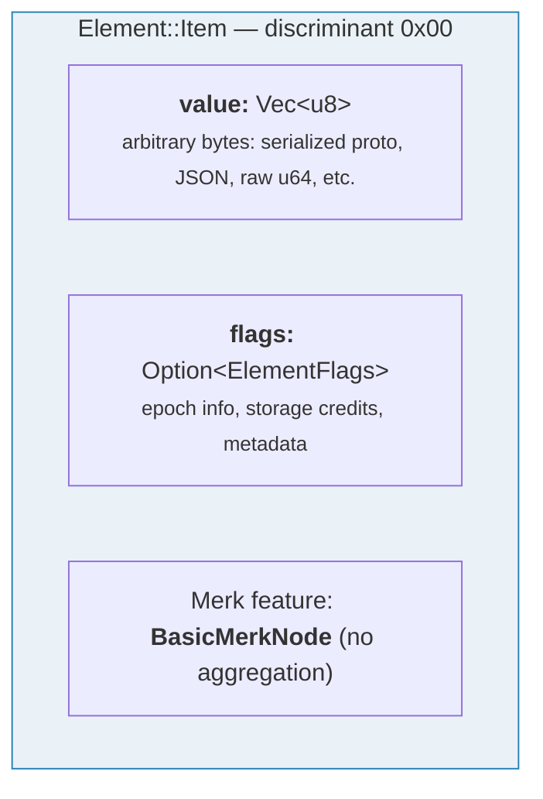
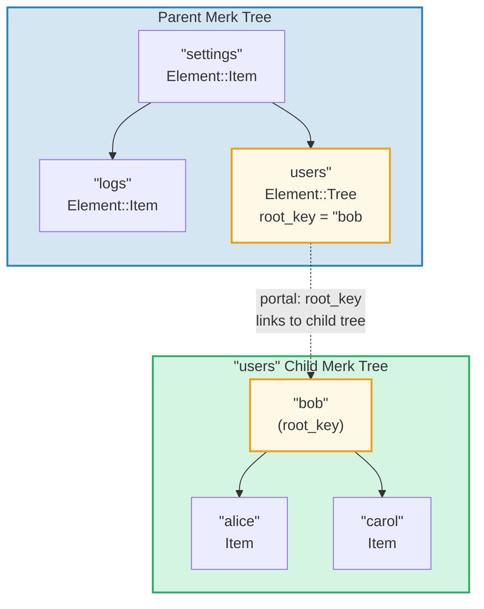
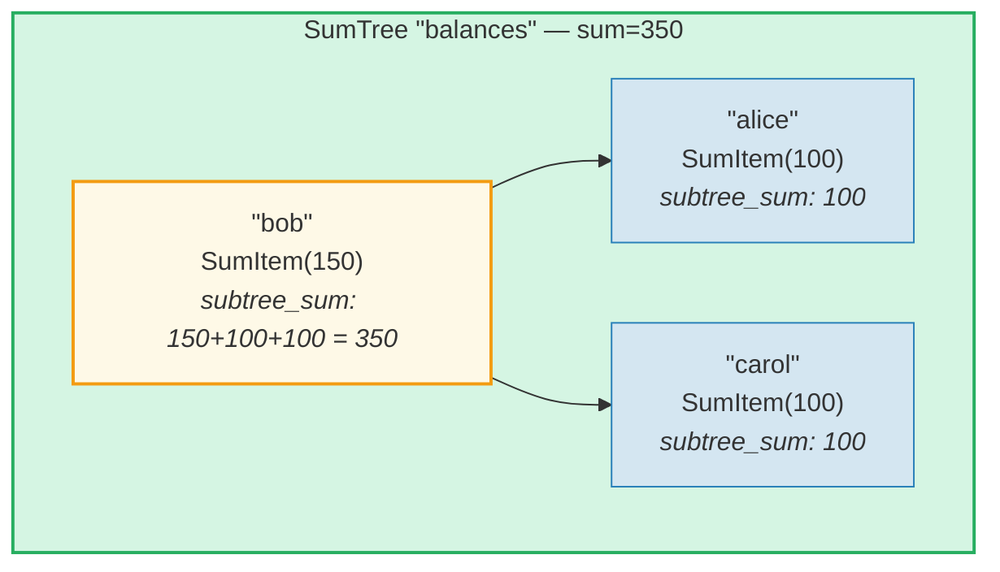
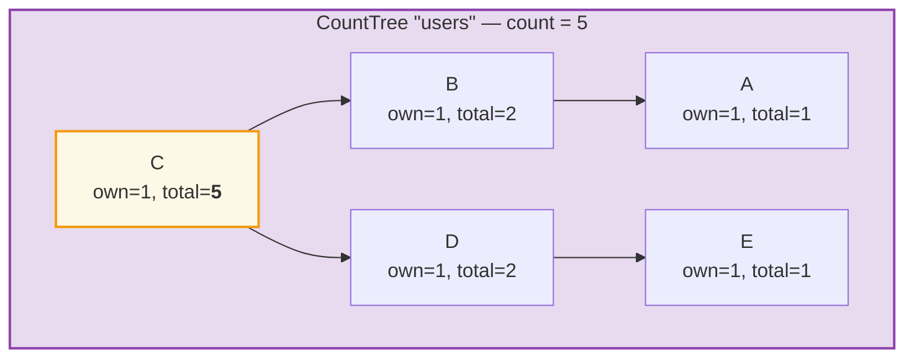
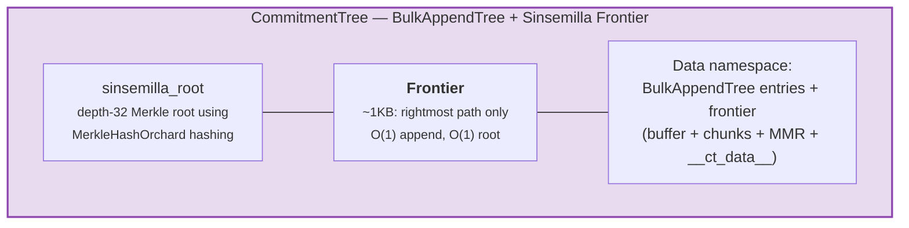

# エレメントシステム

Merk は生のキーバリューペアを扱いますが、GroveDB は**エレメント**（Element）というより高いレベルで動作します — 意味的な意味を持つ型付き値です。GroveDB に格納されるすべての値はエレメントです。

## Element 列挙型

```rust
// grovedb-element/src/element/mod.rs
pub enum Element {
    Item(Vec<u8>, Option<ElementFlags>),                                    // [0]
    Reference(ReferencePathType, MaxReferenceHop, Option<ElementFlags>),    // [1]
    Tree(Option<Vec<u8>>, Option<ElementFlags>),                           // [2]
    SumItem(SumValue, Option<ElementFlags>),                               // [3]
    SumTree(Option<Vec<u8>>, SumValue, Option<ElementFlags>),              // [4]
    BigSumTree(Option<Vec<u8>>, BigSumValue, Option<ElementFlags>),        // [5]
    CountTree(Option<Vec<u8>>, CountValue, Option<ElementFlags>),          // [6]
    CountSumTree(Option<Vec<u8>>, CountValue, SumValue, Option<ElementFlags>), // [7]
    ProvableCountTree(Option<Vec<u8>>, CountValue, Option<ElementFlags>),  // [8]
    ItemWithSumItem(Vec<u8>, SumValue, Option<ElementFlags>),              // [9]
    ProvableCountSumTree(Option<Vec<u8>>, CountValue, SumValue,
                         Option<ElementFlags>),                            // [10]
    CommitmentTree(u64, u8, Option<ElementFlags>),                         // [11]
    MmrTree(u64, Option<ElementFlags>),                                    // [12]
    BulkAppendTree(u64, u8, Option<ElementFlags>),                         // [13]
    DenseAppendOnlyFixedSizeTree(u16, u8, Option<ElementFlags>),           // [14]
}
```

角括弧内の数字はシリアライズ時に使用される識別子（discriminant）です。

全体で使用される型エイリアス：

```rust
pub type ElementFlags = Vec<u8>;        // Arbitrary metadata per element
pub type MaxReferenceHop = Option<u8>;  // Optional hop limit for references
pub type SumValue = i64;                // 64-bit signed sum
pub type BigSumValue = i128;            // 128-bit signed sum
pub type CountValue = u64;              // 64-bit unsigned count
```

## Item — 基本的なキーバリューストレージ

最もシンプルなエレメントです。任意のバイト列を格納します：

```rust
Element::Item(value: Vec<u8>, flags: Option<ElementFlags>)
```



コンストラクタ：

```rust
Element::new_item(b"hello world".to_vec())
Element::new_item_with_flags(b"data".to_vec(), Some(vec![0x01, 0x02]))
```

Item は合計集約に参加します：SumTree 内では、Item はデフォルトの合計値 0 を貢献します。SumItem はその明示的な値を貢献します。

## Tree — サブツリーのコンテナ

Tree エレメントは別の Merk ツリーへの**ポータル**です。子ツリーのルートキー（もしあれば）を格納します：

```rust
Element::Tree(root_key: Option<Vec<u8>>, flags: Option<ElementFlags>)
```



> 親 Merk 内の Tree エレメントは子 Merk ツリーの `root_key` を格納します。これにより**ポータル** — ある Merk ツリーから別のツリーへのリンクが作成されます。

ツリーが空の場合、`root_key` は `None` です。コンストラクタ `Element::empty_tree()` は `Element::Tree(None, None)` を作成します。

## SumItem / SumTree — 集約合計

**SumTree** はすべての直接の子の合計寄与の合計を自動的に維持します：

```rust
Element::SumTree(root_key: Option<Vec<u8>>, sum: SumValue, flags: Option<ElementFlags>)
Element::SumItem(value: SumValue, flags: Option<ElementFlags>)
```



> **集約の公式:** `node_sum = own_value + left_child_sum + right_child_sum`
> Bob: 150 + 100 (alice) + 100 (carol) = **350**。ルートの合計（350）は親の SumTree エレメントに格納されます。

合計は Merk レベルで `TreeFeatureType::SummedMerkNode(i64)` フィーチャータイプを通じて維持されます。ツリー伝播中に各ノードの集約データが再計算されます：

```text
aggregate_sum = own_sum + left_child_sum + right_child_sum
```

## CountTree、CountSumTree、BigSumTree

追加の集約ツリー型：

| エレメント型 | Merk フィーチャータイプ | 集約対象 |
|---|---|---|
| `CountTree` | `CountedMerkNode(u64)` | 要素数 |
| `CountSumTree` | `CountedSummedMerkNode(u64, i64)` | カウントと合計の両方 |
| `BigSumTree` | `BigSummedMerkNode(i128)` | 大きな値用の128ビット合計 |
| `ProvableCountTree` | `ProvableCountedMerkNode(u64)` | ハッシュに組み込まれたカウント |
| `ProvableCountSumTree` | `ProvableCountedSummedMerkNode(u64, i64)` | ハッシュ内のカウント + 合計 |

**ProvableCountTree** は特別です：そのカウントは `node_hash` の計算（`node_hash_with_count` 経由）に含まれるため、証明は値を公開することなくカウントを検証できます。

## エレメントのシリアライズ

エレメントは**ビッグエンディアン**バイト順の **bincode** を使用してシリアライズされます：

```rust
pub fn serialize(&self, grove_version: &GroveVersion) -> Result<Vec<u8>, ElementError> {
    let config = config::standard().with_big_endian().with_no_limit();
    bincode::encode_to_vec(self, config)
}
```

最初のバイトは **discriminant** であり、O(1) での型検出を可能にします：

```rust
pub fn from_serialized_value(value: &[u8]) -> Option<ElementType> {
    match value.first()? {
        0 => Some(ElementType::Item),
        1 => Some(ElementType::Reference),
        2 => Some(ElementType::Tree),
        3 => Some(ElementType::SumItem),
        // ... etc
    }
}
```

## TreeFeatureType と集約データフロー

`TreeFeatureType` 列挙型は GroveDB のエレメントと Merk ノードの間のギャップを橋渡しします：

```rust
pub enum TreeFeatureType {
    BasicMerkNode,                              // No aggregation
    SummedMerkNode(i64),                       // Sum aggregation
    BigSummedMerkNode(i128),                   // Large sum
    CountedMerkNode(u64),                      // Count
    CountedSummedMerkNode(u64, i64),           // Count + sum
    ProvableCountedMerkNode(u64),              // Count in hash
    ProvableCountedSummedMerkNode(u64, i64),   // Count in hash + sum
}
```

集約データはツリーを**上方向**に流れます：



> **集約表:** 各ノードの集約 = own(1) + left_aggregate + right_aggregate
>
> | ノード | own | left_agg | right_agg | total |
> |------|-----|----------|-----------|-------|
> | A | 1 | 0 | 0 | 1 |
> | B | 1 | 1 (A) | 0 | 2 |
> | E | 1 | 0 | 0 | 1 |
> | D | 1 | 0 | 1 (E) | 2 |
> | C | 1 | 2 (B) | 2 (D) | **5** (root) |

各ノードに格納されるカウントは、そのノードをルートとするサブツリー全体の合計カウント（自身を含む）を表します。ルートノードのカウントがツリー全体の合計です。

`AggregateData` 列挙型はリンクシステムを通じてこれを運びます：

```rust
pub enum AggregateData {
    NoAggregateData,
    Sum(i64),
    BigSum(i128),
    Count(u64),
    CountAndSum(u64, i64),
    ProvableCount(u64),
    ProvableCountAndSum(u64, i64),
}
```

## CommitmentTree — Sinsemilla コミットメントツリー

**CommitmentTree** は、Zcash の Orchard シールドプロトコルで使用されるノートコミットメントアンカーを追跡するための深さ32の Sinsemilla マークル木を提供します。O(1) の追加とルート計算のために `incrementalmerkletree::Frontier<MerkleHashOrchard, 32>` をラップしています：

```rust
Element::CommitmentTree(
    total_count: u64,               // Number of commitments appended
    chunk_power: u8,                // BulkAppendTree compaction size (chunk_size = 2^chunk_power)
    flags: Option<ElementFlags>,
)                                   // discriminant [11]
```

> **注意:** Sinsemilla のフロンティアルートハッシュはエレメントに格納されません。
> データストレージに永続化され、Merk の子ハッシュメカニズム（`insert_subtree` の `subtree_root_hash` パラメータ）を通じて流れます。フロンティアへの変更は自動的に GroveDB の Merk 階層を通じて上方に伝播します。



**アーキテクチャ：**
- *フロンティア*（マークル木の最右パス、定数サイズ約1KB）は `COMMITMENT_TREE_DATA_KEY` をキーとして**データ名前空間**に格納されます
- 実際のノートデータ（`cmx || ciphertext`）は**データ名前空間**内の **BulkAppendTree** 経由で格納されます — チャンク圧縮され、位置で検索可能
- 過去のアンカーは Platform が別の証明可能なツリーで追跡
- Sinsemilla ルートはエレメントに格納されません — GroveDB ハッシュ階層を通じて Merk 子ハッシュとして流れます

**操作：**
- `commitment_tree_insert(path, key, cmx, ciphertext, tx)` — `TransmittedNoteCiphertext<M>` を受け取る型付き追加; `(new_root, position)` を返す
- `commitment_tree_anchor(path, key, tx)` — 現在の Orchard Anchor を取得
- `commitment_tree_get_value(path, key, position, tx)` — 位置による値の取得
- `commitment_tree_count(path, key, tx)` — 合計アイテム数を取得

**MemoSize ジェネリック:** `CommitmentTree<S, M: MemoSize = DashMemo>` は暗号文ペイロードが `M` の期待サイズと一致するか検証します。Dash（36バイトメモ）の場合：
`epk_bytes (32) + enc_ciphertext (104) + out_ciphertext (80) = 216 bytes`。

**コスト追跡:** Sinsemilla ハッシュ操作は `cost.sinsemilla_hash_calls` で追跡されます。ルート計算は常に32レベルを走査します。オマーのマージは前の位置の `trailing_ones()` を通じてカスケードします。BulkAppendTree 操作は Blake3 ハッシュコストを追加します。

## MmrTree — マークルマウンテンレンジ

**MmrTree** は Blake3 ハッシュを使用する追記専用の Merkle Mountain Range（MMR）にデータを格納します。MMR ノードは**データ**カラム（Merk ノードと同じ）に格納され、子 Merk サブツリーには格納されません。詳細については **[第13章](#chapter-13-the-mmr-tree--append-only-authenticated-logs)** を参照してください。MMR の仕組み、充填方法、証明の生成と検証、GroveDB との統合について包括的に解説しています。

```rust
Element::MmrTree(
    mmr_size: u64,                  // Internal MMR size (nodes, not leaves)
    flags: Option<ElementFlags>,
)                                   // discriminant [12]
```

> **注意:** MMR ルートハッシュはエレメントに格納されません。`insert_subtree` の `subtree_root_hash` パラメータ経由で Merk 子ハッシュとして流れます。

**操作:** `mmr_tree_append`、`mmr_tree_root_hash`、`mmr_tree_get_value`、`mmr_tree_leaf_count`。**証明:** V1 証明（9.6節および13.9節参照）。

## BulkAppendTree — 2レベルの追記専用構造

**BulkAppendTree** は密なマークル木バッファとチャンクレベルの MMR を組み合わせ、証明可能な範囲クエリを備えた効率的な高スループットの追記を実現します。非 Merk ツリーであり、データは**データ**名前空間に存在し、子 Merk サブツリーには存在しません。詳細については **[第14章](#chapter-14-the-bulkappendtree--high-throughput-append-only-storage)** を参照してください。

```rust
Element::BulkAppendTree(
    total_count: u64,               // Total values appended
    chunk_power: u8,                // Dense tree height (buffer capacity = 2^chunk_power - 1)
    flags: Option<ElementFlags>,
)                                   // discriminant [13]
```

> **注意:** ステートルート（`blake3("bulk_state" || mmr_root || dense_tree_root)`）はエレメントに格納されません。`insert_subtree` の `subtree_root_hash` パラメータ経由で Merk 子ハッシュとして流れます。

**操作:** `bulk_append`、`bulk_get_value`、`bulk_get_chunk`、`bulk_get_buffer`、`bulk_count`、`bulk_chunk_count`。
**証明:** V1 範囲証明（9.6節および14.10節参照）。

## DenseAppendOnlyFixedSizeTree — 密な固定容量ストレージ

**DenseAppendOnlyFixedSizeTree** は、固定高さ *h* の完全二分木であり、すべてのノード（内部ノードとリーフ）がデータ値を格納します。位置はレベル順（BFS）で充填されます。ルートハッシュはその場で再計算されます — 中間ハッシュは永続化されません。詳細については **[第16章](#chapter-16-the-denseappendonlyfixedsizetree--dense-fixed-capacity-merkle-storage)** を参照してください。

```rust
Element::DenseAppendOnlyFixedSizeTree(
    count: u16,                     // Number of values stored (max 65,535)
    height: u8,                     // Tree height (1..=16, immutable), capacity = 2^h - 1
    flags: Option<ElementFlags>,
)                                   // discriminant [14]
```

> **注意:** ルートハッシュはエレメントに格納されません — その場で再計算され、Merk 子ハッシュとして流れます。`count` フィールドは `u16`（u64 ではない）であり、ツリーを65,535位置に制限します。高さは1..=16に制限されます。

**操作:** `dense_tree_insert`、`dense_tree_get`、`dense_tree_root_hash`、`dense_tree_count`。
**証明:** エレメントレベルのみ（サブクエリ証明は未対応）。

## 非 Merk ツリー — 共通パターン

CommitmentTree、MmrTree、BulkAppendTree、DenseAppendOnlyFixedSizeTree は、Merk ベースのツリー型（Tree、SumTree、CountTree など）と区別する共通のアーキテクチャパターンを共有しています：

| プロパティ | Merk ベースのツリー | 非 Merk ツリー |
|----------|-----------------|-------------------|
| 子 Merk サブツリー | あり（`root_key = Some(...)`） | なし（root_key フィールドなし） |
| データストレージ | Merk キーバリューペア | データカラムのブロブ（非 Merk キー） |
| ルートハッシュバインディング | `combine_hash(elem_hash, child_root_hash)` | `combine_hash(elem_hash, type_specific_root)` |
| 型固有ルート | Merk AVL が維持 | Merk 子ハッシュとして流れる（エレメントバイトには含まれない） |
| 証明フォーマット | V0（レイヤーごとの Merk） | V1（型固有の証明） |
| TreeFeatureType | BasicMerkNode（集約なし） | BasicMerkNode |

> **ストレージカラムに関する注意:** 4つの非 Merk ツリー型（MmrTree、CommitmentTree、BulkAppendTree、DenseAppendOnlyFixedSizeTree）すべてが非 Merk キーを使用して**データ**カラムにデータを格納します。CommitmentTree は BulkAppendTree エントリと同じ**データ**カラムに Sinsemilla フロンティアを格納します（キー `b"__ct_data__"`）。

型固有ルート（Sinsemilla ルート、MMR ルート、ステートルート、密なツリーのルートハッシュ）はエレメントに格納されません。代わりに、`insert_subtree` の `subtree_root_hash` パラメータ経由で Merk **子ハッシュ**として流れます。Merk の combined_value_hash は `combine_hash(value_hash(element_bytes), type_specific_root)` になります。型固有ルートへの変更は子ハッシュを変更し、combined_value_hash を変更し、GroveDB ハッシュ階層を通じて上方に伝播します — 暗号学的完全性を維持します。

---
