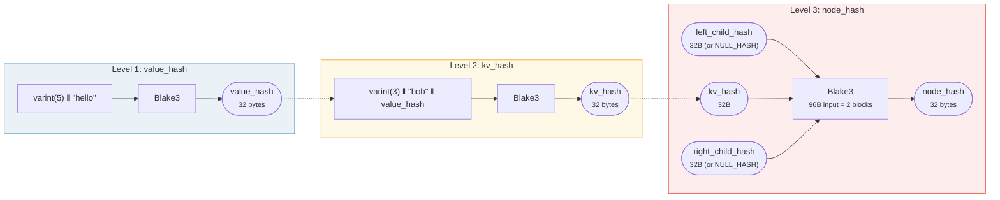
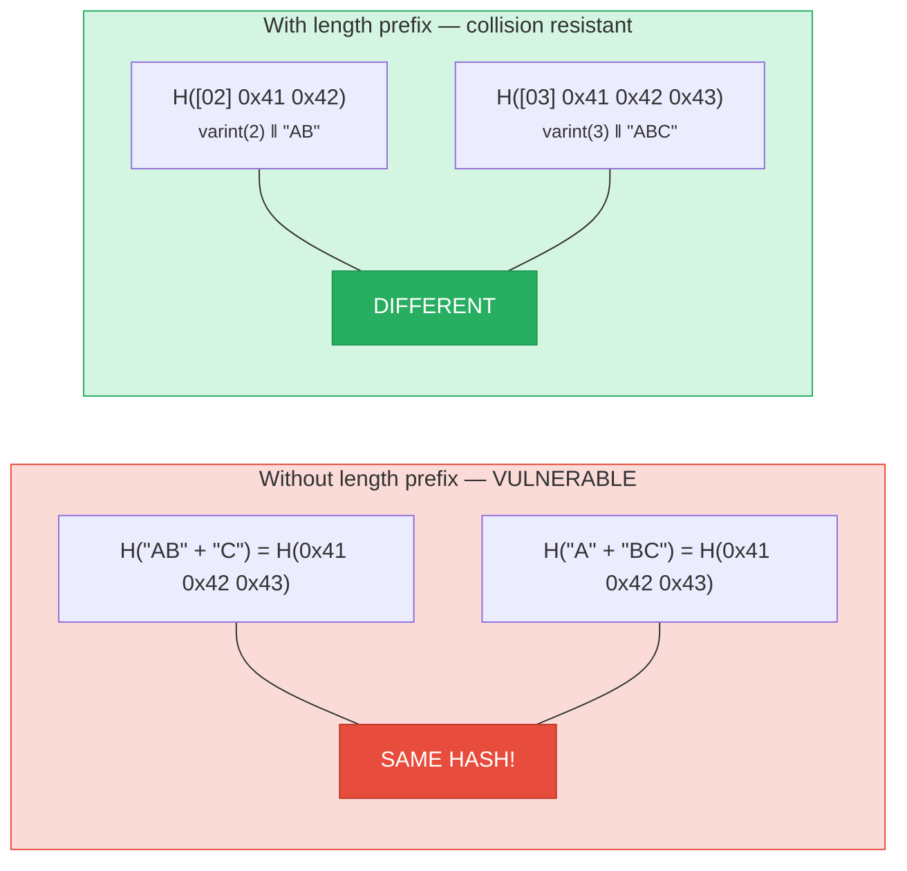
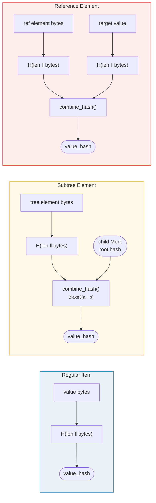

# ハッシング — 暗号学的完全性

Merk ツリーの各ノードはハッシュされて**ルートハッシュ**を生成します — ツリー全体を認証する32バイトの値です。任意のキー、値、または構造的関係の変更により、異なるルートハッシュが生成されます。

## 3レベルのハッシュ階層

Merk は3段階のハッシュ方式を使用します。内側から外側へ：

例：key = `"bob"`（3バイト）、value = `"hello"`（5バイト）：



> ツリーの ROOT = ルートノードの `node_hash` — **すべての**キー、値、構造的関係を認証します。子がない場合は `NULL_HASH = [0x00; 32]` を使用します。

### レベル 1：value_hash

```rust
// merk/src/tree/hash.rs
pub fn value_hash(value: &[u8]) -> CostContext<CryptoHash> {
    let mut hasher = blake3::Hasher::new();
    let val_length = value.len().encode_var_vec();  // Varint encoding
    hasher.update(val_length.as_slice());
    hasher.update(value);
    // ...
}
```

値の長さは **varint エンコード**されて先頭に付加されます。これは衝突耐性にとって重要です — これがないと `H("AB" ‖ "C")` は `H("A" ‖ "BC")` と等しくなってしまいます。

### レベル 2：kv_hash

```rust
pub fn kv_hash(key: &[u8], value: &[u8]) -> CostContext<CryptoHash> {
    let mut hasher = blake3::Hasher::new();
    let key_length = key.len().encode_var_vec();
    hasher.update(key_length.as_slice());
    hasher.update(key);
    let vh = value_hash(value);
    hasher.update(vh.as_slice());  // Nested hash
    // ...
}
```

これはキーを値にバインドします。証明検証用に、事前計算された value_hash を受け取る変種もあります：

```rust
pub fn kv_digest_to_kv_hash(key: &[u8], value_hash: &CryptoHash) -> CostContext<CryptoHash>
```

これは検証者が既に value_hash を持っている場合（例：value_hash が結合ハッシュであるサブツリー）に使用されます。

### レベル 3：node_hash

```rust
pub fn node_hash(
    kv: &CryptoHash,
    left: &CryptoHash,
    right: &CryptoHash,
) -> CostContext<CryptoHash> {
    let mut hasher = blake3::Hasher::new();
    hasher.update(kv);       // 32 bytes
    hasher.update(left);     // 32 bytes
    hasher.update(right);    // 32 bytes — total 96 bytes
    // Always exactly 2 hash operations (96 bytes / 64-byte block = 2)
}
```

子がない場合、そのハッシュは **NULL_HASH** — 32バイトのゼロです：

```rust
pub const NULL_HASH: CryptoHash = [0; HASH_LENGTH];  // [0u8; 32]
```

## ハッシュ関数としての Blake3

GroveDB はすべてのハッシュに **Blake3** を使用します。主な特性：

- **256ビット出力**（32バイト）
- **ブロックサイズ**：64バイト
- **速度**：最新のハードウェアで SHA-256 の約3倍
- **ストリーミング**：データを段階的に供給可能

ハッシュ操作のコストは、処理される64バイトブロックの数に基づいて計算されます：

```rust
let hashes = 1 + (hasher.count() - 1) / 64;  // Number of hash operations
```

## 衝突耐性のための長さプレフィックスエンコーディング

すべての可変長入力は **varint エンコーディング**を使用してその長さがプレフィックスとして付加されます：



> **value_hash の入力**: `[varint(value.len)] [value bytes]`
> **kv_hash の入力**: `[varint(key.len)] [key bytes] [value_hash: 32 bytes]`

長さプレフィックスがなければ、攻撃者は同じダイジェストにハッシュされる異なるキーバリューペアを作成できてしまいます。長さプレフィックスにより、これは暗号学的に不可能になります。

## 特殊エレメントの結合ハッシュ

**サブツリー**と**参照**では、`value_hash` は単なる `H(value)` ではありません。代わりに、エレメントをその対象にバインドする**結合ハッシュ**（combined hash）です：



> **サブツリー:** 子 Merk のルートハッシュを親にバインドします。**参照:** 参照パスとターゲット値の両方をバインドします。どちらを変更してもルートハッシュが変わります。

`combine_hash` 関数：

```rust
pub fn combine_hash(hash_one: &CryptoHash, hash_two: &CryptoHash) -> CostContext<CryptoHash> {
    let mut hasher = blake3::Hasher::new();
    hasher.update(hash_one);   // 32 bytes
    hasher.update(hash_two);   // 32 bytes — total 64 bytes, exactly 1 hash op
    // ...
}
```

これにより GroveDB は単一のルートハッシュを通じて階層全体を認証できます — サブツリーエレメントに対する各親ツリーの value_hash が子ツリーのルートハッシュを含んでいるからです。

## ProvableCountTree の集約ハッシュ

`ProvableCountTree` ノードはノードハッシュに集約カウントを含みます：

```rust
pub fn node_hash_with_count(
    kv: &CryptoHash,
    left: &CryptoHash,
    right: &CryptoHash,
    count: u64,
) -> CostContext<CryptoHash> {
    let mut hasher = blake3::Hasher::new();
    hasher.update(kv);                        // 32 bytes
    hasher.update(left);                      // 32 bytes
    hasher.update(right);                     // 32 bytes
    hasher.update(&count.to_be_bytes());      // 8 bytes — total 104 bytes
    // Still exactly 2 hash ops (104 < 128 = 2 × 64)
}
```

これは、カウントの証明に実際のデータを公開する必要がないことを意味します — カウントは暗号学的コミットメントに組み込まれています。

---
