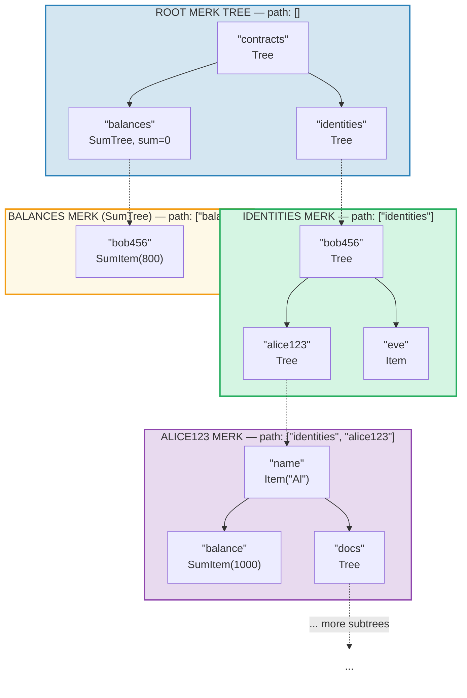
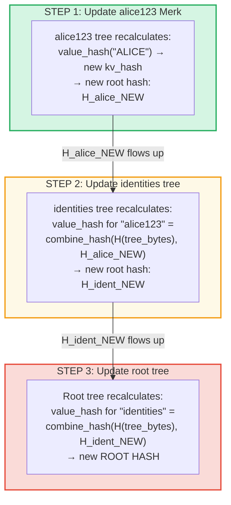
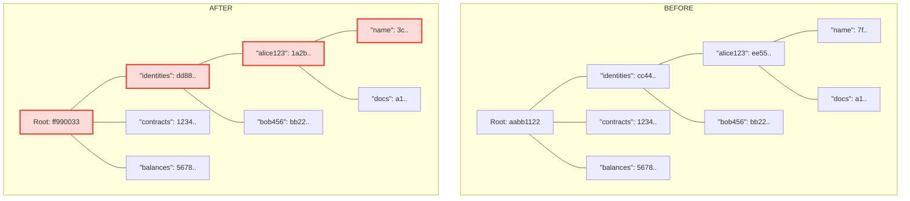
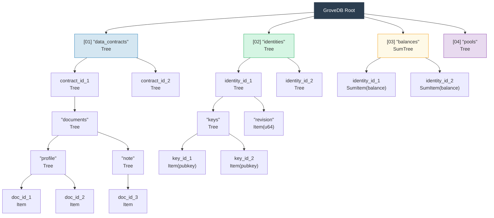

# 階層型グローブ — ツリーのツリー

## サブツリーが親ツリー内にどのようにネストするか

GroveDB の最も特徴的な機能は、Merk ツリーがそれ自体 Merk ツリーであるエレメントを含むことができることです。これにより**階層的な名前空間**が作られます：



> 各色付きボックスは個別の Merk ツリーです。破線の矢印は Tree エレメントから子 Merk ツリーへのポータルリンクを表します。各 Merk へのパスはラベルに示されています。

## パスアドレッシングシステム

GroveDB 内のすべてのエレメントは**パス** — ルートからサブツリーを通ってターゲットキーまでのバイト文字列のシーケンスでアドレス指定されます：

```text
    Path: ["identities", "alice123", "name"]

    Step 1: In root tree, look up "identities" → Tree element
    Step 2: Open identities subtree, look up "alice123" → Tree element
    Step 3: Open alice123 subtree, look up "name" → Item("Alice")
```

パスは `Vec<Vec<u8>>` または効率的なアロケーションなしの操作のための `SubtreePath` 型で表現されます：

```rust
// The path to the element (all segments except the last)
let path: &[&[u8]] = &[b"identities", b"alice123"];
// The key within the final subtree
let key: &[u8] = b"name";
```

## ストレージ分離のための Blake3 プレフィックス生成

GroveDB の各サブツリーは RocksDB 内で独自の**分離されたストレージ名前空間**を取得します。名前空間はパスを Blake3 でハッシュすることで決定されます：

```rust
pub type SubtreePrefix = [u8; 32];

// The prefix is computed by hashing the path segments
// storage/src/rocksdb_storage/storage.rs
```

例：

```text
    Path: ["identities", "alice123"]
    Prefix: Blake3(["identities", "alice123"]) = [0xab, 0x3f, ...]  (32 bytes)

    In RocksDB, keys for this subtree are stored as:
    [prefix: 32 bytes][original_key]

    So "name" in this subtree becomes:
    [0xab, 0x3f, ...][0x6e, 0x61, 0x6d, 0x65]  ("name")
```

これにより以下が保証されます：
- サブツリー間のキー衝突なし（32バイトプレフィックス = 256ビットの分離）
- 効率的なプレフィックス計算（パスバイトに対する単一の Blake3 ハッシュ）
- サブツリーデータが RocksDB 内で共存しキャッシュ効率が向上

## 階層を通じたルートハッシュの伝播

グローブの深い位置で値が変更されると、変更はルートハッシュを更新するために**上方に伝播**する必要があります：

```text
    Change: Update "name" to "ALICE" in identities/alice123/

    Step 1: Update value in alice123's Merk tree
            → alice123 tree gets new root hash: H_alice_new

    Step 2: Update "alice123" element in identities tree
            → identities tree's value_hash for "alice123" =
              combine_hash(H(tree_element_bytes), H_alice_new)
            → identities tree gets new root hash: H_ident_new

    Step 3: Update "identities" element in root tree
            → root tree's value_hash for "identities" =
              combine_hash(H(tree_element_bytes), H_ident_new)
            → ROOT HASH changes
```



**変更前 vs 変更後** — 変更されたノードは赤でマーク：



> 変更された値からルートまでのパス上のノードのみが再計算されます。兄弟ノードや他のブランチは変更されません。

伝播は `propagate_changes_with_transaction` によって実装されており、変更されたサブツリーからルートまでパスを遡り、各親のエレメントハッシュを更新していきます。

## マルチレベルグローブ構造の例

以下は Dash Platform が状態をどのように構造化するかを示す完全な例です：



各ボックスは個別の Merk ツリーであり、バリデータが合意する単一のルートハッシュまですべて認証されています。

---
