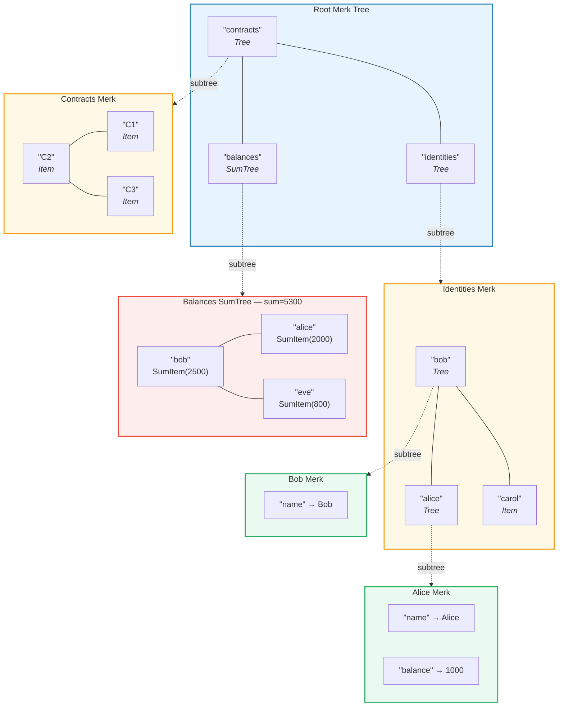
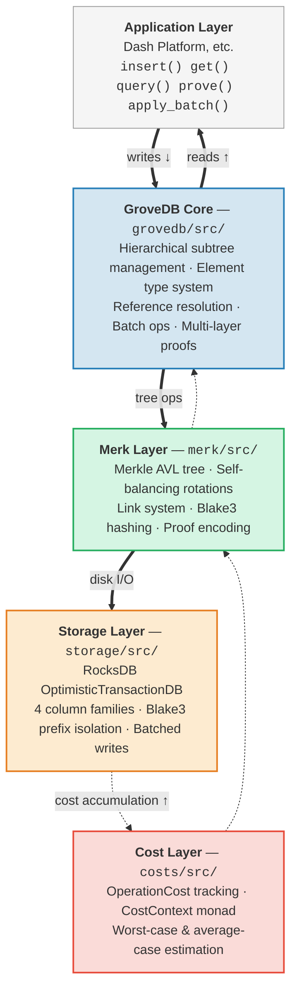

# はじめに — GroveDB とは？

## 基本的な考え方

GroveDB は**階層型認証データ構造**（hierarchical authenticated data structure）です。マークル AVL 木（Merkle AVL tree）上に構築された*グローブ*（木の森）であり、データベース内の各ノードは暗号学的に認証されたツリーの一部です。そして各ツリーは子として他のツリーを含むことができ、検証可能な状態の深い階層を形成します。

> 各色付きボックスは**個別の Merk ツリー**です。破線の矢印はサブツリー関係を示します — 親の Tree エレメントが子 Merk のルートキーを保持しています。

従来のデータベースでは、フラットなキーバリューストアの上に単一のマークル木を置いて認証を行うことが一般的です。GroveDB は異なるアプローチを採ります：マークル木の中にマークル木をネストします。これにより以下が実現されます：

1. **効率的なセカンダリインデックス** — 主キーだけでなく、任意のパスでクエリ可能
2. **コンパクトな暗号証明** — 任意のデータの存在（または不在）を証明
3. **集約データ** — ツリーが子の合計、カウント、その他の集約を自動的に維持
4. **アトミックなクロスツリー操作** — バッチ操作が複数のサブツリーにまたがる

## GroveDB が存在する理由

GroveDB は **Dash Platform** 向けに設計されました。Dash Platform は分散型アプリケーションプラットフォームであり、すべての状態が以下の要件を満たす必要があります：

- **認証済み**: 任意のノードがライトクライアントに対して任意の状態を証明可能
- **決定論的**: すべてのノードがまったく同じステートルートを計算
- **効率的**: 操作がブロック時間の制約内で完了
- **クエリ可能**: アプリケーションがキー検索だけでなくリッチなクエリを必要とする

従来のアプローチには限界があります：

| アプローチ | 問題点 |
|----------|---------|
| 通常のマークル木 | キー検索のみ対応、範囲クエリ不可 |
| Ethereum MPT | リバランスが高コスト、証明サイズが大きい |
| フラットKV + 単一ツリー | 階層クエリ不可、単一の証明がすべてをカバー |
| B木 | 本質的にマークル化されておらず、認証が複雑 |

GroveDB は **AVL 木の実証済みのバランス保証**と**階層的なネスト**、そして**豊富なエレメント型システム**を組み合わせることでこれらの問題を解決します。

## アーキテクチャ概要

GroveDB は明確な責務を持つ個別のレイヤーで構成されています：

データは書き込み時にこれらのレイヤーを**下方向**に、読み取り時に**上方向**に流れます。すべての操作はスタックを通過する際にコストを蓄積し、正確なリソース計算を可能にします。

---
