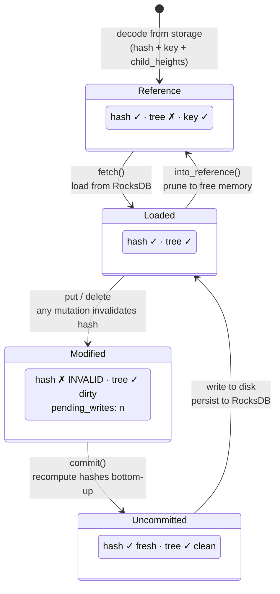
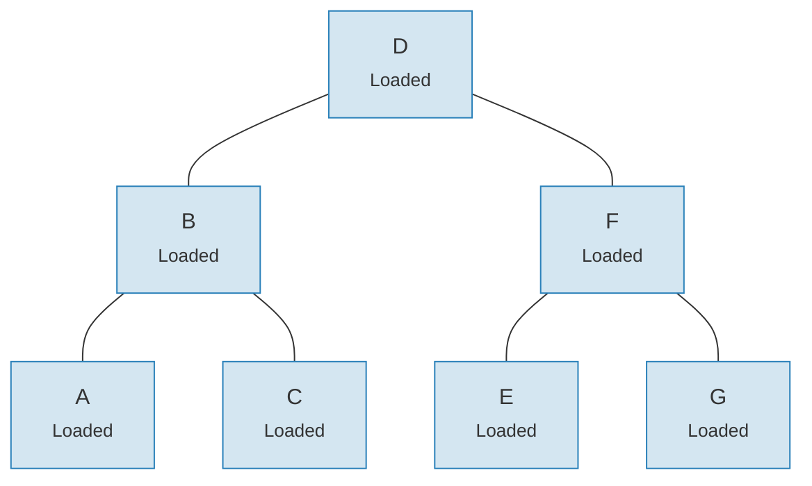
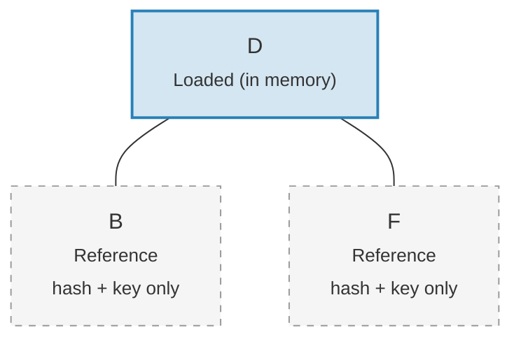

# リンクシステム — 遅延読み込みアーキテクチャ

大きなツリーに対して Merk ツリー全体をメモリにロードするのは非常にコストがかかります。リンクシステム（Link system）は子接続を4つの状態で表現することでこの問題を解決し、**遅延読み込み**（lazy loading）を実現します — 子は実際に必要になったときのみストレージから取得されます。

## 4つのリンク状態

```rust
// merk/src/tree/link.rs
pub enum Link {
    Reference {                    // Pruned: only metadata, no tree in memory
        hash: CryptoHash,
        child_heights: (u8, u8),
        key: Vec<u8>,
        aggregate_data: AggregateData,
    },
    Modified {                     // Recently changed, hash not yet computed
        pending_writes: usize,
        child_heights: (u8, u8),
        tree: TreeNode,
    },
    Uncommitted {                  // Hashed but not yet persisted to storage
        hash: CryptoHash,
        child_heights: (u8, u8),
        tree: TreeNode,
        aggregate_data: AggregateData,
    },
    Loaded {                       // Fully loaded from storage
        hash: CryptoHash,
        child_heights: (u8, u8),
        tree: TreeNode,
        aggregate_data: AggregateData,
    },
}
```

## 状態遷移図



## 各状態が格納するもの

| 状態 | ハッシュ？ | メモリ内のツリー？ | 目的 |
|-------|-------|-----------------|---------|
| **Reference** | あり | なし | コンパクトなディスク上の表現。キー、ハッシュ、子の高さ、集約データのみを格納。 |
| **Modified** | なし | あり | 変更後の状態。バッチ最適化のために `pending_writes` 数を追跡。 |
| **Uncommitted** | あり | あり | ハッシュ計算後だがストレージ書き込み前。コミット中の中間状態。 |
| **Loaded** | あり | あり | 完全にメモリに展開。読み取りやさらなる変更に対応可能。 |

`Modified` の `pending_writes` フィールドは注目に値します：

```rust
// Computed as: 1 + left_pending_writes + right_pending_writes
pending_writes: 1 + tree.child_pending_writes(true)
                  + tree.child_pending_writes(false),
```

このカウントはコミットフェーズが最適なパフォーマンスのために書き込み順序を決定するのに役立ちます。

## フェッチコールバックパターン

リンクシステムは子ノードのロード方法を抽象化する **Fetch トレイト**を使用します：

```rust
pub trait Fetch {
    fn fetch(
        &self,
        link: &Link,
        value_defined_cost_fn: Option<&impl Fn(&[u8], &GroveVersion) -> Option<ValueDefinedCostType>>,
        grove_version: &GroveVersion,
    ) -> CostResult<TreeNode, Error>;
}
```

異なる Fetch 実装が異なる目的に対応します：

- **StorageFetch**: RocksDB からロード（通常のパス）
- **PanicSource**: フェッチが発生してはならないテストで使用
- **MockSource**: 制御されたテストデータを返す

このパターンにより、ツリー操作が**ストレージに依存しない**ようになります — データの出所に関係なく、同じバランシングと変更ロジックが動作します。

## Walker パターン

`Walker` は `TreeNode` を `Fetch` ソースでラップし、自動的な遅延読み込みを伴う安全なツリー走査を提供します（`merk/src/tree/walk/mod.rs`）：

```rust
pub struct Walker<S: Fetch + Sized + Clone> {
    tree: Owner<TreeNode>,
    source: S,
}
```

Walker は3つの主要な操作を提供します：

**walk()** — 子を切り離し、変換し、再接続：

```rust
pub fn walk<F, T>(self, left: bool, f: F, ...) -> CostResult<Self, Error>
where
    F: FnOnce(Option<Self>) -> CostResult<Option<T>, Error>,
    T: Into<TreeNode>,
```

**detach()** — 必要に応じてストレージからロードして子を削除：

```rust
pub fn detach(self, left: bool, ...) -> CostResult<(Self, Option<Self>), Error>
```

子が `Link::Reference`（プルーニング済み）の場合、detach は `fetch()` を呼び出して最初にロードします。子が既にメモリ内にある場合（`Modified`、`Uncommitted`、`Loaded`）、単に所有権を取得します。

**attach()** — 子を親に接続：

```rust
pub fn attach(self, left: bool, maybe_child: Option<Self>) -> Self
```

接続は常に `Link::Modified` を作成します。親子関係が変更されたためです。

## プルーニングによるメモリ効率

変更をコミットした後、ツリーはロード済みのサブツリーを `Link::Reference` に**プルーニング**（枝刈り）して、証明生成に必要なハッシュを保持しながらメモリを解放できます：

**プルーニング前** — 7ノードすべてがメモリ内：



**プルーニング後** — ルートのみがメモリ内に残り、子は `Link::Reference`（ハッシュ + キーのみ）：



> **Link::Loaded** は `hash + child_heights + tree (TreeNode)` を保持します。**Link::Reference** は `hash + child_heights + key` のみを保持します — TreeNode はメモリから解放されます。

変換はシンプルです：

```rust
pub fn into_reference(self) -> Link {
    Link::Reference {
        hash: self.hash(),
        child_heights: self.child_heights(),
        key: self.key().to_vec(),
        aggregate_data: self.aggregate_data(),
    }
}
```

これは大きなツリーでメモリ使用量を制限するために重要です — アクティブにアクセスされているノードのみがメモリ内に存在する必要があります。

---
