# Merk ツリー — マークル AVL 木

Merk ツリーは GroveDB の基本的な構成要素です。グローブ内のすべてのサブツリーは Merk ツリーです — 自己平衡二分探索木であり、すべてのノードが暗号学的にハッシュされ、ツリー全体の内容を認証する単一のルートハッシュを生成します。

## Merk ノードとは？

多くのマークル木の実装ではデータがリーフ（葉）にのみ存在しますが、Merk ツリーでは**すべてのノードがキーバリューペアを格納**します。これは「空の」内部ノードが存在しないことを意味します — ツリーは探索構造とデータストアの両方を同時に兼ねています。

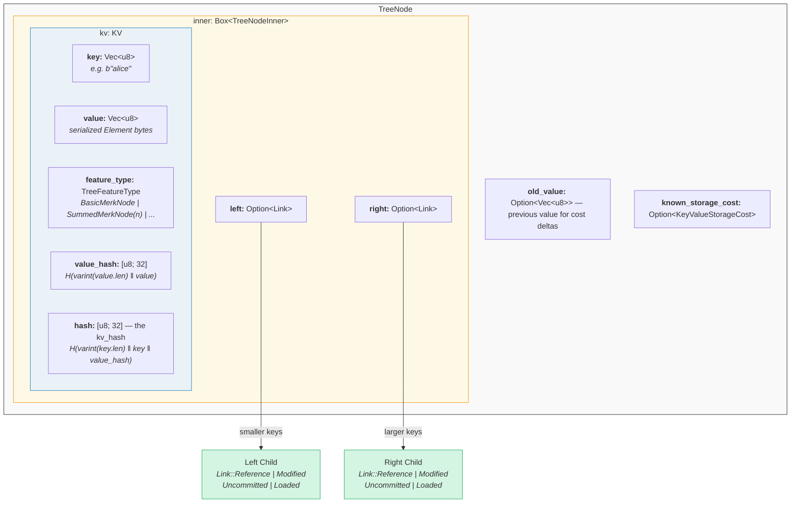

コード内では（`merk/src/tree/mod.rs`）：

```rust
pub struct TreeNode {
    pub(crate) inner: Box<TreeNodeInner>,
    pub(crate) old_value: Option<Vec<u8>>,        // Previous value for cost tracking
    pub(crate) known_storage_cost: Option<KeyValueStorageCost>,
}

pub struct TreeNodeInner {
    pub(crate) left: Option<Link>,    // Left child (smaller keys)
    pub(crate) right: Option<Link>,   // Right child (larger keys)
    pub(crate) kv: KV,               // The key-value payload
}
```

`Box<TreeNodeInner>` はノードをヒープに配置します。子リンクが再帰的に `TreeNode` インスタンス全体を含む可能性があるため、これは不可欠です。

## KV 構造体

`KV` 構造体は生データとその暗号ダイジェストの両方を保持します（`merk/src/tree/kv.rs`）：

```rust
pub struct KV {
    pub(super) key: Vec<u8>,                        // The lookup key
    pub(super) value: Vec<u8>,                      // The stored value
    pub(super) feature_type: TreeFeatureType,       // Aggregation behavior
    pub(crate) value_defined_cost: Option<ValueDefinedCostType>,
    pub(super) hash: CryptoHash,                    // kv_hash
    pub(super) value_hash: CryptoHash,              // H(value)
}
```

重要なポイントが2つあります：

1. **キーはエンコードされたノードの一部としてディスクに格納されません。** RocksDB のキーとして格納されます。ノードがストレージからデコードされる際、キーは外部から注入されます。これによりキーバイトの重複を避けます。

2. **2つのハッシュフィールドが維持されます。** `value_hash` は `H(value)` であり、`hash`（kv_hash）は `H(key, value_hash)` です。両方を保持することで、証明システムがどの程度の情報を公開するかを選択できます。

## 半平衡の性質 — AVL の「揺らぎ」

Merk ツリーは **AVL 木** です — Adelson-Velsky と Landis が発明した古典的な自己平衡二分探索木です。重要な不変条件は：

> すべてのノードにおいて、左右のサブツリーの高さの差は最大 1 です。

これは**バランスファクター**（balance factor）として表現されます：

```text
balance_factor = right_height - left_height
```

有効な値：**{-1, 0, 1}**

```rust
// merk/src/tree/mod.rs
pub const fn balance_factor(&self) -> i8 {
    let left_height = self.child_height(true) as i8;
    let right_height = self.child_height(false) as i8;
    right_height - left_height
}
```

ここで微妙なポイントがあります：個々のノードは1レベルしか傾きませんが、これらの傾きはツリー全体で**累積**する可能性があります。これが「半平衡」と呼ぶ理由です — ツリーは完全二分木のように完璧にバランスしているわけではありません。

10ノードのツリーを考えましょう。完全にバランスしたツリーの高さは 4（⌈log₂(10+1)⌉）ですが、AVL 木は高さ 5 になる可能性があります：

**完全バランス（高さ 4）** — すべてのレベルが完全に埋まっています：

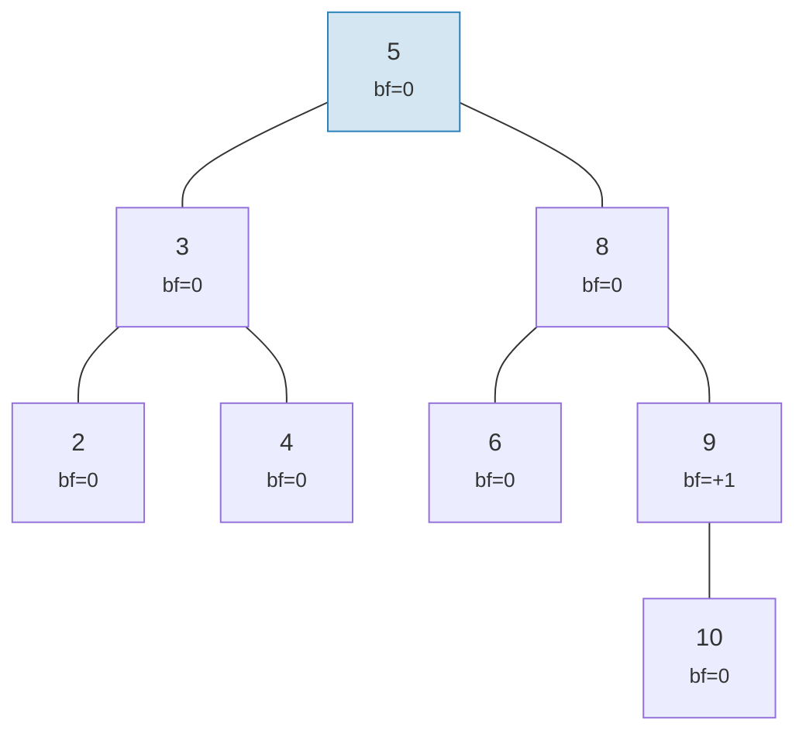

**AVL 有効な「揺らぎ」（高さ 5）** — 各ノードの傾きは最大 1 ですが、累積します：

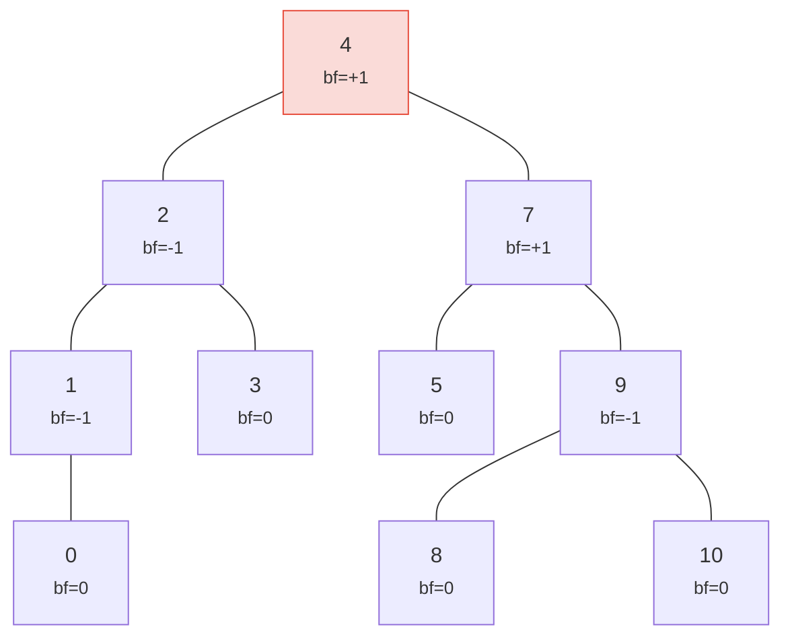

> 高さ 5 対完全な 4 — これが「揺らぎ」です。最悪の場合：h ≤ 1.44 × log₂(n+2)。

両方とも有効な AVL 木です！ AVL 木の最悪の場合の高さは：

```text
h ≤ 1.4404 × log₂(n + 2) − 0.3277
```

したがって **n = 1,000,000** ノードの場合：
- 完全バランス：高さ 20
- AVL 最悪ケース：高さ ≈ 29

この約44%のオーバーヘッドは AVL のシンプルな回転ルールの代償です。実際には、ランダムな挿入は完全バランスにはるかに近いツリーを生成します。

有効なツリーと無効なツリーの例：

**有効** — すべてのバランスファクターが {-1, 0, +1}：

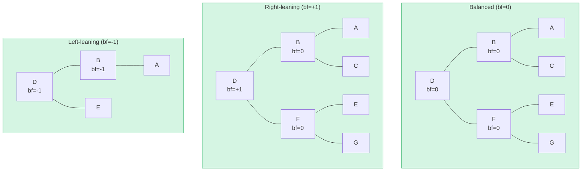

**無効** — バランスファクター = +2（回転が必要！）：

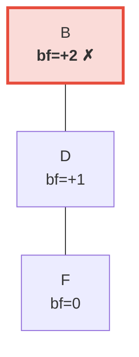

> 右のサブツリーが左（空）より 2 レベル高くなっています。これにより AVL 不変条件を復元するための**左回転**がトリガーされます。

## 回転 — バランスの復元

挿入または削除によりバランスファクターが ±2 に達すると、AVL 不変条件を復元するためにツリーを**回転**する必要があります。4つのケースがありますが、2つの基本操作に帰着します。

### 単一左回転

ノードが**右重**（bf = +2）であり、その右の子が**右重またはバランス**（bf ≥ 0）の場合に使用されます：

**回転前**（bf=+2）：

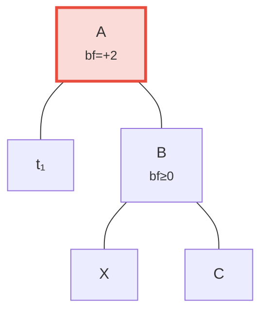

**回転後** — B がルートに昇格：

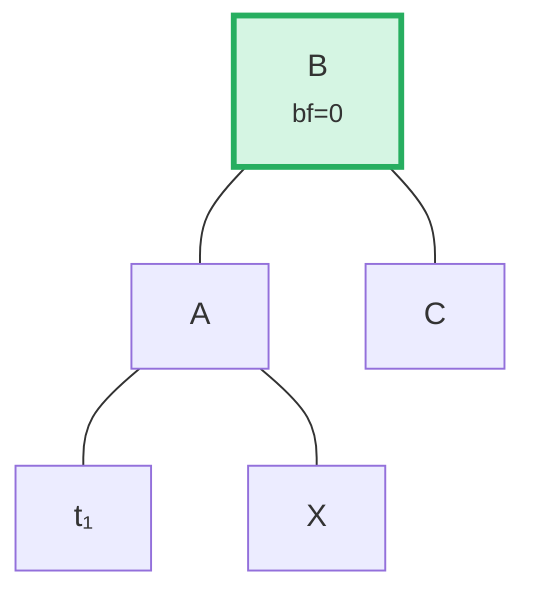

> **手順：** (1) B を A から切り離す。(2) X（B の左の子）を切り離す。(3) X を A の右の子として接続。(4) A を B の左の子として接続。B をルートとするサブツリーはバランスされます。

コード内では（`merk/src/tree/ops.rs`）：

```rust
fn rotate<V>(self, left: bool, ...) -> CostResult<Self, Error> {
    // Detach child on the heavy side
    let (tree, child) = self.detach_expect(left, ...);
    // Detach grandchild from opposite side of child
    let (child, maybe_grandchild) = child.detach(!left, ...);

    // Attach grandchild to original root
    tree.attach(left, maybe_grandchild)
        .maybe_balance(...)
        .flat_map_ok(|tree| {
            // Attach original root as child of promoted node
            child.attach(!left, Some(tree))
                .maybe_balance(...)
        })
}
```

`maybe_balance` が再帰的に呼び出されることに注意してください — 回転自体が新たな不均衡を生み出す可能性があり、さらなる修正が必要になることがあります。

### 二重回転（左-右）

ノードが**左重**（bf = -2）であるが、その左の子が**右重**（bf > 0）の場合に使用されます。単一回転ではこれを修正できません：

**ステップ 0：回転前** — C は左重（bf=-2）ですが、左の子 A は右に傾いています（bf=+1）。単一回転では修正できません：

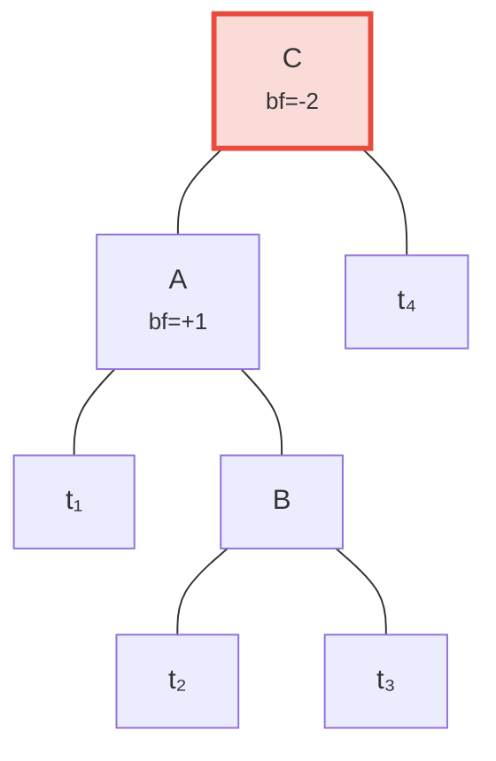

**ステップ 1：子 A を左回転** — C と B の両方が左に傾き、単一回転で修正可能に：

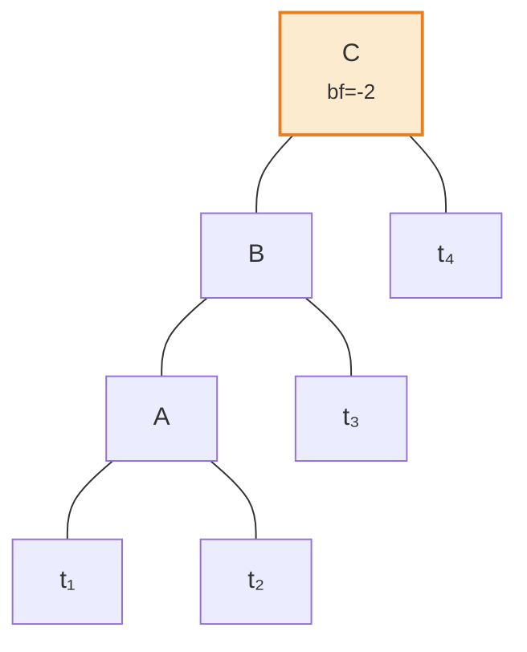

**ステップ 2：ルート C を右回転** — バランス達成！

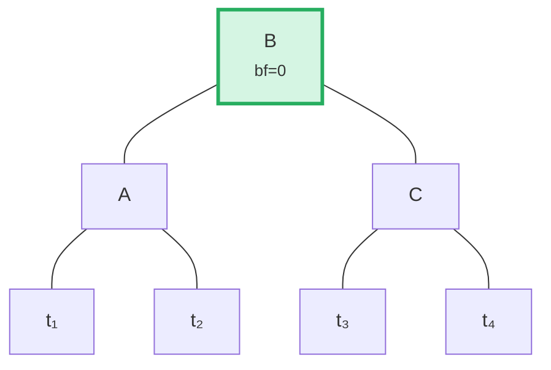

アルゴリズムは親の傾き方向と子のバランスファクターを比較してこのケースを検出します：

```rust
fn maybe_balance<V>(self, ...) -> CostResult<Self, Error> {
    let balance_factor = self.balance_factor();
    if balance_factor.abs() <= 1 {
        return Ok(self);  // Already balanced
    }

    let left = balance_factor < 0;  // true if left-heavy

    // Double rotation needed when child leans opposite to parent
    let tree = if left == (self.tree().link(left).unwrap().balance_factor() > 0) {
        // First rotation: rotate child in opposite direction
        self.walk_expect(left, |child|
            child.rotate(!left, ...).map_ok(Some), ...
        )
    } else {
        self
    };

    // Second (or only) rotation
    tree.rotate(left, ...)
}
```

## バッチ操作 — 構築と適用

要素を1つずつ挿入するのではなく、Merk は複数の変更を1回のパスで適用するバッチ操作をサポートします。これは効率性にとって重要です：M 個の要素を持つツリーに対する N 個の操作のバッチは **O((M + N) log(M + N))** の時間で処理され、逐次挿入の O(N log M) と比較されます。

### MerkBatch 型

```rust
type MerkBatch<K> = [(K, Op)];

enum Op {
    Put(Vec<u8>, TreeFeatureType),  // Insert or update with value and feature type
    PutWithSpecializedCost(...),     // Insert with predefined cost
    PutCombinedReference(...),       // Insert reference with combined hash
    Replace(Vec<u8>, TreeFeatureType),
    Patch { .. },                    // Partial value update
    Delete,                          // Remove key
    DeleteLayered,                   // Remove with layered cost
    DeleteMaybeSpecialized,          // Remove with optional specialized cost
}
```

### 戦略 1：build() — ゼロからの構築

ツリーが空の場合、`build()` は**中央分割**アルゴリズムを使用して、ソート済みバッチから直接バランスの取れたツリーを構築します：

入力バッチ（ソート済み）：`[A, B, C, D, E, F, G]` — 中央（D）をルートとして選択し、各半分に再帰：

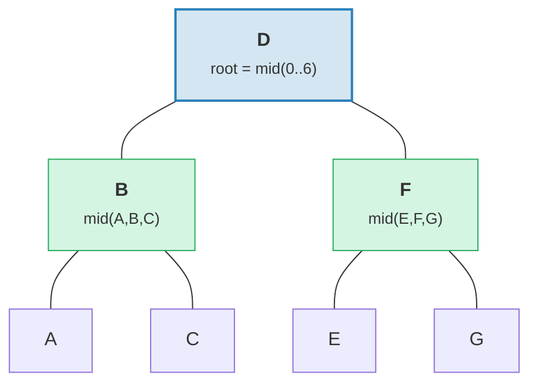

> 結果：高さ 3 = ⌈log₂(7)⌉ の完全にバランスしたツリー。

```rust
fn build(batch: &MerkBatch<K>, ...) -> CostResult<Option<TreeNode>, Error> {
    let mid_index = batch.len() / 2;
    let (mid_key, mid_op) = &batch[mid_index];

    // Create root node from middle element
    let mid_tree = TreeNode::new(mid_key.clone(), value.clone(), None, feature_type)?;

    // Recursively build left and right subtrees
    let left = Self::build(&batch[..mid_index], ...);
    let right = Self::build(&batch[mid_index + 1..], ...);

    // Attach children
    mid_tree.attach(true, left).attach(false, right)
}
```

これは高さ ⌈log₂(n)⌉ のツリーを生成します — 完全にバランスしています。

### 戦略 2：apply_sorted() — 既存ツリーへのマージ

ツリーに既にデータがある場合、`apply_sorted()` は**二分探索**を使用して各バッチ操作の適用先を見つけ、左右のサブツリーに対して再帰的に操作を適用します：

バッチ `[(B, Put), (F, Delete)]` を持つ既存ツリー：

二分探索：B < D（左へ）、F > D（右へ）。

**適用前：**
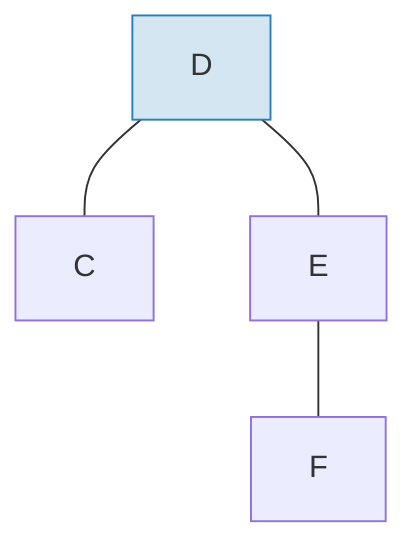

**適用後**（バッチ適用とリバランス後）：
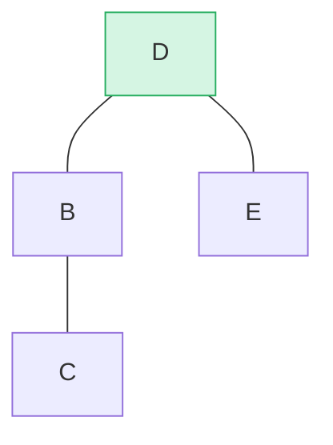

> B が左サブツリーとして挿入され、F が右サブツリーから削除されました。`maybe_balance()` により bf(D) = 0 が確認されます。

```rust
fn apply_sorted(self, batch: &MerkBatch<K>, ...) -> CostResult<...> {
    let search = batch.binary_search_by(|(key, _)| key.cmp(self.tree().key()));

    match search {
        Ok(index) => {
            // Key matches this node — apply operation directly
            // (Put replaces value, Delete removes node)
        }
        Err(mid) => {
            // Key not found — mid is the split point
            // Recurse on left_batch[..mid] and right_batch[mid..]
        }
    }

    self.recurse(batch, mid, exclusive, ...)
}
```

`recurse` メソッドはバッチを分割して左右を走査します：

```rust
fn recurse(self, batch: &MerkBatch<K>, mid: usize, ...) {
    let left_batch = &batch[..mid];
    let right_batch = &batch[mid..];  // or mid+1 if exclusive

    // Apply left batch to left subtree
    let tree = self.walk(true, |maybe_left| {
        Self::apply_to(maybe_left, left_batch, ...)
    });

    // Apply right batch to right subtree
    let tree = tree.walk(false, |maybe_right| {
        Self::apply_to(maybe_right, right_batch, ...)
    });

    // Re-balance after modifications
    tree.maybe_balance(...)
}
```

### ノードの削除

2つの子を持つノードを削除する際、Merk はより高いサブツリーから**端ノード**を昇格させます。これにより追加の回転が必要になる可能性を最小限に抑えます：

**削除前** — D を削除（2つの子があり、右サブツリーの高さ ≥ 左）：

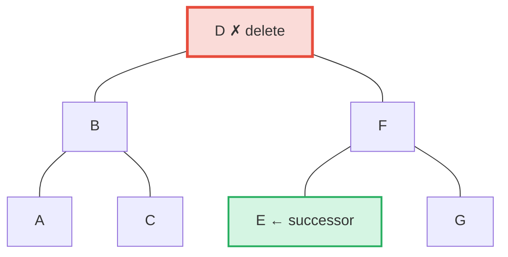

**削除後** — E（右サブツリーの最左 = 中順後継者）が D の位置に昇格：

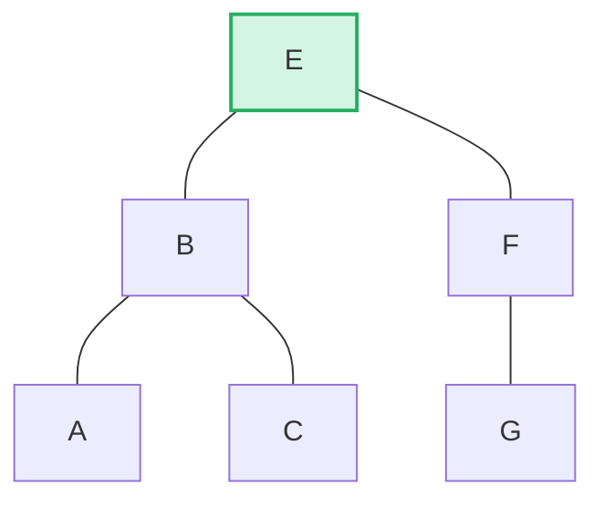

> **ルール：** 左の高さ > 右 → 左サブツリーの右端を昇格。右の高さ ≥ 左 → 右サブツリーの左端を昇格。これにより削除後のリバランスが最小化されます。

```rust
pub fn remove(self, ...) -> CostResult<Option<Self>, Error> {
    let has_left = tree.link(true).is_some();
    let has_right = tree.link(false).is_some();
    let left = tree.child_height(true) > tree.child_height(false);

    if has_left && has_right {
        // Two children: promote edge of taller child
        let (tree, tall_child) = self.detach_expect(left, ...);
        let (_, short_child) = tree.detach_expect(!left, ...);
        tall_child.promote_edge(!left, short_child, ...)
    } else if has_left || has_right {
        // One child: promote it directly
        self.detach_expect(left, ...).1
    } else {
        // Leaf node: just remove
        None
    }
}
```

---
