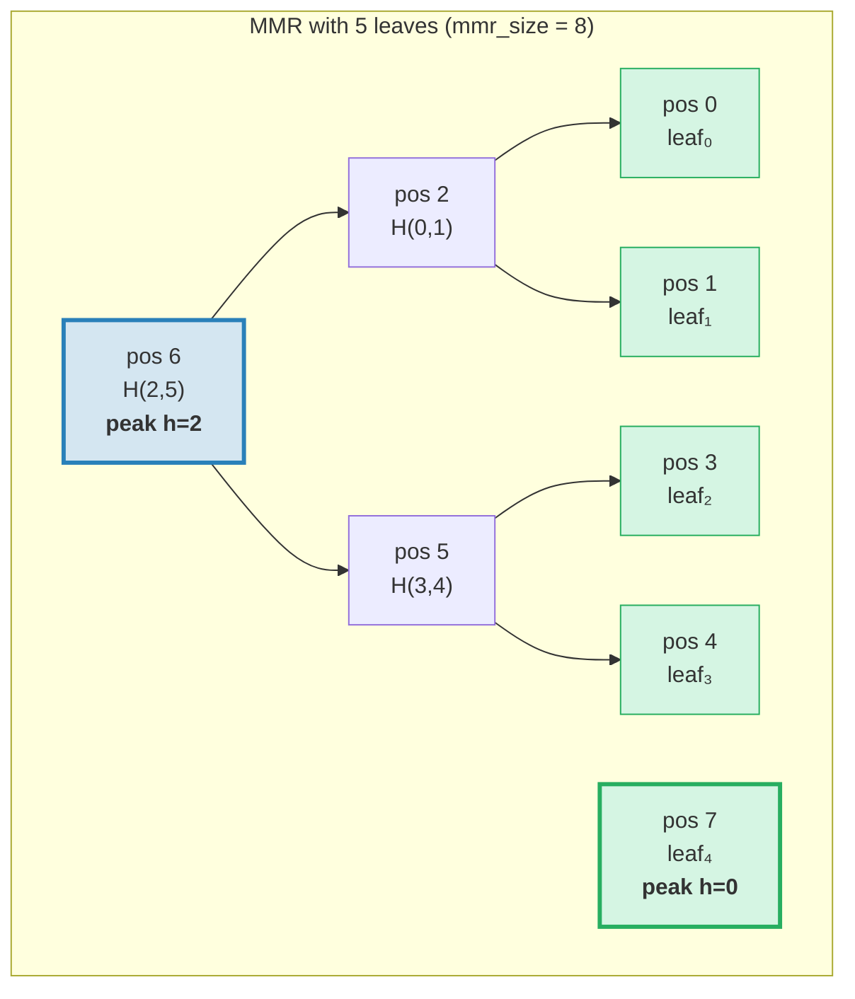
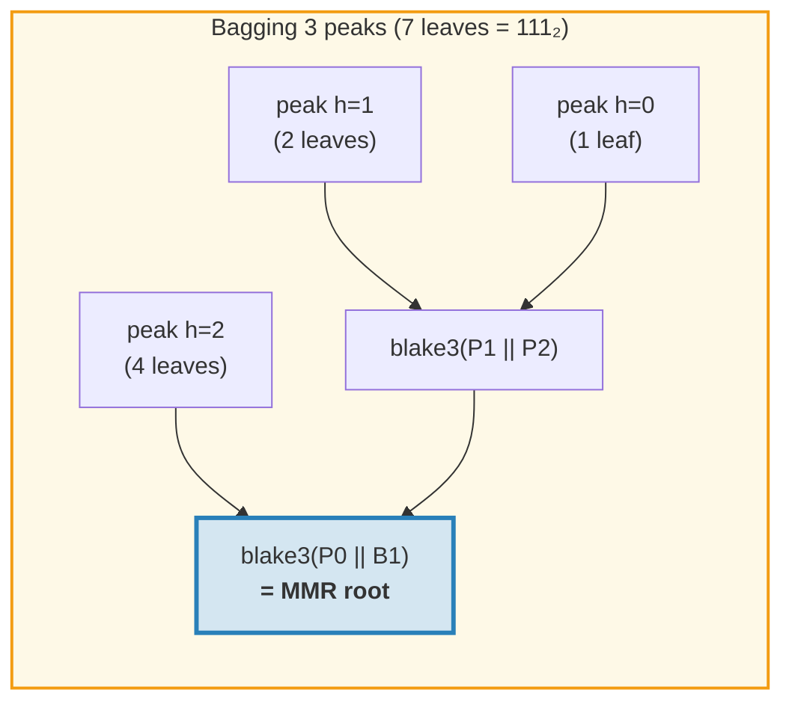
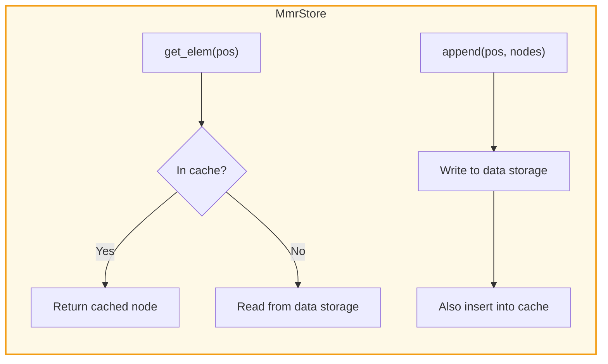
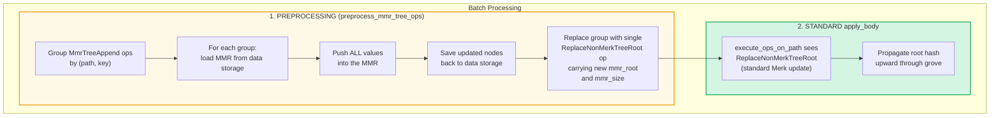
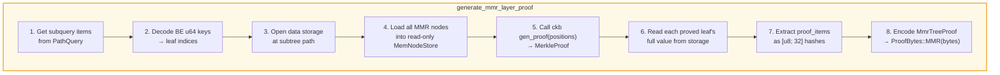
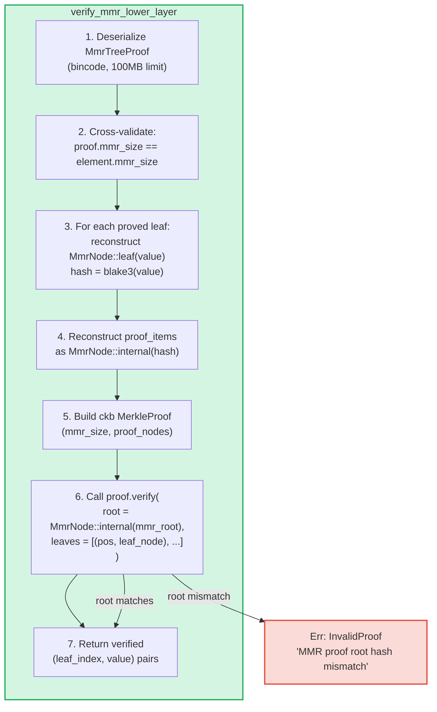

# MMR ツリー — 追記専用の認証済みログ

**MmrTree** は GroveDB の追記専用認証データ構造であり、Blake3 ハッシュを使用する Merkle Mountain Range（MMR）上に構築されています。Merk AVL 木（第2章）がO(log N)の更新を伴うランダムなキーバリュー操作に優れている一方で、MMR は追記専用のケースに特化しています：回転なし、追記あたりO(1)の償却ハッシュコスト、シーケンシャルなI/Oパターンを提供します。

この章では MMR データ構造を詳しく解説します — その成長方法、ノードの格納方法、追記のカスケード方法、そして第三者が特定の位置に特定の値が追記されたことを検証できる証明システムについて説明します。

## 別のツリー型が必要な理由

GroveDB の標準 Merk ツリーは順序付きキーバリューデータをうまく処理しますが、追記専用ログには異なる要件があります：

| プロパティ | Merk AVL 木 | MMR |
|----------|--------------|-----|
| 操作 | 挿入、更新、削除 | 追記のみ |
| リバランス | 書き込みあたり O(log N) 回転 | なし |
| I/O パターン | ランダム（リバランスが多くのノードに触れる） | シーケンシャル（新ノードは常に末尾） |
| N回の挿入の総ハッシュ数 | O(N log N) | O(N) |
| 構造 | 挿入順序に依存 | リーフ数のみに依存 |
| 証明 | ルートからリーフへのパス | 兄弟 + ピークハッシュ |

トランザクションログ、イベントストリーム、または単調に増加するデータなどのユースケースでは、MMR は厳密に優れています：よりシンプル、高速、予測可能です。

## MMR データ構造

MMR は左から右に成長する**完全二分木の森**（「ピーク」と呼ばれる）です。各ピークは高さ *h* の完全二分木であり、正確に 2^h 個のリーフを含みます。

重要な洞察：**リーフ数の二進表現がピーク構造を決定します**。二進形式の各1ビットが1つのピークに対応します：

```text
Leaf count    Binary    Peaks
─────────     ──────    ─────
1             1         one peak h=0
2             10        one peak h=1
3             11        peaks h=1, h=0
4             100       one peak h=2
5             101       peaks h=2, h=0
6             110       peaks h=2, h=1
7             111       peaks h=2, h=1, h=0
8             1000      one peak h=3
```

これは MMR の構造が単一の数値 — リーフ数だけで完全に決定されることを意味します。同じリーフ数を持つ2つの MMR は、どの値が追記されたかに関係なく、常に同じ形状になります。

## MMR の充填方法

MMR 内の各ノードには**位置**（0インデックス）があります。リーフと内部ノードは特定のパターンで交互に配置されます。以下はステップバイステップの成長過程です：

**1リーフ後（mmr_size = 1）：**
```text
pos:  0
      leaf₀        ← one peak at height 0
```

**2リーフ後（mmr_size = 3）：**
```text
pos:     2          ← internal: blake3(leaf₀.hash || leaf₁.hash)
        / \
       0   1        ← leaves

One peak at height 1. Positions 0 and 1 are leaves, position 2 is internal.
```
leaf₁ が追記されると、高さ0のピークが作成されます。しかし既に高さ0のピーク（leaf₀）があったため、高さ1のピークに**マージ**されます。

**3リーフ後（mmr_size = 4）：**
```text
pos:     2     3    ← peak h=1, peak h=0
        / \
       0   1

Two peaks. No merge — heights 1 and 0 are different.
(Binary: 3 = 11₂ → one peak per 1-bit)
```

**4リーフ後（mmr_size = 7）：**
```text
pos:         6              ← internal: merge of nodes 2 and 5
           /   \
         2       5          ← internal nodes
        / \     / \
       0   1   3   4        ← leaves

One peak at height 2.
```
ここが興味深いところです。leaf₃（位置4）の追記によりnode₅が作成されます（位置3と4のマージ）。しかしnode₅（高さ1）とnode₂（高さ1）は等しい高さの隣接ピークであるため、node₆にマージされます。**単一の追記から2回のマージのカスケード。**

**5リーフ後（mmr_size = 8）：**
```text
pos:         6         7    ← peak h=2, peak h=0
           /   \
         2       5
        / \     / \
       0   1   3   4

Two peaks. (Binary: 5 = 101₂)
```

**7リーフ後（mmr_size = 11）：**
```text
pos:         6         10    ← peak h=2, peak h=1, peak h=0
           /   \      / \
         2       5   8   9    7
        / \     / \
       0   1   3   4

Three peaks. (Binary: 7 = 111₂)
```

**8リーフ後（mmr_size = 15）：**
```text
pos:              14                     ← single peak h=3
               /      \
            6            13
          /   \        /    \
        2       5    9       12
       / \     / \  / \     / \
      0   1   3  4 7   8  10  11

One peak at height 3. Three cascading merges from appending leaf₇.
```



> **青** = ピーク（完全二分部分木のルート）。**緑** = リーフノード。

## マージカスケード

新しいリーフが追記されると、マージの連鎖が発生する可能性があります。マージの回数は現在のリーフ数の二進表現における**末尾の1ビット数**と等しくなります：

| リーフ数（push前） | 二進数 | 末尾の1 | マージ数 | 総ハッシュ数 |
|--------------------------|--------|-------------|--------|--------------|
| 0 | `0` | 0 | 0 | 1（リーフのみ） |
| 1 | `1` | 1 | 1 | 2 |
| 2 | `10` | 0 | 0 | 1 |
| 3 | `11` | 2 | 2 | 3 |
| 4 | `100` | 0 | 0 | 1 |
| 5 | `101` | 1 | 1 | 2 |
| 6 | `110` | 0 | 0 | 1 |
| 7 | `111` | 3 | 3 | 4 |

**pushあたりの総ハッシュ数** = `1 + trailing_ones(leaf_count)`：
- リーフ自体に1ハッシュ：`blake3(value)`
- マージカスケードにNハッシュ：各マージに `blake3(left.hash || right.hash)`

GroveDB が各追記のハッシュコストを追跡する方法はこれです。実装：
```rust
pub fn hash_count_for_push(leaf_count: u64) -> u32 {
    1 + leaf_count.trailing_ones()
}
```

## MMR サイズ vs リーフ数

MMR はフラットな位置空間にリーフと内部ノードの両方を格納するため、`mmr_size` は常にリーフ数より大きくなります。正確な関係は：

```text
mmr_size = 2 * leaf_count - popcount(leaf_count)
```

ここで `popcount` は1ビットの数（つまりピークの数）です。各内部ノードは2つのサブツリーをマージし、マージごとにノード数を1つ減らします。

逆の計算 — mmr_size からリーフ数 — はピーク位置を使用します：

```rust
fn mmr_size_to_leaf_count(mmr_size: u64) -> u64 {
    // Each peak at height h contains 2^h leaves
    get_peaks(mmr_size).iter()
        .map(|&peak_pos| 1u64 << pos_height_in_tree(peak_pos))
        .sum()
}
```

| mmr_size | leaf_count | ピーク |
|----------|-----------|-------|
| 0 | 0 | （空） |
| 1 | 1 | h=0 |
| 3 | 2 | h=1 |
| 4 | 3 | h=1, h=0 |
| 7 | 4 | h=2 |
| 8 | 5 | h=2, h=0 |
| 10 | 6 | h=2, h=1 |
| 11 | 7 | h=2, h=1, h=0 |
| 15 | 8 | h=3 |

GroveDB はエレメントに `mmr_size`（リーフ数ではなく）を格納します。ckb MMR ライブラリが内部的に位置を使用するためです。`mmr_tree_leaf_count` 操作はリーフ数をその場で導出します。

## MMR ルートハッシュ — ピークのバギング

MMR には複数のピーク（リーフ数の各1ビットに1つ）があります。単一の32バイトルートハッシュを生成するために、ピークは右から左に**「バギング」**されます：

```text
root = bag_rhs_peaks(peaks):
    start with rightmost peak
    fold leftward: blake3(left_peak || accumulated_right)
```

ピークが1つの場合、ルートはそのピークのハッシュです。3つのピークの場合：



> ルートハッシュはマージが発生しなくても**すべて**の追記で変わります。最右のピークが変わり、バギングを再計算する必要があるためです。

## ノード構造とシリアライズ

各 MMR ノードは `MmrNode` です：

```rust
struct MmrNode {
    hash: [u8; 32],           // Blake3 hash
    value: Option<Vec<u8>>,   // Some for leaves, None for internal nodes
}
```

**リーフノード:** `hash = blake3(value_bytes)`、`value = Some(value_bytes)`
**内部ノード:** `hash = blake3(left.hash || right.hash)`、`value = None`

マージ関数はシンプルです — 2つの32バイトハッシュを連結して Blake3 で処理：

```rust
fn blake3_merge(left: &[u8; 32], right: &[u8; 32]) -> [u8; 32] {
    let mut input = [0u8; 64];
    input[..32].copy_from_slice(left);
    input[32..].copy_from_slice(right);
    *blake3::hash(&input).as_bytes()
}
```

> **PartialEq に関する注意:** `MmrNode` は**ハッシュフィールドのみ**を比較する `PartialEq` を実装しており、value は比較しません。これは証明検証にとって重要です：ckb 検証者は再構築されたルート（value = None）を期待されるルートと比較します。PartialEq が value フィールドを比較すると、単一リーフの MMR 証明は常に失敗します。リーフが `value: Some(...)` を持つ一方、ルート再構築は `value: None` を生成するためです。

**シリアライズ形式：**
```text
Internal: [0x00] [hash: 32 bytes]                                = 33 bytes
Leaf:     [0x01] [hash: 32 bytes] [value_len: 4 BE] [value...]   = 37 + len bytes
```

フラグバイトが内部ノードとリーフを区別します。デシリアライズは正確な長さを検証します — 末尾のバイトは許可されません。

## ストレージアーキテクチャ

MmrTree はノードを**データ**カラム（Merk ノードが使用するのと同じカラムファミリー）に格納し、子 Merk サブツリーには格納しません。エレメントに `root_key` フィールドはありません — MMR ルートハッシュは `insert_subtree(subtree_root_hash)` 経由で Merk **子ハッシュ**として流れ、MMR の状態を認証します。

**ストレージキー**は位置ベースです：
```text
key = 'm' || position_as_be_u64    (9 bytes: prefix + u64 BE)
```

位置42は `[0x6D, 0x00, 0x00, 0x00, 0x00, 0x00, 0x00, 0x00, 0x2A]` のキーに格納されます。

リーフ *i* の検索には、まず MMR 位置を計算する必要があります：`pos = leaf_index_to_pos(i)`、そしてデータキー `m{pos}` を読み取ります。

**ライトスルーキャッシュ:** 追記中に新しく書き込まれたノードは、同じpush内の後続のマージのためにすぐに読み取り可能である必要があります。GroveDB のトランザクショナルストレージは書き込みをバッチに遅延させるため（コミットまで読み取りに反映されない）、`MmrStore` アダプタはインメモリの `HashMap` キャッシュでストレージコンテキストをラップします：



これにより、leaf₃の追記がマージカスケードをトリガーして（位置5と6に内部ノードを作成する場合）、node₆の計算時にnode₅がすぐに利用可能になります。node₅がまだ RocksDB にコミットされていなくても。

**GroveDB ステートルートへのルートハッシュ伝播：**

```text
combined_value_hash = blake3(
    blake3(varint(len) || element_bytes),   ← value_hash from serialized Element
    mmr_root_hash                           ← child_hash = type-specific root
)
```

MMR ルートハッシュは `insert_subtree` 経由で Merk 子ハッシュとして流れます。MMR 状態への変更は異なる `combined_value_hash` を生成し、親 Merk 階層を通じて GroveDB ステートルートまで上方に伝播します。

## GroveDB 操作

MmrTree は4つの操作を提供します：

```rust
// Append a value — returns (new_mmr_root, leaf_index)
db.mmr_tree_append(path, key, value, tx, version)

// Read the current root hash (from Element, no storage access)
db.mmr_tree_root_hash(path, key, tx, version)

// Get a leaf value by 0-based index
db.mmr_tree_get_value(path, key, leaf_index, tx, version)

// Get the number of leaves appended
db.mmr_tree_leaf_count(path, key, tx, version)
```

### 追記フロー

追記操作は最も複雑で、8つのステップを実行します：

```mermaid
graph TD
    subgraph append["mmr_tree_append(path, key, value, tx)"]
        A1["1. Read Element at path/key<br/>→ get mmr_size, flags"]
        A2["2. Open data storage at<br/>path/key subtree"]
        A3["3. Create MmrNode::leaf(value)<br/>hash = blake3(value)"]
        A4["4. Push leaf into ckb MMR<br/>→ cascading merges write<br/>new internal nodes"]
        A5["5. Commit → flush new<br/>nodes to storage"]
        A6["6. Bag peaks → new mmr_root"]
        A7["7. Update Element with<br/>new mmr_root and mmr_size"]
        A8["8. Propagate changes up<br/>through GroveDB Merk<br/>hierarchy + commit tx"]

        A1 --> A2 --> A3 --> A4 --> A5 --> A6 --> A7 --> A8
    end

    style append fill:#d5f5e3,stroke:#27ae60,stroke-width:2px
    style A6 fill:#d4e6f1,stroke:#2980b9,stroke-width:2px
```



ステップ4は1ノード（リーフのみ）または 1 + N ノード（リーフ + N個の内部マージノード）を書き込む可能性があります。ステップ5は `mmr.commit()` を呼び出し、ckb MemStore を MmrStore にフラッシュします。ステップ7は新しい MMR ルートを子ハッシュとして `insert_subtree` を呼び出します（`subtree_root_hash` 経由）。MmrTree には子 Merk がないためです。

### 読み取り操作

`mmr_tree_root_hash` はストレージ内の MMR データからルートを計算します。
`mmr_tree_leaf_count` はエレメント内の `mmr_size` からリーフ数を導出します。
データストレージへのアクセスは不要です。

`mmr_tree_get_value` は `pos = leaf_index_to_pos(leaf_index)` を計算し、`m{pos}` の単一のデータストレージエントリを読み取り、`MmrNode` をデシリアライズして `node.value` を返します。

## バッチ操作

複数の MMR 追記は `GroveOp::MmrTreeAppend { value }` を使用してバッチ処理できます。標準バッチの `execute_ops_on_path` 関数は Merk へのアクセスのみ（MMR のストレージコンテキストへのアクセスなし）であるため、MMR 追記は**前処理フェーズ**を使用します：



例：同じ MMR への3回の追記を含むバッチ：
```rust
vec![
    QualifiedGroveDbOp { path: p, key: k, op: MmrTreeAppend { value: v1 } },
    QualifiedGroveDbOp { path: p, key: k, op: MmrTreeAppend { value: v2 } },
    QualifiedGroveDbOp { path: p, key: k, op: MmrTreeAppend { value: v3 } },
]
```

前処理は MMR を一度読み込み、v1、v2、v3 を push し（すべての中間ノードを作成）、すべてをデータストレージに保存し、最終的な `mmr_root` と `mmr_size` を持つ単一の `ReplaceNonMerkTreeRoot` を出力します。標準バッチ機構が残りを処理します。

## 証明生成

MMR 証明は **V1 証明** — レイヤー化された証明構造の `ProofBytes::MMR` バリアントを使用します（9.6節参照）。証明は、特定のリーフ値が MMR 内の特定の位置に存在し、そのハッシュが親エレメントに格納された `mmr_root` と整合していることを実証します。

### クエリエンコーディング

クエリキーは位置を**ビッグエンディアン u64 バイト**としてエンコードします。BE エンコーディングは単調であるため辞書順ソート順序を保持し、すべての標準 `QueryItem` バリアントが動作します：

```text
QueryItem::Key([0,0,0,0,0,0,0,5])            → leaf index 5
QueryItem::RangeInclusive([..2]..=[..7])      → leaf indices [2, 3, 4, 5, 6, 7]
QueryItem::RangeFrom([..10]..)                → leaf indices [10, 11, ..., N-1]
QueryItem::RangeFull                          → all leaves [0..leaf_count)
```

無制限の範囲クエリによるメモリ枯渇を防ぐため、**10,000,000インデックス**の安全キャップがあります。空の MMR（リーフなし）は空の証明を返します。

### MmrTreeProof 構造体

```rust
struct MmrTreeProof {
    mmr_size: u64,                 // MMR size at proof time
    leaves: Vec<(u64, Vec<u8>)>,   // (leaf_index, value) for each proved leaf
    proof_items: Vec<[u8; 32]>,    // Sibling/peak hashes for verification
}
```

`proof_items` には、証明されたリーフから MMR ルートまでのパスを再構築するために必要な最小限のハッシュセットが含まれます。各レベルの兄弟ノードと関与していないピークハッシュです。

### 生成フロー



ステップ4は `MemNodeStore` — データストレージからすべての MMR ノードをプリロードする読み取り専用 BTreeMap を使用します。ckb 証明生成器にはランダムアクセスが必要なため、すべてのノードがメモリ内にある必要があります。

ステップ5は ckb ライブラリが重い処理を行うところです：MMR サイズと証明する位置が与えられると、必要な兄弟およびピークハッシュを決定します。

### 実例

**5リーフ MMR（mmr_size = 8）でリーフ2を証明：**

```text
MMR structure:
pos:         6         7
           /   \
         2       5
        / \     / \
       0   1   3   4

Leaf index 2 → MMR position 3

To verify leaf at position 3:
  1. Hash the claimed value: leaf_hash = blake3(value)
  2. Sibling at position 4:  node₅ = blake3(leaf_hash || proof[pos 4])
  3. Sibling at position 2:  node₆ = blake3(proof[pos 2] || node₅)
  4. Peak at position 7:     root  = bag(node₆, proof[pos 7])
  5. Compare: root == expected mmr_root ✓

proof_items = [hash(pos 4), hash(pos 2), hash(pos 7)]
leaves = [(2, original_value_bytes)]
```

この例の証明サイズは：3ハッシュ（96バイト）+ 1リーフ値 + メタデータ。一般に、N リーフの MMR から K リーフを証明するには O(K * log N) 個の兄弟ハッシュが必要です。

## 証明検証

検証は**純粋**です — データベースアクセスは不要です。検証者に必要なのは証明バイトと期待される MMR ルートハッシュ（上位の Merk レイヤーで証明された親エレメントから抽出）のみです。

### 検証ステップ



ckb `MerkleProof::verify` 関数はリーフと証明アイテムからルートを再構築し、`PartialEq`（ハッシュのみをチェック）を使用して期待されるルートと比較します。

### 信頼の連鎖

GroveDB ステートルートから検証済みリーフ値までの完全な連鎖：

```text
GroveDB state_root (known/trusted)
│
├─ V0 Merk proof layer 0: proves subtree exists at root
│   └─ root_hash matches state_root ✓
│
├─ V0 Merk proof layer 1: proves MmrTree element at path/key
│   └─ KVValueHash node: element_bytes contain mmr_root
│   └─ combined_hash = combine_hash(H(element_bytes), mmr_root)
│   └─ root_hash matches parent layer ✓
│
└─ V1 MMR proof: proves leaf values are in the MMR
    └─ Reconstruct paths from leaves through siblings to peaks
    └─ Bag peaks → reconstructed root
    └─ reconstructed root == mmr_root from element_bytes ✓
    └─ Result: leaf₂ = [verified value bytes]
```

### セキュリティ特性

- **mmr_size のクロスバリデーション:** 証明の `mmr_size` はエレメントの `mmr_size` と一致する必要があります。不一致は証明が異なる状態に対して生成されたことを示し、拒否されます。
- **Bincode サイズ制限:** デシリアライズは巨大な割り当てを引き起こす細工された長さヘッダを防ぐため100MB制限を使用します。
- **リミットの計算:** 各証明済みリーフはアンダーフローを防ぐために `saturating_sub` を使用して全体のクエリリミットを1減少させます。
- **子ハッシュの返却:** 検証者は親レイヤーの combine_hash 計算のために計算された MMR ルートを子ハッシュとして返します。
- **V0 の拒否:** V0 証明で MmrTree にサブクエリしようとすると `Error::NotSupported` が返されます。非 Merk ツリーに降りることができるのは V1 証明のみです。

## コスト追跡

MMR 操作は正確にコストを追跡します：

| 操作 | ハッシュ呼び出し | ストレージ操作 |
|-----------|-----------|-------------------|
| 1リーフの追記 | `1 + trailing_ones(leaf_count)` | 1リーフ書き込み + N内部書き込み |
| ルートハッシュ | 0（エレメントにキャッシュ） | 1エレメント読み取り |
| 値の取得 | 0 | 1エレメント読み取り + 1データ読み取り |
| リーフ数 | 0 | 1エレメント読み取り |

ハッシュ数の公式 `1 + trailing_ones(N)` は正確な Blake3 呼び出し数を与えます：リーフハッシュに1、カスケードレベルごとに1つのマージハッシュ。

**償却分析:** N回の追記にわたる総ハッシュ数：

```text
Σ (1 + trailing_ones(i)) for i = 0..N-1
= N + Σ trailing_ones(i) for i = 0..N-1
= N + (N - popcount(N))
≈ 2N
```

したがって追記あたりの償却コストは約 **2回の Blake3 ハッシュ呼び出し** — ツリーサイズに依存しない定数です。各挿入にパスのために O(log N) のハッシュと潜在的な回転ハッシュが必要な Merk AVL 木と比較してください。

**ストレージコスト:** 各追記は1リーフノード（37 + value_len バイト）と0から log₂(N) 個の内部ノード（各33バイト）を書き込みます。追記あたりの償却ストレージ書き込みは約 33 + 37 + value_len バイト ≈ 70 + value_len バイトです。

## 実装ファイル

| ファイル | 目的 |
|------|---------|
| `grovedb-mmr/src/node.rs` | `MmrNode` 構造体、Blake3 マージ、シリアライズ |
| `grovedb-mmr/src/grove_mmr.rs` | ckb MMR をラップする `GroveMmr` |
| `grovedb-mmr/src/util.rs` | `mmr_node_key`、`hash_count_for_push`、`mmr_size_to_leaf_count` |
| `grovedb-mmr/src/proof.rs` | `MmrTreeProof` の生成と検証 |
| `grovedb-mmr/src/dense_merkle.rs` | 密なマークル木ルート（BulkAppendTree で使用） |
| `grovedb/src/operations/mmr_tree.rs` | GroveDB 操作 + `MmrStore` アダプタ + バッチ前処理 |
| `grovedb/src/operations/proof/generate.rs` | V1 証明生成：`generate_mmr_layer_proof`、`query_items_to_leaf_indices` |
| `grovedb/src/operations/proof/verify.rs` | V1 証明検証：`verify_mmr_lower_layer` |
| `grovedb/src/tests/mmr_tree_tests.rs` | 28の統合テスト |

## 他の認証構造との比較

| | MMR (MmrTree) | Merk AVL (Tree) | Sinsemilla (CommitmentTree) |
|---|---|---|---|
| **ユースケース** | 追記専用ログ | キーバリューストア | ZK対応コミットメント |
| **ハッシュ関数** | Blake3 | Blake3 | Sinsemilla（Pallas 曲線） |
| **操作** | 追記、インデックスで読み取り | 挿入、更新、削除、クエリ | 追記、証人 |
| **書き込みあたりの償却ハッシュ** | ~2 | O(log N) | ~33（32レベル + オマー） |
| **証明型** | V1（MMR 兄弟ハッシュ） | V0（Merk パス証明） | 証人（マークル認証パス） |
| **ZK対応** | いいえ | いいえ | はい（Halo 2 回路） |
| **リバランス** | なし | AVL 回転 | なし |
| **削除サポート** | なし | あり | なし |

---
