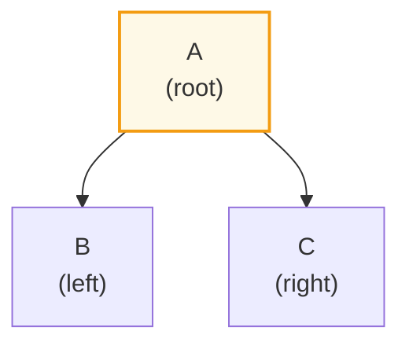
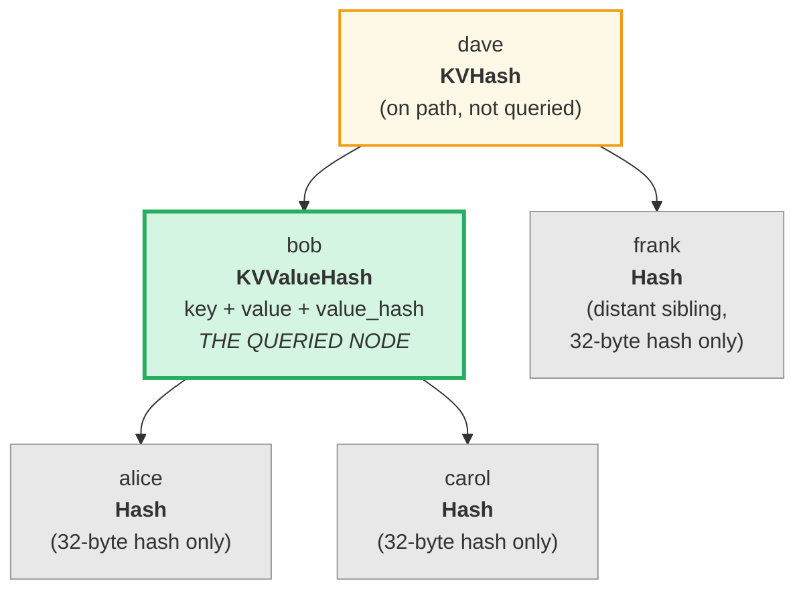
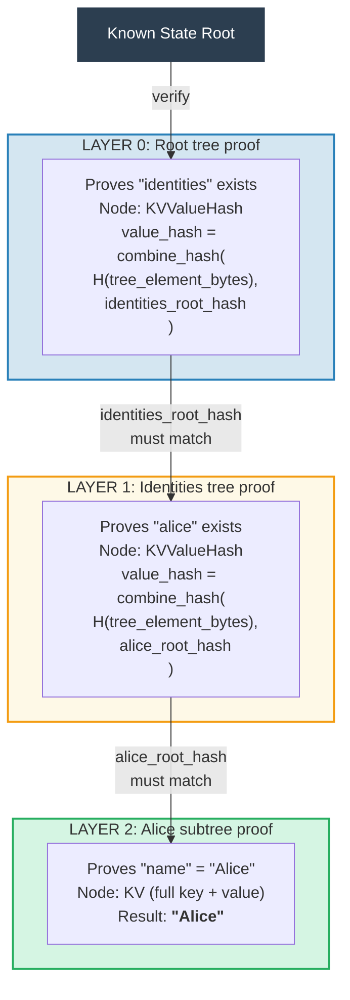
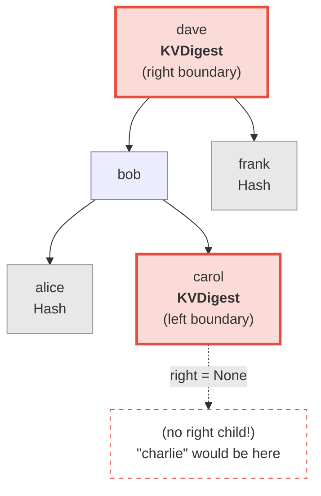
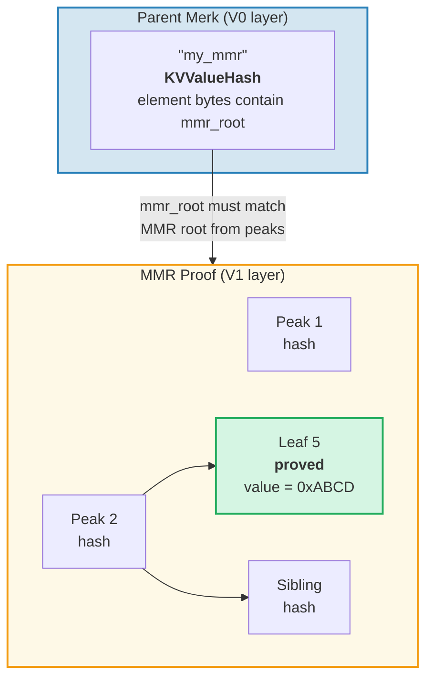
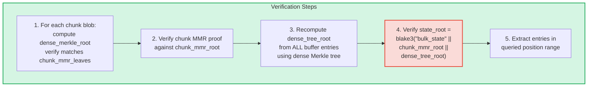
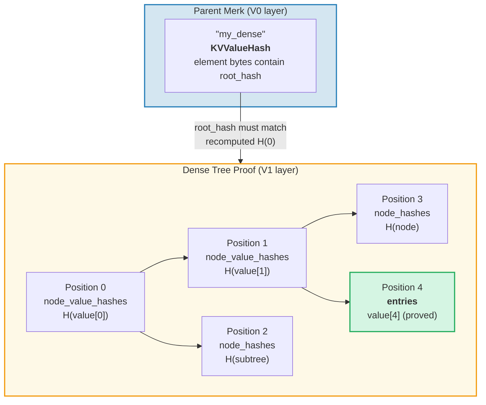

# 証明システム

GroveDB の証明システム（proof system）により、完全なデータベースを持たない任意の当事者がクエリ結果の正しさを検証できます。証明はルートハッシュの再構築を可能にするツリー構造のコンパクトな表現です。

## スタックベースの証明操作

証明はスタックマシンを使用して部分的なツリーを再構築する**操作**のシーケンスとしてエンコードされます：

```rust
// merk/src/proofs/mod.rs
pub enum Op {
    Push(Node),        // Push a node onto the stack (ascending key order)
    PushInverted(Node),// Push a node (descending key order)
    Parent,            // Pop parent, pop child → attach child as LEFT of parent
    Child,             // Pop child, pop parent → attach child as RIGHT of parent
    ParentInverted,    // Pop parent, pop child → attach child as RIGHT of parent
    ChildInverted,     // Pop child, pop parent → attach child as LEFT of parent
}
```

実行にはスタックを使用します：

証明操作列：`Push(B), Push(A), Parent, Push(C), Child`

| ステップ | 操作 | スタック（上→右） | アクション |
|------|-----------|-------------------|--------|
| 1 | Push(B) | [ B ] | B をスタックにプッシュ |
| 2 | Push(A) | [ B , A ] | A をスタックにプッシュ |
| 3 | Parent | [ A{left:B} ] | A（親）をポップ、B（子）をポップ、B → A の LEFT |
| 4 | Push(C) | [ A{left:B} , C ] | C をスタックにプッシュ |
| 5 | Child | [ A{left:B, right:C} ] | C（子）をポップ、A（親）をポップ、C → A の RIGHT |

最終結果 — スタック上に1つのツリー：



> 検証者は `node_hash(A) = Blake3(kv_hash_A || node_hash_B || node_hash_C)` を計算し、期待されるルートハッシュと一致するか確認します。

これは `execute` 関数です（`merk/src/proofs/tree.rs`）：

```rust
pub fn execute<I, F>(ops: I, collapse: bool, mut visit_node: F) -> CostResult<Tree, Error>
where
    I: IntoIterator<Item = Result<Op, Error>>,
    F: FnMut(&Node) -> Result<(), Error>,
{
    let mut stack: Vec<Tree> = Vec::with_capacity(32);

    for op in ops {
        match op? {
            Op::Parent => {
                let (mut parent, child) = (try_pop(&mut stack), try_pop(&mut stack));
                parent.left = Some(Child { tree: Box::new(child), hash: child.hash() });
                stack.push(parent);
            }
            Op::Child => {
                let (child, mut parent) = (try_pop(&mut stack), try_pop(&mut stack));
                parent.right = Some(Child { tree: Box::new(child), hash: child.hash() });
                stack.push(parent);
            }
            Op::Push(node) => {
                visit_node(&node)?;
                stack.push(Tree::from(node));
            }
            // ... Inverted variants swap left/right
        }
    }
    // Final item on stack is the root
}
```

## 証明内のノード型

各 `Push` は検証に十分な情報を含む `Node` を運びます：

```rust
pub enum Node {
    // Minimum info — just the hash. Used for distant siblings.
    Hash(CryptoHash),

    // KV hash for nodes on the path but not queried.
    KVHash(CryptoHash),

    // Full key-value for queried items.
    KV(Vec<u8>, Vec<u8>),

    // Key, value, and pre-computed value_hash.
    // Used for subtrees where value_hash = combine_hash(...)
    KVValueHash(Vec<u8>, Vec<u8>, CryptoHash),

    // KV with feature type — for ProvableCountTree or chunk restoration.
    KVValueHashFeatureType(Vec<u8>, Vec<u8>, CryptoHash, TreeFeatureType),

    // Reference: key, dereferenced value, hash of reference element.
    KVRefValueHash(Vec<u8>, Vec<u8>, CryptoHash),

    // For items in ProvableCountTree.
    KVCount(Vec<u8>, Vec<u8>, u64),

    // KV hash + count for non-queried ProvableCountTree nodes.
    KVHashCount(CryptoHash, u64),

    // Reference in ProvableCountTree.
    KVRefValueHashCount(Vec<u8>, Vec<u8>, CryptoHash, u64),

    // For boundary/absence proofs in ProvableCountTree.
    KVDigestCount(Vec<u8>, CryptoHash, u64),

    // Key + value_hash for absence proofs (regular trees).
    KVDigest(Vec<u8>, CryptoHash),
}
```

Node 型の選択により、検証者が必要とする情報が決まります：

**クエリ：「キー 'bob' の値を取得」**



> 緑 = クエリされたノード（完全なデータを公開）。黄 = パス上（kv_hash のみ）。灰 = 兄弟（32バイトのノードハッシュのみ）。

証明操作としてエンコード：

| # | 操作 | 効果 |
|---|----|----|
| 1 | Push(Hash(alice_node_hash)) | alice のハッシュをプッシュ |
| 2 | Push(KVValueHash("bob", value, value_hash)) | bob の完全データをプッシュ |
| 3 | Parent | alice が bob の左の子になる |
| 4 | Push(Hash(carol_node_hash)) | carol のハッシュをプッシュ |
| 5 | Child | carol が bob の右の子になる |
| 6 | Push(KVHash(dave_kv_hash)) | dave の kv_hash をプッシュ |
| 7 | Parent | bob のサブツリーが dave の左になる |
| 8 | Push(Hash(frank_node_hash)) | frank のハッシュをプッシュ |
| 9 | Child | frank が dave の右の子になる |

## マルチレイヤー証明生成

GroveDB はツリーのツリーであるため、証明は複数のレイヤーにまたがります。各レイヤーは1つの Merk ツリーの関連部分を証明し、レイヤーは combined value_hash メカニズムによって接続されます：

**クエリ:** `Get ["identities", "alice", "name"]`



> **信頼の連鎖:** `known_state_root → レイヤー0を検証 → レイヤー1を検証 → レイヤー2を検証 → "Alice"`。各レイヤーの再構築されたルートハッシュは上位レイヤーの value_hash と一致する必要があります。

検証者は各レイヤーを確認し、以下を確認します：
1. レイヤー証明が期待されるルートハッシュに再構築される
2. ルートハッシュが親レイヤーの value_hash と一致する
3. 最上位のルートハッシュが既知のステートルートと一致する

## 証明検証

検証は証明レイヤーをボトムアップまたはトップダウンで追い、`execute` 関数を使用して各レイヤーのツリーを再構築します。証明ツリーの `Tree::hash()` メソッドはノード型に基づいてハッシュを計算します：

```rust
impl Tree {
    pub fn hash(&self) -> CostContext<CryptoHash> {
        match &self.node {
            Node::Hash(hash) => *hash,  // Already a hash, return directly

            Node::KVHash(kv_hash) =>
                node_hash(kv_hash, &self.child_hash(true), &self.child_hash(false)),

            Node::KV(key, value) =>
                kv_hash(key, value)
                    .flat_map(|kv_hash| node_hash(&kv_hash, &left, &right)),

            Node::KVValueHash(key, _, value_hash) =>
                kv_digest_to_kv_hash(key, value_hash)
                    .flat_map(|kv_hash| node_hash(&kv_hash, &left, &right)),

            Node::KVValueHashFeatureType(key, _, value_hash, feature_type) => {
                let kv = kv_digest_to_kv_hash(key, value_hash);
                match feature_type {
                    ProvableCountedMerkNode(count) =>
                        node_hash_with_count(&kv, &left, &right, *count),
                    _ => node_hash(&kv, &left, &right),
                }
            }

            Node::KVRefValueHash(key, referenced_value, ref_element_hash) => {
                let ref_value_hash = value_hash(referenced_value);
                let combined = combine_hash(ref_element_hash, &ref_value_hash);
                let kv = kv_digest_to_kv_hash(key, &combined);
                node_hash(&kv, &left, &right)
            }
            // ... other variants
        }
    }
}
```

## 不在証明

GroveDB はキーが**存在しない**ことを証明できます。これは境界ノード — 欠落したキーが存在した場合に隣接するノードを使用します：

**証明：** "charlie" は存在しない



> **二分探索：** alice < bob < carol < **"charlie"** < dave < frank。"charlie" は carol と dave の間にあるはずです。carol の右の子は `None` であり、carol と dave の間に何も存在しないことを証明します。したがって "charlie" はこのツリーに存在できません。

範囲クエリの場合、不在証明はクエリ範囲内に結果セットに含まれなかったキーが存在しないことを示します。

## V1 証明 — 非 Merk ツリー

V0 証明システムは Merk サブツリーのみで動作し、グローブ階層をレイヤーごとに降りていきます。しかし、**CommitmentTree**、**MmrTree**、**BulkAppendTree**、**DenseAppendOnlyFixedSizeTree** エレメントはデータを子 Merk ツリーの外部に格納します。降りるべき子 Merk がなく、代わりに型固有のルートハッシュが Merk 子ハッシュとして流れます。

**V1 証明フォーマット**は、型固有の証明構造を持つこれらの非 Merk ツリーを処理するために V0 を拡張します：

```rust
/// Which proof format a layer uses.
pub enum ProofBytes {
    Merk(Vec<u8>),            // Standard Merk proof ops
    MMR(Vec<u8>),             // MMR membership proof
    BulkAppendTree(Vec<u8>),  // BulkAppendTree range proof
    DenseTree(Vec<u8>),       // Dense tree inclusion proof
    CommitmentTree(Vec<u8>),  // Sinsemilla root (32 bytes) + BulkAppendTree proof
}

/// One layer of a V1 proof.
pub struct LayerProof {
    pub merk_proof: ProofBytes,
    pub lower_layers: BTreeMap<Vec<u8>, LayerProof>,
}
```

**V0/V1 の選択ルール:** 証明のすべてのレイヤーが標準 Merk ツリーの場合、`prove_query` は `GroveDBProof::V0`（後方互換）を生成します。いずれかのレイヤーが MmrTree、BulkAppendTree、または DenseAppendOnlyFixedSizeTree を含む場合、`GroveDBProof::V1` を生成します。

### 非 Merk ツリー証明がルートハッシュにどのようにバインドされるか

親 Merk ツリーは標準 Merk 証明ノード（`KVValueHash`）を通じてエレメントのシリアライズされたバイトを証明します。型固有ルート（例：`mmr_root` や `state_root`）は Merk **子ハッシュ**として流れます — エレメントバイトには埋め込まれません：

```text
combined_value_hash = combine_hash(
    Blake3(varint(len) || element_bytes),   ← contains count, height, etc.
    type_specific_root                      ← mmr_root / state_root / dense_root
)
```

型固有の証明は、クエリされたデータが子ハッシュとして使用された型固有ルートと整合していることを証明します。

### MMR ツリー証明

MMR 証明は、特定のリーフが MMR 内の既知の位置に存在し、MMR のルートハッシュが親 Merk ノードに格納された子ハッシュと一致することを実証します：

```rust
pub struct MmrProof {
    pub mmr_size: u64,
    pub proof: MerkleProof,  // ckb_merkle_mountain_range::MerkleProof
    pub leaves: Vec<MmrProofLeaf>,
}

pub struct MmrProofLeaf {
    pub position: u64,       // MMR position
    pub leaf_index: u64,     // Logical leaf index
    pub hash: [u8; 32],      // Leaf hash
    pub value: Vec<u8>,      // Leaf value bytes
}
```



**クエリキーは位置:** クエリアイテムは位置をビッグエンディアン u64 バイトとしてエンコードします（ソート順序を保持）。`QueryItem::RangeInclusive` で BE エンコードされた開始/終了位置を使用すると、MMR リーフの連続範囲を選択します。

**検証：**
1. 証明から `MmrNode` リーフを再構築
2. 親 Merk 子ハッシュからの期待される MMR ルートに対して ckb `MerkleProof` を検証
3. `proof.mmr_size` がエレメントの格納サイズと一致するかクロスバリデーション
4. 証明されたリーフ値を返す

### BulkAppendTree 証明

BulkAppendTree 証明はより複雑です。データが2つの場所 — シールされたチャンクブロブと進行中のバッファ — に存在するためです。範囲証明は以下を返す必要があります：

- クエリ範囲と重なる完了チャンクの**完全なチャンクブロブ**
- まだバッファ内にある位置の**個別のバッファエントリ**

```rust
pub struct BulkAppendTreeProof {
    pub chunk_power: u8,
    pub total_count: u64,
    pub chunk_blobs: Vec<(u64, Vec<u8>)>,       // (chunk_index, blob_bytes)
    pub chunk_mmr_size: u64,
    pub chunk_mmr_proof_items: Vec<[u8; 32]>,    // MMR sibling hashes
    pub chunk_mmr_leaves: Vec<(u64, [u8; 32])>,  // (mmr_pos, dense_merkle_root)
    pub buffer_entries: Vec<Vec<u8>>,             // ALL current buffer (dense tree) entries
    pub chunk_mmr_root: [u8; 32],
}
```



> **なぜすべてのバッファエントリを含むのか？** バッファはすべてのエントリにコミットするルートハッシュを持つ密なマークル木です。`dense_tree_root` を検証するには、検証者がすべてのエントリからツリーを再構築する必要があります。バッファは `capacity` エントリ（最大65,535）で制限されるため、これは許容範囲です。

**リミットの計算:** チャンクブロブ全体ではなく、個々の値（チャンクまたはバッファ内）がクエリリミットにカウントされます。クエリの `limit: 100` でチャンクに1024エントリがあり、500が範囲と重なる場合、500エントリすべてがリミットにカウントされます。

### DenseAppendOnlyFixedSizeTree 証明

密なツリーの証明は、特定の位置に特定の値が保持されていることを、ツリーのルートハッシュ（Merk 子ハッシュとして流れる）に対して認証されたものとして実証します。すべてのノードは `blake3(H(value) || H(left) || H(right))` を使用するため、認証パス上の祖先ノードには完全な値ではなく32バイトの **value hash** のみが必要です。

```rust
pub struct DenseTreeProof {
    pub entries: Vec<(u16, Vec<u8>)>,            // proved (position, value)
    pub node_value_hashes: Vec<(u16, [u8; 32])>, // ancestor value hashes on auth path
    pub node_hashes: Vec<(u16, [u8; 32])>,       // precomputed sibling subtree hashes
}
```

> `height` と `count` は親の Element（Merk 階層で認証済み）から取得され、証明内にはありません。



**検証**はストレージを必要としない純粋な関数です：
1. `entries`、`node_value_hashes`、`node_hashes` からルックアップマップを構築
2. 位置0からルートハッシュを再帰的に再計算：
   - `node_hashes` に事前計算されたハッシュがある位置 → そのまま使用
   - `entries` に値がある位置 → `blake3(blake3(value) || H(left) || H(right))`
   - `node_value_hashes` にハッシュがある位置 → `blake3(hash || H(left) || H(right))`
   - `count` 以上または `capacity` 以上の位置 → `[0u8; 32]`
3. 計算されたルートと親エレメントからの期待されるルートハッシュを比較
4. 成功時に証明されたエントリを返す

**複数位置の証明**は重なり合う認証パスをマージします：共有された祖先とその値は一度だけ出現し、独立した証明よりもコンパクトになります。

---
