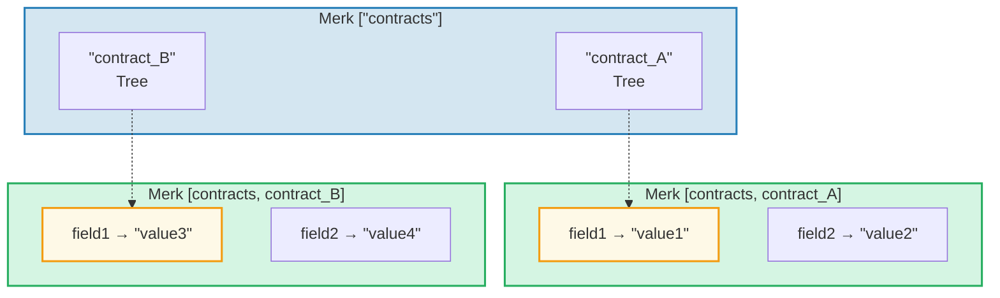
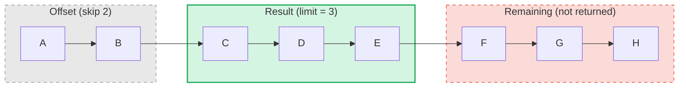

# クエリシステム

## PathQuery 構造

GroveDB のクエリは `PathQuery` 型を使用し、パス（どこを見るか）とクエリ（何を選択するか）を組み合わせます：

```rust
pub struct PathQuery {
    pub path: Vec<Vec<u8>>,         // Starting path in the grove
    pub query: SizedQuery,          // What to select
}

pub struct SizedQuery {
    pub query: Query,               // The selection criteria
    pub limit: Option<u16>,         // Maximum number of results
    pub offset: Option<u16>,        // Skip first N results
}
```

## Query 型

```rust
pub struct Query {
    pub items: Vec<QueryItem>,              // What to match
    pub default_subquery_branch: SubqueryBranch,
    pub conditional_subquery_branches: Option<IndexMap<QueryItem, SubqueryBranch>>,
    pub left_to_right: bool,                // Iteration direction
    pub add_parent_tree_on_subquery: bool,  // Include parent tree element in results (v2)
}
```

> **`add_parent_tree_on_subquery`**（v2）：`true` の場合、親ツリーエレメント（例：CountTree や SumTree）が子の値と一緒にクエリ結果に含まれます。これにより、集約値と個別のエレメントを1つのクエリで取得できます。

## QueryItem — 何を選択するか

各 `QueryItem` はマッチするキーまたは範囲を指定します：

```rust
pub enum QueryItem {
    Key(Vec<u8>),                           // Exact key match
    Range(Range<Vec<u8>>),                  // Exclusive range [start..end)
    RangeInclusive(RangeInclusive<Vec<u8>>),// Inclusive range [start..=end]
    RangeFull(RangeFull),                   // All keys
    RangeFrom(RangeFrom<Vec<u8>>),          // [start..)
    RangeTo(RangeTo<Vec<u8>>),              // [..end)
    RangeToInclusive(RangeToInclusive<Vec<u8>>), // [..=end]
    RangeAfter(RangeFrom<Vec<u8>>),         // (start..) exclusive start
    RangeAfterTo(Range<Vec<u8>>),           // (start..end) exclusive both
    RangeAfterToInclusive(RangeInclusive<Vec<u8>>), // (start..=end]
}
```

クエリの例：

Merk ツリー（ソート済み）：`alice  bob  carol  dave  eve  frank`

| クエリ | 選択 | 結果 |
|-------|-----------|--------|
| `Key("bob")` | alice **[bob]** carol dave eve frank | bob |
| `RangeInclusive("bob"..="dave")` | alice **[bob carol dave]** eve frank | bob, carol, dave |
| `RangeAfter("carol"..)` | alice bob carol **[dave eve frank]** | dave, eve, frank |
| `RangeFull`, limit=2 | **[alice bob]** carol dave eve frank *（リミットで停止）* | alice, bob |
| `RangeFull`, limit=2, 右から左 | alice bob carol dave **[eve frank]** *（リミットで停止）* | frank, eve |

## サブクエリと条件分岐

GroveDB クエリの真の力は**サブクエリ** — クエリが Tree エレメントにマッチした場合、自動的にそのサブツリーに降りることができます：



> **PathQuery:** `path: ["contracts"], query: RangeFull` + `default_subquery: Key("field1")`
>
> **実行：**
> 1. ["contracts"] に対する `RangeFull` → contract_A、contract_B にマッチ
> 2. 両方とも Tree エレメント → サブクエリ `Key("field1")` で降りる
> 3. contract_A → "value1"、contract_B → "value3"
>
> **結果:** `["value1", "value3"]`

**条件付きサブクエリ**により、マッチしたキーに基づいて異なるサブクエリを適用できます：

```rust
conditional_subquery_branches: Some(indexmap! {
    QueryItem::Key(b"contract_A".to_vec()) => SubqueryBranch {
        subquery: Some(Query { items: vec![Key(b"field1".to_vec())] }),
        ..
    },
    QueryItem::Key(b"contract_B".to_vec()) => SubqueryBranch {
        subquery: Some(Query { items: vec![Key(b"field2".to_vec())] }),
        ..
    },
})
```

これにより `contract_A` からは `field1` を、`contract_B` からは `field2` を取得します。

## サイズ付きクエリ — リミットとオフセット

`SizedQuery` ラッパーはページネーションを追加します：



> `SizedQuery { query: RangeFull, limit: Some(3), offset: Some(2) }` → 結果：**[C, D, E]**

`left_to_right: false` と組み合わせると、イテレーションが反転します：

```text
    SizedQuery {
        query: Query { items: [RangeFull], left_to_right: false, .. },
        limit: Some(3),
        offset: None
    }

    Result: [H, G, F]
```

## クエリのマージ

複数の PathQuery を効率化のために単一のクエリにマージできます。マージアルゴリズムは共通パスプレフィックスを見つけ、クエリアイテムを結合します：

```text
    Query A: path=["users"], query=Key("alice")
    Query B: path=["users"], query=Key("bob")

    Merged:  path=["users"], query=items=[Key("alice"), Key("bob")]
```

---
