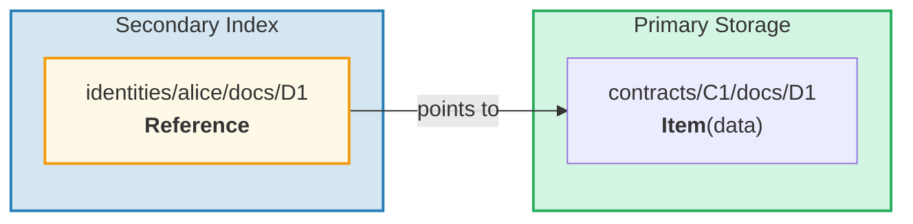
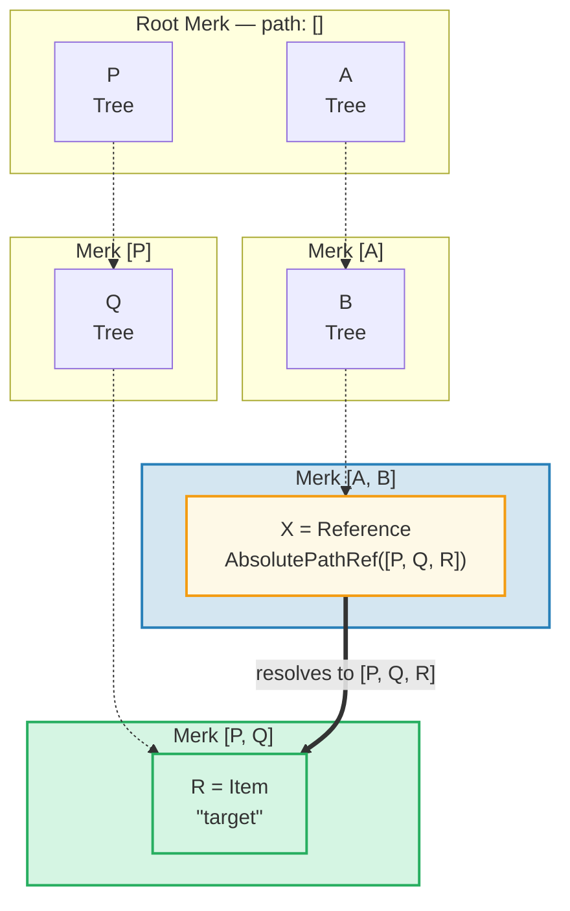
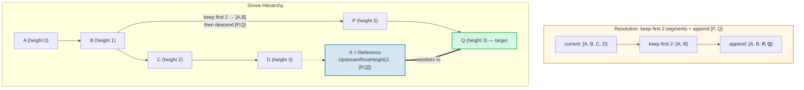
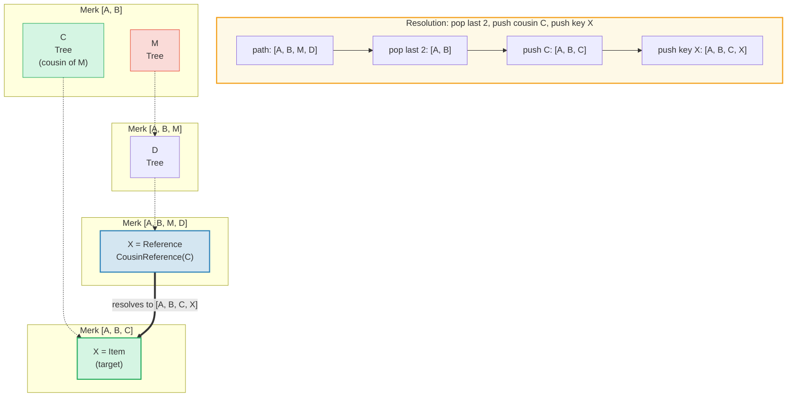
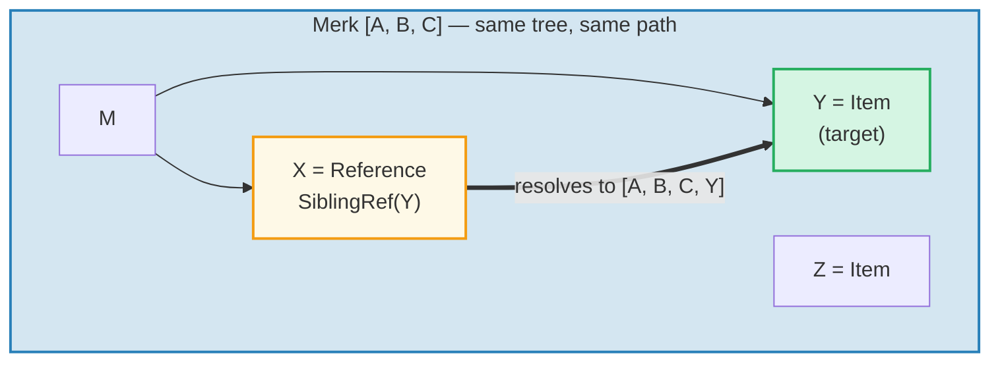
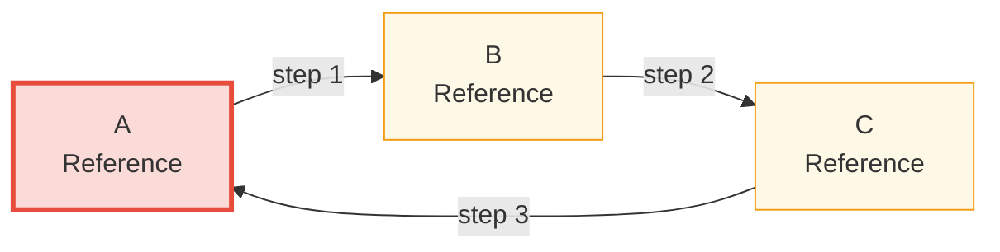

# 参照システム

## 参照が存在する理由

階層型データベースでは、同じデータに複数のパスからアクセスする必要がしばしばあります。例えば、ドキュメントはコントラクトの下に格納されますが、所有者のアイデンティティでもクエリ可能にする必要があります。**参照**（Reference）は GroveDB の解決策です — ある場所から別の場所へのポインタであり、ファイルシステムのシンボリックリンクに似ています。



主な特性：
- 参照は**認証済み** — 参照の value_hash には参照自体と参照先のエレメントの両方が含まれる
- 参照は**連鎖可能** — 参照が別の参照を指すことができる
- 循環検出により無限ループを防止
- 設定可能なホップ制限によりリソース枯渇を防止

## 7つの参照型

```rust
// grovedb-element/src/reference_path/mod.rs
pub enum ReferencePathType {
    AbsolutePathReference(Vec<Vec<u8>>),
    UpstreamRootHeightReference(u8, Vec<Vec<u8>>),
    UpstreamRootHeightWithParentPathAdditionReference(u8, Vec<Vec<u8>>),
    UpstreamFromElementHeightReference(u8, Vec<Vec<u8>>),
    CousinReference(Vec<u8>),
    RemovedCousinReference(Vec<Vec<u8>>),
    SiblingReference(Vec<u8>),
}
```

各型を図とともに説明していきます。

### AbsolutePathReference

最もシンプルな型です。ターゲットへの完全なパスを格納します：



> X は完全な絶対パス `[P, Q, R]` を格納します。X がどこにあっても、常に同じターゲットに解決されます。

### UpstreamRootHeightReference

現在のパスの最初の N セグメントを保持し、新しいパスを追加します：



### UpstreamRootHeightWithParentPathAdditionReference

UpstreamRootHeight と似ていますが、現在のパスの最後のセグメントを再追加します：

```text
    Reference at path [A, B, C, D, E] key=X
    UpstreamRootHeightWithParentPathAdditionReference(2, [P, Q])

    Current path:    [A, B, C, D, E]
    Keep first 2:    [A, B]
    Append [P, Q]:   [A, B, P, Q]
    Re-append last:  [A, B, P, Q, E]   ← "E" from original path added back

    Useful for: indexes where the parent key should be preserved
```

### UpstreamFromElementHeightReference

最後の N セグメントを破棄し、追加します：

```text
    Reference at path [A, B, C, D] key=X
    UpstreamFromElementHeightReference(1, [P, Q])

    Current path:     [A, B, C, D]
    Discard last 1:   [A, B, C]
    Append [P, Q]:    [A, B, C, P, Q]
```

### CousinReference

直接の親のみを新しいキーに置き換えます：



> 「いとこ」（cousin）は参照の祖父母の兄弟サブツリーです。参照は2レベル上に移動し、いとこサブツリーに降りていきます。

### RemovedCousinReference

CousinReference と似ていますが、親を複数セグメントのパスで置き換えます：

```text
    Reference at path [A, B, C, D] key=X
    RemovedCousinReference([M, N])

    Current path:  [A, B, C, D]
    Pop parent C:  [A, B]
    Append [M, N]: [A, B, M, N]
    Push key X:    [A, B, M, N, X]
```

### SiblingReference

最もシンプルな相対参照 — 同じ親内のキーを変更するだけです：



> 最もシンプルな参照型です。X と Y は同じ Merk ツリー内の兄弟です — 解決はパスを保持しながらキーを変更するだけです。

## 参照の追跡とホップ制限

GroveDB が Reference エレメントに遭遇すると、実際の値を見つけるためにそれを**追跡**する必要があります。参照が他の参照を指す可能性があるため、ループが必要です：

```rust
// grovedb/src/reference_path.rs
pub const MAX_REFERENCE_HOPS: usize = 10;

pub fn follow_reference(...) -> CostResult<ResolvedReference, Error> {
    let mut hops_left = MAX_REFERENCE_HOPS;
    let mut visited = HashSet::new();

    while hops_left > 0 {
        // Resolve reference path to absolute path
        let target_path = current_ref.absolute_qualified_path(...);

        // Check for cycles
        if !visited.insert(target_path.clone()) {
            return Err(Error::CyclicReference);
        }

        // Fetch element at target
        let element = Element::get(target_path);

        match element {
            Element::Reference(next_ref, ..) => {
                // Still a reference — keep following
                current_ref = next_ref;
                hops_left -= 1;
            }
            other => {
                // Found the actual element!
                return Ok(ResolvedReference { element: other, ... });
            }
        }
    }

    Err(Error::ReferenceLimit)  // Exceeded 10 hops
}
```

## 循環検出

`visited` HashSet はすでに見たすべてのパスを追跡します。すでに訪問したパスに遭遇した場合、循環があります：



> **循環検出の追跡：**
>
> | ステップ | 追跡 | visited セット | 結果 |
> |------|--------|-------------|--------|
> | 1 | A から開始 | { A } | A は Ref → 追跡 |
> | 2 | A → B | { A, B } | B は Ref → 追跡 |
> | 3 | B → C | { A, B, C } | C は Ref → 追跡 |
> | 4 | C → A | A は既に visited 内！ | **Error::CyclicRef** |
>
> 循環検出がなければ、これは永遠にループします。`MAX_REFERENCE_HOPS = 10` は長いチェーンの走査深度も制限します。

## Merk 内の参照 — 結合バリューハッシュ

Reference が Merk ツリーに格納される場合、その `value_hash` は参照構造と参照先データの両方を認証する必要があります：

```rust
// merk/src/tree/kv.rs
pub fn update_hashes_using_reference_value_hash(
    mut self,
    reference_value_hash: CryptoHash,
) -> CostContext<Self> {
    // Hash the reference element's own bytes
    let actual_value_hash = value_hash(self.value_as_slice());

    // Combine: H(reference_bytes) ⊕ H(referenced_data)
    let combined = combine_hash(&actual_value_hash, &reference_value_hash);

    self.value_hash = combined;
    self.hash = kv_digest_to_kv_hash(self.key(), self.value_hash());
    // ...
}
```

これは、参照自体またはそれが指すデータのどちらを変更してもルートハッシュが変わることを意味します — 両方が暗号学的にバインドされています。

---
