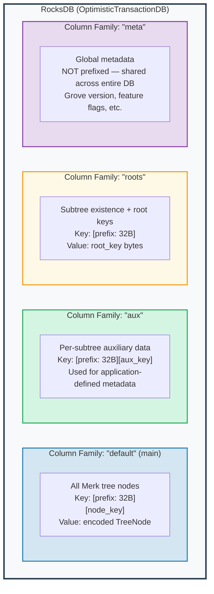
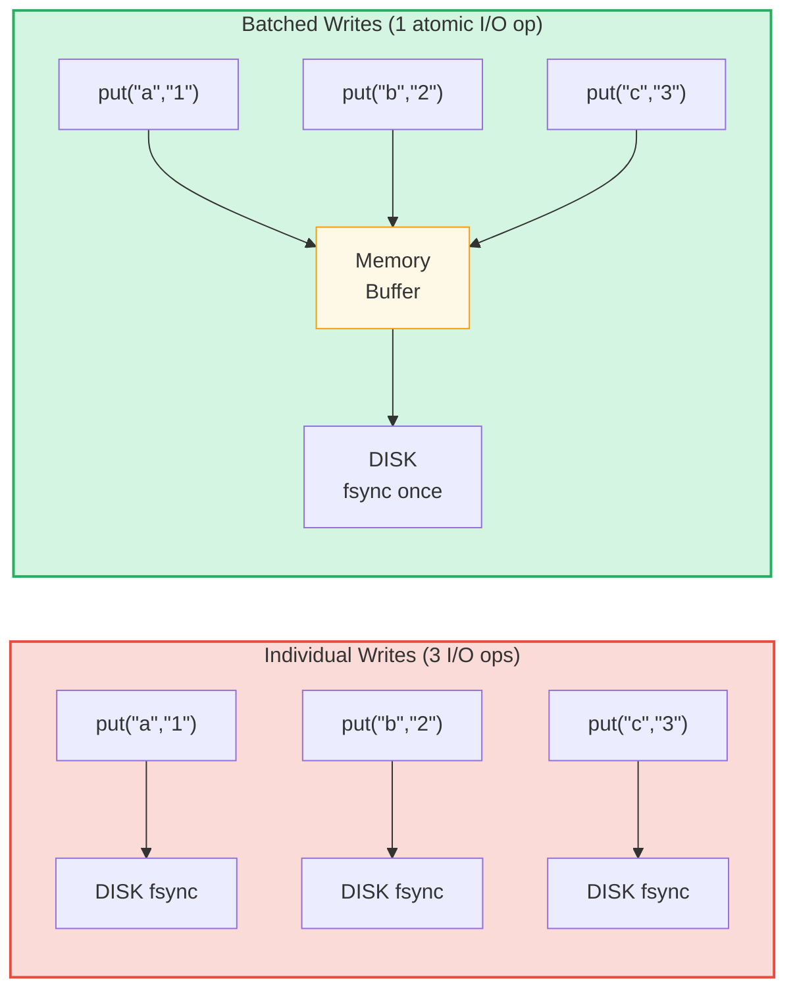

# ストレージ層

## OptimisticTransactionDB を使用した RocksDB

GroveDB はストレージバックエンドとして **RocksDB** を使用し、特にトランザクションをサポートする `OptimisticTransactionDB` バリアントを採用しています：

```rust
// storage/src/rocksdb_storage/storage.rs
pub(crate) type Db = OptimisticTransactionDB;
pub(crate) type Tx<'db> = Transaction<'db, Db>;

pub struct RocksDbStorage {
    db: OptimisticTransactionDB,
}
```

**楽観的トランザクション**（optimistic transaction）は競合が発生しないことを前提として動作します。2つのトランザクションが同じデータを変更した場合、2番目にコミットしようとしたものが失敗し、再試行できます。これは競合が稀なワークロードでは悲観的ロックよりも効率的です。

RocksDB のオプションは GroveDB のワークロードに合わせてチューニングされています：

```rust
lazy_static! {
    static ref DEFAULT_OPTS: rocksdb::Options = {
        let mut opts = rocksdb::Options::default();
        opts.create_if_missing(true);
        opts.increase_parallelism(num_cpus::get() as i32);
        opts.set_allow_mmap_writes(true);
        opts.set_allow_mmap_reads(true);
        opts.create_missing_column_families(true);
        opts.set_atomic_flush(true);
        opts
    };
}
```

## 4つのカラムファミリー

RocksDB のカラムファミリー（column family）は、単一のデータベース内で個別のキーバリュー名前空間として機能します。GroveDB は4つを使用します：



> **例：** "default" CF 内のキー `[ab3fc2...][6e616d65]` は `TreeNode{key:"name", val:"Al"}` にマッピングされます。ここで `ab3fc2...` は `Blake3(path)` であり、`6e616d65` はバイトでの `"name"` です。

```rust
pub(crate) const AUX_CF_NAME: &str = "aux";
pub(crate) const ROOTS_CF_NAME: &str = "roots";
pub(crate) const META_CF_NAME: &str = "meta";
// Main data uses the default column family
```

## プレフィックス付きストレージコンテキスト

各サブツリーは独自の**プレフィックス付きストレージコンテキスト** — すべてのキーに32バイトの Blake3 プレフィックスを自動的に付加するラッパーを取得します：

```text
    Subtree path: ["identities", "alice"]
    Prefix: Blake3(path) = [0xab, 0x3f, 0xc2, ...]  (32 bytes)

    When subtree stores key "name" with value "Alice":

    RocksDB key:   [0xab 0x3f 0xc2 ... (32 bytes) | 0x6e 0x61 0x6d 0x65]
                    \_________prefix________/       \_____"name"_____/

    RocksDB value: [encoded TreeNode with value "Alice"]
```

コンテキストの型：

```text
    Without transaction:
    PrefixedRocksDbImmediateStorageContext
    └── Reads/writes directly to DB with prefix

    With transaction:
    PrefixedRocksDbTransactionContext
    └── Reads/writes through a Transaction with prefix
```

両方とも `StorageContext` トレイトを実装しています：

```rust
pub trait StorageContext<'db> {
    fn get(&self, key: &[u8]) -> CostResult<Option<Vec<u8>>, Error>;
    fn get_aux(&self, key: &[u8]) -> CostResult<Option<Vec<u8>>, Error>;
    fn get_root(&self, key: &[u8]) -> CostResult<Option<Vec<u8>>, Error>;
    fn get_meta(&self, key: &[u8]) -> CostResult<Option<Vec<u8>>, Error>;
    fn put(&self, key: &[u8], value: &[u8], ...) -> CostResult<(), Error>;
    fn put_aux(&self, key: &[u8], value: &[u8], ...) -> CostResult<(), Error>;
    fn put_root(&self, key: &[u8], value: &[u8], ...) -> CostResult<(), Error>;
    fn put_meta(&self, key: &[u8], value: &[u8], ...) -> CostResult<(), Error>;
    fn delete(&self, key: &[u8], ...) -> CostResult<(), Error>;
    // ...
}
```

## 書き込みバッチとトランザクションモデル

パフォーマンスのために、GroveDB は書き込みをバッチに蓄積します：



> 3回のディスク同期 vs 1回のディスク同期 = 約3倍高速。バッチ書き込みは**アトミック**（全か無か）でもあります。

`StorageBatch` は一括でフラッシュされる操作を蓄積します：

```rust
pub struct StorageBatch {
    operations: RefCell<Vec<AbstractBatchOperation>>,
}
```

## 重要な commit_local() パターン

トランザクションを使用する場合、従わなければならない重要なパターンがあります。トランザクション内の書き込みはバッファリングされ、コミットされるまで表示されません：

```rust
// CORRECT pattern:
{
    let tx = db.start_transaction();
    let storage_ctx = db.get_transactional_storage_context(path, &tx);

    storage_ctx.put(key, value);  // Writes to transaction buffer

    drop(storage_ctx);            // Release borrow on tx
    tx.commit_local();            // Flush transaction to DB
}

// INCORRECT — data is lost:
{
    let tx = db.start_transaction();
    let storage_ctx = db.get_transactional_storage_context(path, &tx);

    storage_ctx.put(key, value);  // Writes to transaction buffer

    // tx drops here without commit_local()!
    // All writes are ROLLED BACK!
}
```

`storage_ctx` がトランザクションを借用するため、これは特に重要です。`tx.commit_local()` を呼び出す前に `drop(storage_ctx)` する必要があります。

---
