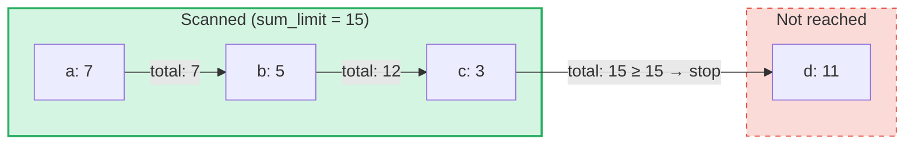

# 집계 합계 쿼리

## 개요

집계 합계 쿼리는 GroveDB의 **SumTree**를 위해 설계된 특수 쿼리 유형입니다.
일반 쿼리가 키나 범위로 엘리먼트를 조회하는 반면, 집계 합계 쿼리는 엘리먼트를 순회하면서
합계 값을 누적하다가 **합계 한도**에 도달하면 중단합니다.

다음과 같은 질문에 유용합니다:
- "누적 합계가 1000을 초과할 때까지의 트랜잭션을 조회"
- "이 트리에서 처음 500단위의 값에 기여하는 항목은?"
- "예산 N까지의 합계 항목을 수집"

## 핵심 개념

### 일반 쿼리와의 차이점

| 기능 | PathQuery | AggregateSumPathQuery |
|------|-----------|----------------------|
| **대상** | 모든 엘리먼트 유형 | SumItem / ItemWithSumItem 엘리먼트 |
| **중단 조건** | 제한(개수) 또는 범위 끝 | 합계 한도(누적 합계) **및/또는** 항목 제한 |
| **반환값** | 엘리먼트 또는 키 | 키-합계 값 쌍 |
| **하위 쿼리** | 예 (하위 트리로 탐색) | 아니오 (단일 트리 레벨) |
| **참조** | GroveDB 레이어에서 해석 | 선택적으로 추적 또는 무시 |

### AggregateSumQuery 구조체

```rust
pub struct AggregateSumQuery {
    pub items: Vec<QueryItem>,              // Keys or ranges to scan
    pub left_to_right: bool,                // Iteration direction
    pub sum_limit: u64,                     // Stop when running total reaches this
    pub limit_of_items_to_check: Option<u16>, // Max number of matching items to return
}
```

쿼리는 그로브에서 어디를 탐색할지 지정하기 위해 `AggregateSumPathQuery`로 감싸집니다:

```rust
pub struct AggregateSumPathQuery {
    pub path: Vec<Vec<u8>>,                 // Path to the SumTree
    pub aggregate_sum_query: AggregateSumQuery,
}
```

### 합계 한도 -- 누적 합계

`sum_limit`은 핵심 개념입니다. 엘리먼트를 스캔하면서 합계 값이 누적됩니다.
누적 합계가 합계 한도에 도달하거나 초과하면 순회가 중단됩니다:



> **결과:** `[(a, 7), (b, 5), (c, 3)]` -- 7 + 5 + 3 = 15 >= sum_limit 이므로 순회 중단

음수 합계 값도 지원됩니다. 음수 값은 남은 예산을 증가시킵니다:

```text
sum_limit = 12, elements: a(10), b(-3), c(5)

a: total = 10, remaining = 2
b: total =  7, remaining = 5  ← negative value gave us more room
c: total = 12, remaining = 0  ← stop

Result: [(a, 10), (b, -3), (c, 5)]
```

## 쿼리 옵션

`AggregateSumQueryOptions` 구조체는 쿼리 동작을 제어합니다:

```rust
pub struct AggregateSumQueryOptions {
    pub allow_cache: bool,                              // Use cached reads (default: true)
    pub error_if_intermediate_path_tree_not_present: bool, // Error on missing path (default: true)
    pub error_if_non_sum_item_found: bool,              // Error on non-sum elements (default: true)
    pub ignore_references: bool,                        // Skip references (default: false)
}
```

### 비합계 엘리먼트 처리

SumTree에는 `SumItem`, `Item`, `Reference`, `ItemWithSumItem` 등 다양한 엘리먼트 유형이
혼재할 수 있습니다. 기본적으로 비합계, 비참조 엘리먼트를 만나면 오류가 발생합니다.

`error_if_non_sum_item_found`를 `false`로 설정하면, 비합계 엘리먼트는 사용자 제한 슬롯을
소모하지 않고 **조용히 건너뜁니다**:

```text
Tree contents: a(SumItem=7), b(Item), c(SumItem=3)
Query: sum_limit=100, limit_of_items_to_check=2, error_if_non_sum_item_found=false

Scan: a(7) → returned, limit=1
      b(Item) → skipped, limit still 1
      c(3) → returned, limit=0 → stop

Result: [(a, 7), (c, 3)]
```

참고: `ItemWithSumItem` 엘리먼트는 합계 값을 포함하므로 **항상** 처리됩니다(건너뛰지 않음).

### 참조 처리

기본적으로 `Reference` 엘리먼트는 **추적됩니다** -- 쿼리가 참조 체인을 해석하여
(최대 3개의 중간 홉) 대상 엘리먼트의 합계 값을 찾습니다:

```text
Tree contents: a(SumItem=7), ref_b(Reference → a)
Query: sum_limit=100

ref_b is followed → resolves to a(SumItem=7)

Result: [(a, 7), (ref_b, 7)]
```

`ignore_references`가 `true`이면, 참조는 비합계 엘리먼트가 건너뛰어지는 것과 유사하게
제한 슬롯을 소모하지 않고 조용히 건너뛰어집니다.

3개를 초과하는 중간 홉의 참조 체인은 `ReferenceLimit` 오류를 발생시킵니다.

## 결과 유형

쿼리는 `AggregateSumQueryResult`를 반환합니다:

```rust
pub struct AggregateSumQueryResult {
    pub results: Vec<(Vec<u8>, i64)>,       // Key-sum value pairs
    pub hard_limit_reached: bool,           // True if system limit truncated results
}
```

`hard_limit_reached` 플래그는 시스템의 하드 스캔 제한(기본값: 1024개 엘리먼트)에 쿼리가
자연적으로 완료되기 전에 도달했는지 나타냅니다. `true`인 경우 반환된 것 이상의 결과가
더 존재할 수 있습니다.

## 이중 제한 시스템

집계 합계 쿼리에는 **세 가지** 중단 조건이 있습니다:

| 제한 | 출처 | 계산 대상 | 도달 시 효과 |
|------|------|----------|-------------|
| **sum_limit** | 사용자 (쿼리) | 합계 값의 누적 합계 | 순회 중단 |
| **limit_of_items_to_check** | 사용자 (쿼리) | 반환된 일치 항목 수 | 순회 중단 |
| **하드 스캔 제한** | 시스템 (GroveVersion, 기본값 1024) | 스캔된 모든 엘리먼트(건너뛴 것 포함) | 순회 중단, `hard_limit_reached` 설정 |

하드 스캔 제한은 사용자 제한이 설정되지 않았을 때 무한 순회를 방지합니다. 건너뛴 엘리먼트
(`error_if_non_sum_item_found=false`인 비합계 항목 또는 `ignore_references=true`인 참조)는
하드 스캔 제한에는 포함되지만 사용자의 `limit_of_items_to_check`에는 포함되지 **않습니다**.

## API 사용법

### 간단한 쿼리

```rust
use grovedb::AggregateSumPathQuery;
use grovedb_merk::proofs::query::AggregateSumQuery;

// "Give me items from this SumTree until the total reaches 1000"
let query = AggregateSumQuery::new(1000, None);
let path_query = AggregateSumPathQuery {
    path: vec![b"my_tree".to_vec()],
    aggregate_sum_query: query,
};

let result = db.query_aggregate_sums(
    &path_query,
    true,   // allow_cache
    true,   // error_if_intermediate_path_tree_not_present
    None,   // transaction
    grove_version,
).unwrap().expect("query failed");

for (key, sum_value) in &result.results {
    println!("{}: {}", String::from_utf8_lossy(key), sum_value);
}
```

### 옵션을 사용한 쿼리

```rust
use grovedb::{AggregateSumPathQuery, AggregateSumQueryOptions};
use grovedb_merk::proofs::query::AggregateSumQuery;

// Skip non-sum items and ignore references
let query = AggregateSumQuery::new(1000, Some(50));
let path_query = AggregateSumPathQuery {
    path: vec![b"mixed_tree".to_vec()],
    aggregate_sum_query: query,
};

let result = db.query_aggregate_sums_with_options(
    &path_query,
    AggregateSumQueryOptions {
        error_if_non_sum_item_found: false,  // skip Items, Trees, etc.
        ignore_references: true,              // skip References
        ..AggregateSumQueryOptions::default()
    },
    None,
    grove_version,
).unwrap().expect("query failed");

if result.hard_limit_reached {
    println!("Warning: results may be incomplete (hard limit reached)");
}
```

### 키 기반 쿼리

범위를 스캔하는 대신 특정 키를 쿼리할 수 있습니다:

```rust
// Check the sum value of specific keys
let query = AggregateSumQuery::new_with_keys(
    vec![b"alice".to_vec(), b"bob".to_vec(), b"carol".to_vec()],
    u64::MAX,  // no sum limit
    None,      // no item limit
);
```

### 내림차순 쿼리

가장 높은 키부터 가장 낮은 키까지 순회합니다:

```rust
let query = AggregateSumQuery::new_descending(500, Some(10));
// Or: query.left_to_right = false;
```

## 생성자 참조

| 생성자 | 설명 |
|--------|------|
| `new(sum_limit, limit)` | 전체 범위, 오름차순 |
| `new_descending(sum_limit, limit)` | 전체 범위, 내림차순 |
| `new_single_key(key, sum_limit)` | 단일 키 조회 |
| `new_with_keys(keys, sum_limit, limit)` | 여러 특정 키 |
| `new_with_keys_reversed(keys, sum_limit, limit)` | 여러 키, 내림차순 |
| `new_single_query_item(item, sum_limit, limit)` | 단일 QueryItem (키 또는 범위) |
| `new_with_query_items(items, sum_limit, limit)` | 여러 QueryItem |

---
