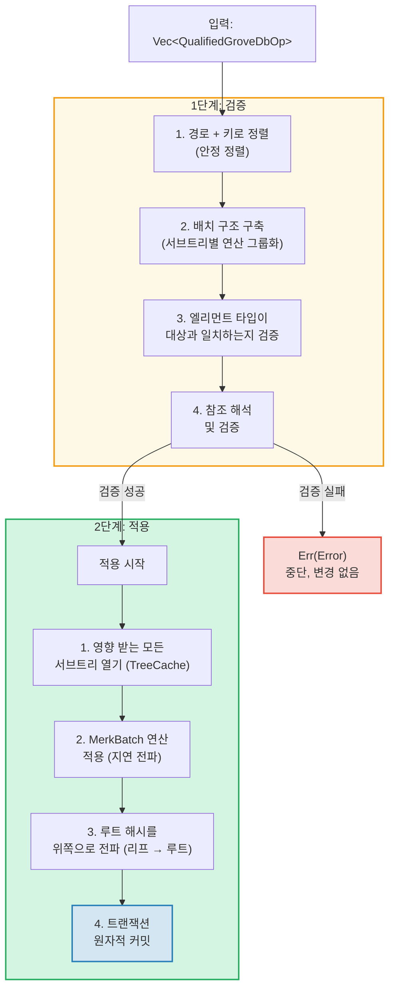
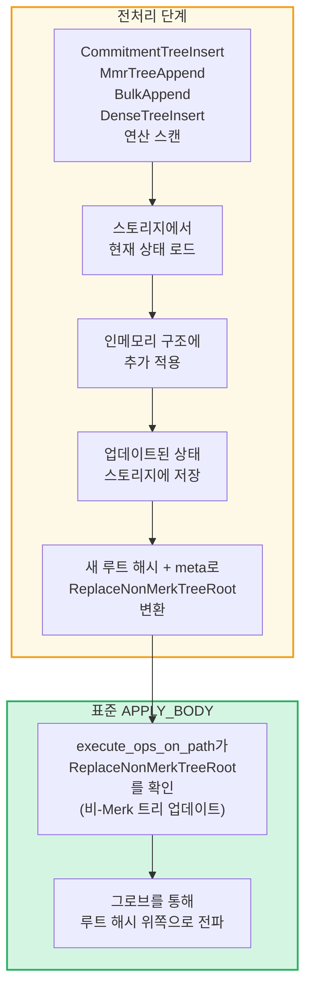

# 그로브 레벨의 배치 연산

## GroveOp 변형

GroveDB 레벨에서 연산은 `GroveOp`으로 표현됩니다:

```rust
pub enum GroveOp {
    // 사용자 대면 연산:
    InsertOnly { element: Element },
    InsertOrReplace { element: Element },
    Replace { element: Element },
    Patch { element: Element, change_in_bytes: i32 },
    RefreshReference { reference_path_type, max_reference_hop, flags, trust_refresh_reference },
    Delete,
    DeleteTree(TreeType),                          // 트리 타입으로 매개변수화

    // 비-Merk 트리 추가 연산 (사용자 대면):
    CommitmentTreeInsert { cmx: [u8; 32], payload: Vec<u8> },
    MmrTreeAppend { value: Vec<u8> },
    BulkAppend { value: Vec<u8> },
    DenseTreeInsert { value: Vec<u8> },

    // 내부 연산 (전처리/전파에 의해 생성, from_ops에서 거부):
    ReplaceTreeRootKey { hash, root_key, aggregate_data },
    InsertTreeWithRootHash { hash, root_key, flags, aggregate_data },
    ReplaceNonMerkTreeRoot { hash: [u8; 32], meta: NonMerkTreeMeta },
    InsertNonMerkTree { hash, root_key, flags, aggregate_data, meta: NonMerkTreeMeta },
}
```

**NonMerkTreeMeta**는 배치 처리 과정에서 트리 타입별 상태를 전달합니다:

```rust
pub enum NonMerkTreeMeta {
    CommitmentTree { total_count: u64, chunk_power: u8 },
    MmrTree { mmr_size: u64 },
    BulkAppendTree { total_count: u64, chunk_power: u8 },
    DenseTree { count: u16, height: u8 },
}
```

각 연산은 경로를 포함하는 `QualifiedGroveDbOp`으로 래핑됩니다:

```rust
pub struct QualifiedGroveDbOp {
    pub path: KeyInfoPath,           // 그로브에서의 위치
    pub key: Option<KeyInfo>,        // 어떤 키 (추가 전용 트리 연산의 경우 None)
    pub op: GroveOp,                 // 수행할 작업
}
```

> **참고:** `key` 필드는 `Option<KeyInfo>`입니다 -- 추가 전용 트리 연산(`CommitmentTreeInsert`, `MmrTreeAppend`, `BulkAppend`, `DenseTreeInsert`)의 경우 `None`이며, 여기서 트리 키는 `path`의 마지막 세그먼트입니다.

## 2단계 처리

배치 연산은 두 단계로 처리됩니다:



## TreeCache와 지연 전파

배치 적용 중에 GroveDB는 서브트리의 모든 연산이 완료될 때까지 루트 해시 전파를 연기하기 위해 **TreeCache**를 사용합니다:


> **3회 전파 x O(깊이)** 대 **1회 전파 x O(깊이)** = 이 서브트리에서 3배 빠름.

많은 연산이 동일한 서브트리를 대상으로 할 때 이것은 상당한 최적화입니다.

## 원자적 교차 서브트리 연산

GroveDB 배치의 핵심 속성은 **서브트리 간 원자성**입니다. 단일 배치가 여러 서브트리의 엘리먼트를 수정할 수 있으며, 모든 변경이 커밋되거나 아무것도 커밋되지 않습니다:

```text
    배치:
    1. Delete ["balances", "alice"]       (잔액 제거)
    2. Insert ["balances", "bob"] = 100   (잔액 추가)
    3. Update ["identities", "bob", "rev"] = 2  (리비전 업데이트)

    영향 받는 세 개의 서브트리: balances, identities, identities/bob

    어떤 연산이라도 실패하면 → 모든 연산이 롤백됨
    모두 성공하면 → 모두 원자적으로 커밋됨
```

배치 프로세서는 다음과 같이 처리합니다:
1. 영향 받는 모든 경로 수집
2. 필요한 모든 서브트리 열기
3. 모든 연산 적용
4. 의존성 순서로 모든 루트 해시 전파
5. 전체 트랜잭션 커밋

## 비-Merk 트리의 배치 전처리

CommitmentTree, MmrTree, BulkAppendTree, DenseAppendOnlyFixedSizeTree 연산은 Merk 외부의 스토리지 컨텍스트에 대한 접근이 필요한데, 표준 `execute_ops_on_path` 메서드 내부에서는 사용할 수 없습니다(Merk에만 접근 가능). 이러한 연산은 **전처리 패턴**을 사용합니다: 메인 `apply_body` 단계 전에 진입점에서 비-Merk 트리 연산을 스캔하여 표준 내부 연산으로 변환합니다.

```rust
pub enum GroveOp {
    // ... 표준 연산 ...

    // 비-Merk 트리 연산 (사용자 대면):
    CommitmentTreeInsert { cmx: [u8; 32], payload: Vec<u8> },
    MmrTreeAppend { value: Vec<u8> },
    BulkAppend { value: Vec<u8> },
    DenseTreeInsert { value: Vec<u8> },

    // 내부 연산 (전처리에 의해 생성):
    ReplaceNonMerkTreeRoot { hash: [u8; 32], meta: NonMerkTreeMeta },
}
```



**전처리를 하는 이유:** `execute_ops_on_path` 함수는 단일 Merk 서브트리에서 작동하며 `self.db`나 더 넓은 스토리지 컨텍스트에 접근할 수 없습니다. 진입점(`apply_batch_with_element_flags_update`, `apply_partial_batch_with_element_flags_update`)에서의 전처리는 데이터베이스에 대한 전체 접근이 가능하므로, 데이터를 로드/저장한 다음 표준 배치 기계에 간단한 `ReplaceNonMerkTreeRoot`를 전달할 수 있습니다.

각 전처리 메서드는 동일한 패턴을 따릅니다:
1. **`preprocess_commitment_tree_ops`** -- 데이터 스토리지에서 프론티어와 BulkAppendTree를 로드하고, 둘 다에 추가하고, 저장하고, 업데이트된 결합 루트와 `CommitmentTree { total_count, chunk_power }` meta를 가진 `ReplaceNonMerkTreeRoot`로 변환
2. **`preprocess_mmr_tree_ops`** -- 데이터 스토리지에서 MMR을 로드하고, 값을 추가하고, 저장하고, 업데이트된 MMR 루트와 `MmrTree { mmr_size }` meta를 가진 `ReplaceNonMerkTreeRoot`로 변환
3. **`preprocess_bulk_append_ops`** -- 데이터 스토리지에서 BulkAppendTree를 로드하고, 값을 추가(청크 압축을 트리거할 수 있음)하고, 저장하고, 업데이트된 상태 루트와 `BulkAppendTree { total_count, chunk_power }` meta를 가진 `ReplaceNonMerkTreeRoot`로 변환
4. **`preprocess_dense_tree_ops`** -- 데이터 스토리지에서 DenseFixedSizedMerkleTree를 로드하고, 순차적으로 값을 삽입하고, 루트 해시를 재계산하고, 저장하고, 업데이트된 루트 해시와 `DenseTree { count, height }` meta를 가진 `ReplaceNonMerkTreeRoot`로 변환

`ReplaceNonMerkTreeRoot` 연산은 새 루트 해시와 `NonMerkTreeMeta` 열거형을 전달하여 처리 후 엘리먼트를 완전히 재구성할 수 있게 합니다.

---
