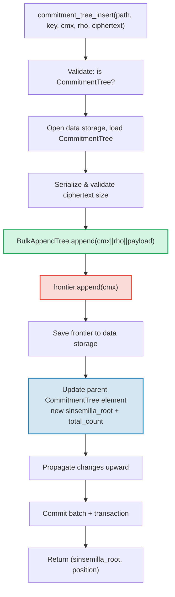

# CommitmentTree -- Sinsemilla 커밋먼트 앵커

**CommitmentTree**는 GroveDB의 인증 스토리지와 영지식 증명 시스템 사이의 다리입니다. 효율적인 청크 압축 데이터 저장을 위한 **BulkAppendTree**(14장)와 ZK 호환 앵커를 위한 **Sinsemilla 프론티어**를 데이터 네임스페이스에서 결합합니다. MmrTree 및 BulkAppendTree와 마찬가지로 **자식 Merk가 없으며** -- 결합 루트 해시가 Merk 자식 해시로 흐릅니다. BulkAppendTree 항목과 Sinsemilla 프론티어 모두 **데이터 네임스페이스**에 존재합니다.

이 장에서는 Sinsemilla 해시 함수와 영지식 회로에서 왜 중요한지, 프론티어 데이터 구조와 컴팩트 직렬화, 이중 네임스페이스 스토리지 아키텍처, GroveDB 연산, 배치 전처리, 클라이언트 측 증인 생성, 그리고 증명이 어떻게 작동하는지를 다룹니다.

## ZK 호환 트리가 필요한 이유

GroveDB의 표준 트리는 Blake3 해싱을 사용합니다. Blake3는 소프트웨어에서 빠르지만, **영지식 회로 내에서는 비용이 높습니다**. 지출자가 "커밋먼트 트리의 위치 P에 있는 노트를 알고 있다"는 것을 P를 노출하지 않고 증명해야 할 때, ZK 회로 내에서 머클 해시 함수를 32번(트리 레벨당 한 번) 평가해야 합니다.

Sinsemilla(Zcash Orchard 프로토콜을 위해 ZIP-244에 명시됨)는 정확히 이 사용 사례를 위해 설계되었습니다 -- Halo 2 증명 시스템이 사용하는 Pasta 곡선 순환의 한쪽인 Pallas 타원 곡선 위에서 **효율적인 회로 내 해싱**을 제공합니다.

| 속성 | Blake3 | Sinsemilla |
|----------|--------|------------|
| **회로 비용** | 해시당 ~25,000 제약 조건 | 해시당 ~800 제약 조건 |
| **소프트웨어 속도** | 매우 빠름 (~2 GB/s) | 느림 (~10,000 해시/s) |
| **대수적 구조** | 없음 (비트 연산) | Pallas 곡선 점 연산 |
| **주요 목적** | 일반 해싱, 머클 트리 | 회로 내 머클 증명 |
| **사용처** | GroveDB Merk 트리, MMR, Bulk | Orchard 차폐 프로토콜 |
| **출력 크기** | 32 바이트 | 32 바이트 (Pallas 필드 엘리먼트) |

CommitmentTree는 ZK 회로가 추론하는 머클 트리에 Sinsemilla를, 그 위의 GroveDB Merk 계층 구조에는 Blake3를 사용합니다. 트리에 삽입된 항목은 데이터 네임스페이스의 BulkAppendTree를 통해 저장되며(청크 압축, 위치별 조회 가능), 동시에 Sinsemilla 프론티어에 추가됩니다(ZK로 증명 가능한 앵커 생성).

## 데이터 네임스페이스 아키텍처

CommitmentTree는 **모든 데이터를 데이터 네임스페이스**에 같은 서브트리 경로로 저장합니다. MmrTree 및 BulkAppendTree와 마찬가지로 **자식 Merk가 없습니다**(`root_key` 필드 없음 -- 타입별 루트가 Merk 자식 해시로 흐름). BulkAppendTree 항목과 Sinsemilla 프론티어는 서로 다른 키 접두사를 사용하여 데이터 네임스페이스에 공존합니다:

```text
┌──────────────────────────────────────────────────────────────┐
│                       CommitmentTree                          │
│                                                               │
│  ┌─────────────────────────────────────────────────────────┐  │
│  │  Data Namespace                                         │  │
│  │                                                         │  │
│  │  BulkAppendTree storage (Chapter 14):                   │  │
│  │    Buffer entries → chunk blobs → chunk MMR             │  │
│  │    value = cmx (32) || rho (32) || ciphertext (216)     │  │
│  │                                                         │  │
│  │  Sinsemilla Frontier (~1KB):                            │  │
│  │    key: b"__ct_data__" (COMMITMENT_TREE_DATA_KEY)       │  │
│  │    Depth-32 incremental Merkle tree                     │  │
│  │    Stores only the rightmost path (leaf + ommers)       │  │
│  │    O(1) append, O(1) root computation                   │  │
│  │    Produces Orchard-compatible Anchor for ZK proofs     │  │
│  └─────────────────────────────────────────────────────────┘  │
│                                                               │
│  sinsemilla_root embedded in Element bytes                    │
│    → flows through Merk value_hash → GroveDB state root      │
└──────────────────────────────────────────────────────────────┘
```

**왜 두 구조인가?** BulkAppendTree는 잠재적으로 수백만 개의 암호화된 노트를 위한 효율적인 청크 압축 저장 및 조회를 제공합니다. Sinsemilla 프론티어는 Halo 2 회로 내에서 증명할 수 있는 ZK 호환 앵커를 제공합니다. 둘 다 매 추가마다 동기적으로 업데이트됩니다.

다른 비표준 트리 타입과의 비교:

| | CommitmentTree | MmrTree | BulkAppendTree |
|---|---|---|---|
| **자식 Merk** | 아니오 | 아니오 | 아니오 |
| **데이터 네임스페이스** | BulkAppendTree 항목 + 프론티어 | MMR 노드 | 버퍼 + 청크 + MMR |
| **Aux 네임스페이스** | -- | -- | -- |
| **항목 쿼리 가능** | V1 증명을 통해 | V1 증명을 통해 | V1 증명을 통해 |
| **해시 함수** | Sinsemilla + Blake3 | Blake3 | Blake3 |

## Sinsemilla 프론티어

프론티어는 `incrementalmerkletree` 크레이트의 `Frontier<MerkleHashOrchard, 32>` 타입으로 구현된 깊이 32의 점진적 머클 트리입니다. 가능한 2^32개의 모든 리프를 저장하는 대신, **다음 리프를 추가하고 현재 루트를 계산하는 데 필요한 정보만** 저장합니다: 가장 오른쪽 리프와 그 오머(루트 계산에 필요한 형제 해시).

```text
                         root (level 32)
                        /               \
                      ...               ...
                     /                     \
                  (level 2)             (level 2)
                  /     \               /     \
              (level 1) (level 1)   (level 1)  ?
              /    \    /    \      /    \
             L0    L1  L2    L3   L4    ?     ← frontier stores L4
                                              + ommers at levels
                                              where left sibling exists
```

프론티어가 저장하는 것:
- **leaf**: 가장 최근에 추가된 값 (Pallas 필드 엘리먼트)
- **ommers**: 프론티어 경로가 오른쪽으로 가는 각 레벨의 왼쪽 형제 해시 (깊이 32 트리에서 최대 32개 오머)
- **position**: 리프의 0-인덱스 위치

주요 속성:
- **O(1) 추가**: 새 리프 삽입, 오머 업데이트, 루트 재계산
- **O(1) 루트**: 저장된 오머를 리프에서 루트까지 순회
- **~1KB 상수 크기**: 얼마나 많은 리프가 추가되었든 무관
- **결정적**: 같은 추가 순서를 가진 두 프론티어는 같은 루트를 생성

`EMPTY_SINSEMILLA_ROOT` 상수는 빈 깊이-32 트리의 루트로, `MerkleHashOrchard::empty_root(Level::from(32)).to_bytes()`로 사전 계산됩니다:

```text
0xae2935f1dfd8a24aed7c70df7de3a668eb7a49b1319880dde2bbd9031ae5d82f
```

## 추가 작동 방식 -- 오머 연쇄

새 커밋먼트가 위치 N에 추가되면, 업데이트해야 하는 오머의 수는 `trailing_ones(N)` -- N의 이진 표현에서 후행 1-비트의 수와 같습니다. 이것은 MMR 병합 연쇄(13.4절)와 같은 패턴이지만, 피크 대신 오머에서 작동합니다.

**구체적 예시 -- 4개 리프 추가:**

```text
Position 0 (binary: 0, trailing_ones: 0):
  frontier = { leaf: L0, ommers: [], position: 0 }
  Sinsemilla hashes: 32 (root computation) + 0 (no ommer merges) = 32

Position 1 (binary: 1, trailing_ones: 0 of PREVIOUS position 0):
  Before: position 0 has trailing_ones = 0
  frontier = { leaf: L1, ommers: [H(L0,L1) at level 1], position: 1 }
  Sinsemilla hashes: 32 + 0 = 32

Position 2 (binary: 10, trailing_ones: 0 of PREVIOUS position 1):
  Before: position 1 has trailing_ones = 1
  frontier = { leaf: L2, ommers: [level1_hash], position: 2 }
  Sinsemilla hashes: 32 + 1 = 33

Position 3 (binary: 11, trailing_ones: 0 of PREVIOUS position 2):
  Before: position 2 has trailing_ones = 0
  frontier = { leaf: L3, ommers: [level1_hash, level2_hash], position: 3 }
  Sinsemilla hashes: 32 + 0 = 32
```

추가당 **총 Sinsemilla 해시**는:

```text
32 (root computation always traverses all 32 levels)
+ trailing_ones(current_position)  (ommer cascade)
```

평균적으로 `trailing_ones`는 ~1(기하 분포)이므로, 평균 비용은 **추가당 ~33 Sinsemilla 해시**입니다. 최악의 경우(모든 비트가 1인 위치 2^32 - 1)는 **64 해시**입니다.

## 프론티어 직렬화 형식

프론티어는 키 `b"__ct_data__"`의 데이터 스토리지에 저장됩니다. 와이어 형식은:

```text
┌──────────────────────────────────────────────────────────────────┐
│ has_frontier: u8                                                  │
│   0x00 → empty tree (no more fields)                             │
│   0x01 → non-empty (fields follow)                               │
├──────────────────────────────────────────────────────────────────┤
│ position: u64 BE (8 bytes)      — 0-indexed leaf position        │
├──────────────────────────────────────────────────────────────────┤
│ leaf: [u8; 32]                  — Pallas field element bytes     │
├──────────────────────────────────────────────────────────────────┤
│ ommer_count: u8                 — number of ommers (0..=32)      │
├──────────────────────────────────────────────────────────────────┤
│ ommers: [ommer_count × 32 bytes] — Pallas field elements        │
└──────────────────────────────────────────────────────────────────┘
```

**크기 분석:**

| 상태 | 크기 | 분해 |
|-------|------|-----------|
| 비어있음 | 1 바이트 | `0x00` 플래그만 |
| 1 리프, 0 오머 | 42 바이트 | 1 + 8 + 32 + 1 |
| ~16 오머 (평균) | 554 바이트 | 1 + 8 + 32 + 1 + 16x32 |
| 32 오머 (최대) | 1,066 바이트 | 1 + 8 + 32 + 1 + 32x32 |

프론티어 크기는 수백만 개의 커밋먼트가 추가되었든 ~1.1KB로 제한됩니다. 이것은 로드/수정/저장 사이클을 매우 저렴하게 만듭니다(읽기 1회 탐색, 쓰기 1회 탐색).

## 엘리먼트 표현

```rust
CommitmentTree(
    u64,                  // total_count: number of appended items
    u8,                   // chunk_power: dense tree height for BulkAppendTree buffer
    Option<ElementFlags>, // flags: optional metadata
)
```

`chunk_power` 매개변수는 BulkAppendTree 버퍼의 조밀 트리 높이를 제어합니다; `chunk_power`는 1..=16 범위여야 합니다(14.1절 및 16장 참조).

**타입 식별자:**

| 식별자 | 값 |
|---|---|
| 엘리먼트 판별자 | 11 |
| `TreeType` | `CommitmentTree = 7` |
| `ElementType` | 11 |
| `COMMITMENT_TREE_COST_SIZE` | 12 바이트 (8 total_count + 1 chunk_power + 1 판별자 + 2 오버헤드) |

Sinsemilla 루트는 엘리먼트에 저장되지 않습니다. `insert_subtree` 메커니즘을 통해 Merk 자식 해시로 흐릅니다. 부모 Merk가 `combined_value_hash`를 계산할 때, Sinsemilla 파생 루트가 자식 해시로 포함됩니다:

```text
combined_value_hash = blake3(value_hash || child_hash)
                                           ↑ sinsemilla/BulkAppendTree combined root
```

이것은 Sinsemilla 프론티어의 어떤 변경이든 GroveDB Merk 계층 구조를 통해 상태 루트까지 자동으로 전파됨을 의미합니다.

**생성자 메서드:**

| 메서드 | 생성하는 것 |
|---|---|
| `Element::empty_commitment_tree(chunk_power)` | 빈 트리, count=0, 플래그 없음 |
| `Element::empty_commitment_tree_with_flags(chunk_power, flags)` | 플래그가 있는 빈 트리 |
| `Element::new_commitment_tree(total_count, chunk_power, flags)` | 모든 필드 명시적 |

## 스토리지 아키텍처

CommitmentTree는 모든 데이터를 서브트리 경로의 단일 **데이터 네임스페이스**에 저장합니다. BulkAppendTree 항목과 Sinsemilla 프론티어는 서로 다른 키 접두사를 사용하여 같은 컬럼에 공존합니다. aux 네임스페이스는 사용되지 않습니다.

```text
┌──────────────────────────────────────────────────────────────────┐
│  Data Namespace (all CommitmentTree storage)                      │
│                                                                   │
│  BulkAppendTree storage keys (see §14.7):                         │
│    b"m" || pos (u64 BE)  → MMR node blobs                        │
│    b"b" || index (u64 BE)→ buffer entries (cmx || rho || ciphertext) │
│    b"e" || chunk (u64 BE)→ chunk blobs (compacted buffer)         │
│    b"M"                  → BulkAppendTree metadata                │
│                                                                   │
│  Sinsemilla frontier:                                             │
│    b"__ct_data__"        → serialized CommitmentFrontier (~1KB)   │
│                                                                   │
│  No Merk nodes — this is a non-Merk tree.                         │
│  Data authenticated via BulkAppendTree state_root (Blake3).       │
│  Sinsemilla root authenticates all cmx values via Pallas curve.   │
└──────────────────────────────────────────────────────────────────┘
```

**로드/수정/저장 패턴**: 모든 변경 연산은 데이터 스토리지에서 프론티어를 로드하고, 메모리에서 수정한 다음, 다시 기록합니다. 프론티어가 최대 ~1KB이므로, 이것은 저렴한 I/O 연산 쌍입니다(읽기 1회 탐색, 쓰기 1회 탐색). 동시에 BulkAppendTree가 로드, 추가, 저장됩니다.

**루트 해시 전파**: 항목이 삽입되면 두 가지가 변경됩니다:
1. BulkAppendTree 상태가 변경됩니다(버퍼에 새 항목 또는 청크 압축)
2. Sinsemilla 루트가 변경됩니다(프론티어에 새 커밋먼트)

둘 다 업데이트된 `CommitmentTree` 엘리먼트에 캡처됩니다. 부모 Merk 노드 해시는:

```text
combined_hash = combine_hash(
    value_hash(element_bytes),    ← includes total_count + chunk_power
    child_hash(combined_root)     ← sinsemilla/BulkAppendTree combined root
)
```

MmrTree 및 BulkAppendTree와 마찬가지로, 타입별 루트가 Merk 자식 해시로 흐릅니다. 모든 데이터 인증이 이 자식 해시 바인딩을 통해 흐릅니다.

**비-Merk 데이터 스토리지 함의**: 데이터 네임스페이스가 BulkAppendTree 키를 포함하므로(Merk 노드가 아님), 스토리지를 Merk 엘리먼트로 반복하는 연산들 -- `find_subtrees`, `is_empty_tree`, `verify_merk_and_submerks` 등 -- 은 CommitmentTree(및 다른 비-Merk 트리 타입)를 특수하게 처리해야 합니다. `Element`와 `TreeType` 모두의 `uses_non_merk_data_storage()` 헬퍼가 이러한 트리 타입을 식별합니다. 삭제 연산은 데이터 네임스페이스를 반복하는 대신 직접 지우고, verify_grovedb는 이러한 타입에 대해 하위 merk 재귀를 건너뜁니다.

## GroveDB 연산

CommitmentTree는 4개 연산을 제공합니다. 삽입 연산은 암호문 페이로드 크기 검증을 제어하는 `M: MemoSize`(`orchard` 크레이트에서)에 대해 제네릭합니다. 기본값 `M = DashMemo`는 216바이트 페이로드(32 epk + 104 enc + 80 out)를 제공합니다.

```rust
// Insert a commitment (typed) — returns (sinsemilla_root, position)
// M controls ciphertext size validation
db.commitment_tree_insert::<_, _, M>(path, key, cmx, rho, ciphertext, tx, version)

// Insert a commitment (raw bytes) — validates payload.len() == ciphertext_payload_size::<DashMemo>()
db.commitment_tree_insert_raw(path, key, cmx, rho, payload_vec, tx, version)

// Get the current Orchard Anchor
db.commitment_tree_anchor(path, key, tx, version)

// Retrieve a value by global position
db.commitment_tree_get_value(path, key, position, tx, version)

// Get the current item count
db.commitment_tree_count(path, key, tx, version)
```

타입이 지정된 `commitment_tree_insert`는 `TransmittedNoteCiphertext<M>`을 받아 내부적으로 직렬화합니다. 원시(raw) `commitment_tree_insert_raw`(pub(crate))는 `Vec<u8>`을 받으며, 페이로드가 이미 직렬화된 배치 전처리에서 사용됩니다.

### commitment_tree_insert

삽입 연산은 BulkAppendTree와 Sinsemilla 프론티어를 단일 원자적 연산에서 모두 업데이트합니다:

```text
Step 1: Validate element at path/key is a CommitmentTree
        → extract total_count, chunk_power, flags

Step 2: Build ct_path = path ++ [key]

Step 3: Open data storage context at ct_path
        Load CommitmentTree (frontier + BulkAppendTree)
        Serialize ciphertext → validate payload size matches M
        Append cmx||rho||ciphertext to BulkAppendTree
        Append cmx to Sinsemilla frontier → get new sinsemilla_root
        Track Blake3 + Sinsemilla hash costs

Step 4: Save updated frontier to data storage

Step 5: Open parent Merk at path
        Write updated CommitmentTree element:
          new total_count, same chunk_power, same flags
        Child hash = combined_root (sinsemilla + bulk state)

Step 6: Propagate changes from parent upward through Merk hierarchy

Step 7: Commit storage batch and local transaction
        Return (sinsemilla_root, position)
```



> **빨간색** = Sinsemilla 연산. **초록색** = BulkAppendTree 연산.
> **파란색** = 둘을 연결하는 엘리먼트 업데이트.

### commitment_tree_anchor

앵커 연산은 읽기 전용 쿼리입니다:

```text
Step 1: Validate element at path/key is a CommitmentTree
Step 2: Build ct_path = path ++ [key]
Step 3: Load frontier from data storage
Step 4: Return frontier.anchor() as orchard::tree::Anchor
```

`Anchor` 타입은 Sinsemilla 루트의 Orchard 네이티브 표현으로, 지출 인가 증명을 구성할 때 `orchard::builder::Builder`에 직접 전달하기에 적합합니다.

### commitment_tree_get_value

전역 위치에 의해 저장된 값(cmx || rho || 페이로드)을 조회합니다:

```text
Step 1: Validate element at path/key is a CommitmentTree
        → extract total_count, chunk_power
Step 2: Build ct_path = path ++ [key]
Step 3: Open data storage context, wrap in CachedBulkStore
Step 4: Load BulkAppendTree, call get_value(position)
Step 5: Return Option<Vec<u8>>
```

이것은 `bulk_get_value`(14.9절)와 같은 패턴을 따릅니다 -- BulkAppendTree가 위치가 어디에 해당하는지에 따라 버퍼 또는 압축된 청크 블롭에서 투명하게 조회합니다.

### commitment_tree_count

트리에 추가된 총 항목 수를 반환합니다:

```text
Step 1: Read element at path/key
Step 2: Verify it is a CommitmentTree
Step 3: Return total_count from element fields
```

이것은 단순한 엘리먼트 필드 읽기입니다 -- 부모 Merk 너머의 스토리지 접근이 필요 없습니다.

## 배치 연산

CommitmentTree는 `GroveOp::CommitmentTreeInsert` 변형을 통해 배치 삽입을 지원합니다:

```rust
GroveOp::CommitmentTreeInsert {
    cmx: [u8; 32],      // extracted note commitment
    rho: [u8; 32],      // nullifier of the spent note
    payload: Vec<u8>,    // serialized ciphertext (216 bytes for DashMemo)
}
```

두 생성자가 이 연산을 만듭니다:

```rust
// Raw constructor — caller serializes payload manually
QualifiedGroveDbOp::commitment_tree_insert_op(path, cmx, rho, payload_vec)

// Typed constructor — serializes TransmittedNoteCiphertext<M> internally
QualifiedGroveDbOp::commitment_tree_insert_op_typed::<M>(path, cmx, rho, &ciphertext)
```

같은 트리를 대상으로 하는 다중 삽입이 단일 배치에서 허용됩니다. `execute_ops_on_path`가 데이터 스토리지에 접근할 수 없으므로, 모든 CommitmentTree 연산은 `apply_body` 전에 전처리되어야 합니다.

**전처리 파이프라인** (`preprocess_commitment_tree_ops`):

```text
Input: [CTInsert{cmx1}, Insert{...}, CTInsert{cmx2}, CTInsert{cmx3}]
                                       ↑ same (path,key) as cmx1

Step 1: Group CommitmentTreeInsert ops by (path, key)
        group_1: [cmx1, cmx2, cmx3]

Step 2: For each group:
        a. Read existing element → verify CommitmentTree, extract chunk_power
        b. Open transactional storage context at ct_path
        c. Load CommitmentTree from data storage (frontier + BulkAppendTree)
        d. For each (cmx, rho, payload):
           - ct.append_raw(cmx, rho, payload) — validates size, appends to both
        e. Save updated frontier to data storage

Step 3: Replace all CTInsert ops with one ReplaceNonMerkTreeRoot per group
        carrying: hash=bulk_state_root (combined root),
                  meta=NonMerkTreeMeta::CommitmentTree {
                      total_count: new_count,
                      chunk_power,
                  }

Output: [ReplaceNonMerkTreeRoot{...}, Insert{...}]
```

각 그룹의 첫 번째 CommitmentTreeInsert 연산이 `ReplaceNonMerkTreeRoot`로 대체됩니다; 같은 (path, key)에 대한 후속 연산은 삭제됩니다. 표준 배치 기계가 엘리먼트 업데이트와 루트 해시 전파를 처리합니다.

## MemoSize 제네릭과 암호문 처리

`CommitmentTree<S, M>` 구조체는 `M: MemoSize`(`orchard` 크레이트에서)에 대해 제네릭합니다. 이것은 각 커밋먼트와 함께 저장되는 암호화된 노트 암호문의 크기를 제어합니다.

```rust
pub struct CommitmentTree<S, M: MemoSize = DashMemo> {
    frontier: CommitmentFrontier,
    pub bulk_tree: BulkAppendTree<S>,
    _memo: PhantomData<M>,
}
```

기본값 `M = DashMemo`는 메모 크기에 관심 없는 기존 코드(`verify_grovedb`, `commitment_tree_anchor`, `commitment_tree_count` 등)가 `M`을 지정하지 않고도 작동함을 의미합니다.

**직렬화 헬퍼** (공개 자유 함수):

| 함수 | 설명 |
|----------|-------------|
| `ciphertext_payload_size::<M>()` | 주어진 `MemoSize`에 대한 예상 페이로드 크기 |
| `serialize_ciphertext::<M>(ct)` | `TransmittedNoteCiphertext<M>`을 바이트로 직렬화 |
| `deserialize_ciphertext::<M>(data)` | 바이트를 `TransmittedNoteCiphertext<M>`으로 역직렬화 |

**페이로드 검증**: `append_raw()` 메서드는 `payload.len() == ciphertext_payload_size::<M>()`를 검증하고 불일치 시 `CommitmentTreeError::InvalidPayloadSize`를 반환합니다. 타입이 지정된 `append()` 메서드는 내부적으로 직렬화하므로, 크기가 항상 정확합니다.

### 저장 레코드 레이아웃 (DashMemo의 경우 280 바이트)

BulkAppendTree의 각 항목은 완전한 암호화된 노트 레코드를 저장합니다. 모든 바이트를 반영한 전체 레이아웃:

```text
┌─────────────────────────────────────────────────────────────────────┐
│  Offset   Size   Field                                              │
├─────────────────────────────────────────────────────────────────────┤
│  0        32     cmx — extracted note commitment (Pallas base field)│
│  32       32     rho — nullifier of the spent note                  │
│  64       32     epk_bytes — ephemeral public key (Pallas point)    │
│  96       104    enc_ciphertext — encrypted note plaintext + MAC    │
│  200      80     out_ciphertext — encrypted outgoing data + MAC     │
├─────────────────────────────────────────────────────────────────────┤
│  Total:   280 bytes                                                 │
└─────────────────────────────────────────────────────────────────────┘
```

처음 두 필드(`cmx`와 `rho`)는 **암호화되지 않은 프로토콜 필드**입니다 -- 설계상 공개됩니다. 나머지 세 필드(`epk_bytes`, `enc_ciphertext`, `out_ciphertext`)는 `TransmittedNoteCiphertext`를 구성하며 암호화된 페이로드입니다.

### 필드별 분석

**cmx (32 바이트)** -- 추출된 노트 커밋먼트, Pallas 기본 필드 엘리먼트입니다. 이것은 Sinsemilla 프론티어에 추가되는 리프 값입니다. 수신자, 값, 무작위성 등 모든 노트 필드에 대해 이들을 드러내지 않고 커밋합니다. cmx는 노트를 커밋먼트 트리에서 "찾을 수 있게" 만드는 것입니다.

**rho (32 바이트)** -- 이 액션에서 지출되는 노트의 무효화자(nullifier)입니다. 무효화자는 이미 블록체인에서 공개됩니다(이중 지출을 방지하기 위해 반드시 공개되어야 합니다). `rho`를 커밋먼트와 함께 저장하면, 시행 복호화를 수행하는 경량 클라이언트가 `esk = PRF(rseed, rho)`를 검증하고 별도의 무효화자 조회 없이 `epk' == epk`를 확인할 수 있습니다. 이 필드는 `cmx`와 암호문 사이에 암호화되지 않은 프로토콜 수준의 연관으로 위치합니다.

**epk_bytes (32 바이트)** -- 임시 공개 키, 직렬화된 Pallas 곡선 점입니다. 노트의 `rseed`로부터 결정적으로 도출됩니다:

```text
rseed → esk = ToScalar(PRF^expand(rseed, [4] || rho))
esk   → epk = [esk] * g_d     (scalar multiplication on Pallas)
epk   → epk_bytes = Serialize(epk)
```

여기서 `g_d = DiversifyHash(d)`는 수신자의 다이버시파이어(diversifier)에 대한 다양화된 기본 점입니다. `epk`는 수신자가 복호화를 위한 공유 비밀을 계산할 수 있게 합니다: `shared_secret = [ivk] * epk`. `esk`나 `ivk` 중 하나를 알지 못하면 발신자나 수신자에 대해 아무것도 드러내지 않으므로 평문으로 전송됩니다.

**enc_ciphertext (DashMemo의 경우 104 바이트)** -- ChaCha20-Poly1305 AEAD 암호화로 생성된 암호화된 노트 평문:

```text
enc_ciphertext = ChaCha20-Poly1305.Encrypt(key, nonce=[0;12], aad=[], plaintext)
               = ciphertext (88 bytes) || MAC tag (16 bytes) = 104 bytes
```

대칭 키는 ECDH를 통해 도출됩니다:
`key = BLAKE2b-256("Zcash_OrchardKDF", shared_secret || epk_bytes)`.

수신자가 (`ivk`를 사용하여) 복호화하면, **노트 평문** (DashMemo의 경우 88 바이트)에는 다음이 포함됩니다:

| Offset | Size | Field | Description |
|--------|------|-------|-------------|
| 0 | 1 | version | Always `0x02` (Orchard, post-ZIP-212) |
| 1 | 11 | diversifier (d) | Recipient's diversifier, derives the base point `g_d` |
| 12 | 8 | value (v) | 64-bit little-endian note value in duffs |
| 20 | 32 | rseed | Random seed for deterministic derivation of `rcm`, `psi`, `esk` |
| 52 | 36 | memo | Application-layer memo data (DashMemo: 36 bytes) |
| **Total** | **88** | | |

처음 52 바이트(version + diversifier + value + rseed)는 **컴팩트 노트**입니다 -- 경량 클라이언트는 ChaCha20 스트림 암호를 사용하여 이 부분만 시행 복호화하여(MAC을 검증하지 않고) 노트가 자신의 것인지 확인할 수 있습니다. 맞다면, 전체 88 바이트를 복호화하고 MAC을 검증합니다.

**out_ciphertext (80 바이트)** -- **발신자**가 사후에 노트를 복구할 수 있게 하는 암호화된 발신 데이터입니다. 발신 암호 키(Outgoing Cipher Key)로 암호화됩니다:

```text
ock = BLAKE2b-256("Zcash_Orchardock", ovk || cv_net || cmx || epk)
out_ciphertext = ChaCha20-Poly1305.Encrypt(ock, nonce=[0;12], aad=[], plaintext)
               = ciphertext (64 bytes) || MAC tag (16 bytes) = 80 bytes
```

발신자가 (`ovk`를 사용하여) 복호화하면, **발신 평문** (64 바이트)에는 다음이 포함됩니다:

| Offset | Size | Field | Description |
|--------|------|-------|-------------|
| 0 | 32 | pk_d | Diversified transmission key (recipient's public key) |
| 32 | 32 | esk | Ephemeral secret key (Pallas scalar) |
| **Total** | **64** | | |

`pk_d`와 `esk`를 사용하여 발신자는 공유 비밀을 재구성하고, `enc_ciphertext`를 복호화하고, 전체 노트를 복구할 수 있습니다. 발신자가 `ovk = null`로 설정하면, 발신 평문은 암호화 전에 랜덤 바이트로 채워져 발신자조차 복구가 불가능해집니다(복구 불가능 출력).

### 암호화 체계: ChaCha20-Poly1305

`enc_ciphertext`와 `out_ciphertext` 모두 ChaCha20-Poly1305 AEAD(RFC 8439)를 사용합니다:

| Parameter | Value |
|-----------|-------|
| Key size | 256 bits (32 bytes) |
| Nonce | `[0u8; 12]` (safe because each key is used exactly once) |
| AAD | Empty |
| MAC tag | 16 bytes (Poly1305) |

제로 논스는 대칭 키가 노트당 새로운 Diffie-Hellman 교환에서 도출되기 때문에 안전합니다 -- 각 키는 정확히 하나의 메시지만 암호화합니다.

### DashMemo와 ZcashMemo 크기 비교

| Component | DashMemo | ZcashMemo | Notes |
|-----------|----------|-----------|-------|
| Memo field | 36 bytes | 512 bytes | Application data |
| Note plaintext | 88 bytes | 564 bytes | 52 fixed + memo |
| enc_ciphertext | 104 bytes | 580 bytes | plaintext + 16 MAC |
| Ciphertext payload (epk+enc+out) | 216 bytes | 692 bytes | Transmitted per note |
| Full stored record (cmx+rho+payload) | **280 bytes** | **756 bytes** | BulkAppendTree entry |

DashMemo의 더 작은 메모(36 대 512 바이트)는 각 저장 레코드를 476 바이트 줄입니다 -- 수백만 개의 노트를 저장할 때 상당한 차이입니다.

### 시행 복호화 흐름 (경량 클라이언트)

각 저장 레코드에 대해 자신의 노트를 스캔하는 경량 클라이언트는 다음 시퀀스를 수행합니다:

```text
1. Read record: cmx (32) || rho (32) || epk (32) || enc_ciphertext (104) || out_ciphertext (80)

2. Compute shared_secret = [ivk] * epk     (ECDH with incoming viewing key)

3. Derive key = BLAKE2b-256("Zcash_OrchardKDF", shared_secret || epk)

4. Trial-decrypt compact note (first 52 bytes of enc_ciphertext):
   → version (1) || diversifier (11) || value (8) || rseed (32)

5. Reconstruct esk = PRF(rseed, rho)    ← rho is needed here!
   Verify: [esk] * g_d == epk           ← confirms this is our note

6. If match: decrypt full enc_ciphertext (88 bytes + 16 MAC):
   → compact_note (52) || memo (36)
   Verify MAC tag for authenticity

7. Reconstruct full Note from (diversifier, value, rseed, rho)
   This note can later be spent by proving knowledge of it in ZK
```

5단계가 `rho`를 암호문과 함께 저장해야 하는 이유입니다 -- 이것이 없으면 경량 클라이언트는 시행 복호화 중 임시 키 바인딩을 검증할 수 없습니다.

## 클라이언트 측 증인 생성

`grovedb-commitment-tree` 크레이트는 노트 지출을 위한 머클 증인 경로를 생성해야 하는 지갑과 테스트 하네스를 위한 **클라이언트 측** 트리를 제공합니다. 사용하려면 `client` 기능을 활성화하세요:

```toml
grovedb-commitment-tree = { version = "4", features = ["client"] }
```

```rust
pub struct ClientMemoryCommitmentTree {
    inner: ShardTree<MemoryShardStore<MerkleHashOrchard, u32>, 32, 4>,
}
```

`ClientMemoryCommitmentTree`는 `ShardTree`를 래핑합니다 -- 프론티어만이 아닌 전체 커밋먼트 트리로, 메모리에 전체 이력을 보관합니다. 이를 통해 프론티어만으로는 할 수 없는, 표시된 리프에 대한 인증 경로를 생성할 수 있습니다.

**API:**

| 메서드 | 설명 |
|---|---|
| `new(max_checkpoints)` | 체크포인트 보존 제한이 있는 빈 트리 생성 |
| `append(cmx, retention)` | 보존 정책과 함께 커밋먼트 추가 |
| `checkpoint(id)` | 현재 상태에서 체크포인트 생성 |
| `max_leaf_position()` | 가장 최근에 추가된 리프의 위치 |
| `witness(position, depth)` | 노트 지출을 위한 `MerklePath` 생성 |
| `anchor()` | `orchard::tree::Anchor`로서의 현재 루트 |

**보존 정책**은 나중에 어떤 리프에 대해 증인을 생성할 수 있는지 제어합니다:

| 보존 | 의미 |
|---|---|
| `Retention::Ephemeral` | 리프에 대해 증인 불가 (다른 사람의 노트) |
| `Retention::Marked` | 리프에 대해 증인 가능 (자신의 노트) |
| `Retention::Checkpoint { id, marking }` | 체크포인트 생성, 선택적으로 표시 |

**서버 대 클라이언트 비교:**

| | `CommitmentFrontier` (서버) | `ClientMemoryCommitmentTree` (클라이언트) | `ClientPersistentCommitmentTree` (sqlite) |
|---|---|---|---|
| **저장** | 데이터 스토리지에 ~1KB 프론티어 | 메모리에 전체 트리 | SQLite에 전체 트리 |
| **증인 가능** | 아니오 | 예 (표시된 리프만) | 예 (표시된 리프만) |
| **앵커 계산 가능** | 예 | 예 | 예 |
| **앵커 일치** | 같은 순서 -> 같은 앵커 | 같은 순서 -> 같은 앵커 | 같은 순서 -> 같은 앵커 |
| **재시작 후 유지** | 예 (GroveDB 데이터 스토리지) | 아니오 (drop 시 소멸) | 예 (SQLite 데이터베이스) |
| **사용 사례** | GroveDB 서버 측 앵커 추적 | 테스트, 임시 지갑 | 프로덕션 지갑 |
| **기능 플래그** | `server` | `client` | `sqlite` |

세 가지 모두 같은 추가 순서에 대해 **동일한 앵커**를 생성합니다. 이것은 `test_frontier_and_client_same_root` 테스트로 검증됩니다.

### 영구 클라이언트 -- SQLite 기반 증인 생성

인메모리 `ClientMemoryCommitmentTree`는 drop 시 모든 상태를 잃습니다. 전체 블록체인을 재스캔하지 않고 재시작 후에도 유지되어야 하는 프로덕션 지갑을 위해, 크레이트는 SQLite 기반의 `ClientPersistentCommitmentTree`를 제공합니다. `sqlite` 기능을 활성화하세요:

```toml
grovedb-commitment-tree = { version = "4", features = ["sqlite"] }
```

```rust
pub struct ClientPersistentCommitmentTree {
    inner: ShardTree<SqliteShardStore, 32, 4>,
}
```

**세 가지 생성자 모드:**

| 생성자 | 설명 |
|---|---|
| `open(conn, max_checkpoints)` | 기존 `rusqlite::Connection`의 소유권을 가져감 |
| `open_on_shared_connection(arc, max_checkpoints)` | 다른 컴포넌트와 `Arc<Mutex<Connection>>`을 공유 |
| `open_path(path, max_checkpoints)` | 편의 기능 -- 주어진 파일 경로에 SQLite DB를 열기/생성 |

자체 연결을 가져오는 생성자(`open`, `open_on_shared_connection`)를 사용하면 지갑이 커밋먼트 트리 스토리지에 **기존 데이터베이스**를 사용할 수 있습니다. `SqliteShardStore`는 `commitment_tree_` 접두사로 테이블을 생성하므로, 다른 애플리케이션 테이블과 안전하게 공존합니다.

**API**는 `ClientMemoryCommitmentTree`와 동일합니다:

| 메서드 | 설명 |
|---|---|
| `append(cmx, retention)` | 보존 정책과 함께 커밋먼트 추가 |
| `checkpoint(id)` | 현재 상태에서 체크포인트 생성 |
| `max_leaf_position()` | 가장 최근에 추가된 리프의 위치 |
| `witness(position, depth)` | 노트 지출을 위한 `MerklePath` 생성 |
| `anchor()` | `orchard::tree::Anchor`로서의 현재 루트 |

**SQLite 스키마** (4개 테이블, 자동 생성):

```sql
commitment_tree_shards                -- Shard data (serialized prunable trees)
commitment_tree_cap                   -- Tree cap (single-row, top of shard tree)
commitment_tree_checkpoints           -- Checkpoint metadata (position or empty)
commitment_tree_checkpoint_marks_removed  -- Marks removed per checkpoint
```

**영속화 예시:**

```rust
use grovedb_commitment_tree::{ClientPersistentCommitmentTree, Retention, Position};

// First session: append notes and close
let mut tree = ClientPersistentCommitmentTree::open_path("wallet.db", 100)?;
tree.append(cmx_0, Retention::Marked)?;
tree.append(cmx_1, Retention::Ephemeral)?;
let anchor_before = tree.anchor()?;
drop(tree);

// Second session: reopen, state is preserved
let tree = ClientPersistentCommitmentTree::open_path("wallet.db", 100)?;
let anchor_after = tree.anchor()?;
assert_eq!(anchor_before, anchor_after);  // same anchor, no re-scan needed
```

**공유 연결 예시** (기존 SQLite 데이터베이스가 있는 지갑용):

```rust
use std::sync::{Arc, Mutex};
use grovedb_commitment_tree::rusqlite::Connection;

let conn = Arc::new(Mutex::new(Connection::open("wallet.db")?));
// conn is also used by other wallet components...
let mut tree = ClientPersistentCommitmentTree::open_on_shared_connection(
    conn.clone(), 100
)?;
```

`grovedb-commitment-tree` 크레이트는 `sqlite` 기능 플래그 아래에서 `rusqlite`를 재내보내므로, 다운스트림 사용자는 `rusqlite`를 별도 의존성으로 추가할 필요가 없습니다.

**SqliteShardStore 내부:**

`SqliteShardStore`는 `ShardStore` 트레이트의 18개 메서드를 모두 구현합니다. 샤드 트리는 컴팩트한 바이너리 형식을 사용하여 직렬화됩니다:

```text
Nil:    [0x00]                                     — 1 byte
Leaf:   [0x01][hash: 32][flags: 1]                 — 34 bytes
Parent: [0x02][has_ann: 1][ann?: 32][left][right]  — recursive
```

`LocatedPrunableTree`는 주소 접두사를 추가합니다: `[level: 1][index: 8][tree_bytes]`.

`ConnectionHolder` 열거형은 소유 연결과 공유 연결을 추상화합니다:

```rust
enum ConnectionHolder {
    Owned(Connection),                    // exclusive access
    Shared(Arc<Mutex<Connection>>),       // shared with other components
}
```

모든 데이터베이스 연산은 `with_conn` 헬퍼를 통해 연결을 획득하며, 공유 모드에서만 뮤텍스를 잠금하여 두 모드를 투명하게 처리합니다.

## 증명 통합

CommitmentTree는 두 가지 증명 경로를 지원합니다:

**1. Sinsemilla 앵커 증명 (ZK 경로):**

```text
GroveDB root hash
  ↓ Merk proof (V0, standard)
Parent Merk node
  ↓ value_hash includes CommitmentTree element bytes
CommitmentTree element bytes
  ↓ contains sinsemilla_root field
Sinsemilla root (Orchard Anchor)
  ↓ ZK proof (Halo 2 circuit, off-chain)
Note commitment at position P
```

1. 부모 Merk 증명은 `CommitmentTree` 엘리먼트가 주장된 path/key에 특정 바이트로 존재함을 입증합니다.
2. 해당 바이트에는 `sinsemilla_root` 필드가 포함됩니다.
3. 클라이언트(지갑)는 `ClientMemoryCommitmentTree::witness()`(테스트) 또는 `ClientPersistentCommitmentTree::witness()`(프로덕션, SQLite 기반)를 사용하여 Sinsemilla 트리에서 독립적으로 머클 증인을 구성합니다.
4. ZK 회로는 앵커(sinsemilla_root)에 대해 증인을 검증합니다.

**2. 항목 조회 증명 (V1 경로):**

개별 항목(cmx || rho || 페이로드)은 위치로 쿼리하고 V1 증명(9.6절)을 사용하여 증명할 수 있습니다. 독립형 BulkAppendTree와 같은 메커니즘입니다. V1 증명은 요청된 위치에 대한 BulkAppendTree 인증 경로를 포함하며, CommitmentTree 엘리먼트에 대한 부모 Merk 증명과 연결됩니다.

## 비용 추적

CommitmentTree는 Sinsemilla 연산을 위한 전용 비용 필드를 도입합니다:

```rust
pub struct OperationCost {
    pub seek_count: u32,
    pub storage_cost: StorageCost,
    pub storage_loaded_bytes: u64,
    pub hash_node_calls: u32,
    pub sinsemilla_hash_calls: u32,   // ← new field for CommitmentTree
}
```

`sinsemilla_hash_calls` 필드는 `hash_node_calls`와 분리되어 있습니다. Sinsemilla 해시가 CPU 시간과 ZK 회로 비용 모두에서 Blake3보다 극적으로 더 비싸기 때문입니다.

**추가당 비용 분해:**

| 구성 요소 | 평균 케이스 | 최악 케이스 |
|---|---|---|
| Sinsemilla 해시 | 33 (32 루트 + 1 오머 평균) | 64 (32 루트 + 32 오머) |
| 프론티어 I/O 탐색 | 2 (get + put) | 2 |
| 프론티어 로드 바이트 | 554 (~16 오머) | 1,066 (32 오머) |
| 프론티어 쓰기 바이트 | 554 | 1,066 |
| BulkAppendTree 해시 | ~5 Blake3 (상각, 14.15절 참조) | 압축 시 O(chunk_size) |
| BulkAppendTree I/O | 2-3 탐색 (메타데이터 + 버퍼) | 청크 압축 시 +2 |

**비용 추정 상수** (`average_case_costs.rs` 및 `worst_case_costs.rs`에서):

```rust
// Average case
const AVG_FRONTIER_SIZE: u32 = 554;    // ~16 ommers
const AVG_SINSEMILLA_HASHES: u32 = 33; // 32 root levels + 1 avg ommer

// Worst case
const MAX_FRONTIER_SIZE: u32 = 1066;   // 32 ommers (max depth)
const MAX_SINSEMILLA_HASHES: u32 = 64; // 32 root levels + 32 ommers
```

BulkAppendTree 구성 요소 비용은 Sinsemilla 비용과 함께 추적되어, Blake3 해시(BulkAppendTree 버퍼/청크 연산에서)와 Sinsemilla 해시(프론티어 추가에서) 모두를 단일 `OperationCost`에 결합합니다.

## Orchard 키 계층 구조와 재내보내기

`grovedb-commitment-tree` 크레이트는 차폐 트랜잭션을 구성하고 검증하는 데 필요한 전체 Orchard API를 재내보냅니다. 이를 통해 Platform 코드가 단일 크레이트에서 모든 것을 가져올 수 있습니다.

**키 관리 타입:**

```text
SpendingKey
  ├── SpendAuthorizingKey → SpendValidatingKey
  └── FullViewingKey
        ├── IncomingViewingKey (decrypt received notes)
        ├── OutgoingViewingKey (decrypt sent notes)
        └── Address (= PaymentAddress, derive recipient addresses)
```

**노트 타입:**

| 타입 | 목적 |
|---|---|
| `Note` | 값, 수신자, 무작위성을 가진 전체 노트 |
| `ExtractedNoteCommitment` | 노트에서 추출된 `cmx` (32 바이트) |
| `Nullifier` | 노트가 지출되었음을 표시하는 고유 태그 |
| `Rho` | 무효화자 도출 입력 (지출을 이전 노트에 연결) |
| `NoteValue` | 64비트 노트 값 |
| `ValueCommitment` | 노트 값에 대한 Pedersen 커밋먼트 |

**증명 및 번들 타입:**

| 타입 | 목적 |
|---|---|
| `ProvingKey` | Orchard 회로를 위한 Halo 2 증명 키 |
| `VerifyingKey` | Orchard 회로를 위한 Halo 2 검증 키 |
| `BatchValidator` | 여러 Orchard 번들의 배치 검증 |
| `Bundle<T, V>` | 차폐 전송을 구성하는 Action의 모음 |
| `Action` | 번들 내의 단일 지출/출력 쌍 |
| `Authorized` | 번들 인가 상태 (서명 + ZK 증명) |
| `Flags` | 번들 플래그 (지출 활성화, 출력 활성화) |
| `Proof` | 인가된 번들 내의 Halo 2 증명 |

**빌더 타입:**

| 타입 | 목적 |
|---|---|
| `Builder` | 지출과 출력으로부터 Orchard 번들을 구성 |
| `BundleType` | 번들의 패딩 전략을 구성 |

**트리 타입:**

| 타입 | 목적 |
|---|---|
| `Anchor` | Orchard 네이티브 타입으로서의 Sinsemilla 루트 |
| `MerkleHashOrchard` | 커밋먼트 트리의 Sinsemilla 해시 노드 |
| `MerklePath` | 증인 생성을 위한 32레벨 인증 경로 |

## 구현 파일

| 파일 | 목적 |
|------|---------|
| `grovedb-commitment-tree/src/lib.rs` | `CommitmentFrontier` 구조체, 직렬화, `EMPTY_SINSEMILLA_ROOT`, 재내보내기 |
| `grovedb-commitment-tree/src/commitment_tree/mod.rs` | `CommitmentTree<S, M>` 구조체, 타입/원시 추가, 암호문 직렬화/역직렬화 헬퍼 |
| `grovedb-commitment-tree/src/commitment_frontier/mod.rs` | `CommitmentFrontier` (Sinsemilla 프론티어, `Frontier` 래핑) |
| `grovedb-commitment-tree/src/error.rs` | `CommitmentTreeError` (`InvalidPayloadSize` 포함) |
| `grovedb-commitment-tree/src/client/mod.rs` | `ClientMemoryCommitmentTree`, 인메모리 증인 생성 |
| `grovedb-commitment-tree/src/client/sqlite_store.rs` | `SqliteShardStore`, SQLite 위의 `ShardStore` 구현, 트리 직렬화 |
| `grovedb-commitment-tree/src/client/client_persistent_commitment_tree.rs` | `ClientPersistentCommitmentTree`, SQLite 기반 증인 생성 |
| `grovedb-commitment-tree/Cargo.toml` | 기능 플래그: `server`, `client`, `sqlite` |
| `grovedb-element/src/element/mod.rs` | `Element::CommitmentTree` 변형 (3 필드: `u64, u8, Option<ElementFlags>`) |
| `grovedb-element/src/element/constructor.rs` | `empty_commitment_tree(chunk_power)`, `new_commitment_tree_with_all()` |
| `grovedb-element/src/element/helpers.rs` | `uses_non_merk_data_storage()` 헬퍼 |
| `merk/src/tree_type/costs.rs` | `COMMITMENT_TREE_COST_SIZE = 12` |
| `merk/src/tree_type/mod.rs` | `TreeType::CommitmentTree = 7`, `uses_non_merk_data_storage()` |
| `grovedb/src/operations/commitment_tree.rs` | GroveDB 연산: 타입 삽입, 원시 삽입, 앵커, get_value, count, 배치 전처리 |
| `grovedb/src/operations/delete/mod.rs` | 비-Merk 트리 타입 삭제 처리 |
| `grovedb/src/batch/mod.rs` | `GroveOp::CommitmentTreeInsert`, `commitment_tree_insert_op_typed` 생성자 |
| `grovedb/src/batch/estimated_costs/average_case_costs.rs` | 평균 케이스 비용 모델 |
| `grovedb/src/batch/estimated_costs/worst_case_costs.rs` | 최악 케이스 비용 모델 |
| `grovedb/src/tests/commitment_tree_tests.rs` | 32개 통합 테스트 |

## 다른 트리 타입과의 비교

| | CommitmentTree | MmrTree | BulkAppendTree | DenseTree |
|---|---|---|---|---|
| **엘리먼트 판별자** | 11 | 12 | 13 | 14 |
| **TreeType** | 7 | 8 | 9 | 10 |
| **자식 Merk 유무** | 아니오 | 아니오 | 아니오 | 아니오 |
| **데이터 네임스페이스** | BulkAppendTree 항목 + Sinsemilla 프론티어 | MMR 노드 | 버퍼 + 청크 + MMR | 위치별 값 |
| **해시 함수** | Sinsemilla + Blake3 | Blake3 | Blake3 | Blake3 |
| **증명 타입** | V1 (Bulk) + ZK (Sinsemilla) | V1 (MMR 증명) | V1 (Bulk 증명) | V1 (DenseTree 증명) |
| **추가당 해시** | ~33 Sinsemilla + ~5 Blake3 | ~2 Blake3 | ~5 Blake3 (상각) | O(n) Blake3 |
| **비용 크기** | 12 바이트 | 11 바이트 | 12 바이트 | 6 바이트 |
| **용량** | 무제한 | 무제한 | 무제한 | 고정 (2^h - 1) |
| **ZK 호환** | 예 (Halo 2) | 아니오 | 아니오 | 아니오 |
| **청크 압축** | 예 (구성 가능한 chunk_power) | 아니오 | 예 | 아니오 |
| **사용 사례** | 차폐 노트 커밋먼트 | 이벤트/트랜잭션 로그 | 고처리량 대량 로그 | 작은 고정 구조 |

효율적인 청크 압축 스토리지와 함께 차폐 프로토콜을 위한 ZK 증명 가능 앵커가 필요한 경우 CommitmentTree를 선택하세요. 개별 리프 증명이 있는 단순한 추가 전용 로그가 필요한 경우 MmrTree를 선택하세요. 청크 기반 스냅샷이 있는 고처리량 범위 쿼리가 필요한 경우 BulkAppendTree를 선택하세요. 모든 위치에 값을 저장하고 루트 해시가 항상 즉석에서 재계산되는 컴팩트한 고정 용량 구조가 필요한 경우 DenseAppendOnlyFixedSizeTree를 선택하세요.

---
