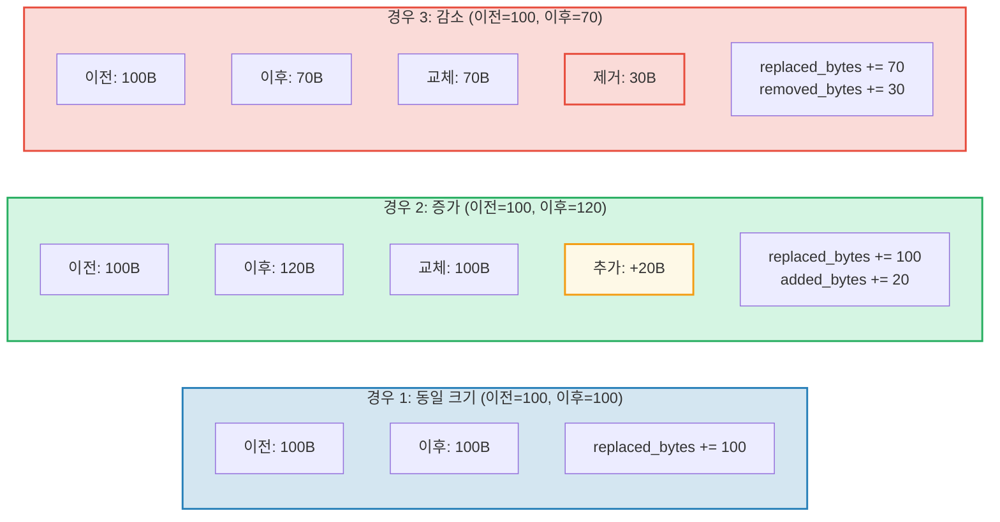

# 비용 추적

## OperationCost 구조체

GroveDB의 모든 연산은 계산 자원으로 측정되는 비용을 누적합니다:

```rust
// costs/src/lib.rs
pub struct OperationCost {
    pub seek_count: u32,              // 스토리지 탐색 횟수
    pub storage_cost: StorageCost,    // 추가/교체/제거된 바이트
    pub storage_loaded_bytes: u64,    // 디스크에서 읽은 바이트
    pub hash_node_calls: u32,         // Blake3 해시 연산 횟수
    pub sinsemilla_hash_calls: u32,   // Sinsemilla 해시 연산 횟수 (EC 연산)
}
```

> **Sinsemilla 해시 호출**은 CommitmentTree 앵커에 대한 타원 곡선 해시 연산을 추적합니다. Blake3 노드 해시보다 훨씬 더 비용이 높습니다.

스토리지 비용은 더 세분화됩니다:

```rust
// costs/src/storage_cost/mod.rs
pub struct StorageCost {
    pub added_bytes: u32,                   // 새로 쓰인 데이터
    pub replaced_bytes: u32,                // 덮어쓰인 기존 데이터
    pub removed_bytes: StorageRemovedBytes, // 해제된 데이터
}
```

## CostContext 패턴

모든 연산은 결과를 `CostContext`에 래핑하여 반환합니다:

```rust
pub struct CostContext<T> {
    pub value: T,               // 연산 결과
    pub cost: OperationCost,    // 소비된 자원
}

pub type CostResult<T, E> = CostContext<Result<T, E>>;
```

이것은 **모나딕(monadic)** 비용 추적 패턴을 만듭니다 -- 비용이 연산 체인을 통해 자동으로 흐릅니다:

```rust
// 결과를 언래핑하고, 비용을 누적기에 추가
let result = expensive_operation().unwrap_add_cost(&mut total_cost);

// 연산을 체인하며, 비용을 누적
let final_result = op1()
    .flat_map(|x| op2(x))      // op1 + op2의 비용
    .flat_map(|y| op3(y));      // + op3의 비용
```

## cost_return_on_error! 매크로

GroveDB 코드에서 가장 일반적인 패턴은 `cost_return_on_error!` 매크로로, `?`처럼 작동하지만 조기 반환 시 비용을 보존합니다:

```rust
macro_rules! cost_return_on_error {
    ( &mut $cost:ident, $($body:tt)+ ) => {
        {
            let result_with_cost = { $($body)+ };
            let result = result_with_cost.unwrap_add_cost(&mut $cost);
            match result {
                Ok(x) => x,
                Err(e) => return Err(e).wrap_with_cost($cost),
            }
        }
    };
}
```

실제 사용:

```rust
fn insert_element(&self, path: &[&[u8]], key: &[u8], element: Element) -> CostResult<(), Error> {
    let mut cost = OperationCost::default();

    // 각 매크로 호출이 연산의 비용을 `cost`에 추가하고
    // Ok 값을 반환합니다 (또는 Err 시 누적된 비용과 함께 조기 반환)
    let merk = cost_return_on_error!(&mut cost, self.open_merk(path));
    cost_return_on_error!(&mut cost, merk.insert(key, element));
    cost_return_on_error!(&mut cost, self.propagate_changes(path));

    Ok(()).wrap_with_cost(cost)
    // `cost`는 이제 세 연산의 비용 합계를 포함합니다
}
```

## 스토리지 비용 분석

값이 업데이트될 때, 비용은 새 값이 더 큰지, 작은지, 같은 크기인지에 따라 달라집니다:



## 해시 연산 비용

해시 비용은 "해시 노드 호출" -- Blake3 블록 압축 횟수로 측정됩니다:

| 연산 | 입력 크기 | 해시 호출 |
|------|----------|----------|
| `value_hash(소형)` | < 64 바이트 | 1 |
| `value_hash(중형)` | 64-127 바이트 | 2 |
| `kv_hash` | key + value_hash | 가변 |
| `node_hash` | 96 바이트 (3 x 32) | 2 (항상) |
| `combine_hash` | 64 바이트 (2 x 32) | 1 (항상) |
| `node_hash_with_count` | 104 바이트 (3 x 32 + 8) | 2 (항상) |
| Sinsemilla (CommitmentTree) | Pallas 곡선 EC 연산 | `sinsemilla_hash_calls`로 별도 추적 |

Blake3의 일반 공식:

```text
hash_calls = 1 + (input_bytes - 1) / 64
```

## 최악 및 평균 사례 추정

GroveDB는 연산을 실행하기 전에 비용을 **추정**하는 함수를 제공합니다. 이것은 블록체인 수수료 계산에 매우 중요합니다 -- 비용을 지불하기로 약속하기 전에 비용을 알아야 합니다.

```rust
// 노드 읽기의 최악 비용
pub fn add_worst_case_get_merk_node(
    cost: &mut OperationCost,
    not_prefixed_key_len: u32,
    max_element_size: u32,
    node_type: NodeType,
) {
    cost.seek_count += 1;  // 한 번의 디스크 탐색
    cost.storage_loaded_bytes +=
        TreeNode::worst_case_encoded_tree_size(
            not_prefixed_key_len, max_element_size, node_type
        ) as u64;
}

// 최악 전파 비용
pub fn add_worst_case_merk_propagate(
    cost: &mut OperationCost,
    input: &WorstCaseLayerInformation,
) {
    let levels = match input {
        MaxElementsNumber(n) => ((*n + 1) as f32).log2().ceil() as u32,
        NumberOfLevels(n) => *n,
    };
    let mut nodes_updated = levels;

    // AVL 회전이 추가 노드를 업데이트할 수 있음
    if levels > 2 {
        nodes_updated += 2;  // 회전으로 최대 2개 추가 노드
    }

    cost.storage_cost.replaced_bytes += nodes_updated * MERK_BIGGEST_VALUE_SIZE;
    cost.storage_loaded_bytes +=
        nodes_updated as u64 * (MERK_BIGGEST_VALUE_SIZE + MERK_BIGGEST_KEY_SIZE) as u64;
    cost.seek_count += nodes_updated;
    cost.hash_node_calls += nodes_updated * 2;
}
```

사용되는 상수:

```rust
pub const MERK_BIGGEST_VALUE_SIZE: u32 = u16::MAX as u32;  // 65535
pub const MERK_BIGGEST_KEY_SIZE: u32 = 256;
```

---
