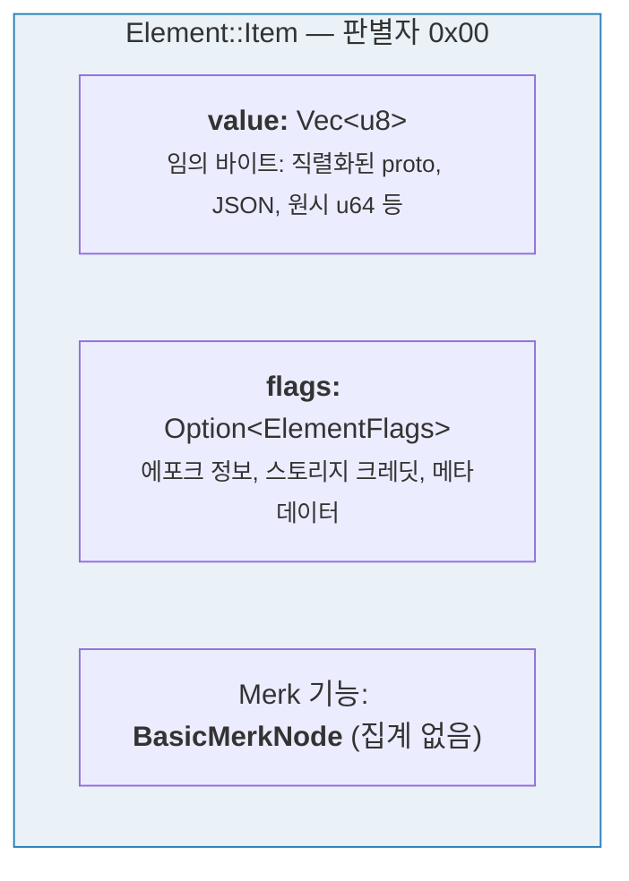
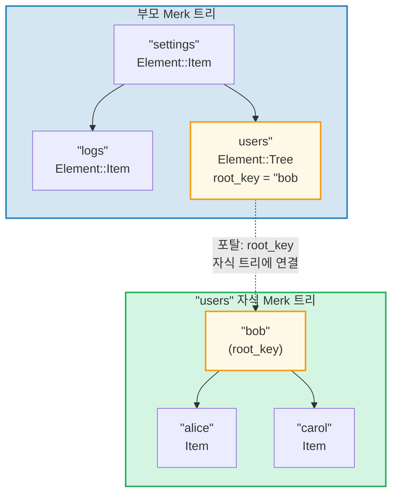
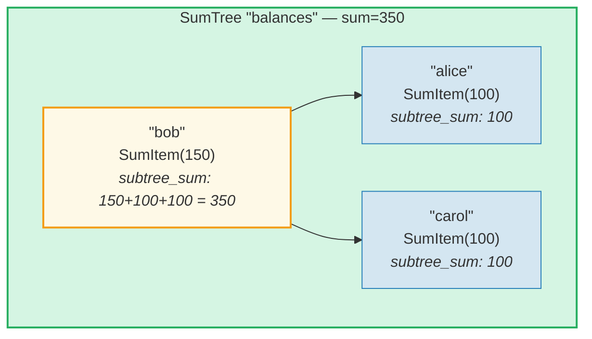
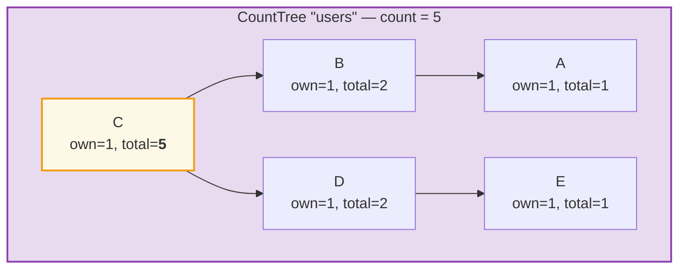
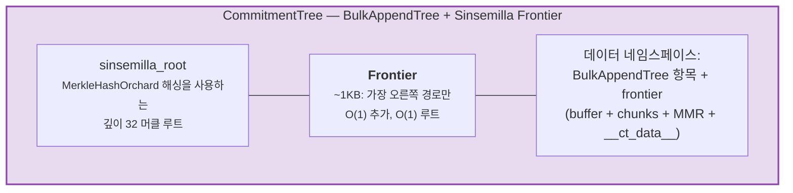

# 엘리먼트 시스템

Merk가 원시 키-값 쌍을 다루는 반면, GroveDB는 더 높은 수준에서 **엘리먼트(Element)** -- 의미적 의미를 가진 타입화된 값 -- 를 사용하여 동작합니다. GroveDB에 저장되는 모든 값은 엘리먼트입니다.

## Element 열거형

```rust
// grovedb-element/src/element/mod.rs
pub enum Element {
    Item(Vec<u8>, Option<ElementFlags>),                                    // [0]
    Reference(ReferencePathType, MaxReferenceHop, Option<ElementFlags>),    // [1]
    Tree(Option<Vec<u8>>, Option<ElementFlags>),                           // [2]
    SumItem(SumValue, Option<ElementFlags>),                               // [3]
    SumTree(Option<Vec<u8>>, SumValue, Option<ElementFlags>),              // [4]
    BigSumTree(Option<Vec<u8>>, BigSumValue, Option<ElementFlags>),        // [5]
    CountTree(Option<Vec<u8>>, CountValue, Option<ElementFlags>),          // [6]
    CountSumTree(Option<Vec<u8>>, CountValue, SumValue, Option<ElementFlags>), // [7]
    ProvableCountTree(Option<Vec<u8>>, CountValue, Option<ElementFlags>),  // [8]
    ItemWithSumItem(Vec<u8>, SumValue, Option<ElementFlags>),              // [9]
    ProvableCountSumTree(Option<Vec<u8>>, CountValue, SumValue,
                         Option<ElementFlags>),                            // [10]
    CommitmentTree(u64, u8, Option<ElementFlags>),                         // [11]
    MmrTree(u64, Option<ElementFlags>),                                    // [12]
    BulkAppendTree(u64, u8, Option<ElementFlags>),                         // [13]
    DenseAppendOnlyFixedSizeTree(u16, u8, Option<ElementFlags>),           // [14]
}
```

대괄호 안의 판별자(discriminant) 번호는 직렬화 시 사용됩니다.

코드 전반에서 사용되는 타입 별칭:

```rust
pub type ElementFlags = Vec<u8>;        // 엘리먼트별 임의 메타데이터
pub type MaxReferenceHop = Option<u8>;  // 참조의 선택적 홉 제한
pub type SumValue = i64;                // 64비트 부호 있는 합계
pub type BigSumValue = i128;            // 128비트 부호 있는 합계
pub type CountValue = u64;              // 64비트 부호 없는 카운트
```

## Item -- 기본 키-값 저장소

가장 단순한 엘리먼트입니다. 임의 바이트를 저장합니다:

```rust
Element::Item(value: Vec<u8>, flags: Option<ElementFlags>)
```



생성자:

```rust
Element::new_item(b"hello world".to_vec())
Element::new_item_with_flags(b"data".to_vec(), Some(vec![0x01, 0x02]))
```

Item은 합계 집계에 참여합니다: SumTree 내에서 Item은 기본값 0의 합계를 기여합니다. SumItem은 명시적 값을 기여합니다.

## Tree -- 서브트리를 위한 컨테이너

Tree 엘리먼트는 다른 Merk 트리로의 **포탈(portal)**입니다. 자식 트리의 루트 키를 저장합니다(있는 경우):

```rust
Element::Tree(root_key: Option<Vec<u8>>, flags: Option<ElementFlags>)
```



> 부모 Merk의 Tree 엘리먼트는 자식 Merk 트리의 `root_key`를 저장합니다. 이것이 **포탈** -- 하나의 Merk 트리에서 다른 트리로의 링크 -- 을 만듭니다.

트리가 비어있으면, `root_key`는 `None`입니다. 생성자 `Element::empty_tree()`는 `Element::Tree(None, None)`을 생성합니다.

## SumItem / SumTree -- 집계 합계

**SumTree**는 모든 직접 자식의 합계 기여를 자동으로 유지합니다:

```rust
Element::SumTree(root_key: Option<Vec<u8>>, sum: SumValue, flags: Option<ElementFlags>)
Element::SumItem(value: SumValue, flags: Option<ElementFlags>)
```



> **집계 공식:** `node_sum = own_value + left_child_sum + right_child_sum`
> Bob: 150 + 100 (alice) + 100 (carol) = **350**. 루트 합계(350)가 부모의 SumTree 엘리먼트에 저장됩니다.

합계는 `TreeFeatureType::SummedMerkNode(i64)` 기능 타입을 통해 Merk 레벨에서 유지됩니다. 트리 전파 중에 각 노드의 집계 데이터가 재계산됩니다:

```text
aggregate_sum = own_sum + left_child_sum + right_child_sum
```

## CountTree, CountSumTree, BigSumTree

추가 집계 트리 타입:

| 엘리먼트 타입 | Merk 기능 타입 | 집계 대상 |
|---|---|---|
| `CountTree` | `CountedMerkNode(u64)` | 엘리먼트 수 |
| `CountSumTree` | `CountedSummedMerkNode(u64, i64)` | 카운트와 합계 모두 |
| `BigSumTree` | `BigSummedMerkNode(i128)` | 큰 값을 위한 128비트 합계 |
| `ProvableCountTree` | `ProvableCountedMerkNode(u64)` | 해시에 포함된 카운트 |
| `ProvableCountSumTree` | `ProvableCountedSummedMerkNode(u64, i64)` | 해시에 포함된 카운트 + 합계 |

**ProvableCountTree**는 특별합니다: 카운트가 `node_hash` 계산에 포함되어(`node_hash_with_count`를 통해), 증명이 어떤 값도 공개하지 않고 카운트를 검증할 수 있습니다.

## 엘리먼트 직렬화

엘리먼트는 빅 엔디안 바이트 순서의 **bincode**를 사용하여 직렬화됩니다:

```rust
pub fn serialize(&self, grove_version: &GroveVersion) -> Result<Vec<u8>, ElementError> {
    let config = config::standard().with_big_endian().with_no_limit();
    bincode::encode_to_vec(self, config)
}
```

첫 번째 바이트는 **판별자(discriminant)**로, O(1) 타입 감지를 가능하게 합니다:

```rust
pub fn from_serialized_value(value: &[u8]) -> Option<ElementType> {
    match value.first()? {
        0 => Some(ElementType::Item),
        1 => Some(ElementType::Reference),
        2 => Some(ElementType::Tree),
        3 => Some(ElementType::SumItem),
        // ... 등
    }
}
```

## TreeFeatureType과 집계 데이터 흐름

`TreeFeatureType` 열거형은 GroveDB 엘리먼트와 Merk 노드 사이의 간격을 연결합니다:

```rust
pub enum TreeFeatureType {
    BasicMerkNode,                              // 집계 없음
    SummedMerkNode(i64),                       // 합계 집계
    BigSummedMerkNode(i128),                   // 큰 합계
    CountedMerkNode(u64),                      // 카운트
    CountedSummedMerkNode(u64, i64),           // 카운트 + 합계
    ProvableCountedMerkNode(u64),              // 해시에 포함된 카운트
    ProvableCountedSummedMerkNode(u64, i64),   // 해시에 포함된 카운트 + 합계
}
```

집계 데이터는 트리를 통해 **위쪽으로** 흐릅니다:



> **집계 표:** 각 노드의 집계 = own(1) + left_aggregate + right_aggregate
>
> | 노드 | own | left_agg | right_agg | total |
> |------|-----|----------|-----------|-------|
> | A | 1 | 0 | 0 | 1 |
> | B | 1 | 1 (A) | 0 | 2 |
> | E | 1 | 0 | 0 | 1 |
> | D | 1 | 0 | 1 (E) | 2 |
> | C | 1 | 2 (B) | 2 (D) | **5** (루트) |

각 노드에 저장된 카운트는 자기 자신을 포함하여 해당 노드를 루트로 하는 서브트리의 총 카운트를 나타냅니다. 루트 노드의 카운트가 전체 트리의 합계입니다.

`AggregateData` 열거형이 링크 시스템을 통해 이것을 전달합니다:

```rust
pub enum AggregateData {
    NoAggregateData,
    Sum(i64),
    BigSum(i128),
    Count(u64),
    CountAndSum(u64, i64),
    ProvableCount(u64),
    ProvableCountAndSum(u64, i64),
}
```

## CommitmentTree -- Sinsemilla 커밋먼트 트리

**CommitmentTree**는 Zcash의 Orchard 차폐 프로토콜에서 사용되는 노트 커밋먼트 앵커를 추적하기 위한 깊이 32의 Sinsemilla 머클 트리를 제공합니다. O(1) 추가 및 루트 계산을 위해 `incrementalmerkletree::Frontier<MerkleHashOrchard, 32>`를 래핑합니다:

```rust
Element::CommitmentTree(
    total_count: u64,               // 추가된 커밋먼트 수
    chunk_power: u8,                // BulkAppendTree 압축 크기 (chunk_size = 2^chunk_power)
    flags: Option<ElementFlags>,
)                                   // 판별자 [11]
```

> **참고:** Sinsemilla 프론티어 루트 해시는 Element에 저장되지 않습니다.
> 데이터 스토리지에 유지되며 Merk 자식 해시 메커니즘
> (`insert_subtree`의 `subtree_root_hash` 매개변수)을 통해 흐릅니다. 프론티어의
> 어떤 변경이든 GroveDB Merk 계층 구조를 통해 자동으로 전파됩니다.



**아키텍처:**
- *프론티어(frontier)*(머클 트리의 가장 오른쪽 경로, 약 1KB 고정 크기)는 `COMMITMENT_TREE_DATA_KEY`로 키가 지정된 **데이터 네임스페이스**에 저장됩니다
- 실제 노트 데이터(`cmx || ciphertext`)는 **데이터 네임스페이스**에 **BulkAppendTree**를 통해 저장됩니다 -- 청크 압축, 위치별 조회 가능
- 히스토리 앵커는 Platform이 별도의 증명 가능한 트리에서 추적합니다
- Sinsemilla 루트는 Element에 저장되지 않습니다 -- GroveDB 해시 계층 구조를 통해 Merk 자식 해시로 흐릅니다

**연산:**
- `commitment_tree_insert(path, key, cmx, ciphertext, tx)` -- `TransmittedNoteCiphertext<M>`를 받는 타입화된 추가; `(new_root, position)`을 반환
- `commitment_tree_anchor(path, key, tx)` -- 현재 Orchard Anchor 가져오기
- `commitment_tree_get_value(path, key, position, tx)` -- 위치별 값 조회
- `commitment_tree_count(path, key, tx)` -- 총 항목 수 가져오기

**MemoSize 제네릭:** `CommitmentTree<S, M: MemoSize = DashMemo>`는 암호문 페이로드가 `M`에 대한 예상 크기와 일치하는지 검증합니다. Dash (36바이트 메모)의 경우: `epk_bytes (32) + enc_ciphertext (104) + out_ciphertext (80) = 216 바이트`.

**비용 추적:** Sinsemilla 해시 연산은 `cost.sinsemilla_hash_calls`를 통해 추적됩니다. 루트 계산은 항상 32 레벨을 순회합니다. Ommer 병합은 이전 위치의 `trailing_ones()`를 통해 연쇄됩니다. BulkAppendTree 연산은 Blake3 해시 비용을 추가합니다.

## MmrTree -- 머클 산 범위

**MmrTree**는 Blake3 해싱을 사용하는 추가 전용 머클 산 범위(Merkle Mountain Range, MMR)에 데이터를 저장합니다. MMR 노드는 자식 Merk 서브트리가 아닌 **데이터** 컬럼(Merk 노드와 동일한 컬럼 패밀리)에 저장됩니다. MMR이 어떻게 작동하는지, 어떻게 채워지는지, 증명이 어떻게 생성되고 검증되는지, 그리고 MmrTree가 GroveDB와 어떻게 통합되는지에 대한 종합적인 심화 학습은 **[13장](#chapter-13-the-mmr-tree--append-only-authenticated-logs)**을 참조하세요.

```rust
Element::MmrTree(
    mmr_size: u64,                  // 내부 MMR 크기 (리프가 아닌 노드)
    flags: Option<ElementFlags>,
)                                   // 판별자 [12]
```

> **참고:** MMR 루트 해시는 Element에 저장되지 않습니다. `insert_subtree`의 `subtree_root_hash` 매개변수를 통해 Merk 자식 해시로 흐릅니다.

**연산:** `mmr_tree_append`, `mmr_tree_root_hash`, `mmr_tree_get_value`, `mmr_tree_leaf_count`. **증명:** V1 증명 (9.6절 및 13.9절 참조).

## BulkAppendTree -- 2단계 추가 전용 구조

**BulkAppendTree**는 효율적인 고처리량 추가와 증명 가능한 범위 쿼리를 위해 조밀한 머클 트리 버퍼와 청크 수준 MMR을 결합합니다. 비-Merk 트리로, 데이터는 자식 Merk 서브트리가 아닌 **데이터** 네임스페이스에 존재합니다. 2단계 아키텍처, 청크 압축, 증명 생성, 검증 및 GroveDB 통합에 대한 종합적인 심화 학습은 **[14장](#chapter-14-the-bulkappendtree--high-throughput-append-only-storage)**을 참조하세요.

```rust
Element::BulkAppendTree(
    total_count: u64,               // 추가된 총 값 수
    chunk_power: u8,                // 조밀 트리 높이 (버퍼 용량 = 2^chunk_power - 1)
    flags: Option<ElementFlags>,
)                                   // 판별자 [13]
```

> **참고:** 상태 루트(`blake3("bulk_state" || mmr_root || dense_tree_root)`)는 Element에 저장되지 않습니다. `insert_subtree`의 `subtree_root_hash` 매개변수를 통해 Merk 자식 해시로 흐릅니다.

**연산:** `bulk_append`, `bulk_get_value`, `bulk_get_chunk`, `bulk_get_buffer`, `bulk_count`, `bulk_chunk_count`.
**증명:** V1 범위 증명 (9.6절 및 14.10절 참조).

## DenseAppendOnlyFixedSizeTree -- 조밀한 고정 용량 저장소

**DenseAppendOnlyFixedSizeTree**는 고정 높이 *h*의 완전 이진 트리로, 모든 노드(내부 및 리프)가 데이터 값을 저장합니다. 위치는 레벨 순서(BFS)로 채워집니다. 루트 해시는 즉석에서 재계산됩니다 -- 중간 해시는 저장되지 않습니다. 전체 심화 학습은 **[16장](#chapter-16-the-denseappendonlyfixedsizetree--dense-fixed-capacity-merkle-storage)**을 참조하세요.

```rust
Element::DenseAppendOnlyFixedSizeTree(
    count: u16,                     // 저장된 값의 수 (최대 65,535)
    height: u8,                     // 트리 높이 (1..=16, 불변), 용량 = 2^h - 1
    flags: Option<ElementFlags>,
)                                   // 판별자 [14]
```

> **참고:** 루트 해시는 Element에 저장되지 않습니다 -- 즉석에서 재계산되며 Merk 자식 해시로 흐릅니다. `count` 필드는 `u16`(u64가 아님)이므로, 트리는 65,535개 위치로 제한됩니다. 높이는 1..=16으로 제한됩니다.

**연산:** `dense_tree_insert`, `dense_tree_get`, `dense_tree_root_hash`, `dense_tree_count`.
**증명:** 엘리먼트 수준만 (아직 하위 쿼리 증명 없음).

## 비-Merk 트리 -- 공통 패턴

CommitmentTree, MmrTree, BulkAppendTree, DenseAppendOnlyFixedSizeTree는 Merk 기반 트리 타입(Tree, SumTree, CountTree 등)과 구별되는 공통 아키텍처 패턴을 공유합니다:

| 속성 | Merk 기반 트리 | 비-Merk 트리 |
|------|--------------|-------------|
| 자식 Merk 서브트리 | 예 (`root_key = Some(...)`) | 아니오 (root_key 필드 없음) |
| 데이터 저장소 | Merk 키-값 쌍 | 데이터 컬럼 블롭 (비-Merk 키) |
| 루트 해시 바인딩 | `combine_hash(elem_hash, child_root_hash)` | `combine_hash(elem_hash, type_specific_root)` |
| 타입별 루트 | Merk AVL이 유지 | Merk 자식 해시로 흐름 (엘리먼트 바이트에 없음) |
| 증명 형식 | V0 (레이어별 Merk) | V1 (타입별 증명) |
| TreeFeatureType | BasicMerkNode (집계 없음) | BasicMerkNode |

> **스토리지 컬럼 참고:** 네 가지 비-Merk 트리 타입(MmrTree, CommitmentTree, BulkAppendTree, DenseAppendOnlyFixedSizeTree) 모두 비-Merk 키를 사용하여 **데이터** 컬럼에 데이터를 저장합니다. CommitmentTree는 Sinsemilla 프론티어를 BulkAppendTree 항목과 함께 동일한 **데이터** 컬럼에 저장합니다 (키 `b"__ct_data__"`).

타입별 루트(sinsemilla 루트, MMR 루트, 상태 루트 또는 조밀 트리 루트 해시)는 Element에 저장되지 않습니다. 대신, `insert_subtree`의 `subtree_root_hash` 매개변수를 통해 Merk **자식 해시**로 흐릅니다. Merk combined_value_hash는 `combine_hash(value_hash(element_bytes), type_specific_root)`가 됩니다. 타입별 루트의 어떤 변경이든 자식 해시를 변경하고, 이것이 combined_value_hash를 변경하며, GroveDB 해시 계층 구조를 통해 위쪽으로 전파됩니다 -- 암호학적 무결성을 유지합니다.

---
