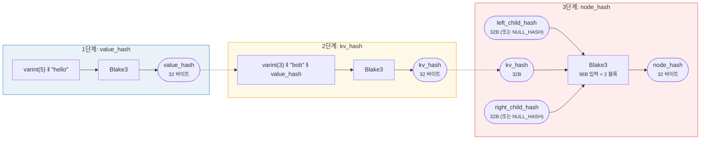
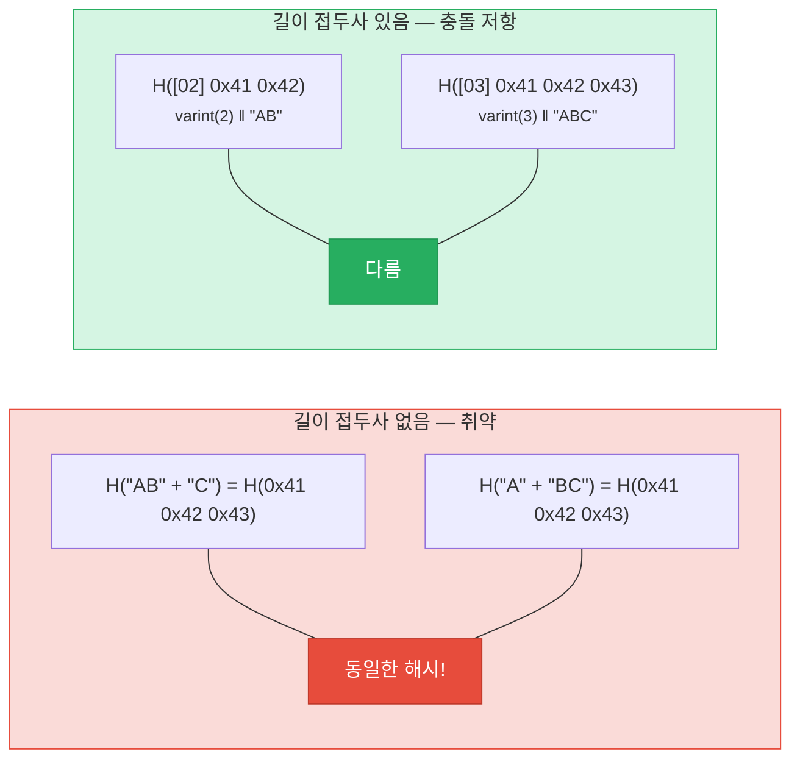
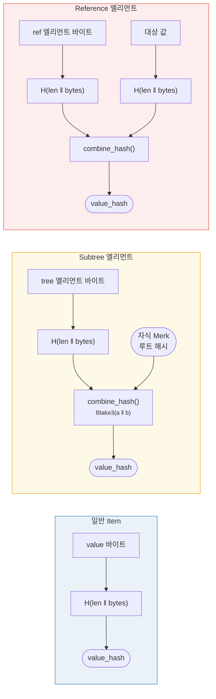

# 해싱 -- 암호학적 무결성

Merk 트리의 모든 노드는 해시되어 **루트 해시(root hash)**를 생성합니다 -- 전체 트리를 인증하는 단일 32바이트 값입니다. 어떤 키, 값 또는 구조적 관계의 변경이라도 다른 루트 해시를 생성합니다.

## 3단계 해시 계층

Merk는 안쪽에서 바깥쪽으로의 3단계 해싱 체계를 사용합니다:

예시: key = `"bob"` (3 바이트), value = `"hello"` (5 바이트):



> 트리의 ROOT = 루트 노드의 `node_hash`로, **모든** 키, 값 및 구조적 관계를 인증합니다. 누락된 자식은 `NULL_HASH = [0x00; 32]`를 사용합니다.

### 1단계: value_hash

```rust
// merk/src/tree/hash.rs
pub fn value_hash(value: &[u8]) -> CostContext<CryptoHash> {
    let mut hasher = blake3::Hasher::new();
    let val_length = value.len().encode_var_vec();  // Varint 인코딩
    hasher.update(val_length.as_slice());
    hasher.update(value);
    // ...
}
```

값의 길이가 **varint 인코딩**되어 앞에 붙습니다. 이것은 충돌 저항성에 매우 중요합니다 -- 이것이 없으면 `H("AB" || "C")`가 `H("A" || "BC")`와 같아질 수 있습니다.

### 2단계: kv_hash

```rust
pub fn kv_hash(key: &[u8], value: &[u8]) -> CostContext<CryptoHash> {
    let mut hasher = blake3::Hasher::new();
    let key_length = key.len().encode_var_vec();
    hasher.update(key_length.as_slice());
    hasher.update(key);
    let vh = value_hash(value);
    hasher.update(vh.as_slice());  // 중첩 해시
    // ...
}
```

이것은 키를 값에 바인딩합니다. 증명 검증을 위해 미리 계산된 value_hash를 받는 변형도 있습니다:

```rust
pub fn kv_digest_to_kv_hash(key: &[u8], value_hash: &CryptoHash) -> CostContext<CryptoHash>
```

이것은 검증자가 이미 value_hash를 가지고 있을 때 사용됩니다 (예: value_hash가 결합 해시인 서브트리의 경우).

### 3단계: node_hash

```rust
pub fn node_hash(
    kv: &CryptoHash,
    left: &CryptoHash,
    right: &CryptoHash,
) -> CostContext<CryptoHash> {
    let mut hasher = blake3::Hasher::new();
    hasher.update(kv);       // 32 바이트
    hasher.update(left);     // 32 바이트
    hasher.update(right);    // 32 바이트 — 합계 96 바이트
    // 항상 정확히 2번의 해시 연산 (96 바이트 / 64바이트 블록 = 2)
}
```

자식이 없으면, 해시는 **NULL_HASH** -- 32개의 0 바이트:

```rust
pub const NULL_HASH: CryptoHash = [0; HASH_LENGTH];  // [0u8; 32]
```

## 해시 함수로서의 Blake3

GroveDB는 모든 해싱에 **Blake3**를 사용합니다. 주요 특성:

- **256비트 출력** (32 바이트)
- **블록 크기**: 64 바이트
- **속도**: 최신 하드웨어에서 SHA-256보다 약 3배 빠름
- **스트리밍**: 데이터를 점진적으로 공급 가능

해시 연산 비용은 처리되는 64바이트 블록 수에 기반하여 계산됩니다:

```rust
let hashes = 1 + (hasher.count() - 1) / 64;  // 해시 연산 횟수
```

## 충돌 저항성을 위한 길이 접두사 인코딩

모든 가변 길이 입력은 **varint 인코딩**을 사용하여 길이가 접두사로 붙습니다:



> **value_hash 입력**: `[varint(value.len)] [value 바이트]`
> **kv_hash 입력**: `[varint(key.len)] [key 바이트] [value_hash: 32 바이트]`

길이 접두사가 없으면, 공격자가 동일한 다이제스트로 해시되는 다른 키-값 쌍을 만들 수 있습니다. 길이 접두사는 이것을 암호학적으로 불가능하게 만듭니다.

## 특수 엘리먼트를 위한 결합 해싱

**서브트리**와 **참조**의 경우, `value_hash`는 단순히 `H(value)`가 아닙니다. 대신, 엘리먼트를 대상에 바인딩하는 **결합 해시(combined hash)**입니다:



> **서브트리:** 자식 Merk의 루트 해시를 부모에 바인딩합니다. **참조:** 참조 경로와 대상 값을 모두 바인딩합니다. 어느 쪽이든 변경하면 루트 해시가 변경됩니다.

`combine_hash` 함수:

```rust
pub fn combine_hash(hash_one: &CryptoHash, hash_two: &CryptoHash) -> CostContext<CryptoHash> {
    let mut hasher = blake3::Hasher::new();
    hasher.update(hash_one);   // 32 바이트
    hasher.update(hash_two);   // 32 바이트 — 합계 64 바이트, 정확히 1회 해시 연산
    // ...
}
```

이것이 GroveDB가 단일 루트 해시를 통해 전체 계층 구조를 인증할 수 있게 하는 것입니다 -- 서브트리 엘리먼트에 대한 각 부모 트리의 value_hash가 자식 트리의 루트 해시를 포함합니다.

## ProvableCountTree를 위한 집계 해싱

`ProvableCountTree` 노드는 노드 해시에 집계 카운트를 포함합니다:

```rust
pub fn node_hash_with_count(
    kv: &CryptoHash,
    left: &CryptoHash,
    right: &CryptoHash,
    count: u64,
) -> CostContext<CryptoHash> {
    let mut hasher = blake3::Hasher::new();
    hasher.update(kv);                        // 32 바이트
    hasher.update(left);                      // 32 바이트
    hasher.update(right);                     // 32 바이트
    hasher.update(&count.to_be_bytes());      // 8 바이트 — 합계 104 바이트
    // 여전히 정확히 2회 해시 연산 (104 < 128 = 2 x 64)
}
```

이것은 카운트 증명이 실제 데이터를 공개할 필요가 없다는 것을 의미합니다 -- 카운트가 암호학적 커밋먼트에 내장되어 있습니다.

---
