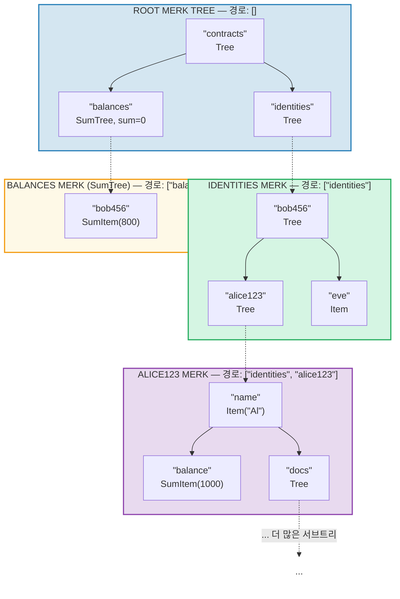
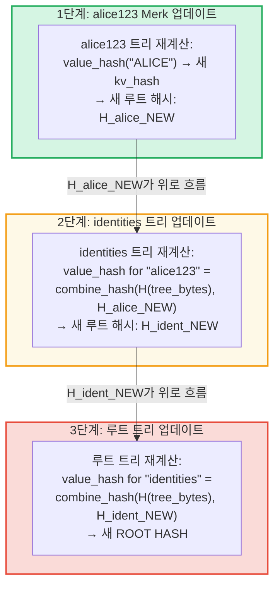
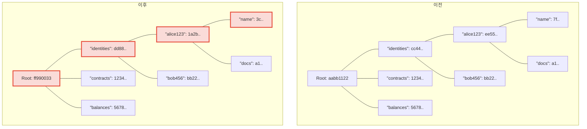
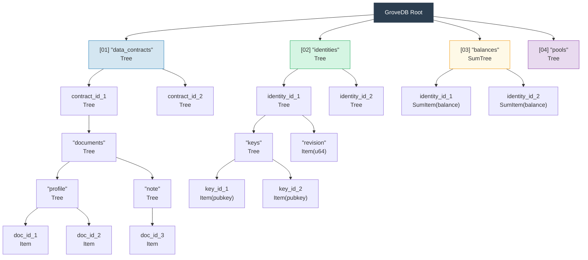

# 계층적 그로브 -- 트리의 트리

## 서브트리가 부모 트리 내에 중첩되는 방식

GroveDB의 핵심 특징은 Merk 트리가 그 자체로 Merk 트리인 엘리먼트를 포함할 수 있다는 것입니다. 이것이 **계층적 네임스페이스**를 만듭니다:



> 각 색상 상자는 별도의 Merk 트리입니다. 점선 화살표는 Tree 엘리먼트에서 자식 Merk 트리로의 포탈 링크를 나타냅니다. 각 Merk의 경로가 레이블에 표시됩니다.

## 경로 주소 시스템

GroveDB의 모든 엘리먼트는 **경로(path)**로 주소가 지정됩니다 -- 루트에서 서브트리를 통해 대상 키까지 탐색하는 바이트 문자열의 시퀀스:

```text
    경로: ["identities", "alice123", "name"]

    1단계: 루트 트리에서 "identities" 조회 → Tree 엘리먼트
    2단계: identities 서브트리를 열고 "alice123" 조회 → Tree 엘리먼트
    3단계: alice123 서브트리를 열고 "name" 조회 → Item("Alice")
```

경로는 `Vec<Vec<u8>>`로 표현되거나 할당 없이 효율적으로 조작하기 위한 `SubtreePath` 타입을 사용합니다:

```rust
// 엘리먼트 경로 (마지막 세그먼트를 제외한 모든 세그먼트)
let path: &[&[u8]] = &[b"identities", b"alice123"];
// 최종 서브트리 내의 키
let key: &[u8] = b"name";
```

## 스토리지 격리를 위한 Blake3 접두사 생성

GroveDB의 각 서브트리는 RocksDB에서 자체 **격리된 스토리지 네임스페이스**를 가집니다. 네임스페이스는 경로를 Blake3로 해싱하여 결정됩니다:

```rust
pub type SubtreePrefix = [u8; 32];

// 접두사는 경로 세그먼트를 해싱하여 계산됩니다
// storage/src/rocksdb_storage/storage.rs
```

예시:

```text
    경로: ["identities", "alice123"]
    접두사: Blake3(["identities", "alice123"]) = [0xab, 0x3f, ...]  (32 바이트)

    RocksDB에서 이 서브트리의 키는 다음과 같이 저장됩니다:
    [접두사: 32 바이트][원래_키]

    따라서 이 서브트리의 "name"은 다음과 같습니다:
    [0xab, 0x3f, ...][0x6e, 0x61, 0x6d, 0x65]  ("name")
```

이것은 다음을 보장합니다:
- 서브트리 간 키 충돌 없음 (32바이트 접두사 = 256비트 격리)
- 효율적인 접두사 계산 (경로 바이트에 대한 단일 Blake3 해시)
- RocksDB에서 서브트리 데이터가 인접하여 캐시 효율성 향상

## 계층 구조를 통한 루트 해시 전파

그로브 깊은 곳에서 값이 변경되면, 변경 사항이 루트 해시를 업데이트하기 위해 **위쪽으로 전파**되어야 합니다:

```text
    변경: identities/alice123/ 에서 "name"을 "ALICE"로 업데이트

    1단계: alice123의 Merk 트리에서 값 업데이트
            → alice123 트리가 새 루트 해시를 얻음: H_alice_new

    2단계: identities 트리에서 "alice123" 엘리먼트 업데이트
            → "alice123"에 대한 identities 트리의 value_hash =
              combine_hash(H(tree_element_bytes), H_alice_new)
            → identities 트리가 새 루트 해시를 얻음: H_ident_new

    3단계: 루트 트리에서 "identities" 엘리먼트 업데이트
            → "identities"에 대한 루트 트리의 value_hash =
              combine_hash(H(tree_element_bytes), H_ident_new)
            → 루트 해시 변경
```



**이전 대 이후** -- 변경된 노드가 빨간색으로 표시:



> 변경된 값에서 루트까지의 경로에 있는 노드만 재계산됩니다. 형제 노드와 다른 분기는 변경되지 않습니다.

전파는 `propagate_changes_with_transaction`에 의해 구현되며, 수정된 서브트리에서 루트까지 경로를 올라가며 각 부모의 엘리먼트 해시를 업데이트합니다.

## 다중 레벨 그로브 구조 예시

Dash Platform이 상태를 구조화하는 완전한 예시는 다음과 같습니다:



각 상자는 별도의 Merk 트리이며, 검증자들이 동의하는 단일 루트 해시까지 모두 인증됩니다.

---
