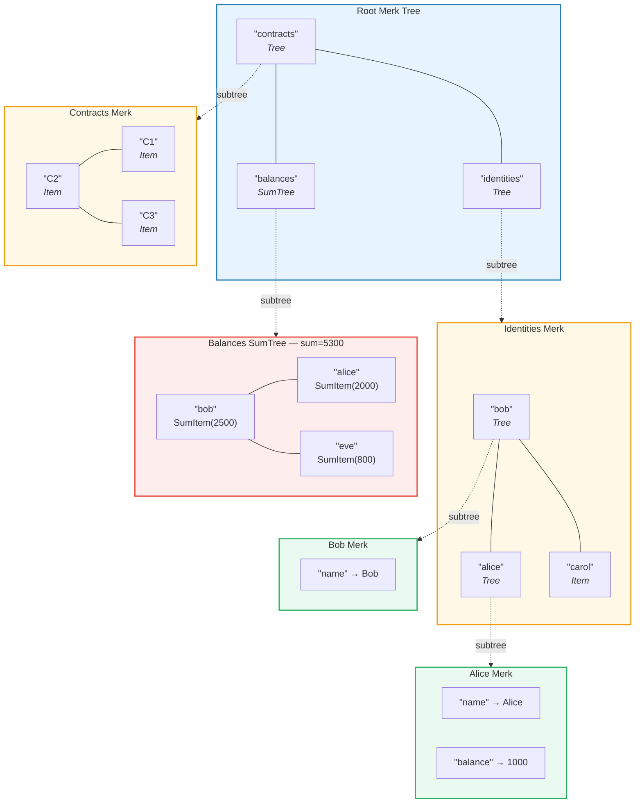
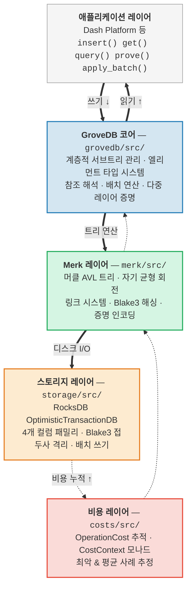

# 소개 -- GroveDB란?

## 핵심 아이디어

GroveDB는 **계층적 인증 데이터 구조(hierarchical authenticated data structure)**입니다. 본질적으로 머클 AVL 트리(Merkle AVL tree) 위에 구축된 *그로브(grove, 트리의 트리)*입니다. 데이터베이스의 모든 노드는 암호학적으로 인증된 트리의 일부이며, 각 트리는 다른 트리를 자식으로 포함할 수 있어 검증 가능한 상태의 깊은 계층 구조를 형성합니다.

> 각 색상 상자는 **별도의 Merk 트리**입니다. 점선 화살표는 서브트리 관계를 나타냅니다. 부모의 Tree 엘리먼트가 자식 Merk의 루트 키를 포함합니다.

전통적인 데이터베이스에서는 데이터를 평면적인 키-값 저장소에 저장하고 인증을 위해 단일 머클 트리를 그 위에 올려놓을 수 있습니다. GroveDB는 다른 접근 방식을 취합니다: 머클 트리 안에 머클 트리를 중첩시킵니다. 이를 통해 다음을 얻을 수 있습니다:

1. **효율적인 보조 인덱스** -- 기본 키뿐만 아니라 어떤 경로로든 쿼리 가능
2. **간결한 암호학적 증명** -- 어떤 데이터의 존재(또는 부재)를 증명
3. **집계 데이터** -- 트리가 자동으로 자식들의 합계, 개수 등을 집계 가능
4. **원자적 교차 트리 연산** -- 배치 연산이 여러 서브트리에 걸쳐 수행

## GroveDB가 존재하는 이유

GroveDB는 **Dash Platform**을 위해 설계되었습니다. Dash Platform은 모든 상태가 다음 조건을 충족해야 하는 탈중앙화 애플리케이션 플랫폼입니다:

- **인증 가능**: 어떤 노드든 라이트 클라이언트에게 어떤 상태든 증명 가능
- **결정론적**: 모든 노드가 정확히 동일한 상태 루트를 계산
- **효율적**: 블록 시간 제약 내에서 연산 완료 필수
- **쿼리 가능**: 애플리케이션이 키 조회뿐 아니라 풍부한 쿼리를 필요로 함

전통적인 접근 방식들은 부족합니다:

| 접근 방식 | 문제점 |
|----------|---------|
| 일반 머클 트리 | 키 조회만 지원, 범위 쿼리 불가 |
| 이더리움 MPT | 재균형 비용이 높고 증명 크기가 큼 |
| 평면 키-값 + 단일 트리 | 계층적 쿼리 불가, 단일 증명이 모든 것을 포함 |
| B-트리 | 자연스럽게 머클화되지 않으며 인증이 복잡 |

GroveDB는 **AVL 트리의 검증된 균형 보장**과 **계층적 중첩**, 그리고 **풍부한 엘리먼트 타입 시스템**을 결합하여 이 문제들을 해결합니다.

## 아키텍처 개요

GroveDB는 각각 명확한 책임을 가진 별도의 레이어로 구성되어 있습니다:

데이터는 쓰기 시 이 레이어들을 **아래로** 흐르고 읽기 시 **위로** 흐릅니다. 모든 연산은 스택을 통과하면서 비용을 누적하여 정확한 자원 회계를 가능하게 합니다.

---
