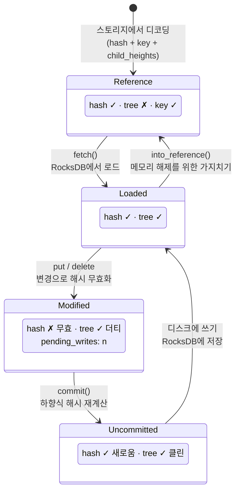
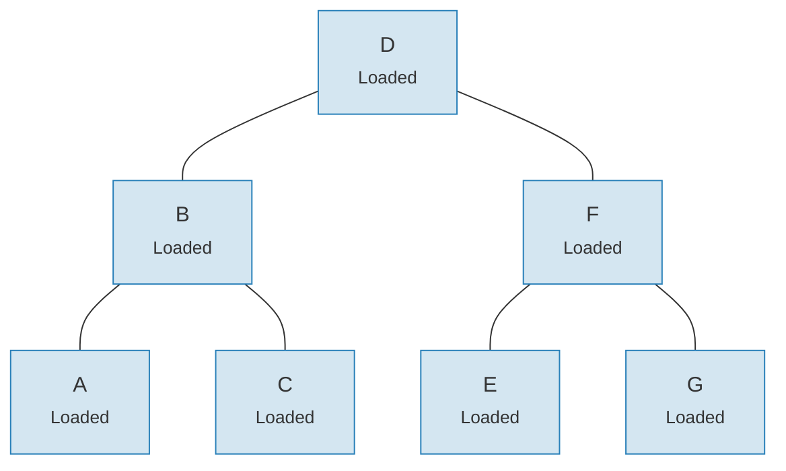
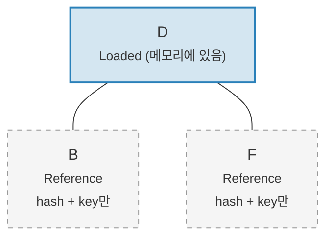

# 링크 시스템 -- 지연 로딩 아키텍처

전체 Merk 트리를 메모리에 로드하는 것은 대규모 트리에서는 비용이 너무 높습니다. 링크 시스템(Link system)은 자식 연결을 네 가지 가능한 상태로 표현하여 이 문제를 해결합니다. **지연 로딩(lazy loading)**을 가능하게 합니다 -- 자식은 실제로 필요할 때만 스토리지에서 가져옵니다.

## 네 가지 링크 상태

```rust
// merk/src/tree/link.rs
pub enum Link {
    Reference {                    // 가지치기됨: 메타데이터만, 메모리에 트리 없음
        hash: CryptoHash,
        child_heights: (u8, u8),
        key: Vec<u8>,
        aggregate_data: AggregateData,
    },
    Modified {                     // 최근 변경됨, 해시 아직 미계산
        pending_writes: usize,
        child_heights: (u8, u8),
        tree: TreeNode,
    },
    Uncommitted {                  // 해시 계산되었으나 스토리지에 미저장
        hash: CryptoHash,
        child_heights: (u8, u8),
        tree: TreeNode,
        aggregate_data: AggregateData,
    },
    Loaded {                       // 스토리지에서 완전히 로드됨
        hash: CryptoHash,
        child_heights: (u8, u8),
        tree: TreeNode,
        aggregate_data: AggregateData,
    },
}
```

## 상태 전이 다이어그램



## 각 상태가 저장하는 것

| 상태 | 해시? | 메모리에 트리? | 목적 |
|------|-------|-------------|------|
| **Reference** | 예 | 아니오 | 간결한 디스크 표현. 키, 해시, 자식 높이, 집계 데이터만 저장. |
| **Modified** | 아니오 | 예 | 변경 후 상태. 배치 최적화를 위해 `pending_writes` 카운트를 추적. |
| **Uncommitted** | 예 | 예 | 해시 계산 후 스토리지 쓰기 전. 커밋 중 중간 상태. |
| **Loaded** | 예 | 예 | 완전히 실체화됨. 읽기 또는 추가 수정 준비 완료. |

`Modified`의 `pending_writes` 필드는 주목할 만합니다:

```rust
// 계산 방식: 1 + left_pending_writes + right_pending_writes
pending_writes: 1 + tree.child_pending_writes(true)
                  + tree.child_pending_writes(false),
```

이 카운트는 커밋 단계에서 최적의 성능을 위해 쓰기 순서를 결정하는 데 도움을 줍니다.

## Fetch 콜백 패턴

링크 시스템은 자식 노드 로딩 방법을 추상화하기 위해 **Fetch 트레이트**를 사용합니다:

```rust
pub trait Fetch {
    fn fetch(
        &self,
        link: &Link,
        value_defined_cost_fn: Option<&impl Fn(&[u8], &GroveVersion) -> Option<ValueDefinedCostType>>,
        grove_version: &GroveVersion,
    ) -> CostResult<TreeNode, Error>;
}
```

다른 Fetch 구현체는 다른 목적을 수행합니다:

- **StorageFetch**: RocksDB에서 로드 (일반적인 경로)
- **PanicSource**: 페칭이 절대 일어나서는 안 되는 테스트에서 사용
- **MockSource**: 제어된 테스트 데이터를 반환

이 패턴은 트리 연산이 **스토리지에 무관**하게 합니다 -- 데이터가 어디서 오든 동일한 균형 및 변경 로직이 작동합니다.

## Walker 패턴

`Walker`는 `TreeNode`를 `Fetch` 소스와 함께 래핑하여 자동 지연 로딩이 포함된 안전한 트리 순회를 제공합니다 (`merk/src/tree/walk/mod.rs`):

```rust
pub struct Walker<S: Fetch + Sized + Clone> {
    tree: Owner<TreeNode>,
    source: S,
}
```

Walker는 세 가지 주요 연산을 제공합니다:

**walk()** -- 자식을 분리하고, 변환하고, 다시 연결:

```rust
pub fn walk<F, T>(self, left: bool, f: F, ...) -> CostResult<Self, Error>
where
    F: FnOnce(Option<Self>) -> CostResult<Option<T>, Error>,
    T: Into<TreeNode>,
```

**detach()** -- 자식을 제거하며, 필요시 스토리지에서 로드:

```rust
pub fn detach(self, left: bool, ...) -> CostResult<(Self, Option<Self>), Error>
```

자식이 `Link::Reference`(가지치기됨) 상태이면, detach는 먼저 `fetch()`를 호출하여 로드합니다. 자식이 이미 메모리에 있는 상태(`Modified`, `Uncommitted`, `Loaded`)이면, 단순히 소유권을 가져옵니다.

**attach()** -- 자식을 부모에 연결:

```rust
pub fn attach(self, left: bool, maybe_child: Option<Self>) -> Self
```

연결은 부모-자식 관계가 변경되었으므로 항상 `Link::Modified`를 생성합니다.

## 가지치기를 통한 메모리 효율성

변경 사항을 커밋한 후, 트리는 로드된 서브트리를 `Link::Reference`로 **가지치기(prune)**하여 메모리를 해제하면서 증명 생성에 필요한 해시는 유지할 수 있습니다:

**가지치기 전** -- 7개 노드 모두 메모리에 있음:



**가지치기 후** -- 루트만 메모리에 있고, 자식은 `Link::Reference` 상태(해시 + 키만):



> **Link::Loaded**는 `hash + child_heights + tree (TreeNode)`를 보유합니다. **Link::Reference**는 `hash + child_heights + key`만 보유합니다 -- TreeNode은 메모리에서 해제됩니다.

변환은 간단합니다:

```rust
pub fn into_reference(self) -> Link {
    Link::Reference {
        hash: self.hash(),
        child_heights: self.child_heights(),
        key: self.key().to_vec(),
        aggregate_data: self.aggregate_data(),
    }
}
```

이것은 대규모 트리에서 메모리 사용량을 제한하는 데 매우 중요합니다 -- 실제로 접근 중인 노드만 메모리에 있으면 됩니다.

---
